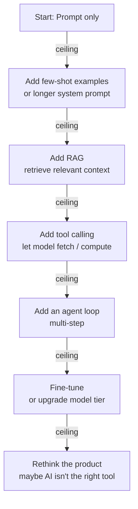

# When to Pivot

> **In one line:** The pivot signal isn't a feeling — it's an eval curve that's flat across three real iterations. When you've hit your approach's ceiling, switch architectures (prompt → RAG, RAG → fine-tune, single-call → agent) instead of grinding.

## 1. Why pivot-decisions matter

The most expensive failure mode in AI engineering isn't picking the wrong approach. It's *staying with* the wrong approach too long.

Each pivot is a 1–4 week cost (build the new thing, evaluate it, migrate if it wins). Each non-pivot when you should have is an open-ended cost — weeks of grinding on a ceiling.

Mature engineers notice the ceiling early and pivot quickly. The discipline: trust the eval curve, not the optimism.

## 2. The pivot signal

The robust signal:

> **Three real iterations with substantive effort and no eval improvement.**

"Real iteration" = a meaningful change, not a wording tweak. Prompt v3 → v4 with a new edge case handled. New chunking strategy. New retrieval technique. Each takes hours-to-days; each runs against the eval; the score should move.

If three of these in a row produce flat or noisy results, you've hit the ceiling.

The bad pivot signal: "this feels slow / unsatisfying." Vibes lie. The eval doesn't.

## 3. The pivot ladder

The natural escalation order for most AI features:

Most features stop at step C or D. Each step adds engineering cost but unlocks new capability.

The mistake is jumping multiple steps ("we need an agent") when a step back would have done. Always try the next-step-up first.

## 4. Specific pivot decisions

### From prompt-only → add RAG

**When:** the model needs information that's not in its training data (your private docs, current events, user-specific data).

**Signal:** evals fail on questions requiring specific knowledge; prompts get longer trying to stuff information in.

**Not yet:** if the model just needs to follow instructions better, RAG won't help. Tune the prompt first.

### From RAG → fine-tune

**When:** retrieval is solid, the model can find the right info, but its response style / format / domain language is wrong.

**Signal:** evals show high faithfulness (model isn't hallucinating) but low quality of expression; you've tuned the prompt extensively without gains.

**Not yet:** fine-tuning is expensive (training data curation, infrastructure, evaluation against the base model). Most teams should try a different model tier or better prompt first.

### From single-call → agent

**When:** the task requires multi-step reasoning where each step depends on the previous step's actual output (not predictable).

**Signal:** you keep adding "if X then Y" branches; the prompt becomes a flowchart you're encoding in English.

**Not yet:** if the steps are predictable, a pipeline (chain) is simpler. Agents are for genuinely dynamic loops.

### From workhorse → frontier model

**When:** specific eval cases fail at workhorse, pass at frontier, and they matter enough to justify the cost.

**Signal:** eval shows a measurable, reproducible quality gap for the specific failing cases.

**Not yet:** if cheap-tier passes evals, never go above. If workhorse passes, never go to frontier.

### From one framework → another

**When:** you've hit specific limits (framework can't do X, has bugs you can't work around, ergonomics are stalling progress).

**Signal:** you're frequently working around the framework instead of with it; PRs that should be simple take days.

**Not yet:** "the new framework looks cleaner" isn't a reason. Switching costs are real; the new framework has unknown bugs too.

### From hosted → self-hosted

**When:** specific quantitative drivers force it: cost at scale > engineering cost of self-hosting; data residency requirement; latency budget the hosted provider can't meet.

**Signal:** you can write the cost spreadsheet and self-hosted wins by 2x or more.

**Not yet:** "we should own our stack" alone isn't enough. Self-hosting is real ops work.

## 5. The "this approach can't ever work" pivot

Sometimes the pivot isn't an upgrade — it's stepping back to question whether the feature should exist at all.

Signals:

- The eval keeps surfacing failures that no engineering can fix (the model truly can't do it reliably).
- The cost-per-user is permanently above what the user pays.
- The latency required is below what any model achieves.
- Users don't actually want it; they say they do but never use it.

The mature pivot: kill the feature, redirect the team. The cost of killing is one-time; the cost of zombie-feature maintenance is forever.

## 6. The "stop and re-eval" habit

Every 4–6 weeks on any sustained AI project, force yourself to ask:

- Is this approach still right? Or am I just iterating because I started?
- If I started fresh today, knowing what I know now, would I build it this way?
- What would I have to see to pivot? Am I likely to see it?

This habit catches sunk-cost stuckness early. The 30 minutes per quarter saves months.

## 7. The "pivot too often" failure mode

The opposite failure: pivoting on every minor frustration. Signs:

- Tried three frameworks this quarter.
- Switched models four times in two months.
- Half-rewrote the same feature on three architectures.

This is also failure. The fix: commit to an architecture for 2–4 weeks. Run the eval. Decide based on numbers.

The threshold: pivot if three real iterations show no improvement. Don't pivot on iteration one.

## 8. The "shipping the pivot" rule

A pivot isn't complete until the new approach ships AND the old one is decommissioned. Two failure modes:

- Pivot half-done: new code coexists with old; team confused about which is canonical.
- Pivot stops before ship: "we'll switch to RAG next sprint" forever.

When you decide to pivot, allocate the full week. Build the new, eval it, migrate, kill the old. Anything less is the worst of both worlds.

## 9. The "wait for the next model" anti-pattern

The single most common avoidance pattern: "this approach is hitting a ceiling, but the next OpenAI release is in 2 weeks; let's wait."

It's almost never the right call:

- The next model is rarely the silver bullet for your specific cases.
- "2 weeks" turns into 2 months as the model is evaluated.
- The team idles; momentum decays.

Pivot now using current models. If the next model improves things, you'll benefit; if it doesn't, you've moved.

## 10. The pivot postmortem

After every pivot, write a one-page note:

- **Symptom**: what eval / cost / latency forced the pivot?
- **Old approach**: what was failing?
- **New approach**: what's different about it?
- **Verification**: how did we confirm the new approach helps?
- **What we'd do differently**: would we have seen this earlier? Pivoted faster?

After a year, these notes are gold. They calibrate your pivot timing for the next decade.

## Common mistakes

:::caution[Where people commonly trip up]
- **Pivoting on vibes, not evals.** "This feels slow / wrong / hard." Without an eval curve, the pivot is guessing. Build the eval first.
- **Staying in approach too long.** Sunk cost. If the eval is flat after three real iterations, the approach is at its ceiling.
- **Skipping pivot steps.** "We need fine-tuning." Maybe. Try better RAG and a model tier upgrade first.
- **Half-pivoting.** New approach started, old approach still around. Pick one; ship it; remove the other.
- **Waiting for the next model release.** It almost never solves your specific problem. Pivot now.
- **No postmortem after a pivot.** You lose the learning. One-page note. Five minutes. Decades of compounding value.
:::

---

That's Part IV — the meta-skills of staying productive in AI engineering as the field evolves.

You've now completed Chapter 2 of the guide. Take a moment, run the [Chapter 2 Checkpoint quiz](../90-checkpoint.md), and then dive into the topic chapters that follow. The roadmap was the path. The rest of the guide is the terrain.

→ Back to [Roadmap overview](../index.md) · Continue to [Chapter 3 — Lifecycle](/docs/lifecycle).
