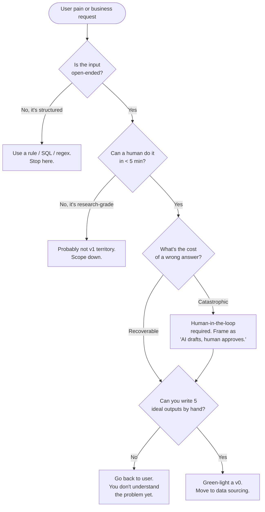

# Problem framing

> **In one line:** If you can't write down "the answer is good when X" and "the answer is unacceptable when Y" in plain English, you're not ready to build.

:::tip[In plain English]
Problem framing is the part where you stop and ask, *out loud*, "what are we actually doing and how will we know if it worked?" — before opening a code editor. It's the cheapest hour of the project and skipping it is the most expensive mistake. Half of failed AI projects fail here, not in the model.
:::

## Why this phase exists

A normal software feature has a spec ("build a button that does X"). An AI feature has a *behavior* — a fuzzy, judgment-laden notion of what a good response looks like. If you don't pin that down before you start, you'll spend weeks tuning prompts toward a target nobody has agreed on.

Concretely, problem framing produces three things:

1. A written description of who the user is and what they're trying to do.
2. Five hand-written `(input, ideal output)` examples.
3. A go/no-go decision recorded somewhere durable.

That's it. It should fit on one page.

## Three questions to answer first

**1. What does "good" look like?**
Write 5 example inputs and the ideal output for each. By hand. Before any code. If you can't write the ideal output, you don't understand the problem well enough to ship AI for it. If two people on the team write different ideal outputs, you have a definition-of-good problem, not a model problem.

**2. What's the cost of a wrong answer?**
Slightly annoying? Lose a customer? Legal exposure? This sets your eval bar and your human-in-the-loop requirements. The cost framing also decides whether you can ship "fast and improve" or whether you need to clear a high bar before any real user sees output.

**3. Is there a deterministic alternative?**
If a regex, a SQL query, or a hand-coded heuristic gets you 90% of the way, that's almost always the right answer for v0. AI is a great hammer but most problems aren't actually nails — they're already-screwed-in screws that just need a screwdriver.

## When AI is the right tool

- The input is open-ended (free text, images, audio, semi-structured documents).
- The output benefits from generative or summarization capabilities.
- The problem has been hard for deterministic approaches over the years.
- You can tolerate occasional wrong answers, *or* the human-in-the-loop pattern is acceptable.
- The cost-per-call (a few cents at most) fits the value of the action.

## When AI is the wrong tool

- The cost of a single wrong answer is catastrophic and human review is impossible.
- The input is already structured and a rule can solve it (e.g., "is this email address valid").
- The latency/cost budget doesn't fit (sub-100ms responses at scale, sub-$0.0001/call).
- "We want to add AI" without an identified user pain point.
- You'd need to expose data you legally can't send to an LLM provider, and you don't have budget to self-host.

## The framing flow

## Output of this phase

A one-pager containing:

- The user problem (one paragraph, plain English).
- The proposed AI solution (one paragraph).
- 5 example inputs + ideal outputs.
- The failure cost (low / medium / high / catastrophic).
- The success metric (what you'd point at in 90 days to say "it worked").
- A go/no-go decision with the date and the names of the people who signed off.

Store it in the repo as `docs/proposal.md` or in your team wiki. You will refer back to it constantly when scope creep starts.

:::note[Acme thread: framing the support assistant]
The Acme team starts here. Initial framing is a sentence: *"Let's add AI to support."* That's a feature wish, not a problem.

After a 45-minute working session with the support lead, the one-pager looks like:

- **User:** internal support agent (not the end customer — important).
- **Problem:** ~30% of incoming tickets are FAQ-style and the agent spends 4-5 minutes locating the answer in the docs.
- **Proposed solution:** an "AI draft reply" panel that surfaces 2-3 relevant doc snippets and a suggested response the agent can edit and send.
- **5 ideal outputs:** the support lead writes them in 20 minutes from last week's archive.
- **Failure cost:** medium. Wrong drafts waste agent time but never reach the customer unedited.
- **Success metric:** average time-to-first-response drops by 30%, with agent satisfaction (survey) flat or up.
- **Decision:** go.

Notice what's *not* in there: which model, what framework, whether to use RAG. Those are the next phases.
:::

## Common anti-patterns

- **"Let's add AI to X."** Feature wish, not a problem. Push back until you have a user and a pain point.
- **Framing in jargon.** "Build a RAG system over our knowledge base" prejudges the approach. Frame in user outcomes.
- **No ideal outputs.** If nobody on the team can write what good looks like, no model will either.
- **Two different definitions of "good."** Caught early, this is a 30-minute alignment conversation. Caught after build, it's a re-do.
- **Scope creep into the framing.** "And it should also book the meeting and update the CRM." Frame *one* outcome per project.
- **Skipping the failure-cost question.** Determines whether you need HITL, which changes the entire UX.
- **"We'll figure out the metric later."** Later means never. Pick one now, even if imperfect.

## Real numbers

| What | Typical range |
|---|---|
| Time on this phase | 2-4 hours for a small team, 1-2 weeks for an enterprise with stakeholders |
| One-pager length | 1 page (literally — if it spills to 3, you're overthinking) |
| Number of ideal outputs to hand-write | 5 minimum, 10-20 better |
| Cost of skipping this phase | Weeks of rebuild + a damaged relationship with whoever ships it |

:::caution[Where teams trip up]
- **Building before framing because "AI is fast to prototype."** Yes — and that's exactly why teams ship demos with no shared definition of done and then can't ship v2.
- **Letting the loudest stakeholder define "good."** Get the actual end user's input. They will say surprising things.
- **Confusing AI excitement for AI fit.** It is okay — encouraged, even — to come out of framing and decide *not* to build with AI.
- **Framing the success metric as "users love it."** That's not measurable. Time saved, error rate, ticket deflection, etc. — make it numeric.
:::

## Checklist before moving on

- [ ] Written one-pager exists.
- [ ] Five hand-written ideal outputs exist.
- [ ] Failure cost is named (low / medium / high / catastrophic).
- [ ] Success metric is numeric and measurable in 90 days.
- [ ] Go/no-go decision recorded, with names + date.
- [ ] At least one non-engineer has read it and agrees with the framing.

<Quiz id="lifecycle-problem-framing-quick-check" variant="micro" title="Quick check">

<Question
  prompt="According to the page, what does the problem-framing phase concretely produce?"
  options={[
    { text: "A model choice, a framework choice, and a deployment plan" },
    { text: "A working prototype and a demo for stakeholders" },
    { text: "A one-page write-up, five hand-written input/ideal-output examples, and a recorded go/no-go decision" },
    { text: "A complete eval suite with hundreds of graded cases" }
  ]}
  correct={2}
  explanation="Framing produces exactly three lightweight artifacts: a written description of the user and problem, five hand-written ideal outputs, and a recorded go/no-go decision — all fitting on one page. Model and framework choices are deliberately absent; as the Acme example notes, those belong to the next phases."
/>

<Question
  prompt="Two teammates write noticeably different 'ideal outputs' for the same example input. What does the page say this indicates?"
  options={[
    { text: "A definition-of-good problem that needs an alignment conversation before any building" },
    { text: "A model problem that a stronger frontier model would fix" },
    { text: "Normal variance that evals will smooth out later" },
    { text: "A sign the task is research-grade and should be abandoned" }
  ]}
  correct={0}
  explanation="Disagreement on ideal outputs means the team has not agreed on what 'good' means — a definition-of-good problem, not a model problem. Caught early it is a 30-minute alignment conversation; caught after build it is a re-do. No model can hit a target nobody has agreed on, so a stronger model would not help."
/>

<Question
  prompt="A teammate proposes using an LLM to check whether email addresses are valid. Based on this page, what is the best response?"
  options={[
    { text: "Agree, since LLMs handle open-ended input well" },
    { text: "Agree, but require human-in-the-loop review of each result" },
    { text: "Suggest fine-tuning a small model to cut latency" },
    { text: "Push back: the input is structured and a deterministic rule solves it, so AI is the wrong tool" }
  ]}
  correct={3}
  explanation="Email validation is the page's own example of when AI is the wrong tool: the input is already structured and a rule can solve it. If a regex, SQL query, or heuristic gets you 90% of the way, that is almost always the right v0. AI fits open-ended input — free text, images, documents — not already-solved structured checks, so options that keep the LLM are over-engineering."
/>

</Quiz>

---

→ Next: [Data sourcing](./02-data.md)
