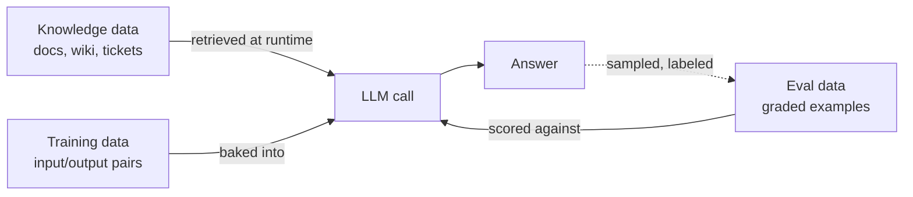

# Data sourcing

> **In one line:** AI projects have three different data needs — knowledge data, eval data, and (sometimes) training data — and most teams only think about the first one until it's far too late.

:::tip[In plain English]
"Data sourcing" sounds boring, but it's the phase where most AI projects quietly die. The model is a commodity; the data isn't. You need three different piles of data: the **knowledge** the model retrieves from (the docs, the wiki, the database), the **eval set** that tells you whether the system is good (a few hundred graded examples), and — only sometimes — **training data** to fine-tune a model. Almost every team underestimates the eval set in particular.
:::

## The three uses of data



> **Reading this diagram:** Knowledge flows *in* at runtime via RAG. Eval data scores the model's output. Training data (only for fine-tuning projects) shapes the model itself. The dotted line is the most important: production outputs become tomorrow's eval cases.

## Knowledge data (for RAG)

The documents the model will retrieve from. Questions to answer before you build anything:

- **Where does it live?** Wiki, S3, Notion, Postgres, customer files, SharePoint, Zendesk, that ancient Confluence instance nobody owns.
- **How does it get updated, and how often?** Hourly? Quarterly? "When somebody remembers"?
- **Who owns it?** If a doc has no human owner, nobody will keep it fresh. This is a future-quality bomb.
- **Who can read it?** Authorization becomes a RAG concern: the user must never see retrieved content they wouldn't otherwise have access to.
- **What's the quality?** Outdated docs → outdated answers. Run a small audit: pick 20 docs at random, check accuracy.
- **Can you crawl it incrementally** vs. full re-ingest? Re-embedding 5M chunks every night is a budget line item.
- **Are there duplicates and near-duplicates?** Same content, three slightly different versions. RAG will retrieve all three and confuse the model.

### Common knowledge-data sources, ranked roughly by pain

| Source | Pain level | Why |
|---|---|---|
| Markdown in a Git repo | Low | Versioned, diff-able, easy to ingest. |
| Postgres or BigQuery rows | Low | Structured, queryable. |
| Notion / Confluence | Medium | API works but rate limits and weird page hierarchies. |
| Google Drive | Medium-high | Permissions are per-file; the API is awkward; PDFs vary wildly. |
| Email / Slack archives | High | Conversation context matters; PII everywhere; legal questions. |
| Customer-uploaded files | High | Untrusted, variable formats, prompt injection vector. |
| Scanned PDFs / images | Highest | Needs OCR first, often hallucinates structure. |

## Eval data

The 50-500 graded examples that tell you "is this working." If you only build one data pile, build this one.

Sources:

- **Real user logs** — best source. Sample from production once you're running. Until then, simulate.
- **Hand-crafted** — for cold start; write them yourself or, ideally, with a domain expert. The 5 examples from problem framing are the seed.
- **Synthetic** — LLM-generated cases. Useful for coverage and stress-testing edge formats; never the *only* source.
- **Adversarial** — prompt injection attempts, weird formatting, deliberately-confusing input, edge cases.

Each eval case is roughly shaped like this:

```python
{
  "id": "ticket-2026-04-17-billing-refund-001",
  "input": {
    "ticket_text": "Hi, I was charged twice for my June subscription...",
    "user_tier": "pro",
  },
  "expected": {
    "must_cite_doc_ids": ["billing-refund-policy-v3"],
    "must_contain_phrases": ["double-charge", "5 business days"],
    "must_not_contain_phrases": ["I'm sorry, I cannot help"],
    "tone": "apologetic, action-oriented",
  },
  "category": "billing/refund",
  "source": "production-log-2026-04-17",
}
```

The exact shape varies; the point is each case has a graded structure, not just a freeform "this should be good." Vague expectations produce vague evals.

## Training data (for fine-tuning)

Hundreds to thousands of `{input, ideal_output}` pairs. Expensive to assemble and to keep fresh. Most projects don't need this until they've exhausted prompting and RAG. The bar for "you should fine-tune now" is high:

- A stable, narrow task that won't drift much.
- A clear quality ceiling with prompting alone.
- Hundreds of high-quality labeled examples.
- A latency or cost reason a smaller specialized model would help.

If you don't meet all four, don't fine-tune yet. See [Continuous improvement](./10-improve.md) for when to revisit.

## Privacy and compliance

These decisions cascade into model choice, deployment topology, and contract negotiations. Surface them early — they often eliminate options.

- **What does the data contain?** PII, PHI, financial, IP, customer secrets?
- **Can it be sent to the model provider, or must it stay on-prem?** Anthropic, OpenAI, Google all offer no-training, zero-retention enterprise tiers, but contracts take weeks. Self-hosted (vLLM, Together, Fireworks) is another option.
- **Is there a retention or deletion requirement?** GDPR right-to-be-forgotten interacts oddly with embeddings.
- **Has the data subject consented to AI use?** "We updated our terms" is a brittle answer.
- **Where do logs go, and how long do they live?** This is the same question, but for the *output* side.

## Real numbers

| Item | Typical range |
|---|---|
| Time on knowledge-data audit | 1-3 days for one source, weeks for an enterprise sprawl |
| Time to build a starter eval set | 4-12 hours of a domain expert + 4 hours of engineer wrangling |
| Eval set size at launch | 50-200 cases |
| Eval set size at year 1 | 500-2,000 cases |
| Vector DB cost (1M chunks, daily updates) | $20-$200/month depending on provider |
| OpenAI/Anthropic enterprise contract turnaround | 4-12 weeks |

:::info[Real numbers callout]
Embedding 1M chunks of ~500 tokens each with a 2026-tier embedding model (`text-embedding-3-large` or equivalent) costs roughly $20-$60 one-time. Storing them in pgvector or a hosted Pinecone instance: ~$50-$200/month. The expensive part is *keeping it fresh* — re-embedding nightly to capture doc updates can multiply the cost 30x. Incremental ingestion (only re-embed changed chunks) is worth the engineering effort by month 2.
:::

:::note[Acme thread: the data audit]
The Acme team finds:

- **Knowledge:** docs live in three places — a Notion workspace (200 pages), the help center on Intercom (180 articles), and historical resolved tickets in Zendesk (~30K). The Notion and Intercom are fresh; the Zendesk archive is *gold* but contains PII (customer names, sometimes payment info).
- **Eval data:** the support lead pulls 100 resolved tickets across the top 6 categories. With the AI engineer, they label "ideal reply" for each one in about a day.
- **Training data:** none needed. They're going RAG-only.
- **Privacy:** Zendesk tickets get a PII-scrubbing pass before being embedded. They already have an enterprise Claude contract from another project, so model-side data handling is solved.

Total elapsed: 3 days. The PII scrubber takes longer than expected (named-entity recognition false negatives), which is normal.
:::

## Common anti-patterns

- **"We'll figure out the data later."** Later means at launch, when the docs turn out to be stale and the eval set doesn't exist.
- **One pile of data for everything.** Knowledge data ≠ eval data ≠ training data. They have different shapes and freshness requirements.
- **Trusting the doc owners to say the docs are good.** Audit a random sample; owners are biased.
- **Embedding the entire wiki on day one.** Start with the subset you know is good. Add more sources only when retrievability is the bottleneck.
- **Synthetic-only eval sets.** They're easy to generate and easy to ace. Real users produce shapes no LLM can synthesize.
- **Ignoring permissions.** RAG with no per-user filtering is the single most common AI security bug in 2026.

:::caution[Where teams trip up]
- **Discovering on day 30 that the docs are stale.** Always audit before you build.
- **Confusing "we have a lot of data" with "we have useful data."** Volume is not value.
- **Treating PII as someone else's problem.** If it lands in your embedding store, it's yours.
- **Building a beautiful pipeline before knowing if retrieval helps.** Test with 20 docs first; scale later.
:::

## Checklist before moving on

- [ ] Every knowledge source has a named human owner and an update cadence.
- [ ] You have a 50+ case eval set with input + structured expected output.
- [ ] PII / PHI handling is decided and written down.
- [ ] Model-provider contract is sufficient for the data class you're sending.
- [ ] Retention and deletion policies are agreed for both inputs and outputs.

<Quiz id="lifecycle-data-quick-check" variant="micro" title="Quick check">

<Question
  prompt="The page describes three distinct piles of data. If a team only builds one, which does the page say it should be?"
  options={[
    { text: "The knowledge data, because RAG cannot work without it" },
    { text: "The eval data — the 50-500 graded examples that tell you whether the system works" },
    { text: "The training data, because fine-tuning gives the biggest quality gains" },
    { text: "A unified pile that serves knowledge, evals, and training at once" }
  ]}
  correct={1}
  explanation="The page is explicit: 'If you only build one data pile, build this one' — the eval set. Knowledge data matters for RAG, but without evals you cannot tell whether anything works. Training data is only needed for fine-tuning, which most projects defer, and a single pile for everything is listed as an anti-pattern because the three have different shapes and freshness needs."
/>

<Question
  prompt="Why does the page warn against eval sets made only of synthetic (LLM-generated) cases?"
  options={[
    { text: "Synthetic data is forbidden under GDPR retention rules" },
    { text: "Synthetic cases cost far more tokens than sampling real logs" },
    { text: "LLM-generated cases always contain hallucinated PII" },
    { text: "They are easy to generate and easy to ace; real users produce input shapes no LLM can synthesize" }
  ]}
  correct={3}
  explanation="Synthetic cases are useful for coverage and stress-testing edge formats, but the page says they must never be the only source: a system can ace an LLM-generated test while failing on the messy, surprising inputs real users actually send. The other options are not claims the page makes — the objection is about blind spots, not cost or legality."
/>

<Question
  prompt="According to the page, what is the single most common AI security bug in 2026?"
  options={[
    { text: "RAG with no per-user permission filtering, so users can see retrieved content they should not access" },
    { text: "Prompt injection through customer-uploaded files" },
    { text: "Leaking provider API keys in client-side code" },
    { text: "Poisoned training data in fine-tuned models" }
  ]}
  correct={0}
  explanation="The page names RAG without per-user filtering as 'the single most common AI security bug in 2026.' Authorization becomes a retrieval concern: a user must never see retrieved content they could not otherwise read. Prompt injection via uploaded files is a real risk the page also flags, but it is rated a high-pain source — not the most common bug."
/>

</Quiz>

---

→ Next: [Data engineering for AI features](./data-engineering.md)
