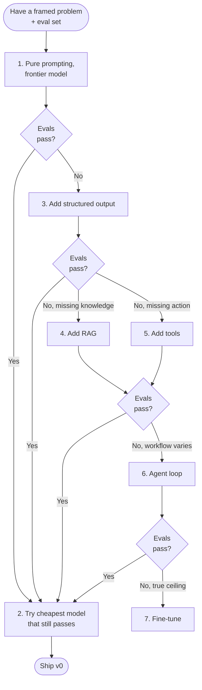

# Model & approach selection

> **In one line:** Pick the simplest pattern that could plausibly work; complicate later if your evals say so.

:::tip[In plain English]
There are basically four shapes an AI feature takes — a single prompt, prompt-plus-retrieval (RAG), a fine-tuned model, or an agent that uses tools in a loop. Most teams reach for the fanciest one first because it sounds impressive. The right move is to start with the simplest and only escalate when evals prove the simpler thing isn't enough. Each step up the ladder costs more in engineering, latency, and operational complexity.
:::

## The four shapes

- **Pure prompting** — One LLM call, well-crafted prompt, structured output. Right when the task fits in a single call and the model has the knowledge.
- **RAG** — Retrieval-augmented prompting. Right when the answer depends on documents the model doesn't know (private docs, recent data, customer-specific context).
- **Fine-tuning** — Right when you need consistent tone/format/style across thousands of examples that prompting can't enforce, *or* when latency/cost demands a smaller specialized model.
- **Agent** — Multi-step loop with tools. Right when the workflow varies and benefits from dynamic tool selection.

## Default decision order

Try in this order; stop at the first that passes your evals.



Concretely:

1. **Pure prompting with the best model.** Baseline. Don't optimize cost yet.
2. **Pure prompting with the cheapest model that passes evals.** Cost-optimize.
3. **Add structured output.** Almost always free quality + composability win.
4. **Add RAG** if knowledge is the gap.
5. **Add tools** if action or live data is the gap.
6. **Make it an agent** if the workflow varies and the model needs to decide *which* tool to call.
7. **Fine-tune** if everything above hits a ceiling.

## When each pattern is right (and wrong)

### Pure prompting

**Right when:** task is self-contained (summarize, classify, rewrite), inputs fit in context, the model already has the knowledge (general world facts), the output schema is simple.

**Wrong when:** the answer depends on private/recent data, the workflow has more than one step, the output needs to vary by external state.

### RAG

**Right when:** answers depend on documents (FAQ, policies, product docs, internal wiki), data updates frequently, you need to cite sources, the knowledge is too large to stuff in a system prompt.

**Wrong when:** the model already knows it (don't RAG over "what is Python"), the docs are stale (you'll cite wrong answers with confidence), the retrieval is poor (a bad retriever makes RAG worse than no RAG).

### Fine-tuning

**Right when:** you have a stable narrow task, you need consistent tone/format the prompt can't enforce after many tries, you have hundreds of high-quality `{input, output}` pairs, latency or cost-per-call is a hard constraint.

**Wrong when:** the task is still evolving (you'll burn through fine-tunes), you have < 200 good labeled examples, you haven't exhausted prompting yet. Fine-tuning is almost never the right *first* move.

:::tip[→ Going deeper]
For the full decision — LoRA vs full fine-tune, data prep, preference tuning, and how to tell when you've genuinely hit the prompting/RAG ceiling — see [Chapter 7: Fine-tuning & Customization](/docs/fine-tuning), especially [when to fine-tune](/docs/fine-tuning/ft-when).
:::

### Agents

**Right when:** the workflow genuinely varies (the model must choose between 5+ tools based on input), multi-step reasoning is required, the output isn't a single answer but a sequence of actions.

**Wrong when:** a script with branches would do (then write the script; agents are for cases where you can't enumerate the branches). Agents are slow, expensive, and harder to debug — the bar is high.

## Model picks (May 2026)

- **Frontier (when quality matters most):** Claude Opus 4.7, GPT-class flagship, Gemini Advanced.
- **Workhorse (90% of features):** Claude Sonnet 4.6, GPT mid-tier, Gemini Pro.
- **Cheap & fast (classification, batch, internal tools):** Claude Haiku 4.5, GPT mini, Gemini Flash.
- **Open self-hosted:** Llama 4, Mistral, Qwen 3, DeepSeek-R3 via vLLM or Together/Fireworks/Groq.

### Tiered routing

The 2026 trick: **tiered routing**. Use the cheap model by default; escalate to the bigger one only when needed.

```python
def answer(question, context):
    # Try the cheap model first
    draft = haiku.generate(prompt(question, context))
    if confidence(draft) > 0.85 and validates_schema(draft):
        return draft
    # Escalate to the workhorse on uncertain or malformed outputs
    return sonnet.generate(prompt(question, context))
```

Typical savings: 60-80% of inference cost with negligible quality loss, *if* your escalation signal is good. The most common escalation signals: low confidence score, schema-validation failure, presence of "I don't know" phrasing, output length anomalies.

## Real numbers

| Pattern | Engineering time to v0 | Per-call cost (Acme-shaped task) | p50 latency |
|---|---|---|---|
| Pure prompting | Hours | $0.002-$0.01 | 1-3s |
| RAG | 1-3 days | $0.005-$0.02 | 2-5s |
| Fine-tuned small model | 2-4 weeks | $0.0005-$0.002 | < 1s |
| Agent (3-5 tool calls) | 1-2 weeks | $0.02-$0.10 | 8-30s |

:::info[Real numbers callout]
Cost-per-call grows roughly linearly with the number of LLM round-trips. A pure prompt is 1 round-trip. RAG is still 1 round-trip (the retrieval is much cheaper than the LLM call). A 5-step agent is 5+ round-trips and so 5-10x the cost. This is why "let's add agentic behavior" should require evidence, not enthusiasm.
:::

:::note[Acme thread: picking RAG]
The Acme team runs through the decision flow:

- **Pure prompting?** No — the model doesn't know Acme's billing policy or feature-flag rules.
- **RAG?** Likely yes — answers live in the docs.
- **Fine-tuning?** No — they have ~30K resolved tickets but the policies change quarterly, so a fine-tune would go stale fast.
- **Agent?** No — the workflow is "look up docs, draft reply." It doesn't branch much.

Picked: **RAG over (Notion + Intercom + scrubbed Zendesk archive) with Claude Sonnet 4.6.** Tiered routing later; v0 uses Sonnet for everything.

Time on this decision: 90 minutes including writing the ADR. The ADR matters because in 6 months somebody will ask "why didn't we fine-tune?" and the answer should be written down.
:::

## Common anti-patterns

- **"Let's build an agent."** Almost always premature. Start with a prompt; add structure when you need it.
- **"Let's fine-tune."** Almost always premature. Exhaust prompting + RAG first.
- **Defaulting to the flagship model "just in case."** Run an eval on the cheap one first; you'll often be surprised.
- **Choosing the model before designing evals.** You can't compare models without evals.
- **Picking an OSS self-hosted model to "avoid lock-in"** without doing the ops math. Self-hosting is real work; lock-in to a commodity API is overstated.
- **Adding RAG when the model already knows the answer.** Burns latency and budget without quality gain.
- **One agent loop wrapping everything because "agents are the future."** Agents are *a* future; they're not the right shape for most tasks today.

:::caution[Where teams trip up]
- **Pattern flexing.** Choosing the technically interesting pattern instead of the right one for the problem. Boring beats clever in production.
- **Skipping the ADR.** Six months from now you won't remember why you picked RAG over fine-tuning. Write 200 words now and your future self thanks you.
- **Treating "model choice" as the project.** The model is the easiest thing to swap. Spending three weeks A/B-testing flagship models before you have evals is wasted time.
- **Underestimating retrieval quality.** A great model with bad retrieval beats nothing, but loses to a mediocre model with good retrieval. Invest in the retriever.
:::

## Checklist before moving on

- [ ] Chosen pattern is one of: prompt, RAG, fine-tune, agent — and you can explain why in one sentence.
- [ ] Chosen model tier (flagship / workhorse / cheap) is named.
- [ ] A short ADR (Architecture Decision Record) exists explaining the choice.
- [ ] Cost-per-call ballpark is estimated and acceptable.
- [ ] Latency target is named (e.g., "under 5s p95").
- [ ] You haven't committed to fine-tuning unless all four fine-tune preconditions are met.

<Quiz id="lifecycle-approach-quick-check" variant="micro" title="Quick check">

<Question
  prompt="What is the page's core rule for choosing between prompting, RAG, fine-tuning, and agents?"
  options={[
    { text: "Start with an agent so you never have to re-architect later" },
    { text: "Pick whichever pattern the team finds most technically interesting" },
    { text: "Start with the simplest pattern and escalate only when evals prove it is not enough" },
    { text: "Always fine-tune first, since a specialized model is cheapest at scale" }
  ]}
  correct={2}
  explanation="The page's one-liner is to pick the simplest pattern that could plausibly work and complicate later only if evals say so. Each step up the ladder — RAG, tools, agents, fine-tuning — costs more engineering, latency, and operational complexity. Starting with an agent or a fine-tune is called out as almost always premature, and 'pattern flexing' (choosing the interesting option) is a named trip-up."
/>

<Question
  prompt="When does the page say fine-tuning is the right move?"
  options={[
    { text: "A stable narrow task, a real quality ceiling with prompting, hundreds of high-quality labeled pairs, and a latency or cost constraint" },
    { text: "Whenever you have tens of thousands of historical examples available" },
    { text: "As soon as a prompt fails after the first few tries" },
    { text: "When the model needs knowledge from private documents that change weekly" }
  ]}
  correct={0}
  explanation="Fine-tuning needs all of: a stable narrow task, a genuine ceiling that prompting cannot pass, hundreds of good labeled pairs, and a latency or cost reason. Volume of raw examples alone is not enough — Acme had ~30K tickets and still skipped fine-tuning because policies change quarterly. Frequently changing knowledge is a RAG problem; a fine-tune would just go stale."
/>

<Question
  prompt="In tiered routing, what is the role of the cheap model?"
  options={[
    { text: "It double-checks the flagship model's answers for hallucinations" },
    { text: "It handles every request first, escalating to a bigger model only on signals like low confidence or schema failure" },
    { text: "It is used only for offline batch jobs, never live traffic" },
    { text: "It generates synthetic training data for the larger model" }
  ]}
  correct={1}
  explanation="Tiered routing sends every request to the cheap model by default and escalates to the workhorse only when an escalation signal fires — low confidence, schema-validation failure, 'I don't know' phrasing, or length anomalies. Done well it saves 60-80% of inference cost with negligible quality loss. The cheap model is the front line, not a checker or a data generator."
/>

</Quiz>

---

→ Next: [Eval design](./04-evals.md)
