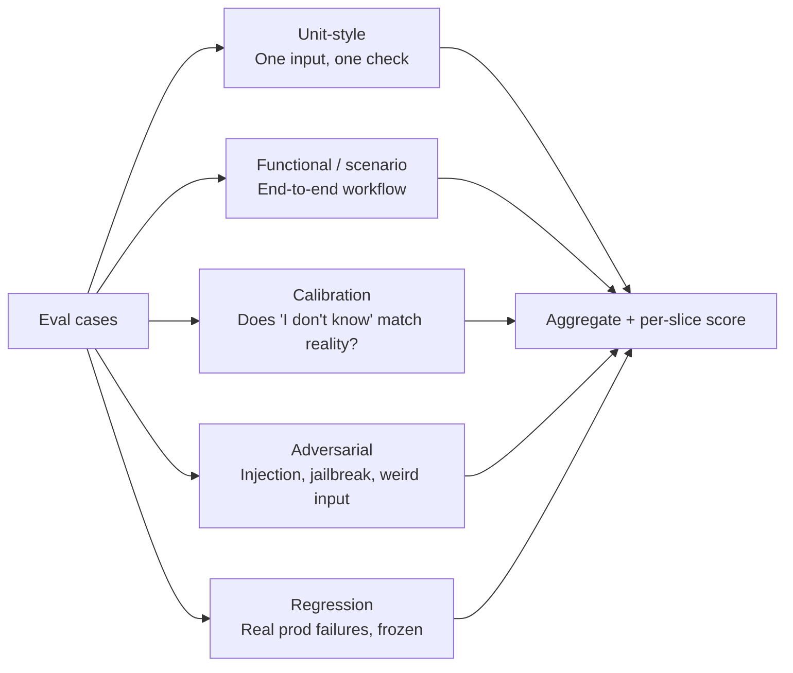

# Eval design

> **In one line:** Evals are unit tests for stochastic systems. You can't ship without them.

:::tip[In plain English]
An eval is a graded test of your model's output. You write down a bunch of `(input, expected_behavior)` cases, run them through your system, and a "grader" — sometimes deterministic, sometimes another LLM — scores how well each output matched. Run them on every change. If the score drops, don't ship. This is the closest thing AI has to a unit-test culture, and the teams that build one ship 5x faster than the teams that "just look at outputs."
:::

## What an eval is

A graded test of model output. Each test case has:

- **Input** — what gets sent to the model (or system).
- **Expected** — a reference answer, a schema, a set of required substrings, a set of allowed source IDs, a tone description, etc. *Not necessarily* a single string.
- **Grader** — the function that compares model output to expected. Either deterministic (regex, schema, set membership) or LLM-as-judge (a small prompt that scores the response).

A score across the whole set tells you whether things are getting better or worse over time.

## Types of evals



- **Unit-style** — One input, one specific expected behavior. ("This question must return source ID 42 and the word 'refund'.")
- **Functional / scenario** — End-to-end check of a workflow. ("Given this conversation, the bot should escalate to a human.")
- **Calibration** — How often does the model's "I don't know" actually correlate with absent knowledge?
- **Adversarial** — Prompt injection, jailbreak, weird inputs, malicious tool inputs.
- **Regression** — Real production failures, captured as new eval cases. This pile grows forever.

## Eval case structure

A typical eval case as Python:

```python
{
  "id": "billing-refund-001",
  "input": {
    "ticket": "I was charged twice for June. Please refund.",
    "user_tier": "pro",
  },
  "expected": {
    "must_cite": ["billing-refund-policy-v3"],
    "must_contain_phrases": ["double-charge", "5 business days"],
    "must_not_contain_phrases": ["I cannot help", "I'm just an AI"],
    "must_call_tool": "create_refund_request",
    "tone": "apologetic, action-oriented",
  },
  "category": "billing/refund",
  "weight": 1.0,
  "source": "production-log-2026-04-17",
}
```

## Scoring shapes

The actual grading code stays small. A starter eval runner:

```python
def score_case(case, output):
    checks = []
    e = case["expected"]
    if "must_cite" in e:
        cited = set(output.get("sources", []))
        checks.append(set(e["must_cite"]).issubset(cited))
    if "must_contain_phrases" in e:
        text = output["text"].lower()
        checks.append(all(p.lower() in text for p in e["must_contain_phrases"]))
    if "must_not_contain_phrases" in e:
        text = output["text"].lower()
        checks.append(not any(p.lower() in text for p in e["must_not_contain_phrases"]))
    if "must_call_tool" in e:
        called = [t["name"] for t in output.get("tool_calls", [])]
        checks.append(e["must_call_tool"] in called)
    if "tone" in e:
        checks.append(llm_judge_tone(output["text"], e["tone"]) >= 0.7)
    return sum(checks) / len(checks)
```

LLM-as-judge for the fuzzy bits (tone, helpfulness):

```python
def llm_judge_tone(text, target_tone):
    prompt = f"""Rate from 0.0 to 1.0 how well this text matches the tone: "{target_tone}".
Text: {text}
Return ONLY a number."""
    return float(haiku.generate(prompt))  # cheap model is enough for judging
```

> **Why a cheap model for judging?** The judge's job is simple — score a string against a rubric. Using the flagship model to judge the flagship model's output is expensive and rarely worth it. Just sanity-check that the judge agrees with humans on ~30 cases.

## Tooling

- **Starter:** a Python file with JSON test cases. Run on CI. 100 lines.
- **Hosted:** Braintrust, Langfuse, Vellum, LangSmith. Add when you have eval-set sprawl (many graders, many slices, many comparisons).
- **OSS:** Promptfoo, DeepEval, Ragas (especially for RAG-specific metrics like faithfulness, context relevance, answer relevance).

You don't need a tool for the first 30 days. A `evals/` directory and a `pytest` run is fine.

:::tip[→ Going deeper]
This page is the lifecycle-level view. For the full discipline — LLM-as-judge design and its biases, the metrics that actually correlate with quality, and running evals continuously against production traffic — see [Chapter 5: Evaluation & Measurement](/docs/evaluation), especially [LLM-as-judge](/docs/evaluation/eval-llm-as-judge) and [eval metrics](/docs/evaluation/eval-metrics).
:::

## The cycle that actually works

1. Curate 30-50 representative cases by hand. Cover the top 5 categories of input.
2. Run them against your current implementation. Score them.
3. Ship the first version (behind a flag).
4. Sample real user inputs. Any time you spot a wrong answer, **add it to the eval set with the correct expected output**.
5. Re-run on every prompt or model change. Don't ship if the aggregate score drops *or* if any per-category slice drops > 5%.

Teams that do this iterate confidently. Teams that don't are guessing.

## Slicing matters

A single aggregate score hides regressions. Slice by:

- **Category** (billing, technical, account, ...)
- **Difficulty** (easy / medium / hard, labeled by the curator)
- **Source** (hand-crafted / from prod / adversarial)
- **User tier** (free / pro / enterprise — if behavior should differ)
- **Length** (short prompt / long prompt)

A "+3% overall" change that's actually "+8% on easy cases, -7% on hard" is a regression for the cases that matter.

## Real numbers

| Item | Typical range |
|---|---|
| Eval set size at v0 launch | 30-100 cases |
| Eval set size at year 1 | 500-2,000 cases |
| Time to curate one good case | 5-20 minutes (longer with structured expected fields) |
| Eval run wall-clock (200 cases, no parallelism) | 5-15 minutes |
| Eval run wall-clock (200 cases, parallelized) | 30-90 seconds |
| Per-eval-run cost (200 cases on Sonnet) | $0.50 - $3.00 |

:::info[Real numbers callout]
A 200-case eval running on every prompt change at Sonnet pricing is ~$2. Run it 50 times in a month and that's $100. This is negligible against engineering time and worth every cent. Don't skip evals because "they cost money to run" — they're orders of magnitude cheaper than the failure mode they prevent.
:::

:::note[Acme thread: building the first eval set]
The Acme team:

1. The support lead picks 100 resolved tickets covering 6 categories (billing, account, integrations, bugs, feature requests, "other").
2. For each, she writes an ideal reply plus a structured `expected` object with required citations and forbidden phrases ("I'm just an AI", "I cannot help with that").
3. The AI engineer writes a 120-line `eval_runner.py` that scores cases against the system and emits a per-category breakdown.
4. They wire it into CI: every PR that touches `/prompts` or `/retriever` re-runs the suite and posts the diff vs main as a comment.

Total time: 1 day from the support lead, half a day from the engineer. They later wish they'd done 200 cases instead of 100, but 100 is enough to ship v0.
:::

## Common anti-patterns

- **"We'll add evals after we ship."** You won't. And without them, "after we ship" you can't tell if changes help.
- **Aggregate-only scores.** Hides slice regressions. Always look at the breakdown.
- **Eval set that only contains easy cases.** You'll ace it and ship a broken thing.
- **Eval set frozen in time.** Add prod failures continuously, or it becomes irrelevant.
- **Judging with the same model that's being tested.** You'll get correlated errors. Use a different model — usually a cheaper one is fine.
- **Eval cases that test wording instead of behavior.** "Output must say 'Thank you for contacting us.'" is brittle. Test the *behavior*: was the right info conveyed, in the right tone, with the right citation?
- **Optimizing for the eval set at the expense of real users.** Periodically sample real prod data; if eval scores and user satisfaction diverge, the eval set is wrong.

:::caution[Where teams trip up]
- **Calling "outputs look good in playground" an eval.** It isn't. A vibe-check is not a measurement.
- **No CI integration.** If evals only run when someone remembers, regressions ship.
- **Curating cases alone.** A domain expert finds cases an engineer would never write.
- **Building elaborate eval infrastructure before having a real eval suite.** 100 lines of Python + a JSON file beats a hosted dashboard with 5 cases in it.
- **Not versioning the eval set alongside the prompt.** When the prompt changes, the eval set sometimes needs to too. Commit them together.
:::

## Checklist before moving on

- [ ] You have 30+ eval cases covering the top categories.
- [ ] Each case has structured `expected` fields, not just a freeform string.
- [ ] Scoring runs in under 5 minutes (parallelized) so people will actually run it.
- [ ] CI runs evals on every prompt/retriever change.
- [ ] Per-category and per-slice breakdowns are visible, not just the aggregate.
- [ ] At least one domain expert has reviewed the case set for coverage.

<Quiz id="lifecycle-evals-quick-check" variant="micro" title="Quick check">

<Question
  prompt="Why does the page recommend a cheap model for LLM-as-judge grading?"
  options={[
    { text: "Cheap models are inherently less biased than flagship models" },
    { text: "Judging requires a different provider for compliance reasons" },
    { text: "Flagship models refuse to grade outputs from other models" },
    { text: "The judge's job — scoring a string against a rubric — is simple, so a flagship judge is expensive and rarely worth it" }
  ]}
  correct={3}
  explanation="The judge only has to score a string against a rubric, which a cheap model handles fine — just sanity-check that it agrees with humans on ~30 cases. Separately, the page warns against judging with the same model being tested, because you get correlated errors; using a different, cheaper model solves both problems at once."
/>

<Question
  prompt="An eval run shows the aggregate score up 3% overall. According to the page, why is that not enough to ship?"
  options={[
    { text: "Aggregate scores are statistically meaningless below 1,000 cases" },
    { text: "The aggregate can hide slice regressions — for example +8% on easy cases while hard cases drop 7%" },
    { text: "Eval scores only matter once the product is in production" },
    { text: "A 3% gain is always within the noise of LLM-as-judge graders" }
  ]}
  correct={1}
  explanation="A single aggregate hides regressions: the page's example is a '+3% overall' change that is really +8% on easy cases and -7% on hard ones — a regression for the cases that matter. That is why the cycle says don't ship if any per-category slice drops more than 5%, even when the aggregate is up. The other options are not claims the page makes."
/>

<Question
  prompt="In the eval cycle the page describes, what should happen when you spot a wrong answer in real production traffic?"
  options={[
    { text: "File a bug and wait for the next model upgrade to fix it" },
    { text: "Patch the prompt immediately in production" },
    { text: "Add it to the eval set as a new case with the correct expected output" },
    { text: "Remove similar cases from the eval set so scores stay comparable" }
  ]}
  correct={2}
  explanation="Real production failures become regression eval cases — a pile that 'grows forever.' This keeps the eval set relevant and prevents the same failure from shipping twice. A frozen eval set is a named anti-pattern, and patching prompts directly in production skips the eval re-run that tells you whether the fix actually helped."
/>

</Quiz>

---

→ Next: [Build (v0)](./05-build.md)
