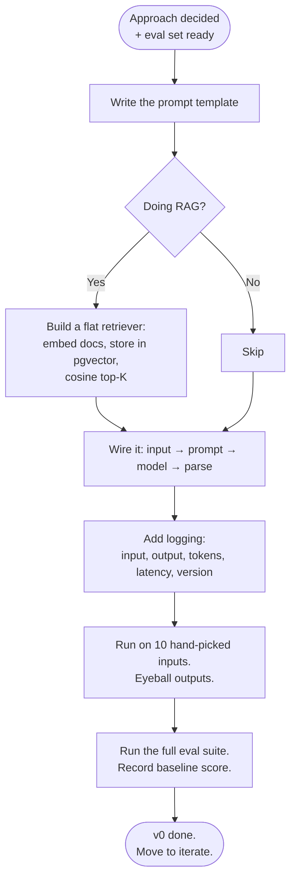

# Build (v0)

> **In one line:** The first build is end-to-end and intentionally minimal. The point is to surface unknowns, not to ship beauty.

:::tip[In plain English]
v0 is the throwaway-quality version that proves the concept works end-to-end. Real input goes in one side, an output comes out the other, and you can score it on the eval set. Nothing else matters for v0 — no caching, no fallback, no fancy UI, no model routing. You'll discover at least three surprises while building v0 (the docs are messier than expected, the latency is worse than expected, the model handles X better than expected). Those surprises are the whole point.
:::

## What v0 looks like

- **Frontier model** (best quality available) so you're not debugging the model. Cost-optimize later.
- **Raw provider SDK** (no framework) so you understand the surface. LangChain, LlamaIndex, etc. all hide useful detail at this stage.
- **Single prompt template**, version-controlled.
- **A simple retrieval** if you're doing RAG — flat vector search, no reranker, no hybrid yet, top-K of 5.
- **Structured output** for the output object — schema-validated.
- **Streaming** if user-facing.
- **Logs to a JSON file or Postgres table** — every input, output, model, latency, token count, prompt version.

That's the entire surface area.

## What v0 deliberately *omits*

- Multiple models or routing.
- Multiple personas.
- Multiple tool variants.
- A vector DB if a flat file works.
- A framework that promises to "do everything."
- Caching.
- Retry logic beyond what the SDK does automatically.
- Pretty UI.
- Production-grade auth on the demo endpoint.

You'll add these *after* you know which trade-offs they're solving. Every omitted feature is one less variable when you debug v0.

## The v0 build flow



## A v0 skeleton (Python, RAG flavor)

```python
import anthropic
from db import vector_search, log_call
from prompts import V0_TEMPLATE  # version-controlled string
from schemas import DraftReply    # Pydantic model

PROMPT_VERSION = "v0.1"
MODEL = "claude-sonnet-4-6"

def draft_reply(ticket: dict) -> DraftReply:
    docs = vector_search(query=ticket["text"], k=5)
    prompt = V0_TEMPLATE.format(
        ticket_text=ticket["text"],
        user_tier=ticket["user_tier"],
        docs="\n\n".join(f"[{d.id}] {d.text}" for d in docs),
    )
    t0 = time.monotonic()
    resp = anthropic.messages.create(
        model=MODEL,
        max_tokens=800,
        messages=[{"role": "user", "content": prompt}],
        # structured output via tool-use or response_format
    )
    latency_ms = (time.monotonic() - t0) * 1000
    parsed = DraftReply.model_validate_json(resp.content[0].text)
    log_call({
        "ticket_id": ticket["id"],
        "prompt_version": PROMPT_VERSION,
        "model": MODEL,
        "input_tokens": resp.usage.input_tokens,
        "output_tokens": resp.usage.output_tokens,
        "latency_ms": latency_ms,
        "input": ticket,
        "output": parsed.model_dump(),
        "retrieved_doc_ids": [d.id for d in docs],
    })
    return parsed
```

That's roughly the entire v0. Maybe 200 lines including the prompt template, the retriever, the schema, and the logging helper.

## How long v0 takes

For most AI features that are "one prompt + maybe RAG + maybe one tool": **a couple of days**, not weeks. If v0 is sliding past two weeks, the scope is too big — slice the feature.

Smell test: if your v0 has more than ~500 lines of Python before the eval suite runs, you've over-engineered it. Throw a layer away.

## Definition of done for v0

- Runs end to end on real input.
- Outputs are inspected (eyeballed) on a few dozen examples.
- A first pass at the eval set has been scored. Record the baseline.
- Cost and latency per call are measured.
- Worst observed failure mode is logged.
- Prompt is in version control (not in a Notion doc, not in a Python string scattered across files).

Now you have something to iterate on.

## Real numbers

| Metric | v0 target |
|---|---|
| Lines of Python | 100-500 |
| Time to build | 2-3 days for small team, 1-2 weeks for enterprise |
| First eval score | Whatever it is — you're establishing the baseline |
| p50 latency | < 5s for user-facing, < 30s for batch |
| Cost per call | Acceptable for your traffic ballpark |
| External services wired | 1-3 (model API, vector store, log destination) |

:::info[Real numbers callout]
Acme's v0: ~280 lines including the prompt template, the pgvector retriever, the schema, and the eval runner integration. Built in two engineer-days. First eval score: 0.61 (out of 1.0). p50 latency: 3.4s. Cost per draft: $0.018 on Sonnet, no caching yet. They now have something concrete to argue about.
:::

:::note[Acme thread: building v0]
The Acme engineer:

1. Spends an hour writing the prompt template. Includes the user's question, retrieved doc snippets, an instruction to cite by `[doc_id]`, and a JSON output schema with `reply_text`, `cited_doc_ids`, `confidence`, and `suggested_internal_note`.
2. Embeds the ~380 docs into pgvector (one-time, ~$1 of embedding cost).
3. Writes the 200-line `draft_reply` function above.
4. Runs it on 20 tickets from last week. Eyeballs the outputs with the support lead.
5. Runs the 100-case eval suite. Score: **0.61**. Worst category: integrations (0.42) — the retriever's missing the deep docs there.
6. Logs the baseline + observation in the project README.

Total time: 1.5 days. They are now ready to iterate.
:::

## Common anti-patterns

- **Starting with a framework you don't understand.** LangChain etc. hide retries, tool-call shapes, prompt assembly. Hard to debug what you can't see.
- **Building a beautiful UI before the model works.** UI is the last 20%, not the first.
- **Optimizing for cost on day one.** You don't know what you're optimizing against.
- **Skipping the eval baseline.** Without it, you can't tell if changes help.
- **No logging.** Without logged outputs, you can't add real failures to your eval set.
- **Building a multi-stage pipeline because "we'll need it eventually."** Build the single-stage version. Add stages when the eval forces you to.
- **No prompt versioning.** Editing a prompt without a version bump means you can't reproduce yesterday's behavior.
- **Hand-typing the same prompt into Playground to test changes.** Use the eval suite. Playground hides too much.

:::caution[Where teams trip up]
- **Polishing v0.** v0 is supposed to be ugly. The next phase will rewrite half of it. Polishing is wasted work.
- **Adding a vector DB on day one when 380 docs fit in pgvector.** pgvector handles up to a few million chunks fine. Don't reach for Pinecone/Qdrant until you have a reason.
- **Treating "the demo worked" as v0 done.** v0 is done when the eval suite scores it. Demos are not measurements.
- **Building three v0s in parallel to compare approaches.** Build one, evaluate it, then decide whether to try another. Sequential is faster than parallel here.
- **Trusting the model to follow your output schema without enforcement.** Use the SDK's structured-output / tool-use feature. Free-form JSON parsing fails ~5-15% of the time even with great prompts.
:::

## Checklist before moving on

- [ ] Code runs end-to-end on a real input.
- [ ] Eval suite scores it; baseline is recorded.
- [ ] Per-call cost and latency are measured and within your target band.
- [ ] Every call is logged with input, output, tokens, model, prompt version.
- [ ] Prompt and retriever code are in version control.
- [ ] No framework you can't read end-to-end in an hour.
- [ ] One paragraph written: "what surprised us in v0."

---

→ Next: [Iterate with evals](./06-iterate.md)
