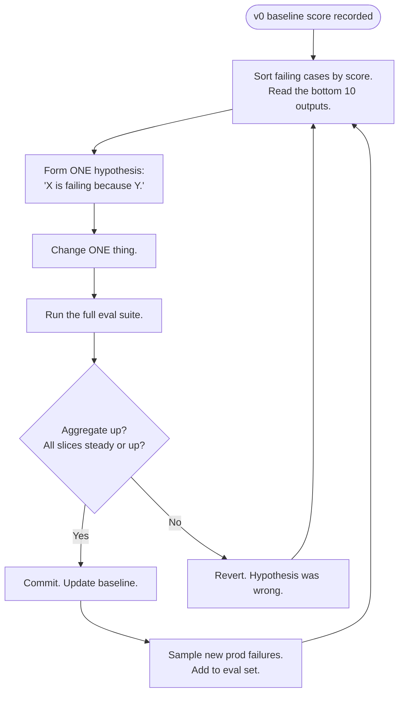

# Iterate with evals

> **In one line:** Look at *actual outputs*, not at the prompt. The prompt is what you change; the outputs are what you measure.

:::tip[In plain English]
The iterate phase is where most of the actual quality work happens. You read failing outputs, form a hypothesis about why they failed, change one thing, re-run the eval suite, and check whether the score went up without anything else going down. The trap everyone falls into is changing five things at once, declaring victory on the aggregate score, and silently regressing on a category nobody noticed. Disciplined iteration is what separates teams that go from 0.6 → 0.9 in a quarter from teams that plateau at 0.65.
:::

## The loop



1. **Inspect failures.** Sort eval cases by score; read the bottom 10. Don't aggregate — read individual outputs. You're looking for *patterns*: "the model keeps inventing doc IDs," "the model hedges when the user is angry," "retrieval brings back irrelevant chunks for short queries."
2. **Hypothesize.** "The model gets X wrong because it interprets Y as Z."
3. **Change one thing.** A prompt instruction, a retrieval setting, the model, a few-shot example, the schema.
4. **Re-run the full eval suite.** Not just the failing cases — make sure you didn't regress others.
5. **Commit and ship** if scores improved on aggregate *and* didn't drop > 5% on any slice. Otherwise revert.

## What to vary, in order of cheapness

```
prompt wording             ← try first (free, instant)
  ↓
few-shot examples          ← cheap, often dramatic
  ↓
system prompt structure    ← free
  ↓
output schema              ← cheap, often unlocks quality
  ↓
retrieval settings         ← K, chunk size, reranker, hybrid
  ↓
model                      ← cost/latency trade-off
  ↓
decomposition              ← split one call into two specialized calls
  ↓
fine-tuning                ← expensive, rarely the right next step
```

The discipline is *don't skip ahead*. Teams reach for fine-tuning when a single sentence added to the system prompt would have fixed it.

## What "change one thing" actually means

It's tempting to bundle "improved the retrieval, also tightened the prompt, also moved to a bigger model" into one PR. Don't.

```python
# Bad: three changes, one commit
- top_k = 5
+ top_k = 10
- model = "claude-sonnet-4-5"
+ model = "claude-sonnet-4-6"
- prompt = OLD_PROMPT
+ prompt = NEW_PROMPT_WITH_FEW_SHOT
```

If the score goes up, you don't know which change helped. If it goes down, you don't know which change hurt. Three separate eval runs cost ~$6 and take 15 minutes. Just do it.

## Reading failures well

Sit with the lowest-scoring 10 outputs. For each, answer:

1. What did the model output?
2. What was expected?
3. *Why* did the model do what it did? (Imagine the model's POV: what was in the context, what was the instruction, what was ambiguous?)
4. Is this a prompt problem, a retrieval problem, a model-capability problem, or a *case-was-wrong* problem?

The last category matters: ~10-20% of eval failures are actually bad eval cases (the expected output was wrong, or under-specified). Fix the case; don't blame the model.

## Patterns of common fixes

| Failure pattern | Likely fix |
|---|---|
| Model hallucinates source IDs | Constrain output to only IDs from the retrieved set; validate before returning |
| Model hedges too much | Add a few-shot example showing confident answers |
| Model refuses safe requests | Soften system-prompt safety language; add positive examples |
| Retrieved docs are off-topic | Increase K, add a reranker, try hybrid (BM25 + dense), check chunking |
| Model loses earlier context in long convos | Summarize earlier turns; cap conversation length |
| Output schema fails to parse | Use the SDK's structured output instead of free-form JSON |
| Slow on long inputs | Truncate retrieved docs; cache stable prefixes; downgrade model |
| Inconsistent tone | Few-shot examples with target tone; add a `tone` field in output schema |

## Tracking iteration

Keep a markdown log (per project, in the repo) that looks like:

```markdown
## Iteration log

### 2026-05-12 — added "cite by doc_id, not by content" instruction
- Hypothesis: model was paraphrasing instead of citing
- Score: 0.61 → 0.68 (+0.07)
- Slice movement: billing +0.10, integrations +0.05, account +0.04
- Cost change: none
- Verdict: shipped

### 2026-05-13 — bumped K from 5 to 10
- Hypothesis: integrations failures looked like retrieval misses
- Score: 0.68 → 0.66 (-0.02)
- Slice movement: integrations -0.04 (more noise), billing flat
- Cost change: +18% per call
- Verdict: reverted

### 2026-05-14 — added reranker (Cohere rerank-3.5) on top-20 → top-5
- Score: 0.68 → 0.74 (+0.06)
- Slice movement: integrations +0.12, others flat
- Cost change: +$0.001 per call
- Latency change: +180ms
- Verdict: shipped
```

Two effects: future you remembers what you tried, and the team sees the score trajectory.

## What to avoid

- **Changing more than one thing per cycle.** You won't know what helped.
- **Aggregate-only inspection.** "Score went up by 3%" without looking at examples hides regressions on important slices.
- **Optimizing for evals at the expense of real users.** Periodically sample real prod data; add failures back to the eval set.
- **Tuning until the eval set goes to 1.0.** Eval scores asymptote. The last 10% usually means the eval set is too easy.
- **Iterating without a CI eval run.** Every prompt change should trigger a fresh score.

## Real numbers

| Item | Typical |
|---|---|
| Eval score gain in first month of iteration | 0.6 → 0.8 is common |
| Eval score gain in second month | 0.8 → 0.85 is common (diminishing returns) |
| Time per iteration cycle | 30-60 minutes including eval re-run |
| Iterations to plateau | 15-40 |
| Iteration cost (200-case eval × 30 iterations) | ~$60 |

:::info[Real numbers callout]
At Acme, iteration cycle 1 (added a `cite by doc_id` instruction) moved the score from 0.61 to 0.68 in 20 minutes of work. Cycle 4 (added Cohere reranker) moved it from 0.68 to 0.74 and cost an extra $0.001/call + 180ms. By cycle 25 they hit 0.86, the team's pre-agreed "ship to internal cohort" bar. Total iteration time across two weeks: ~22 engineer-hours. Total iteration spend: ~$45 in eval runs.
:::

:::note[Acme thread: the iteration log]
The Acme engineer keeps `docs/iteration-log.md` in the repo and updates it after every eval run. Three months in, the log has 47 entries. About 60% of them were reverts. The team's quote-of-the-quarter: *"We learn as much from the things we tried that didn't help as from the things that did."*

The single biggest jump came from a non-obvious change: replacing the prompt's "Be helpful" instruction with three concrete examples of the desired tone. That moved tone-related grader scores from 0.51 to 0.79 in one commit.
:::

## Common anti-patterns

- **Vibe iteration.** "I added a sentence and it felt better." Without a re-run, you don't know.
- **Refusing to revert.** When the score drops, revert. Sunk cost is real.
- **Slice-blindness.** Aggregate up, but the user-facing slice (free-tier users, say) dropped. Ship and regret.
- **Eval-set overfit.** Tuning to the test, not to the world. Mitigate by adding fresh prod cases continuously.
- **Letting the model choose.** "Let's try a bigger model." Costs go up, score doesn't. Try the cheap fixes first.
- **Iterating on the wrong layer.** Spending three days on prompts when the retriever was the bottleneck.
- **No iteration log.** Every change should leave a record of what was tried and what happened.

:::caution[Where teams trip up]
- **Reading aggregate scores in Slack updates.** Always link to the per-slice breakdown.
- **Changing prompts in production directly.** Prompts are code. They go through a PR, with an eval diff attached.
- **"This is good enough — let's stop iterating."** Define "good enough" as a numeric eval threshold before you start. Otherwise the bar moves with mood.
- **Iterating on the cold eval set forever without sampling prod.** Eval cases age out of relevance. Weekly prod-sampling keeps them current.
- **Treating iteration as a one-time pre-launch sprint.** Iteration is *the job*, for the life of the product. Budget for it forever.
:::

## Checklist before moving on

- [ ] Eval score has moved meaningfully from baseline (typical: > +0.15).
- [ ] Per-slice scores are within ~5% of each other; no slice is silently regressing.
- [ ] An iteration log exists with at least 10 entries.
- [ ] Every prompt/retriever change goes through a PR with an eval diff.
- [ ] You've sampled at least one batch of real prod outputs and added failures to the eval set.
- [ ] You can articulate the *next* hypothesis you'd test if you had another week.

<Quiz id="lifecycle-iterate-quick-check" variant="micro" title="Quick check">

<Question
  prompt="Why does the page insist on changing only one thing per iteration cycle?"
  options={[
    { text: "Multiple changes make the eval suite too expensive to run" },
    { text: "Version control cannot track more than one change cleanly" },
    { text: "Models behave nondeterministically when several parameters change at once" },
    { text: "If the score moves after a bundled change, you cannot tell which change helped or which one hurt" }
  ]}
  correct={3}
  explanation="Bundling 'better retrieval, tighter prompt, bigger model' into one PR means an improved score teaches you nothing and a worse score gives you nothing to revert precisely. The page notes three separate eval runs cost about $6 and 15 minutes — cheap insurance. Cost is not the obstacle; attribution is."
/>

<Question
  prompt="Your RAG feature is underperforming. According to the page's 'order of cheapness', what should you try first?"
  options={[
    { text: "Prompt wording — it is free and instant" },
    { text: "Fine-tuning a smaller specialized model" },
    { text: "Swapping in a bigger model" },
    { text: "Splitting the single call into two specialized calls" }
  ]}
  correct={0}
  explanation="The ladder runs from cheapest to most expensive: prompt wording, few-shot examples, system prompt structure, output schema, retrieval settings, model swap, decomposition, and only then fine-tuning. The discipline is not skipping ahead — teams reach for fine-tuning when a single sentence added to the system prompt would have fixed the problem."
/>

<Question
  prompt="While reading failing outputs, you find the expected answer in an eval case is itself wrong. How common does the page say this is?"
  options={[
    { text: "Vanishingly rare — under 1% of failures" },
    { text: "About half of all eval failures" },
    { text: "Roughly 10-20% of eval failures are actually bad eval cases — fix the case rather than blaming the model" },
    { text: "It only happens with synthetic eval cases" }
  ]}
  correct={2}
  explanation="The page says about 10-20% of eval failures trace back to the eval case itself — a wrong or under-specified expected output. That is why the failure-reading routine ends with asking whether this is a prompt problem, a retrieval problem, a model-capability problem, or a case-was-wrong problem. Treating every failure as a model bug wastes iteration cycles on phantom issues."
/>

</Quiz>

---

→ Next: [Pre-production hardening](./07-harden.md)
