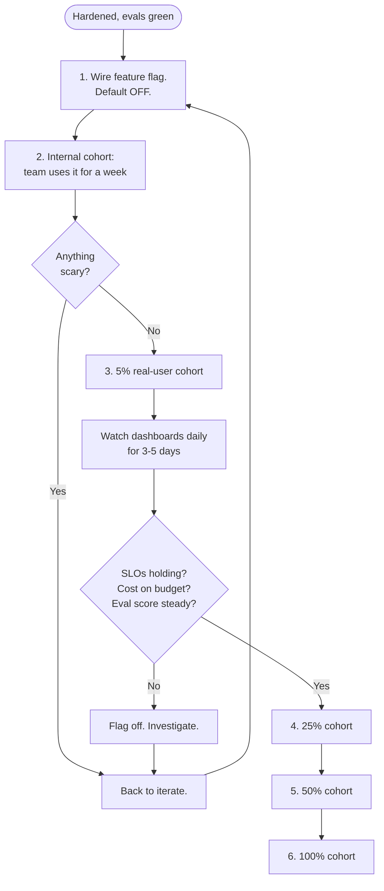

# Deploy

> **In one line:** AI features are deployed in cohorts, not big-bangs. The first 1% of users teaches you what evals didn't catch.

:::tip[In plain English]
Deploying an AI feature looks like deploying any other feature — but the failure modes are different. The model can hallucinate in production cases your eval set never covered. Users can prompt-inject. A model update from the provider can silently shift behavior. So you ship behind a feature flag, to a small cohort first, with observability watching from the moment the first user touches it, and a kill-switch that takes one toggle to flip. Cohorts let you learn cheaply; the flag lets you stop bleeding instantly.
:::

## Deployment pattern



1. **Feature flag.** All AI features ship behind a flag, with per-user or per-percentage rollout. Tools: LaunchDarkly, Statsig, PostHog flags, Unleash, or a homegrown DB-backed flag service.
2. **Internal cohort first.** Your team uses it for a week. They will find things you didn't.
3. **5% cohort.** Real users. Real traffic. Watch dashboards daily.
4. **Ramp** to 25% / 50% / 100% over days or weeks, gated on quality and cost staying inside SLOs.
5. **A kill switch.** One toggle that turns the AI path off and falls back to the non-AI behavior (or a graceful "this feature is temporarily unavailable").

## Cohort selection matters

Not all 5% cohorts are equal. Choose deliberately:

- **Internal team first.** Always. They're forgiving and find weird bugs.
- **Friendly customers** (design partners, support-tier paying users). Tolerant of bumps and reachable.
- **Free-tier users** are *not* automatically a safe cohort. They may carry more reputational risk (their complaints are loud) for less upside (less revenue at stake).
- **Geo-segmented cohorts** are useful if a regional language/data quality varies.
- **A/B vs B/A** — make sure your "control" group is matched on activity. Otherwise you're comparing power users to lurkers.

## What to watch in the first week

| Signal | Why it matters | Healthy band |
|---|---|---|
| Daily cost (vs. forecast) | Catches runaway loops, bad caching | Within ±20% of forecast |
| p50 / p95 latency | User-visible speed | Within 10% of pre-launch eval-time latency |
| Eval suite score on **sampled production data** | Real-world quality vs cold eval | Within 5% of cold eval score |
| User-facing error rate | Schema failures, timeouts | < 1% |
| Thumbs-down / regenerate rate | Direct user dissatisfaction | < 10% |
| Support tickets mentioning the feature | Indirect dissatisfaction | Trend, not absolute |
| Prompt-injection / abuse attempts | Adversarial usage | Watch the *shape*, not just the count |

## The "production data eval" trick

Eval scores on the cold eval set tell you what you knew. Production scores tell you what you didn't.

Pipeline:

```python
# Every night
def nightly_prod_eval():
    sample = sample_prod_logs(n=200, since="24h", stratify_by="category")
    for log in sample:
        # The LLM-as-judge scores the prod output against the input
        score = judge_prompt(log.input, log.output)
        record_prod_eval(log.id, score)
    publish_dashboard()
```

The judge doesn't have a reference answer (it's prod data) — it scores on rubrics like "did the output address the user's question," "is it grounded in cited sources," "is the tone appropriate." A divergence between cold-eval score and prod-eval score is a red flag.

## Rollback

- **Rollback is a flag flip, not a redeploy.** Seconds, not minutes.
- **Logs persist across rollback** — you'll want them for the postmortem.
- **The fallback behavior is itself tested.** A broken fallback is worse than no fallback.
- **Document the rollback path in the runbook.** When you're paged at 3am, you should not be figuring out where the flag lives.

## Real numbers

| Item | Typical |
|---|---|
| Time from "hardened" to "5% live" | 1-3 days |
| Time from 5% to 100% | 1-4 weeks |
| % of issues caught in internal cohort | ~40% of eventual issues |
| % of issues caught in 5% cohort | ~30% of eventual issues |
| % of issues only seen at 100% | ~30% — yes, really |

:::info[Real numbers callout]
At Acme, the internal cohort (8 support agents for a week) caught: a markdown-rendering bug, two cases where the model cited deprecated docs, a UX issue with the "regenerate" button. The 5% rollout caught: a Spanish-language ticket where retrieval returned only English docs (now the multilingual fix is on the backlog). The 100% rollout caught: zero new functional issues but a noticeable cost spike when traffic hit a Monday morning peak — solved by enabling the previously-disabled tiered routing.
:::

:::note[Acme thread: rollout week by week]
- **Week 1 (internal):** 8 support agents, flag on. ~200 drafts/day across the team. Logged 12 "weird" outputs; 4 became new eval cases; 1 prompt change shipped.
- **Week 2 (5%):** ~30 random agents. ~600 drafts/day. Two new eval cases, one cost-cap tweak. Eval score on sampled prod: 0.84 vs 0.86 cold-eval — close enough.
- **Week 3 (25%):** ~150 agents. ~3K drafts/day. p95 latency holds; no new issues.
- **Week 4 (50%):** Smooth.
- **Week 5 (100%):** Smooth. Time-to-first-response dropped 28% across the team (target was 30%).
:::

## Common anti-patterns

- **Big-bang launch.** Shipping to 100% on day one. The first 1% would have caught what now hits everyone.
- **No flag.** "We'll just redeploy if it's bad." Redeploy is minutes, flag is seconds. The difference matters during an incident.
- **Cohort = all free-tier users.** Free users aren't a guinea-pig pool; they're real users with real expectations.
- **Watching dashboards weekly.** First week is daily. First three days is twice-daily.
- **No prod-data eval.** Cold evals + vibes = surprise.
- **"It worked in staging."** Staging doesn't have real user input distributions. Cohort rollout is your real staging.
- **Kill switch nobody knows how to flip.** Document it. Practice it.
- **Treating the feature flag as permanent.** Once 100% is healthy and stable, *remove the flag*. Flag debt slows future work.

:::caution[Where teams trip up]
- **Confusing 5% rollout with 5% traffic.** A 5% rollout to power users may be 30% of traffic. Pick the cohort intentionally.
- **Eval scores on cold set drifting up while prod scores drift down.** You overfit. Sample more aggressively from prod.
- **Cost forecasts based on internal cohort.** Internal use patterns are nothing like real users. Re-forecast after each ramp.
- **Forgetting to update the runbook when the flag name changes.** The runbook is the on-call's lifeline; it must be true.
- **Holding at 5% forever because "the data is too noisy."** At 5% there's enough signal in a week. Stalling cohort rollouts is its own risk (technical debt, divergence between old/new path).
:::

## Checklist before moving on

- [ ] Feature flag exists and supports per-user/per-percentage rollout.
- [ ] Kill switch tested (you've actually flipped it once).
- [ ] Fallback behavior tested (not just code-reviewed).
- [ ] Internal cohort ran for at least 3 days; issues triaged.
- [ ] 5% cohort defined with clear ramp criteria.
- [ ] Dashboards for cost, latency, error rate, eval score visible.
- [ ] Nightly prod-data eval running.
- [ ] On-call rotation knows where the runbook is.

<Quiz id="lifecycle-deploy-quick-check" variant="micro" title="Quick check">

<Question
  prompt="Why does the page say AI features should roll out in cohorts instead of a big-bang launch?"
  options={[
    { text: "Cohorts reduce the cost of feature-flag tooling" },
    { text: "Providers rate-limit new features, so traffic must ramp slowly" },
    { text: "The first small cohorts surface failures the eval set never covered, before they hit everyone" },
    { text: "Big-bang launches are impossible with streaming endpoints" }
  ]}
  correct={2}
  explanation="The first 1% of users teaches you what evals did not catch — hallucinations on uncovered cases, injection attempts, silent provider-side behavior shifts. The page's numbers: roughly 40% of issues show up in the internal cohort, 30% at 5%, and 30% only at 100%. Cohorts let you learn cheaply; the flag lets you stop bleeding instantly."
/>

<Question
  prompt="In the nightly 'production data eval', how does the judge score outputs when there is no reference answer?"
  options={[
    { text: "It compares each output to the closest case in the cold eval set" },
    { text: "It asks the user to rate the response with thumbs up or down" },
    { text: "It re-runs the same input through a bigger model and diffs the answers" },
    { text: "It scores against rubrics — did the output address the question, is it grounded in cited sources, is the tone appropriate" }
  ]}
  correct={3}
  explanation="Production data has no reference answers, so the LLM-as-judge scores on rubrics instead: addressed the question, grounded in citations, appropriate tone. The point of the pipeline is the comparison — cold-eval scores tell you what you knew, prod scores tell you what you didn't, and divergence between the two is a red flag for overfitting to the eval set."
/>

<Question
  prompt="Why does the page warn against using all free-tier users as the first real-user cohort?"
  options={[
    { text: "Free users generate too little traffic to produce a signal" },
    { text: "Free users can carry more reputational risk — loud complaints — for less upside, and they are real users with real expectations" },
    { text: "Free tiers are usually excluded from feature-flag tooling" },
    { text: "Free users skew the A/B test because they are all power users" }
  ]}
  correct={1}
  explanation="Free-tier users are not automatically a safe guinea-pig pool: their complaints are loud (reputational risk) while less revenue is at stake (less upside). The page's preferred sequence is internal team first — forgiving and good at finding weird bugs — then friendly customers like design partners who are tolerant of bumps and reachable."
/>

</Quiz>

---

→ Next: [Monitor](./09-monitor.md)
