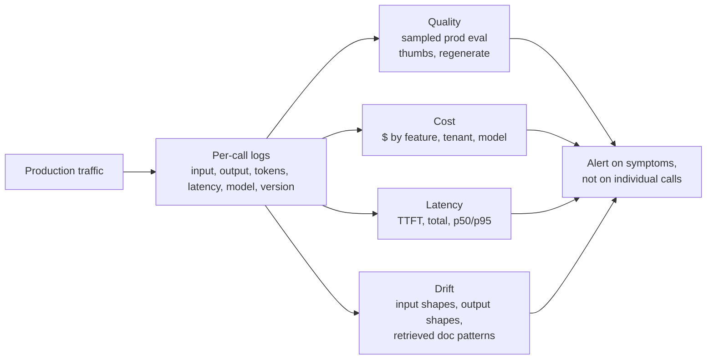

# Monitor

> **In one line:** AI features are never "done." The provider changes the model, your users change behavior, your docs change — and quality drifts. Monitoring is the only way to know.

:::tip[In plain English]
Monitoring for AI features looks similar to monitoring for normal services — dashboards, alerts, logs — but the things you watch are different. Latency and error rate still matter, but you also need to track *quality* (is the model still producing good answers?), *cost* (is anyone burning through tokens?), and *drift* (are the inputs or outputs shifting over time?). The trickiest one is silent quality regression: nothing breaks, no error fires, but the answers slowly get worse. That's the failure mode monitoring needs to catch.
:::

## The four axes



- **Quality** — eval suite scored on sampled prod data, plus user feedback signals (thumbs, regenerate clicks, follow-up rephrasings).
- **Cost** — daily $ by feature, by tenant, by model. Catch runaway loops early.
- **Latency** — TTFT and total response time. SLO breaches.
- **Drift** — distribution of inputs, outputs, retrieved docs, tool-call patterns over time.

## The log shape

Every call should produce a structured log entry. A minimum 2026 shape:

```json
{
  "trace_id": "abc123",
  "ts": "2026-05-20T14:23:11Z",
  "feature": "support-draft",
  "user_id": "u_4823",
  "tenant_id": "acme-prod",
  "model": "claude-sonnet-4-6",
  "prompt_version": "v1.4",
  "input": {
    "ticket_text": "...",
    "user_tier": "pro"
  },
  "output": {
    "reply_text": "...",
    "cited_doc_ids": ["billing-refund-policy-v3"],
    "confidence": 0.82,
    "tool_calls": []
  },
  "retrieved_doc_ids": ["billing-refund-policy-v3", "refunds-edge-cases"],
  "tokens": {"input": 5180, "output": 412, "cached_input": 4900},
  "cost_usd": 0.0042,
  "latency_ms": {"ttft": 740, "total": 3420},
  "user_feedback": null,
  "judge_score": null
}
```

`user_feedback` gets filled in if the user thumbs-up/down. `judge_score` gets filled in by the nightly prod-eval job (see [Deploy](./08-deploy.md)).

## What to alert on

| Signal | Threshold | Severity |
|---|---|---|
| Daily spend > N× forecast | 1.5× | Page |
| Eval score drops > X% week-over-week | 5% | Page |
| Per-tenant spend spike | 3× tenant baseline | Page |
| Provider availability < 99% over 15min | sustained | Page |
| Per-conversation token usage 95th percentile spikes | 2× last week's | Warn |
| Error rate > 1% | sustained 10min | Page |
| Thumbs-down rate > 15% | sustained 1h | Warn |
| Schema-validation failures > 2% | sustained | Warn |
| p95 latency > SLO | sustained 15min | Warn / Page (depends) |

## What *not* to alert on

- **Individual bad responses.** They happen. The signal is *rate*, not single events.
- **Daily score variance under your noise floor.** A 1-point eval swing on a small sample is noise. Establish your floor first.
- **Single user complaints.** Triage them, don't alert on them. Aggregate signal is what matters.
- **Cost spikes during scheduled batch jobs.** Whitelist known windows.

## The model-update drill

Providers silently update models (Claude 4.5 → 4.6 → 4.7). Symbol versions help; tracking *behavioral* drift is what catches the rest. Two practices:

1. **Pin model versions explicitly** (`claude-sonnet-4-6-20260315`), don't use aliases like `claude-sonnet-latest`. If the provider updates the alias, your behavior changes silently.
2. **Re-run the eval suite weekly against the live model.** If scores move, investigate. Sometimes the update is genuinely better; sometimes it regresses on your specific use case.

When a new model is released, do a side-by-side eval before swapping:

```python
def model_bakeoff(eval_cases, candidates):
    results = {}
    for model in candidates:
        scores = [run_and_score(case, model) for case in eval_cases]
        results[model] = {
            "mean": mean(scores),
            "p25": percentile(scores, 25),
            "per_category": breakdown_by_category(scores),
            "cost_per_call": avg_cost(scores),
            "p50_latency_ms": median_latency(scores),
        }
    return results
```

Then make the call: quality, cost, latency — pick what matters for this feature.

## Drift detection

A few cheap, high-signal drift checks:

- **Input topic distribution.** Cluster recent prompts; alert if the cluster shape changes meaningfully week-over-week. New topics may mean new use cases (good) or new attacks (bad).
- **Output token-length distribution.** Sudden growth = looping or verbosity drift = cost spike incoming.
- **Retrieved-doc concentration.** If 95% of queries hit 5 docs, RAG is probably under-utilized or your docs have a coverage gap.
- **Tool-call frequency.** If tool X stopped being called, something changed — model update? Prompt regression? Real user behavior shift?

## Dashboards: a starter set

The five dashboards every AI feature should have:

1. **Cost** — $ today vs forecast, by feature/model/tenant, with a 30-day trend.
2. **Quality** — sampled prod eval score, thumbs ratio, weekly trend, per-category breakdown.
3. **Latency** — TTFT and total, p50/p95/p99, by endpoint.
4. **Reliability** — error rate, provider availability, fallback rate.
5. **Drift** — input topic shifts, output length distribution, retrieved-doc concentration.

If you only have one tool, **Langfuse / Helicone / Braintrust** handle calls 1-3 out of the box and 4-5 with custom dashboards. Datadog/Grafana can do all five if you're already invested.

## Real numbers

| Item | Typical |
|---|---|
| Per-call log size | 2-10 KB |
| Logs retention | 30-90 days hot, 1y warm |
| Log storage cost (1M calls/mo, 5KB each) | $10-$50/month |
| Nightly prod-eval cost (200 cases) | $0.50-$3 |
| Hosted observability tool cost | $0 (free tier, < 50K events/mo) to $500/mo (1M events) |

:::info[Real numbers callout]
Logging is cheap, alerting maturity is what costs you. The first version of Acme's monitoring took 2 days to wire up (Langfuse + custom Slack alerts on cost + a nightly Python job for prod-eval). The mature version 3 months later — with proper SLOs, runbooks per alert, and quality dashboards reviewed weekly — took another ~10 engineer-days incrementally. Both phases were worth it; the first one is non-negotiable.
:::

:::note[Acme thread: catching a drift]
Six weeks after 100% launch, Acme's nightly prod-eval score quietly drifts from 0.84 to 0.78 over four days. No errors, no cost spike, no user complaints yet. The drift alert fires.

Investigation: a new product feature ("automations") shipped two weeks ago. Tickets about it now flood support. The RAG index doesn't have the new docs yet — the embedder runs nightly but somebody disabled the cron during a maintenance window and forgot to re-enable.

Fix: re-enable the cron, backfill the missing docs, re-embed (~5 minutes). Score returns to 0.84 within 24 hours. New eval cases added for "automations" tickets to catch this category specifically going forward.

The whole thing was caught by the drift alert ~10 days before users would have noticed.
:::

## Common anti-patterns

- **Logs without trace IDs.** Can't reconstruct a multi-step interaction.
- **Logging full request bodies forever.** PII risk + storage cost.
- **Alerting on individual bad outputs.** Pager fatigue, then real alerts get ignored.
- **No prod-eval pipeline.** Cold evals say everything is fine while real users get worse answers.
- **One global cost dashboard, no per-feature breakdown.** Can't tell which feature caused the spike.
- **Treating monitoring as "done."** Alerts decay. Thresholds drift. Schedule quarterly review.
- **Using `claude-latest`-style aliases.** Silent model updates = silent behavior shifts.

:::caution[Where teams trip up]
- **Skipping monitoring for "internal-only" features.** Internal features become external surprisingly often. Wire monitoring from day one.
- **Confusing "monitoring" with "observability."** Monitoring is the set of dashboards you decided on in advance. Observability is being able to ask new questions about a problem you didn't predict. You need both.
- **No on-call rotation for AI features.** Whose pager goes off when the eval score drops? Decide before the page fires, not after.
- **Looking at aggregate quality scores only.** The slice that matters (paying customers, your biggest tenant) can drop while the aggregate looks fine.
- **Treating provider updates as someone else's problem.** They affect you directly. Re-eval after every notified update.
:::

## Checklist before moving on

- [ ] Every call is logged with the shape above (input, output, tokens, latency, model, version, trace id).
- [ ] Five dashboards (cost, quality, latency, reliability, drift) are live.
- [ ] Alerts wired for the 7-9 thresholds above, with runbooks linked.
- [ ] Nightly prod-eval pipeline running on sampled traffic.
- [ ] Model version is pinned, not aliased.
- [ ] On-call rotation defined; runbooks exist for the top 5 alert types.
- [ ] Quarterly review scheduled to refresh thresholds and runbooks.

<Quiz id="lifecycle-monitor-quick-check" variant="micro" title="Quick check">

<Question
  prompt="According to the page, why should you NOT alert on individual bad responses?"
  options={[
    { text: "Single bad outputs happen normally; the signal is the rate, and per-event alerts cause pager fatigue until real alerts get ignored" },
    { text: "Individual responses are impossible to capture in structured logs" },
    { text: "Provider terms prohibit storing single responses" },
    { text: "Bad responses are almost always caused by user error" }
  ]}
  correct={0}
  explanation="Individual bad responses happen — that is the nature of a stochastic system. The meaningful signal is the rate (thumbs-down rate, schema-failure rate, error rate sustained over a window). Alerting on single events trains the team to ignore the pager, which is exactly when a real regression slips through. Triage single complaints; alert on aggregates."
/>

<Question
  prompt="Why does the page tell you to pin an explicit model version instead of an alias like 'claude-sonnet-latest'?"
  options={[
    { text: "Aliases cost more per token than pinned versions" },
    { text: "Aliases are rate-limited more aggressively by providers" },
    { text: "If the provider updates the alias, your system's behavior changes silently" },
    { text: "Pinned versions get priority access during outages" }
  ]}
  correct={2}
  explanation="Providers silently update models, and an alias means those updates flow straight into production with no deploy on your side — silent behavior shifts. Pin the dated version, re-run the eval suite weekly against the live model, and run a side-by-side bake-off before deliberately swapping. Cost and rate limits are not the issue; control is."
/>

<Question
  prompt="In the Acme drift story, the prod-eval score fell from 0.84 to 0.78 with no errors, no cost spike, and no user complaints. What was the root cause?"
  options={[
    { text: "The provider silently upgraded the model behind an alias" },
    { text: "A prompt change shipped without an eval run" },
    { text: "A malicious user was prompt-injecting the bot" },
    { text: "The embedding cron had been disabled, so the RAG index was missing docs for a newly shipped feature" }
  ]}
  correct={3}
  explanation="A new 'automations' feature flooded support with tickets, but the doc-embedding cron had been disabled during maintenance and never re-enabled — so retrieval had nothing to offer. This is the silent quality regression the page warns about: nothing errors, nothing costs more, answers just get worse. The nightly prod-eval drift alert caught it roughly 10 days before users would have noticed."
/>

</Quiz>

---

→ Next: [Continuous improvement](./10-improve.md)
