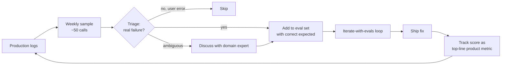

# Continuous improvement

> **In one line:** The team that compounds quality fastest is the team that turns the most real-world failures into eval cases.

:::tip[In plain English]
Continuous improvement is the long tail of the lifecycle — the multi-quarter loop where you keep making the AI feature better. The mechanic is simple: every week you look at production logs, find the bad outputs, turn them into new eval cases, fix the underlying issue, and ship. Do this for a year and your eval set grows from 100 cases to 1,500 — and your real-world quality with it. Skip this loop, and the feature stagnates while users churn quietly. There's no shipping plateau; there's only "still iterating" or "regressing."
:::

## The cycle

1. **Sample production logs weekly.** Look at: lowest-rated responses, highest-cost conversations, longest agent runs, outputs with very low confidence, schema-validation failures.
2. **Triage.** Real failure vs. user error vs. ambiguous. Skip non-failures; add failures.
3. **Add real failures to the eval set** with the correct expected output.
4. **Run the iterate-with-evals loop.** Fix. Re-ship.
5. **Track the eval score** as a top-line product metric. Put it next to revenue and active users in the weekly review.

## The weekly review meeting

A 30-minute meeting that's worth its weight in gold. Agenda:

- **Eval score trend** (this week vs last 4 weeks, broken down by category).
- **New eval cases added** (count and sources).
- **Cost and latency trends** (any anomalies?).
- **Top 3 worst-rated outputs from prod** (read out loud; discuss).
- **Drift signals** (any topic/length/tool-call shifts?).
- **Decisions and action items** (one owner each, dated).

Who attends: AI engineer, the PM or product owner, the domain expert (1-2 hours/wk of their time is worth it), an ops or support person who hears from end-users.

## Quarterly investments

Beyond the weekly mechanics, schedule quarterly bigger-rocks work:

- **Model refresh.** Re-evaluate the current model vs. new releases. Bake-off on the eval set. Swap if a newer/cheaper model wins on your specific use case.
- **Prompt rewrite.** Once a quarter, audit the prompt for accumulated cruft. Prompts grow patches like coral grows on a shipwreck. Rewrite from scratch and re-eval; surprisingly often the rewrite is shorter and scores higher.
- **Eval set audit.** Remove stale cases (changed docs, deprecated features), add new edge cases, balance by category. Goal: the case distribution roughly matches the prod distribution.
- **Cost audit.** Anything that can move to a cheaper model without quality loss? Anything new in 2026 that wasn't an option last quarter? (Tiered routing? Better caching? Smaller embedding model?)
- **Latency audit.** Anything that can be cached / parallelized / shortened? Where's the p95 actually going?
- **Architecture sanity check.** Is the pattern (RAG / agent / fine-tune) still right? Did the problem evolve?

## Compounding eval growth

A back-of-envelope of how a healthy team's eval set grows:

| Week | New cases | Total | Notes |
|---|---|---|---|
| 0 (launch) | 100 | 100 | Hand-crafted by domain expert |
| 4 | +30 | 130 | First month of prod sampling |
| 12 | +120 | 220 | Catching real failures |
| 26 | +300 | 420 | Steady weekly cadence |
| 52 | +400 | 820 | Year one |
| 104 | +400 | 1,220 | Slower in year two; pruning starts |

The 800-1,500 case range is roughly the sweet spot for most projects. Beyond that, run-time and curation cost both grow faster than signal.

## When to fine-tune

You've been iterating for months on prompts + RAG. Eventually you may hit a ceiling. Fine-tune *after* you've exhausted prompting and RAG, and only when all four apply:

- **A stable, narrow task.** If the task is still evolving, the fine-tune goes stale.
- **Hundreds of high-quality `{input, ideal_output}` pairs.** You probably have these now — they're sitting in your eval set, in resolved tickets, in user-approved drafts.
- **Evidence the base model has a ceiling on this task.** Show a side-by-side eval where bigger/better models don't help.
- **Latency or cost pressure** a smaller specialized model can solve. Often the real motivation.

If those four don't all apply, keep iterating on prompts and retrieval. Fine-tuning is operationally heavier (re-training cadence, version management, A/B against base) than it sounds.

## Pruning the eval set

Eval sets ossify if untouched. Twice a year:

- **Remove cases for deprecated features** or stale docs.
- **De-duplicate near-identical cases** (same failure mode, different wording).
- **Re-balance by category** so no slice dominates the aggregate.
- **Re-check `expected` fields** for cases written a year ago — has the right answer changed?
- **Tag cases by difficulty** so you can report easy/medium/hard separately.

A 600-case set pruned to 480 cases of higher quality is a clear win.

## Real numbers

| Item | Typical |
|---|---|
| Time per weekly review | 30-45 min |
| Eval cases added per week | 5-15 |
| Quarterly prompt-rewrite cost | 1-2 engineer-days |
| Quarterly model bake-off cost | $20-$100 in eval-run spend + 1 engineer-day |
| Score gain per quarter (year 1) | +5 to +10 points |
| Score gain per quarter (year 2+) | +1 to +3 points (diminishing) |

:::info[Real numbers callout]
At Acme, the weekly review takes ~45 minutes including reading three bad outputs aloud. Over 6 months they added 240 eval cases — 38 per month, mostly from the nightly prod-eval's bottom 5%. The eval score trajectory: 0.86 (launch) → 0.89 (month 3) → 0.91 (month 6). Three of those points came from a single quarterly prompt rewrite that cut the system prompt by 40% and added two new few-shot examples.
:::

:::note[Acme thread: a year in]
After 12 months in production:

- Eval set: 820 cases (from 100 at launch).
- Eval score: 0.93 (from 0.61 at v0, 0.86 at launch).
- Cost per draft: $0.009 (from $0.018 at v0; cached prefixes + tiered routing).
- p50 latency: 2.1s (from 3.4s).
- Models swapped: Sonnet 4.6 → Sonnet 4.7 in month 8 (won the bake-off by 2 points, same cost).
- Time-to-first-response across the team: -41% vs pre-AI baseline (target was 30%).
- Hours saved per week across the team: ~24h.
- AI engineering time spent maintaining the feature: ~4h/week average.

ROI is obvious enough that the team got greenlit to apply the same pattern to two more support workflows.
:::

## Common anti-patterns

- **Treating "we shipped" as the end.** Most of the quality work happens *after* shipping.
- **No weekly review.** Without a cadence, improvement is sporadic and depends on individuals remembering.
- **Eval set never grows.** Stagnant evals lead to stagnant quality.
- **Eval set only grows, never shrinks.** Pruning matters too.
- **Fine-tuning to escape the work of curating better evals.** Fine-tune fixes one ceiling; bad evals are a forever ceiling.
- **Skipping the quarterly model bake-off.** You'll miss the cost/quality wins of new model releases.
- **Owner-less features.** "Whose job is this now?" — if you can't name a single owner, the feature decays.

:::caution[Where teams trip up]
- **Letting the eval set age out of relevance.** A 2024 eval set on 2026 user behavior tests the past, not the present.
- **Reviewing aggregate scores in standup, not slice scores.** The slice that matters can hide.
- **Treating prompts as code only senior engineers touch.** Domain experts should be able to suggest prompt tweaks via PR.
- **Confusing "the model is better now" with "our system is better now."** Model bumps without re-eval are a coin flip.
- **Improvement work that doesn't get scheduled.** "We'll get to it" doesn't survive next sprint's planning. Block calendar time.
- **Quality plateau panic.** The score will plateau. That's not failure; it's the eval set saturating. Add harder cases, re-baseline.
:::

## Checklist for healthy continuous improvement

- [ ] Weekly review meeting on the calendar with a named owner.
- [ ] Eval set grew by 5+ cases this month (from prod failures).
- [ ] Score, cost, and latency trends reviewed weekly.
- [ ] Quarterly prompt-rewrite scheduled.
- [ ] Quarterly model bake-off scheduled.
- [ ] Eval set pruned at least once in the last 6 months.
- [ ] Quality metrics visible in the team's standard product dashboard, not just the AI-specific one.
- [ ] At least one domain expert spends 1-2 hours/week on this.

---

→ Next: [Handoffs across the team](./11-handoffs.md)
