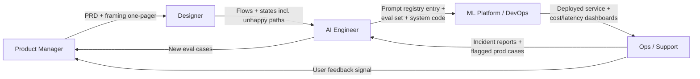

# Handoffs across the team

> **In one line:** AI projects fail at handoff boundaries more often than at technical boundaries. Defining who owns which artifact is half the work.

:::tip[In plain English]
A successful AI feature passes through five or six pairs of hands: a PM frames the problem, a designer shapes the UX, an AI engineer builds the system, an ML/platform team runs the infrastructure, an ops/support team monitors and responds in production. Each handoff is a moment where context can drop and quality can leak. The fix is *artifacts* — every role owns a concrete document or piece of code that the next role consumes. When the artifact is clear, handoffs are smooth. When it's vague, the project stalls.
:::

## Why this page exists

In a traditional web project, handoffs are well-trodden: PM ships a PRD, designer ships a Figma file, engineer ships code, ops ships dashboards. People know the artifact shape.

In an AI project, half the artifacts are new (eval sets, prompt registries, judge prompts, drift dashboards) and the rest are shaped differently than their non-AI cousins. Roles that worked together for years suddenly need to renegotiate who owns what. This page makes the new artifact map explicit.

## The role map



The diagram is *not* purely linear — the feedback arrows from Ops back to AI Engineer and PM are what makes the lifecycle a loop instead of a waterfall.

## Roles and the artifacts they own

### Product Manager (PM)

**Owns:**

- **Problem framing one-pager** (from Phase 1) — the user, the problem, the failure cost, the success metric, the go/no-go decision.
- **PRD** — the longer doc with scope, scenarios, success metrics, rollout plan. Includes "what good looks like" with the 5+ ideal outputs.
- **The cohort rollout schedule** (when do we move from 5% → 25% → 100%, and what gates each step).
- **The "kill it or keep it" decision** at month 3/6 after launch, based on the success metric.

**Consumes:** weekly eval-score trend, user feedback rollups, cost dashboard.

**Common failure:** writing the PRD before the framing one-pager. The one-pager is a 1-hour artifact that prevents a 3-week PRD revision.

### Designer

**Owns:**

- **Interaction flows** including all the unhappy paths AI adds: low-confidence output state, "I don't know" state, "drafting unavailable" fallback state, regenerate/edit affordances, citation display.
- **Trust UX** — how confidence is shown, how sources are surfaced, how the user understands "this was AI-drafted."
- **The user feedback mechanism** — thumbs up/down, the "report a bad answer" path, what happens after a report.
- **Error message copy** for AI-specific failures ("model unavailable," "answer flagged for review," etc.).

**Consumes:** sample outputs (good + bad) from the AI engineer to design against; the eval categories to make sure every category has UI coverage.

**Common failure:** designing only the happy-path AI flow. AI features fail in shapes traditional features don't — empty retrieval, low confidence, partial output. All need designed states.

### AI Engineer

**Owns:**

- **The system code** — the prompt assembly, retrieval, parsing, error handling.
- **The prompt registry entry** — a versioned, reviewed, named prompt artifact:

  ```yaml
  # prompts/support-draft.yaml
  name: support-draft
  version: 1.4
  owner: ai-eng@acme
  model: claude-sonnet-4-6-20260315
  schema: schemas/draft_reply.json
  template: |
    SYSTEM:
    You are an Acme support drafter. ...
  changelog:
    - v1.4 (2026-05-14): added Cohere reranker; removed redundant tone instruction.
    - v1.3 (2026-05-10): introduced few-shot block for billing category.
  eval_baseline: 0.86
  ```

- **The eval set** — JSON/YAML cases, the scoring code, CI integration.
- **The iteration log** (see [Iterate](./06-iterate.md)).
- **The ADR** for approach choices (RAG vs fine-tune, model choice, etc.).
- **A short runbook** for the top failure modes ("eval score dropped," "cost spiked," "prompt injection attempt detected").

**Consumes:** PRD, design flows, infrastructure SLOs from the ML platform team, incident reports from ops.

**Common failure:** treating the prompt as code-comments-quality, not as a versioned artifact. Prompts deserve PR review and changelogs just like SQL migrations.

### ML Platform / DevOps

**Owns:**

- **The deployed service** — endpoints, auth, networking, autoscaling.
- **Cost dashboards** — daily $ by feature/model/tenant, alerting thresholds.
- **Latency dashboards** — TTFT, total, p50/p95/p99, by endpoint.
- **The feature flag service** and its UI.
- **Provider integration** — API keys, fallback routing, rate-limit handling, contract compliance.
- **Logs/traces pipeline** — Langfuse/Helicone/OpenTelemetry → backend.
- **The kill switch** and its runbook.

**Consumes:** the system code from AI engineer, SLOs from product, alert thresholds (negotiated with AI engineer + ops).

**Common failure:** treating LLM calls as "just another API call." LLM observability needs prompt-version tracking, token accounting, judge-score recording — fields a generic APM tool won't capture.

### Ops / Support / On-call

**Owns:**

- **The runbook** for AI-specific incidents (cost spike, eval-score drop, provider outage, drift alert).
- **First-response triage** — is this a real incident or a noisy alert? Is the kill switch the right move?
- **User-impact reporting** — when a real user is affected, document it; feed it back to PM and AI engineer.
- **The "flagged-for-review" queue** — when the system or a user flags an output as bad, it lands here and someone looks.
- **Sampling for human review** — even outside incidents, a small percentage of outputs gets human-spot-checked.

**Consumes:** dashboards from ML platform, runbooks from AI engineer, the kill switch.

**Common failure:** no defined ops role for AI features. "It's the AI team's problem" doesn't survive a 3am page.

### Domain expert (often part-time, sometimes a different team)

**Owns:**

- **Eval-case curation** — they write the ideal outputs, with the AI engineer wrangling format.
- **The "is this output good?" judgment** in weekly reviews and ambiguous triage.
- **Spot-checking** sampled outputs.

**Consumes:** sample outputs, the eval-case template.

**Common failure:** treating the domain expert as a one-time consultant. They're a recurring 1-2 hours/week role for the life of the feature.

## The artifact map

| Artifact | Owner | Lives where | Reviewed by |
|---|---|---|---|
| Framing one-pager | PM | Wiki / repo `/docs/proposal.md` | Designer, AI engineer |
| PRD | PM | Wiki | Whole team |
| Flow + states (incl. unhappy) | Designer | Figma | PM, AI engineer |
| Trust UX patterns | Designer | Figma + design system | PM |
| Prompt registry entry | AI engineer | Repo `/prompts/*.yaml` | AI engineer peer + domain expert |
| Eval set | AI engineer (curation: domain expert) | Repo `/evals/*` | Domain expert |
| System code | AI engineer | Repo | AI engineer peer |
| ADR | AI engineer | Repo `/docs/adr/` | PM + ML platform |
| Iteration log | AI engineer | Repo `/docs/iteration-log.md` | Open; surfaces in weekly review |
| Feature flag config | ML platform | Flag service (LaunchDarkly/PostHog) | PM signs off on cohort criteria |
| Cost / latency / quality dashboards | ML platform | Datadog / Langfuse / Grafana | PM reviews weekly |
| Runbooks | AI engineer + ML platform | Wiki linked from alerts | Ops |
| Incident reports | Ops | Wiki | Whole team |
| Flagged-output queue | Ops | Ticket system / Langfuse | AI engineer triages |

## Real-world handoff shapes

### Solo developer (1 person)

You play all five roles. The artifacts still exist — they're just shorter and live in the same repo. The biggest risk is *skipping the artifact* because "I already know." You won't, in 4 months. Write the one-pager anyway.

### Small startup (3-10 engineers)

PM and AI engineer are often the same person; designer is often a contractor; ML platform is "whoever set up the cloud account." Handoffs are quick, artifacts are lighter, but the eval set + prompt registry + runbook trio is non-negotiable.

### Mid-size (50-500 engineers)

All roles distinct. Handoffs become political. The artifact map above maps directly. Add: explicit RACI for each artifact, weekly cross-role syncs, a single owner per feature (not a committee).

### Enterprise (1000+ engineers, regulated industries)

Add: legal review on data flow, compliance sign-off on model provider, security review on prompt-injection defenses, accessibility review on the UX. Every artifact has an approval workflow. Timelines stretch from weeks to quarters. The artifact map is the same — the *process* around it gets heavier.

## Real numbers

| Item | Typical |
|---|---|
| Time spent on handoff artifacts (% of project) | 15-25% |
| Time saved by clear artifacts | ~30% of total cycle time |
| Number of distinct artifacts per AI feature | 8-12 |
| Number of roles that touch an AI feature | 4-6 |
| Domain expert hours per week post-launch | 1-2 |

:::info[Real numbers callout]
At Acme, the artifact handoff overhead was about 4 days of total team time spread across the 3-week build (so ~15%). The PM wrote the one-pager and PRD in a day. The designer's flows took 1.5 days. The AI engineer's ADR, prompt registry entry, and initial runbook took ~1 day combined. The savings showed up later: when an outage hit at month 4, the runbook resolved it in 12 minutes with the on-call engineer alone — no escalation needed.
:::

:::note[Acme thread: the handoff matrix]
Acme is small enough (40 people) that roles double up. The actual mapping:

- **PM:** the head of customer experience, who also wears the domain-expert hat 2 hours/week.
- **Designer:** a contractor who shipped the flows in 1.5 days and stays on retainer for changes.
- **AI engineer:** one full-time engineer, 50% allocation on this feature for the first 3 months, then 20% ongoing.
- **ML platform:** the existing DevOps engineer (no dedicated ML platform team yet).
- **Ops:** the support lead, who handles flagged outputs and pages the engineer if eval score drops > 5%.

The one document that made this work: a single-page "who owns what" matrix pinned in the team Notion. When someone asked "whose job is X?", the answer was always in there.
:::

## Common anti-patterns

- **No named owner per artifact.** "We" own the eval set → nobody owns it → it stagnates.
- **Designers handed Figma flows that only cover the happy path.** AI features have 3-5 sad-path states; design must cover them.
- **AI engineer ships without an ADR.** Six months later nobody remembers why we chose RAG.
- **Ops has no AI-specific runbook.** First incident becomes a multi-hour war room.
- **The prompt lives in a Python string, not in a versioned registry.** Changes are untrackable.
- **Domain expert involved at week 1 and never again.** Their judgment is needed weekly.
- **PRD without success metric.** Can't tell if it worked, so the next quarter's funding fight is a feelings argument.
- **PM owns the eval set instead of the AI engineer.** Eval is a technical artifact; the AI engineer owns it with the domain expert curating.

:::caution[Where teams trip up]
- **Throwing the prompt over the wall.** AI engineer to ML platform: "here's the prompt, deploy it." No version, no eval baseline, no runbook. Ops gets paged at 3am with no context.
- **Designer working from a screenshot.** They need real sample outputs from the system, including bad ones, to design proper states.
- **PM measuring "AI-ness" instead of user outcome.** "% of replies that are AI-drafted" is a vanity metric; "time-to-first-response" is the real one.
- **No domain expert allocated post-launch.** The eval set decays without ongoing curation.
- **Treating runbook as a one-time doc.** Update it after every incident.
- **Solo dev who skips all artifacts because "I know what I'm doing."** Future-you doesn't.
:::

## Checklist for healthy handoffs

- [ ] Every artifact in the table above has a single named owner.
- [ ] The owner has agreed in writing that they own it.
- [ ] The artifacts are linked from a single index doc.
- [ ] PRD includes the success metric, the failure cost, and the rollout plan.
- [ ] Design covers all unhappy-path states AI introduces.
- [ ] Prompt registry with version history exists.
- [ ] Eval set + scoring code + CI integration exists.
- [ ] ADR for the approach choice exists.
- [ ] Runbook for top 5 failure modes exists.
- [ ] Domain expert has 1-2 hours/week allocated post-launch.

<Quiz id="lifecycle-handoffs-quick-check" variant="micro" title="Quick check">

<Question
  prompt="According to the page, what makes handoffs between roles go smoothly on an AI project?"
  options={[
    { text: "Weekly all-hands meetings where every role reports status" },
    { text: "Having the AI engineer own every artifact end to end" },
    { text: "Each role owning a concrete artifact that the next role consumes" },
    { text: "Keeping the team small enough that handoffs never happen" }
  ]}
  correct={2}
  explanation="The page's thesis is that AI projects fail at handoff boundaries more often than at technical ones, and the fix is artifacts: the PM's one-pager and PRD, the designer's flows, the engineer's prompt registry and eval set, and so on. When the artifact is clear, the handoff is smooth; when it is vague, the project stalls. Concentrating ownership in one person is the opposite of the page's artifact map."
/>

<Question
  prompt="What is the designer's most common failure mode on an AI feature, per the page?"
  options={[
    { text: "Designing in Figma instead of directly in code" },
    { text: "Designing only the happy-path flow, when AI adds unhappy states like low confidence, empty retrieval, and 'drafting unavailable'" },
    { text: "Choosing visuals that conflict with the brand system" },
    { text: "Writing error copy without consulting the PM" }
  ]}
  correct={1}
  explanation="AI features fail in shapes traditional features do not — low-confidence output, 'I don't know' states, fallback states, partial output — and each needs a designed state. The related trip-up is the designer working from a screenshot: they need real sample outputs from the system, including bad ones, to design proper states."
/>

<Question
  prompt="Who owns the eval set, according to the artifact map?"
  options={[
    { text: "The PM, since evals measure the product's success metric" },
    { text: "The ML platform team, since evals run in CI infrastructure" },
    { text: "The domain expert, since they judge output quality" },
    { text: "The AI engineer owns it, with the domain expert curating the cases" }
  ]}
  correct={3}
  explanation="The eval set is a technical artifact — JSON/YAML cases, scoring code, CI integration — so the AI engineer owns it, while the domain expert curates the cases and reviews coverage. 'PM owns the eval set instead of the AI engineer' is a named anti-pattern; the PM consumes the eval-score trend rather than owning the artifact itself."
/>

</Quiz>

---

→ Next: [Checkpoint](./12-checkpoint.md)
