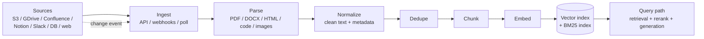

# Data engineering for AI features

> **In one line:** A production RAG or search feature is mostly a pipeline problem — ingest documents from wherever they live, parse them into clean text, chunk them, embed the chunks, index the embeddings, and keep all of that fresh and de-duplicated as the source data changes — and the failure modes of each step are why most "RAG works in demo, breaks in prod" stories happen.

:::tip[In plain English]
The model and the prompt get the attention. The data pipeline is where production AI quality actually comes from. A perfect prompt with stale, duplicated, badly-parsed chunks loses to a mediocre prompt with a clean, fresh, well-chunked index. This page is the pipeline view that the foundations pages ([RAG basics](../01-foundations/rag-basics.md), [Chunking strategies](../01-foundations/chunking-strategies.md)) treat in isolation.
:::

## The full pipeline

Eight stages. Each one has a failure mode. Each one needs evals at its layer, not just end-to-end.

## Stage 1 — Ingest

Get data from the source system into your pipeline. Three patterns:

- **Pull on a schedule.** Cron that hits the source's list/search API. Simple; can be stale by N hours.
- **Push via webhook.** Source notifies you on change. Real-time; requires the source to support it; requires you to handle replays.
- **CDC (change data capture).** For databases. Stream of row-level changes. Most accurate; most operational complexity.

The pragmatic mix: webhook where supported (Slack, Notion, GitHub), pull on a schedule for the long tail, CDC for the primary DB.

**Key engineering concerns:**

- **Pagination.** Most source APIs paginate. Handle cursors, handle "page changed mid-iteration" by sorting on a stable key.
- **Rate limits.** Source APIs have limits. Backoff, jitter, queueing.
- **Deletion.** Webhook-based ingest needs to handle `event=delete`. Pull-based ingest needs a *reconciliation pass* to find docs that were deleted at the source but are still in your index.
- **Auth & scoping.** Per-tenant access tokens, never a single global key with read-all access — that's a row-level-security disaster waiting to happen.

## Stage 2 — Parse

Convert source-format files (PDF, DOCX, HTML, code, images) into clean text with metadata.

Parser quality is the single biggest predictor of RAG quality on document-heavy corpora. Bad parsing → tables become text soup, lists lose structure, headers disappear → retrieval finds the wrong chunks.

The 2026 toolbox ([document parsing](../04-stack/document-parsing.md)):

- **Reducto, Unstructured, Mathpix** — production document parsing.
- **Vision-model OCR.** Claude / GPT-4o on a PDF page. Slow but high quality; the right pick when layout matters (financial filings, scientific papers).
- **Tree-sitter** — for code.
- **`pypdf` / `pdfminer`** — fast but fragile for complex PDFs. Fine for born-digital simple docs.

**Always preserve:**

- Source URL / file path.
- Section / heading hierarchy.
- Page numbers.
- Tables as tables (or markdown), not as text.
- The original parse, in case you need to re-chunk later.

## Stage 3 — Normalize

Clean the parsed text. This is unglamorous and important.

- **Strip boilerplate.** Footers, headers, "Confidential" stamps, navigation menus. They become noise in retrieval.
- **Normalize whitespace, encodings.** Smart quotes, non-breaking spaces, mixed line endings.
- **Detect and tag language.** Multilingual corpora need language-aware retrieval; tag now, filter later.
- **Extract metadata.** Author, date, type, tags. Some you parse out of the doc; some you carry from the source system.

This stage is also where you'd do **PII detection / redaction** if your downstream policy requires it. See [Safety & privacy](../10-patterns/11-safety-privacy.md).

## Stage 4 — Deduplicate

Source corpora are riddled with duplicates: the same document forwarded in emails, multiple versions of a wiki page, an FAQ that exists in five places.

If you don't dedupe, retrieval returns the same chunk five times and the model has nothing else to ground on. Or worse, retrieval picks one version while another version says the opposite, and the model picks whichever it likes.

Levels of dedup:

- **Exact hash.** Trivial. Catches identical files.
- **Near-duplicate** (Jaccard / MinHash / SimHash). Catches edited copies.
- **Semantic dedup** (embedding similarity above threshold). Catches paraphrases of the same content.

Production pattern: run exact + near-duplicate at ingest, run semantic dedup as a periodic batch over the indexed corpus.

## Stage 5 — Chunk

Cover this thoroughly in [Chunking strategies](../01-foundations/chunking-strategies.md); the pipeline-level concerns:

- **Chunk size.** ~500 tokens with ~50-token overlap is a defensible default. Tune per corpus.
- **Boundary respect.** Don't split mid-sentence; don't split inside a code block; don't split inside a table.
- **Section-aware chunks.** Each chunk carries its section path (`"Doc > Chapter 3 > Section 5.2"`). Massive retrieval quality boost.
- **Chunk metadata.** Always store: source doc ID, source URL, position in doc, section path, last-modified timestamp, tenant ID, ACL tags.

The metadata pays off later when you filter retrieval by tenant, by freshness, or by ACL.

## Stage 6 — Embed

Run each chunk through an embedding model. See [Embeddings](../01-foundations/embeddings.md), [Embedding models](../04-stack/embedding-models.md).

**Pipeline concerns:**

- **Batch.** Embedding APIs are 5–20× cheaper / faster per item when batched. Always batch.
- **Rate limits.** Same as any external API.
- **Failures.** A batch fails — what happens? Retry policy, dead-letter queue, alerting.
- **Versioning.** When you switch embedding models, you must **re-embed the whole corpus**. Plan for a parallel index during the migration.

## Stage 7 — Index

Write to the vector DB. Often paired with a BM25 / lexical index for hybrid search ([Hybrid search](../01-foundations/hybrid-search.md)).

Index decisions: **HNSW** (default, fast at moderate scale), **IVF / IVF-PQ** (for billion-scale), **flat** (small data, perfect recall).

Pragmatic defaults: **pgvector + HNSW** for under 10M chunks; **Pinecone / Qdrant / Weaviate / LanceDB** when ops complexity is worth it.

## Stage 8 — Refresh

The under-discussed stage. Documents change. New docs appear. Old docs are deleted. Your index must reflect that.

**Per-document update flow:**

1. Detect change (webhook or polling diff).
2. Re-parse the document.
3. Re-chunk.
4. Diff against existing chunks for this doc — which are new, which changed, which are gone.
5. Embed new + changed chunks.
6. Upsert into the index; delete the gone-chunks.

The naive version — *"delete all chunks for this doc, re-add all"* — is wasteful (you re-embed text that didn't change). The diff-and-upsert version is what production runs.

**Deletion is the hardest case.** When a source doc is gone, your pipeline needs to know to delete its chunks. This is why many teams keep a `source_docs` table separate from the chunk index — the master list of "what should exist" — and run periodic reconciliation against the actual index.

## Multi-tenancy — the production gotcha

Almost every B2B AI feature is multi-tenant. Each tenant's data must be strictly isolated:

- **Per-tenant filtering on every query.** `WHERE tenant_id = :requesting_tenant` is non-negotiable, in code, before the LLM ever sees results.
- **Per-tenant index** vs **shared index with tenant column**. Per-tenant scales worse but is harder to mis-configure. Shared index is operationally simpler but a single forgotten filter is a data-leak incident.
- **ACL beyond tenancy.** Within a tenant, document-level / user-level access (Sales sees X, Engineering sees Y). Store ACL tags on each chunk, filter on the query path.

See [Safety & privacy](../10-patterns/11-safety-privacy.md) for the threat model.

## Freshness expectations

How fresh does your data need to be?

- **Real-time** (seconds): support chat. Webhook ingestion, sub-minute pipeline.
- **Near-real-time** (minutes): general knowledge base. Webhook + queue with a few minutes of delay.
- **Daily** (hours): research corpora, archived data. Nightly batch is fine.
- **Static** (rare changes): legal docs, manuals. Manual / on-demand re-index.

Match the engineering investment to the requirement. Don't build a real-time pipeline for a doc set that changes monthly.

## Cost shape

For most teams the cost breakdown is:

- **Embedding API calls:** dominant at first. ~$0.10 per million input tokens for current embedding models; a 50M-token corpus is ~$5 to embed once, but re-embedding on model changes recurs.
- **Vector storage:** modest. Pinecone is ~$0.50 per 100K vectors per month at small scale; self-hosted pgvector is essentially free until very large.
- **Document parsing:** can be surprisingly large if you use vision-model OCR ($0.01–$0.05 per page for VLM parsing). Reducto / Unstructured are cheaper per page but pay an integration cost.
- **Querying:** small per call (~one embedding lookup + vector search). At scale, it adds up; cache aggressively.

## Observability for the data pipeline

Treat the pipeline like any other production system:

- **Throughput** — docs/sec, chunks/sec, embeddings/sec.
- **Lag** — time from source change to indexed-and-searchable.
- **Error rate** — parse failures, embedding failures, index write failures, broken-up by source.
- **Drift signals** — embedding-model version, chunk count per tenant, last-refresh time per doc.
- **Quality metrics** — recall@k and precision@k on a frozen eval set, run nightly.

Without these, "RAG is broken" is an unanswerable bug report.

## What beginners get wrong

:::caution[Common mistakes]
- **Doing it in a Jupyter notebook and never productionizing.** The notebook is a prototype; the pipeline is the product. Promote it to actual infra.
- **No deletion path.** Docs deleted at the source still serve up in retrieval. Build the deletion path on day one.
- **No incremental updates.** Re-indexing the entire corpus nightly when a daily diff would do.
- **One-shot parse with no re-parsability.** You parsed the docs, threw away the originals; can't change parser without re-fetching from sources.
- **Embedding the *raw* parsed text without normalization.** Boilerplate dominates similarity scores; legitimate content gets buried.
- **Single shared index for multiple tenants with no filtering.** A data-leak waiting to happen.
- **No eval on retrieval quality.** Only end-to-end accuracy is measured; you can't tell whether the retrieval or the prompt is at fault.
- **Embedding model changes without re-embedding.** New chunks use the new model, old chunks use the old — distance scores are nonsense. Always full re-embed on model change.
- **No per-tenant cost / usage tracking.** A heavy tenant burns your bill, you don't know it's them.
:::

:::info[Highlight: the pipeline is the product]
For a RAG-heavy or search-heavy product, your data pipeline is more of the engineering surface than your LLM glue code. Teams that treat the pipeline as a first-class system — with monitoring, evals, deletion semantics, multi-tenancy, refresh discipline — ship reliable AI products. Teams that treat it as an offline batch script ship demos.
:::

---

→ Next: [Choose the approach](./03-approach.md)
