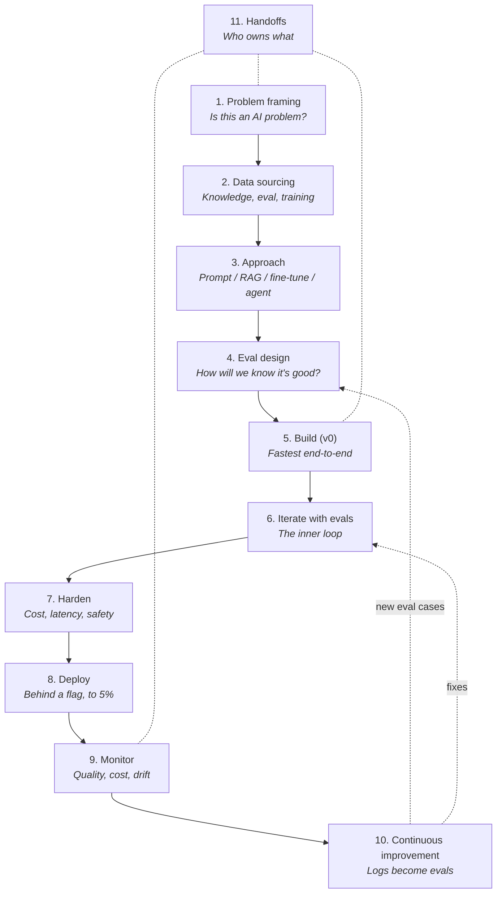

# Part 3: The AI Project Lifecycle

*From "we should add AI to X" to "AI in X is shipping, measured, and getting better."*

> **In one line:** The AI lifecycle borrows from the SDLC but adds three new disciplines — eval design, prompt iteration, and continuous calibration. Skipping them is the most common reason AI projects fail.

:::tip[In plain English]
A normal software project goes: plan → design → code → test → ship → monitor. An AI project goes through the same arc, but with three extra muscles: you have to write **evals** instead of unit tests (because the system is stochastic), you have to keep **iterating on prompts and retrieval** the way you used to iterate on code, and you have to **monitor for drift** because the model itself can change under you. The teams that ship working AI features have built habits around all three. The teams that get stuck at "demo works, prod doesn't" are usually missing one or more.
:::

## The twelve phases

> **Reading this diagram:** The dotted lines back from Phase 10 are the part most teams miss. Continuous improvement is *not* "we ship and check in next quarter." Every week, real failures become new eval cases and the iterate-loop runs again. Handoffs (Phase 11) touches every other phase — it's about who owns each artifact, not a step you do once.

## The phases

1. [Problem framing](./01-problem-framing.md) — Is this actually an AI problem? What's the failure cost?
2. [Data sourcing](./02-data.md) — What data do you have, and is it good enough?
2b. [Data engineering for AI features](./data-engineering.md) — Ingest, parse, chunk, embed, refresh, dedupe, multi-tenancy — the pipelines behind every RAG feature.
3. [Model & approach selection](./03-approach.md) — Prompt vs RAG vs fine-tune vs agent.
4. [Eval design](./04-evals.md) — How will you know if it's good?
5. [Build (v0)](./05-build.md) — The fastest possible end-to-end implementation.
6. [Iterate with evals](./06-iterate.md) — The inner loop that distinguishes serious teams.
7. [Pre-production hardening](./07-harden.md) — Cost, latency, prompt injection, fallback.
8. [Deploy](./08-deploy.md) — Behind a flag, to a small cohort, with observability on.
9. [Monitor](./09-monitor.md) — Quality, cost, latency, drift.
10. [Continuous improvement](./10-improve.md) — Logs → new eval cases → fixes → re-deploy.
11. [Handoffs across the team](./11-handoffs.md) — PM, designer, AI engineer, ML platform, ops.
12. [Checkpoint](./12-checkpoint.md) — Self-test covering all phases.

## Why this differs from normal SDLC

- **Eval design replaces "writing tests."** You can't unit-test a stochastic system. Eval suites + LLM-as-judge are the equivalent.
- **The model is part of the spec.** Swap models and outputs change. Pin model versions and re-eval.
- **Failures are silent.** A wrong answer looks like a right one. Without monitoring, regressions hide indefinitely.
- **Cost is dynamic.** Traffic patterns, prompt length growth, and feature uptake all change spend non-linearly.
- **The "code" is a prompt.** Prompts are version-controlled artifacts, like SQL migrations — small changes can have outsized behavioral effects.

:::note[Worked example we'll follow across this chapter]
**Acme SaaS** is a 40-person B2B company shipping a project-management tool. Their support team handles ~600 tickets/week. Each ticket takes a human agent ~8 minutes on average. They want an **AI support assistant** that answers FAQs, finds relevant docs, and drafts replies for the human to send. It is *not* allowed to send unattended messages to customers.

We'll follow this project through every phase: framing the problem, picking RAG over fine-tuning, designing evals against their actual ticket archive, building v0 in two days, hardening for prompt injection, rolling out behind a flag to internal agents first, and watching the dashboards three months in.

Where you see a **"Acme thread"** box, that's the running case study showing what each phase looks like concretely.
:::

## Real numbers from a typical project

| Phase | Time (small team) | Time (enterprise) | Common cost trap |
|---|---|---|---|
| 1. Problem framing | 1 day | 2-4 weeks | Skipping it; building "AI feature" with no defined success |
| 2. Data sourcing | 2-3 days | 1-3 months | Discovering on day 30 that the docs are stale |
| 3. Approach | 0.5 days | 1-2 weeks | Defaulting to fine-tune when prompting would work |
| 4. Eval design | 1-2 days | 2-4 weeks | Skipping evals entirely; vibe-testing |
| 5. Build (v0) | 2-3 days | 2-6 weeks | Frameworks that hide too much |
| 6. Iterate | Ongoing | Ongoing | Changing 5 things at once; no eval baseline |
| 7. Harden | 2-3 days | 2-4 weeks | Discovering cost cap is missing on the bill |
| 8. Deploy | 0.5 days | 1-2 weeks | Big-bang rollout, no flag |
| 9. Monitor | Ongoing | Ongoing | "Set up Datadog later" — later never comes |
| 10. Improve | Ongoing | Ongoing | Eval set ossifies; never refreshed from prod |

:::info[Real numbers callout]
A representative cost shape for Acme's assistant at steady state: ~$0.012 per ticket draft (Sonnet-tier model + RAG over 8K-token context, with prompt caching cutting input cost ~60%). At 600 tickets/week that's ~$30/month in inference, or $375/year. Engineering time to ship v1: ~3 weeks of one AI engineer at ~50% allocation. The biggest line item by far is the **eval curation** — ~40 hours of a senior support agent's time labeling 200 tickets, which is non-trivial to coordinate but pays back forever.
:::

## How to read this chapter

Read top-to-bottom for your first project. Refer back to specific phases later. The [Checkpoint](./12-checkpoint.md) at the end has a self-test if you want to verify it stuck.

## Common anti-patterns (chapter-wide)

- **Treating the lifecycle as linear.** It's a loop. Phase 10 feeds Phase 4 and Phase 6 forever.
- **Hiring an AI engineer and assuming the rest of the team's job is unchanged.** PM scope, designer flows, and ops dashboards all shift.
- **Doing the demo, skipping evals.** The demo always works. Evals are what catch the cases it doesn't.
- **Picking the model first.** Frame the problem, design evals, *then* pick the model. The model is the easiest thing to swap.
- **Treating "we shipped" as the end.** AI features need more post-launch attention than traditional ones, not less.

## Chapter checklist

- [ ] You can name all twelve phases and what each produces.
- [ ] You know the worked example (Acme support assistant) end-to-end.
- [ ] You can articulate three ways the AI lifecycle differs from the standard SDLC.
- [ ] You know which phase you're currently in for your own project.

---

→ Next: [Problem framing](./01-problem-framing.md)
