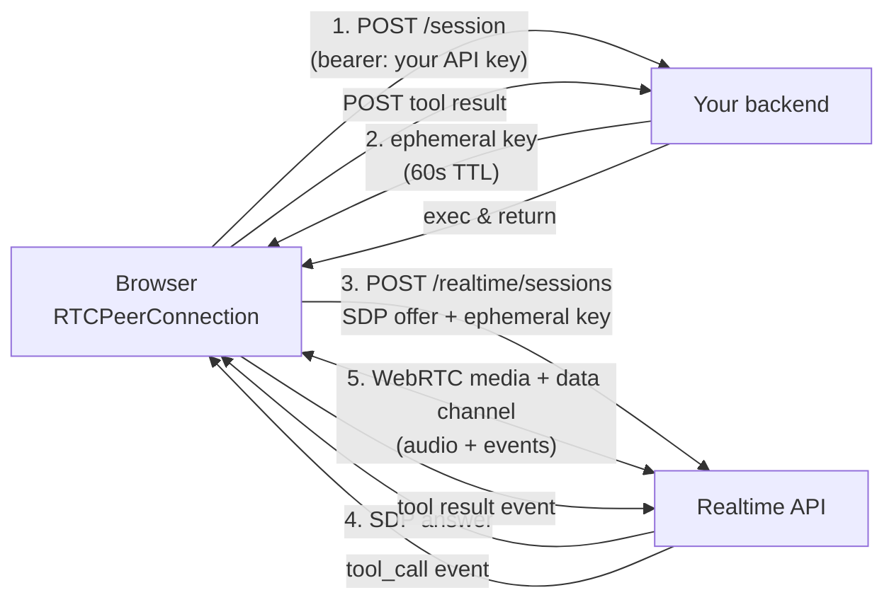

# Realtime voice — the engineering details

> **In one line:** Picking OpenAI Realtime, Gemini Live, or LiveKit + Pipecat is the easy part; the hard part is the WebRTC handshake, the ephemeral-key threat model, the session-event lifecycle, voice activity detection, interruption handling, and keeping the round-trip under 800ms — all of which the vendor docs cover unevenly.

:::tip[In plain English]
The [voice infrastructure](./voice-infra.md) page tells you which provider to pick. This page is what you actually have to build on top of it: how the browser opens a WebRTC connection without exposing your API key, how the session is set up and updated mid-call, how the model knows the user finished talking, how it stops gracefully when the user interrupts, and how every layer's latency stacks up to the moment-of-truth "how fast did the AI respond?" budget.
:::

> **→ Going deeper:** This is the infra/wiring view of voice. For the modeling side — what speech and vision models can actually do, and how to evaluate them — see [Chapter 8: Multimodal & Voice AI](/docs/multimodal), especially [Voice](/docs/multimodal/mm-voice) and [Vision](/docs/multimodal/mm-vision).

## The realtime architecture, in one diagram



Five steps. Step 1–2 are your auth boundary. Step 3–4 is the WebRTC handshake. Step 5 is the live session. The whole rest of this page is the detail behind those arrows.

## Ephemeral keys — the auth boundary

A naive design: browser holds the API key, calls the Realtime API directly. **Don't.** That key is now leaked to anyone who opens DevTools.

The pattern every provider supports (OpenAI, Google, Anthropic, LiveKit) is **ephemeral session keys**:

1. Browser calls *your* backend (authenticated as your normal app user).
2. Backend calls the provider with your long-lived API key, requests a short-lived session token (typical TTL: 60 seconds).
3. Backend returns the ephemeral token to the browser.
4. Browser uses the ephemeral token to establish the WebRTC session directly to the provider.
5. Token expires; if the user starts a new session, repeat.

```python
# Server-side (FastAPI sketch)
@app.post("/session")
async def mint_session(user=Depends(current_user)):
    # gates: is this user allowed? are they over rate limit?
    if rate_limit_exceeded(user.ip):
        raise HTTPException(429)
    if user.session_minutes_today >= 60:
        raise HTTPException(402, "daily cap")
    r = await openai.beta.realtime.sessions.create(
        model="gpt-realtime",
        voice="alloy",
        instructions=load_system_prompt(user.brief_id),
    )
    return {"client_secret": r.client_secret.value}  # short-lived
```

**What this defends against:**
- API-key extraction from the browser.
- Anonymous users hammering the provider on your dime (your `/session` endpoint enforces auth + rate limit + spend cap *before* minting).

**What it does NOT defend against:**
- A logged-in attacker burning their session minutes (cap per user).
- Token theft after issue (60s window is small but not zero — issue right before connect; don't pre-mint).
- The user's network being recorded (use DTLS-SRTP, the default for WebRTC).

## The WebRTC handshake — SDP, ICE, and what each does

WebRTC connects two peers (browser ↔ provider) for media. The handshake:

1. **Browser creates `RTCPeerConnection`** with STUN servers (`stun:stun.l.google.com:19302` is the typical default; the provider may provide its own).
2. **Browser adds the local audio track** from `getUserMedia({ audio: true })`.
3. **Browser calls `createOffer()`** — this produces an SDP (Session Description Protocol) string describing what codecs, transports, and capabilities the browser supports.
4. **Browser POSTs the SDP offer** to the provider's Realtime endpoint, authenticated with the ephemeral key.
5. **Provider returns an SDP answer** — its side of the negotiation.
6. **Browser calls `setRemoteDescription(answer)`** — the negotiation is now agreed.
7. **ICE candidates** trickle in on both sides — these are concrete `IP:port` pairs the peers will try to connect on. STUN finds your public IP behind NAT; TURN relays media if direct connection fails.
8. **Connection state becomes `connected`** when at least one ICE pair succeeds. *Now* audio flows.

```typescript
// Client sketch — OpenAI Realtime via WebRTC
const pc = new RTCPeerConnection();

// Receive remote audio
pc.ontrack = (e) => { audioEl.srcObject = e.streams[0]; };

// Data channel for events (tool calls, transcripts, control)
const dc = pc.createDataChannel("oai-events");
dc.onmessage = (e) => handleEvent(JSON.parse(e.data));

// Local mic
const stream = await navigator.mediaDevices.getUserMedia({ audio: true });
stream.getTracks().forEach((t) => pc.addTrack(t, stream));

// Offer
const offer = await pc.createOffer();
await pc.setLocalDescription(offer);

// POST to provider
const r = await fetch("https://api.openai.com/v1/realtime?model=gpt-realtime", {
  method: "POST",
  headers: { Authorization: `Bearer ${ephemeralKey}`, "Content-Type": "application/sdp" },
  body: offer.sdp,
});
const answer = { type: "answer" as const, sdp: await r.text() };
await pc.setRemoteDescription(answer);
```

That's it. About 20 lines of client code for a working voice connection. The data channel (`dc`) is the side-channel for non-audio events.

### Why WebRTC and not WebSocket

- **Built-in audio plumbing.** Jitter buffer, packet loss concealment, codec negotiation, echo cancellation. You'd reinvent all of it on WebSocket.
- **UDP under the hood.** Drops a packet during a 30ms phoneme? It moves on. WebSocket over TCP would block on retransmits and the user hears stutter.
- **Built-in DTLS-SRTP encryption.** No additional crypto layer.

WebSocket is fine for transcript-only or for *control* (when you're sending text events) — and OpenAI also exposes a WebSocket variant of Realtime that's easier to use server-side. But for low-latency duplex audio in a browser, WebRTC is the default.

## The session-event lifecycle

After the WebRTC connection is up, the data channel carries a stream of structured events in both directions. The shape varies by provider, but the lifecycle is similar:

| Event (client → server) | When you send it |
|---|---|
| `session.update` | Change instructions, voice, turn-detection mode mid-call |
| `input_audio_buffer.commit` | "I'm done talking" (only in manual VAD mode) |
| `response.create` | Ask the model to respond now (e.g., after a tool result) |
| `response.cancel` | User interrupted — stop generating |

| Event (server → client) | What it means |
|---|---|
| `session.created` | Connection alive |
| `input_audio_buffer.speech_started` | Server-side VAD detected user speech |
| `input_audio_buffer.speech_stopped` | User finished a turn |
| `response.audio.delta` | A chunk of model-generated audio (sent over media, not data channel — this event just signals) |
| `response.audio_transcript.delta` | Streaming transcript of what the model is saying |
| `response.function_call_arguments.delta` / `.done` | Tool call streaming |
| `response.done` | This turn is fully generated |
| `error` | Something went wrong; payload has detail |

The **`session.update`** event is how you do "load this interviewer brief," "switch to a different voice," "change the temperature" mid-call without tearing down the WebRTC.

## Voice activity detection (VAD) and turn-taking

The model has to know **when the user finished talking** so it can respond. Three modes:

1. **Server-side VAD (default).** The provider detects silence on the incoming audio and ends the turn after a configurable silence threshold (typical: 500ms). Simplest. Bad at noisy environments — wind or background music can extend or cut off turns.
2. **Client-side push-to-talk.** UI shows a button; user holds it to talk. You emit `input_audio_buffer.commit` on release. Eliminates VAD mistakes; awkward UX.
3. **Semantic turn detection (2025+).** A small classifier model decides whether the user's pause is a "thinking pause" or "I'm done." Available in OpenAI's Realtime API since GA. Costs a bit more, much better in noisy environments.

```jsonc
// Switch on semantic VAD
{
  "type": "session.update",
  "session": {
    "turn_detection": { "type": "semantic_vad", "eagerness": "medium" }
  }
}
```

`eagerness` is a knob: low = wait longer (good for slow speakers / interviews); high = respond fast (good for quick exchanges).

## Interruption handling — barge-in

User starts talking while the AI is mid-response. The expected behavior: AI stops mid-word, listens, responds to the new input. The implementation:

1. **VAD fires `speech_started`** on the incoming audio while a response is in flight.
2. **Client immediately stops playback** of buffered model audio (`audioEl.pause()`, clear queued buffers).
3. **Client emits `response.cancel`** so the model stops generating and you stop paying for tokens you'll never play.
4. **Model handles the new turn** as it normally would.

Forget any step and the UX feels broken — the AI talks over the user, or pays for 30 seconds of unplayed audio, or both.

## The latency budget

Voice feels broken above ~800ms round-trip. Where does the budget go?

| Hop | Realistic latency |
|---|---|
| Mic → browser audio API | 20–80ms (depends on driver, headset) |
| Browser → provider over WebRTC | 30–80ms (depends on geography; uses UDP) |
| VAD decides "user finished" | 200–500ms (silence threshold) |
| Model TTFT (first audio token) | 200–600ms (model size, load) |
| First audio chunk → speaker | 30–80ms |
| **Total perceived** | **~500ms–1.3s** |

Levers, in order of leverage:

- **Lower the VAD silence threshold** (300ms is aggressive; 500ms is default; 800ms is "talking to grandma"). Trade-off: false-positive interruptions.
- **Pick a fast model** (Haiku-class, GPT-realtime-mini, Gemini Flash) for the LLM hop if you're using a pipeline architecture.
- **Region routing.** A user in Sydney hitting a US-East endpoint is 200ms of pure light-speed delay. Use the provider's nearest region; LiveKit handles this with global media servers.
- **Use end-to-end speech models** (OpenAI Realtime, Gemini Live) instead of STT → LLM → TTS pipeline; you save the STT and TTS hops (~200ms combined).

If your **total** budget blows past 1.5s, the product feels broken regardless of how good the model is.

## Tool calling mid-conversation

Voice models can call tools mid-call. The pattern:

1. User: "What's my order status?"
2. Model emits `response.function_call_arguments.done` with `{ "order_id": "ABC-123" }`.
3. **Important:** play a filler immediately. Have the model say "one moment, let me check that" *before* the tool call fires, or play a pre-recorded "checking now…" client-side. Without it the user hears 1–3 seconds of dead air.
4. Your client (or backend, via the client) executes the tool, sends a tool-result event.
5. Emit `response.create` to nudge the model to respond using the result.
6. Audio of "Your order shipped Tuesday" streams out.

Best practice: design tool descriptions so the model says "let me check" *before* requesting the tool. Phrased as part of the system prompt: *"When you need to look something up, briefly tell the user you're checking before calling the tool."*

## Telephony — when the user is on a phone

In-app voice runs over WebRTC. Phone-number products run over SIP — same idea, different signaling. The integration path:

- **Twilio Voice or LiveKit SIP** terminates the phone call as a SIP trunk.
- That SIP trunk is bridged to a WebRTC peer connection to the Realtime API.
- DTMF (touch-tones) come in as data-channel events.
- You handle hold music, call recording, voicemail detection at the SIP layer.

Hosted products (Vapi, Retell, Bland) bundle all of this. DIY uses LiveKit + Pipecat with Twilio numbers — more control, more wiring.

## Failure modes specific to voice

| Failure | What you'll see | What to do |
|---|---|---|
| Network jitter spike | Choppy audio, dropped words | RTCP-based jitter buffer (built into WebRTC); play "you're cutting out" if `connectionState === 'disconnected'` |
| Bandwidth crashes to &lt;100kbps | Codec falls back to low-bitrate, robotic voice | Detect via `RTCInboundRtpStreamStats`; warn user |
| User's mic is muted at OS level | Provider VAD never fires `speech_started` | Detect with `getStats()` showing zero audio level; prompt the user |
| AI gets stuck in an infinite "hmm let me think" | Token generation loops | Cap max output tokens per turn; cap turns per session |
| User dialing in from corporate NAT/firewall | ICE can't get a direct connection | TURN relay (provider-supplied) handles it but adds 50ms |
| Ephemeral key expired before user clicks "Start" | First `/session` request 401s | Mint right before connect, not on page load |
| Tool takes longer than the natural conversational gap | Awkward silence | Filler line; or stream a "still working on it" event every 2s |
| Voice cloning attempt with cloned audio | Provider's safety classifier blocks output | Surface a generic error; log for review |

## Cost controls specific to voice

Voice is the most expensive feature per active user in most stacks. Hard limits to set, server-side, day one:

- **Max session length** (e.g., 15 minutes). Enforced server-side via the session token's TTL plus a watchdog that tears down the WebRTC if exceeded.
- **Max sessions per user per day.**
- **Max parallel sessions per user** (usually 1).
- **Per-IP rate limit on `/session`** — even before login, an attacker can't spam token mints.
- **Kill switch on the `/session` endpoint** for total daily budget. Past $X, return 503 with a maintenance message.

A stuck voice agent that loops in a `let-me-think` cycle for 30 minutes costs ~$6 — multiply by 100 anonymous attackers and it's a serious problem. The cap matters.

## What beginners get wrong

:::caution[Common mistakes]
- **Holding the API key in the browser.** Always ephemeral keys minted server-side, gated by auth and rate-limit.
- **No interruption handling.** Build barge-in on day one, not as a polish task.
- **Treating Whisper as a streaming STT.** Whisper is batch — great for recordings, wrong for live. Use Deepgram, AssemblyAI, or Soniox for streaming.
- **One global region.** A US-only deployment delivering voice to APAC users is broken before the model even responds.
- **No filler before tool calls.** Dead air during a 2-second DB query is the #1 complaint about voice products.
- **No max-duration cap on sessions.** A single stuck call can rack up tens of dollars; an attack can rack up thousands.
- **Building voice on synchronous HTTP.** Every hop must stream. The moment one layer waits for the full response before forwarding, the latency budget is gone.
- **Ignoring `connectionState` and `iceConnectionState`.** When the network hiccups, the user wants to see "reconnecting…", not silence.
:::

:::info[Highlight: voice is where the AI engineer becomes a real-time engineer]
Voice products force you to think about jitter, packet loss, NAT traversal, codecs, and turn-taking — concerns that don't exist in text. That's why voice specialization commands a premium: it's the union of AI engineering and real-time media engineering. If you can ship a working voice product, you can ship anything.
:::

---

→ Next: [Fine-tuning platforms](./fine-tuning-platforms.md)
