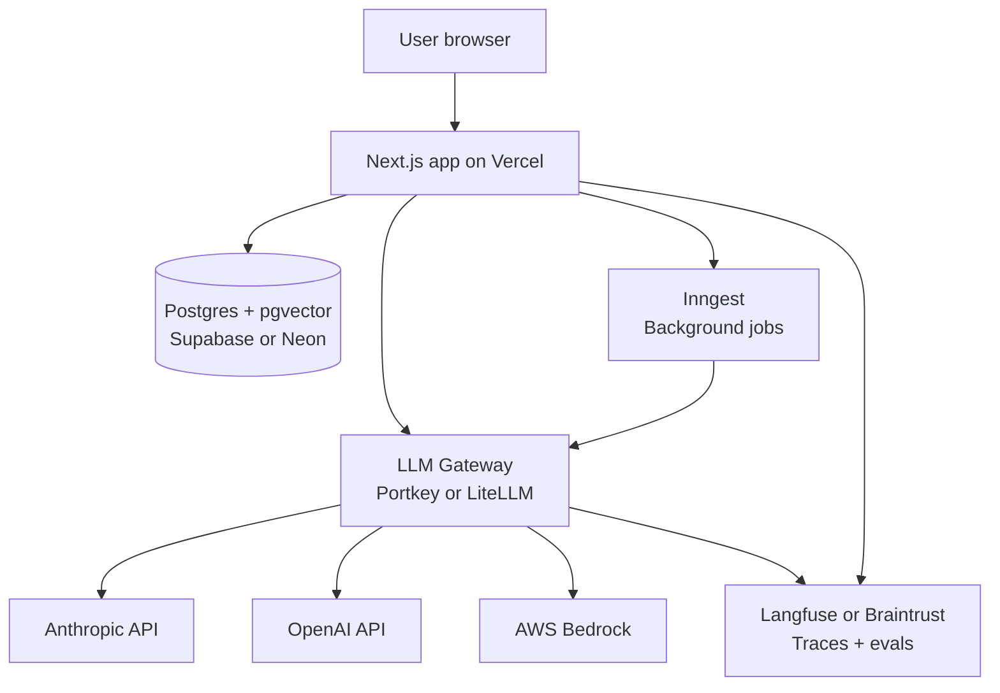

# Architecture for an AI Startup

> **In one line:** One Next.js monolith, an LLM gateway in front of two providers, pgvector for embeddings, Inngest for long jobs, Langfuse or Braintrust for traces. Split only when a specific component hurts.

:::tip[In plain English]
Microservices and "agent platforms" are fake debates at this scale. One deployable app calling a managed LLM gateway will take you from 0 to $5M ARR. The architecture diagram fits on a napkin. The interesting decisions are *which managed services* you commit to — not whether to build vs buy (always buy).
:::

## The reference architecture



One app. One database. One gateway. One trace store. One job queue. Everything else is glue code in the monolith.

## The 2026 AI-startup stack

| Layer              | Primary choice                         | Fallback / alt                          |
|--------------------|----------------------------------------|-----------------------------------------|
| App framework      | Next.js 15 (App Router) + Vercel AI SDK| Remix, SvelteKit                        |
| Language (app)     | TypeScript (strict)                    | —                                       |
| Language (workers) | Python on Modal/Render                 | TS workers on Inngest                   |
| LLM gateway        | Portkey                                | OpenRouter, LiteLLM (self-hosted)       |
| Models             | Anthropic primary, OpenAI fallback     | + Bedrock for compliance customers      |
| Embeddings         | OpenAI text-embedding-3-small          | Voyage AI, Cohere                       |
| Vector store       | pgvector in Postgres                   | Pinecone, Turbopuffer, Qdrant at scale  |
| Database           | Postgres via Supabase or Neon          | RDS                                     |
| ORM                | Drizzle                                | Prisma                                  |
| Background jobs    | Inngest                                | Trigger.dev, Temporal                   |
| Evals + traces     | Braintrust *or* Langfuse (pick one)    | Vellum, LangSmith                       |
| App observability  | Sentry + Datadog (or Better Stack)     | New Relic                               |
| Feature flags      | PostHog or Statsig                     | LaunchDarkly                            |
| Auth               | Clerk or Better Auth                   | Supabase Auth                           |
| Hosting            | Vercel + Supabase + Modal              | Railway, Fly.io                         |

This stack handles roughly **0 to $10M ARR** for most modern AI startups. Adjustments at scale: dedicated vector DB, sharded Postgres, multi-region — none of which require rewrites.

## The LLM gateway: non-negotiable

If you only adopt one piece of dedicated AI infra, it's the gateway. Two providers minimum behind one interface:

```ts
// Portkey example
const response = await portkey.chat.completions.create({
  messages: [...],
  model: "claude-sonnet-4.5",
  // Auto-fallback to OpenAI on Anthropic outage
  config: { fallback: { models: ["gpt-5"] } },
});
```

What the gateway buys you:

- **Provider failover.** Anthropic 500s for 20 minutes → OpenAI seamlessly takes over.
- **Unified logging.** Every call is traced regardless of provider.
- **Cost attribution.** Per-tenant, per-feature spending in one dashboard.
- **Rate limit pooling.** Multiple API keys across providers, automatically rotated.
- **Prompt caching control.** A single setting across providers.

Cost: typically $0–$500/month for the gateway itself; pays for itself on the *first* provider outage.

## pgvector first; dedicated vector DB only when forced

Most startups can run RAG entirely on **pgvector inside Postgres** until they hit ~10M vectors or need sub-100ms queries at high QPS. Reasons:

- One database, one connection pool, one backup story.
- Transactions across vectors and metadata for free.
- No data-sync nightmare between Postgres and the vector store.

Switch to Pinecone, Turbopuffer, or Qdrant when:

- Your vector count crosses ~10M and query latency degrades.
- You need hybrid search (semantic + BM25) with better tooling than `tsvector` joined to vectors.
- Multi-region serving becomes a requirement.

## When to add a Python worker

Most startups can stay all-TypeScript on the app side. Python comes in for:

- **Heavy data prep / batch embedding jobs.** numpy, pandas, scikit-learn are still better in Python.
- **Custom evaluation logic** when you outgrow the eval platform's built-ins.
- **Fine-tuning data pipelines** when you eventually go there.

Pattern: Modal (or Render workers, Fly machines) hosting a FastAPI service that the Next.js app calls. Queue with Inngest if work is long-running.

## When to split the monolith

Default answer: don't. The signs you genuinely need to split:

- A specific feature has wildly different scaling needs (e.g., a real-time voice agent at 100x the QPS of the rest of the app).
- A specific feature needs different compliance (HIPAA boundary, on-prem deployment).
- A specific feature is owned by a team that needs a different release cadence.

When you do split, extract *one* service first (the one with the clearest boundary), prove the pattern, then consider more. Most companies never need to split more than 1–2 services off.

:::note[Worked example: a stack that handled 10x growth without rewrite]
A 22-person AI startup grew from 500 to 8,000 active customers in 18 months. Their stack at month 0: Next.js + Supabase + Portkey + Anthropic + Langfuse. Their stack at month 18: *the same*, plus a Modal worker for batch embeddings and a switch from pgvector to Turbopuffer at month 14.

What they didn't do: re-platform, adopt microservices, add Kubernetes, build a custom orchestration framework. What they did: pay $80K/year more for managed services and ship 4x more features than competitors who were rewriting their stack.

The lesson: boring is fast.
:::

:::info[Highlight: the gateway pays for itself the first outage]
The morning Anthropic had a 4-hour incident in mid-2025, startups without a gateway lost their entire AI surface area for the morning. Startups with a gateway configured for OpenAI fallback saw a 12-second blip of higher latency, then service resumed. The fallback configuration is *one line of YAML.* There is no reason to skip this.
:::

## Streaming and SSE plumbing

Almost every AI feature needs streaming responses end-to-end. The 2026 pattern:

- **Frontend:** Vercel AI SDK (`useChat`, `useCompletion`) handles SSE plumbing for you in Next.js. Works with the gateway.
- **Backend:** Next.js Route Handler returns a streaming `Response` whose body is the gateway's stream.
- **Gateway:** Portkey passes streams through transparently.

A typical streaming endpoint is ~40 lines of code. Don't roll your own SSE parser — use the SDK.

## Caching layers

Three cache layers, all earning their keep:

| Layer                      | Stored where         | TTL          | Hit pattern                            |
|----------------------------|----------------------|--------------|----------------------------------------|
| Anthropic prompt cache     | Provider-side        | 5 min default| Reused system prompts + long context   |
| Gateway semantic cache     | Portkey              | 1 hour       | Near-identical user queries            |
| App-level cache (Postgres) | Your DB              | Hours/days    | Deterministic preprocessing outputs    |

Enable prompt caching first — it's a free 50–80% cost cut on any feature with a long static system prompt. Semantic caching is more nuanced; turn on per-feature and measure.

## When to add a queue

If a feature can take >30 seconds end-to-end (agent loops, large batch jobs, multi-step retrieval), put it on a queue:

- Inngest or Trigger.dev for TypeScript-native event-driven jobs.
- Temporal if you need durable, complex workflows with state machines.
- Modal queues if you're in Python land.

The user-facing pattern: submit → return a job ID → poll or websocket for completion → notify when done. Don't make users sit on a 45-second loading spinner.

## Common mistakes

:::caution[Where people commonly trip up]
- **Adopting LangChain "for everything" because it's familiar.** A LangChain agent is overkill for a single prompt call. Use the raw SDK for 80% of features; reach for a framework only when you have a real orchestration need (chained agents, complex tool routing).
- **Building your own gateway.** A weekend project to "save the Portkey fee" turns into 6 months of maintenance, lost provider features, and missed observability. Buy.
- **Premature vector DB migration.** Switching off pgvector at 100K vectors because "Pinecone scales better" wastes a quarter for no measurable gain. Migrate when latency actually hurts, not before.
- **One model provider with no fallback.** It's not if, it's when. The provider will have an outage during your most important customer demo.
- **Mixing eval platforms.** Don't run half on Braintrust and half on Langfuse. The mental overhead of two tools eats the benefit of either.
:::

## What's next

→ Continue to [Environment Setup](./06-env-setup.md) where we cover the shared prompt library, eval scripts in CI, gateway config, and secrets management.
