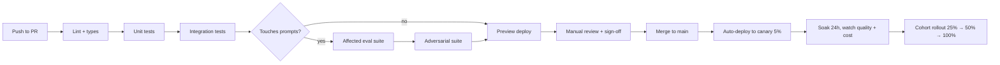

# CI/CD for AI Startups

> **In one line:** Lint, type-check, unit + integration tests, eval suite, preview deploy, then cohort rollout. Every step blocks the next. Eval and adversarial suites are gates, not warnings.

:::tip[In plain English]
A regular CI pipeline answers "does the code work?" An AI CI pipeline also has to answer "does the *output* still meet the bar?" That extra question is what justifies eval-gating in CI. The first time you ship a prompt change without an eval and silently regress your top customer, you'll wish you'd set this up on day one.
:::

## The pipeline shape



Each step blocks the next. CI minutes are cheaper than customer churn.

## A typical workflow file

```yaml
# .github/workflows/ci.yaml
name: CI
on: [pull_request]

jobs:
  validate:
    runs-on: ubuntu-latest
    steps:
      - uses: actions/checkout@v4
      - uses: oven-sh/setup-bun@v1
      - run: bun install --frozen-lockfile
      - run: bun run lint
      - run: bun run typecheck
      - run: bun run test           # unit + integration

  evals:
    needs: validate
    runs-on: ubuntu-latest
    if: contains(github.event.pull_request.changed_files, 'packages/prompts/')
    steps:
      - uses: actions/checkout@v4
      - uses: oven-sh/setup-bun@v1
      - run: bun install --frozen-lockfile
      - run: bun run evals:affected --base=${{ github.event.pull_request.base.sha }}
        env:
          PORTKEY_API_KEY: ${{ secrets.PORTKEY_API_KEY }}
          BRAINTRUST_API_KEY: ${{ secrets.BRAINTRUST_API_KEY }}
      - name: Post eval delta to PR
        run: bun run evals:post-comment

  adversarial:
    needs: evals
    runs-on: ubuntu-latest
    if: contains(github.event.pull_request.changed_files, 'packages/prompts/')
    steps:
      - run: bun run evals:adversarial
```

> **Reading it:** `validate` runs the cheap stuff (lint, types, unit, integration). `evals` only runs if the PR touched `packages/prompts/`. `adversarial` runs after evals pass. Anything failing blocks merge via branch protection.

## Branch protection

Required on `main`:

- All CI jobs must pass.
- 1 reviewer for any PR touching `packages/prompts/`.
- 2 reviewers for any PR touching Tier-0 or Tier-1 prompts.
- Linear history (squash or rebase merges only).
- Signed commits if SOC 2 prep is on the roadmap.

## The cost-aware CI rule

Eval suites cost real money — every case is an LLM call. Two rules to keep CI bills sane:

1. **Affected-only on PRs.** Only run evals for prompts that changed. Full suite runs nightly on `main`.
2. **Spend cap on the CI gateway key.** Set a daily budget (e.g., $50). If a runaway PR loop blows it, the next eval run fails fast with a "budget exceeded" error rather than ballooning to $4,000.

Typical eval cost for a healthy startup: $100–$500/month, split across CI runs and nightly full sweeps.

## Preview deploys

Every PR gets a Vercel preview URL automatically. The preview:

- Hits real provider APIs (no mocks).
- Uses a sandbox tenant in a separate Supabase project.
- Has its own gateway key with low daily spend cap.
- Posts the preview URL as a PR comment.

Designer, PM, and AI engineer all click the preview before approving merge.

## The merge → deploy flow

Once a PR merges to `main`:

1. **Auto-deploy to canary (5% of traffic).** Vercel + feature-flag cohort handles this.
2. **24-hour soak.** Dashboards watch eval score on prod traces, p95 latency, cost/answer, error rate.
3. **Auto-promote to 25%** if no alerts. Notify in Slack.
4. **Manual promote to 50% → 100%** by the on-call engineer.

Any threshold breach during canary or soak → auto-rollback by flipping the cohort flag.

## Deploy windows

- **Production deploys:** Monday–Thursday, 9am–4pm local. Avoid Friday afternoon and weekends.
- **Tier-0 prompt changes:** Tuesday or Wednesday only. Maximum daylight engineering hours for response if something goes wrong.
- **Emergency hotfix:** allowed any time, but requires a paged on-call engineer ready to monitor.

## Hotfix path

When something breaks in prod and needs a fix now:

1. Branch from `main` with prefix `hotfix/`.
2. CI runs the full required suite — no shortcuts.
3. Reviewer approves; merge.
4. Deploy goes straight to 100% rather than canary (because the alternative is staying broken).
5. Post-mortem within 48 hours.

If "we need to skip evals to ship this hotfix" comes up: the answer is no. If evals are the bottleneck on a hotfix, the eval suite is too slow — fix that separately.

:::note[Worked example: a canary rollout that caught a stealth regression]
A 25-person AI startup merges a prompt cleanup that passed the eval suite (no regression detected). Auto-deploys to 5% canary. During the 24h soak, the prod dashboard shows the LLM-as-judge score on real traffic *drops* 8 points.

Auto-rollback fires; the on-call engineer investigates. Finding: the eval set had 30 cases but didn't cover the specific input pattern that 12% of real users hit. The "clean" prompt narrowed handling for that pattern.

Fix: add 15 new cases to the eval set covering the missed pattern; reattempt the prompt change with the broader bar; ship clean. The canary system caught what the eval set didn't — that's why both layers exist.
:::

:::info[Highlight: eval gating in CI is the single highest-leverage rule]
One rule — "eval suite must pass before merge" — replaces dozens of process workarounds. No need for "AI review board," "weekly prompt review meeting," or "senior approval for any model change." The eval suite *is* the review. Process collapses into a number.

The teams that resist this rule (usually because their suite is slow or flaky) end up with much heavier human process to compensate. Fix the suite; the process disappears.
:::

## Common mistakes

:::caution[Where people commonly trip up]
- **CI that takes 30 minutes.** Engineers will skip it or context-switch and lose flow. Aim for under 12 minutes total. Cache aggressively (bun lockfile, Turbo cache, Docker layers).
- **Allowing `--no-verify` for prompt PRs.** It's a culture-killer. Once one engineer does it, the discipline collapses. Block at the pre-commit hook and at branch protection.
- **No spend cap on the CI gateway key.** A runaway eval loop in a PR bills $1,500 over a weekend. Always cap.
- **No auto-rollback on the canary cohort.** If the on-call engineer has to be paged and manually intervene every time, you'll suffer prolonged outages at night. Auto-rollback for threshold breaches is mandatory.
- **Deploying Tier-0 changes on Friday at 4pm.** Just don't.
:::

<Quiz id="startup-ai-cicd-quick-check" variant="micro" title="Quick check">

<Question
  prompt="During an urgent production hotfix, an engineer says evals are slowing them down and should be skipped. What does the page say?"
  options={[
    { text: "Skip evals for hotfixes — speed matters more during an incident" },
    { text: "Run only the unit tests and skip the rest" },
    { text: "No — the full required suite runs with no shortcuts; if evals are the bottleneck, the suite is too slow and that gets fixed separately" },
    { text: "Skip evals but require two senior reviewers instead" }
  ]}
  correct={2}
  explanation="The hotfix path keeps every gate: CI runs the full required suite, a reviewer approves, and the only concession is deploying straight to 100% instead of canary (because the alternative is staying broken). Skipping evals under pressure is the culture-killer the page warns about — once one engineer bypasses the gate, the discipline collapses."
/>

<Question
  prompt="What two rules keep CI eval costs sane?"
  options={[
    { text: "Run affected suites only on PRs (full suite nightly), and set a daily spend cap on the CI gateway key" },
    { text: "Run evals only on release branches, and use the cheapest model for all eval calls" },
    { text: "Cache all eval results forever, and run evals weekly instead of per-PR" },
    { text: "Mock the LLM in CI, and run real evals only before major releases" }
  ]}
  correct={0}
  explanation="Affected-only scoping keeps per-PR runs fast and cheap, while the spend cap (e.g. $50/day) means a runaway PR loop fails fast with a budget error instead of ballooning to thousands. The mocking option is the seductive zero-cost answer, but mocked evals measure nothing — typical real cost is only $100-500/month, which is cheap insurance."
/>

<Question
  prompt="In the worked example, a prompt change passed the eval suite but was still rolled back. What does this demonstrate?"
  options={[
    { text: "Eval suites are unreliable and should be replaced with manual review" },
    { text: "The canary should have run for a week instead of 24 hours" },
    { text: "Auto-rollback fires too aggressively and needs tuning" },
    { text: "The eval set and the canary catch different failures — the canary found an input pattern hitting 12% of real users that the 30-case eval set never covered" }
  ]}
  correct={3}
  explanation="The eval suite can only test cases it contains; the canary's LLM-as-judge on real traffic caught the 8-point quality drop, auto-rollback fired, and 15 new eval cases were added before reattempting. 'Evals are unreliable' is the cynical overreaction — the lesson is that both layers exist because each covers the other's blind spot."
/>

</Quiz>

## What's next

→ Continue to [Deployment](./10-deployment.md) where we cover feature flags, cohort rollouts, kill switches, and the AI-as-change-management reality.
