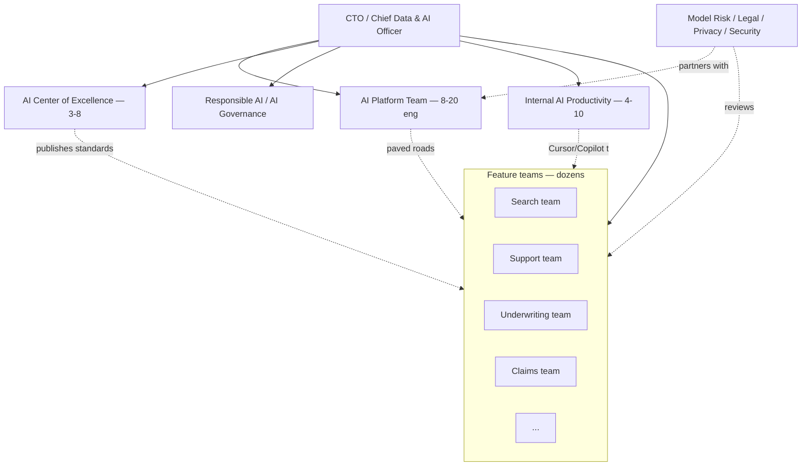

# Team Structure at This Scale

> **In one line:** A working enterprise AI org has a central platform team owning the paved roads, feature teams consuming them, a small CoE setting standards, and named partners in Risk/Legal/Privacy who get pulled into every High-tier review.

:::tip[In plain English]
At a startup, "the AI team" is often two engineers and a Slack channel. At an enterprise, AI work is spread across five or six distinct functions, each with its own reporting line, budget, and OKRs. Knowing who does what — and who *doesn't* do what — is most of what makes you effective in your first six months.

If you can't answer "who owns the gateway?" and "who signs off on a High-tier model?" within your first week, you'll spend months attached to the wrong meetings and ignored by the right ones.
:::

## The pattern that works

### AI Platform team (the load-bearing function)

Owns the shared infrastructure that every AI feature depends on:

- **AI gateway** (Portkey Enterprise, Kong AI Gateway, in-house Envoy).
- **Prompt registry** (Git-backed, often layered on top of Braintrust or Vellum).
- **Eval platform** (Braintrust, LangSmith, or an MLflow-backed in-house service).
- **LLM observability** (Datadog LLM Obs, Langfuse, Arize Phoenix).
- **RAG infrastructure** (vector DB, embedding pipeline, ingestion scaffolds).
- **Fine-tuning platform** (SageMaker, Vertex Pipelines, Databricks Mosaic AI).
- **Model registry** (which models are approved, which versions, which residencies).

Typically 8–20 engineers at a 500-engineer org. Reports into a Director or VP of AI Platform. Their OKRs are about *adoption of paved roads*, not features shipped.

### Feature teams (the consumers)

Each owns a product surface that uses AI. Examples in a regional bank: underwriting team, fraud team, support team, marketing team, internal-search team. They:

- Build on the platform's paved roads — gateway, evals, prompt registry, RAG.
- *Do not* pick their own vector DB, eval tool, or model provider unless the platform doesn't cover their case.
- Own their feature's product metrics and risk-tier compliance.
- Have a designated AI engineer or AI-fluent engineer on the team, often paired with a domain expert.

### AI Center of Excellence (CoE)

A small (3–8 person) virtual team that doesn't ship product code. They:

- Publish AI engineering standards and the prompt-style guide.
- Run an "eval clinic" — office hours where feature teams come for help.
- Own the model card template and risk-tier rubric.
- Partner with Risk/Legal/Privacy on policy.
- Track shadow AI usage and steer it back to paved roads.

The trap: CoE without authority. A CoE that only "guides" and "thought-leads" becomes an internal blog. The working pattern is CoE + a real review-gate role (e.g., the CoE signs off on Medium and High-tier features before they ship).

### Responsible AI / AI Governance

A small team (often 2–5 people, sometimes inside Legal, sometimes inside the CTO org) that:

- Owns the AI risk register.
- Owns the EU AI Act readiness program.
- Runs the AI risk review committee for High-tier features.
- Liaises with regulators and auditors.
- Owns the company's published AI principles and the public model documentation.

In financial services, this is often part of the Model Risk Management (MRM) function under the CRO. In healthcare, it's often inside the privacy or compliance office.

### Risk, Legal, Privacy, Security partners

Not a dedicated AI team — they're the people from existing risk/legal/privacy/security functions who get pulled in by AI Risk Reviews. The healthy pattern is **named partners**: each function designates one or two people who become the AI specialists in that function. You don't want a fresh privacy lawyer every review — you want the same three people who already understand your gateway architecture.

### Internal AI Productivity

Often a separate team (4–10 people) that rolls out AI *to the company's own engineers and employees*:

- Cursor / GitHub Copilot Enterprise / Claude Code rollouts to thousands of devs.
- Internal AI assistants on Slack/Teams.
- An "AI for everyone" enablement program.

This is distinct from the AI Platform team — they're customers of it, not it. Mixing them tends to underweight one or the other.

:::info[Highlight: the platform team is judged on adoption, not features]
The single biggest cultural shift compared to a feature team is that platform OKRs are about **paved-road adoption**, not feature shipping.

A platform team that ships ten new eval features that nobody uses delivered nothing. A platform team that ships *one* eval feature that 90% of AI features now run inside their CI gate delivered enormously.

If you join the platform team and your manager hasn't framed your work this way, that's the conversation to have in week one.
:::

## A representative staffing model

For a 500-engineer org with roughly 30 AI-touched features in production:

| Function | Headcount | Reports to |
|---|---|---|
| AI Platform team | 12 (1 EM, 1 Staff, 10 IC) | VP Platform |
| AI Center of Excellence | 5 (virtual, drawn from across org) | VP AI |
| Responsible AI / Governance | 3 | Chief Risk Officer or General Counsel |
| Internal AI Productivity | 6 | VP DevEx |
| Feature-team AI engineers | ~25 (embedded, 1–2 per AI-touched team) | Their product team |
| **Total dedicated AI headcount** | **~50 (10% of eng)** | — |

At a 5,000-engineer org, multiply the platform / CoE / governance functions by 3–5x, but feature-team AI engineers can scale closer to linearly (1–2 per AI-touched product team).

## What goes wrong

- **Feature teams each pick their own stack.** Six different vector DBs, eight different eval tools, three different gateways. The platform team eventually has to run a consolidation program; it's painful, takes 12+ months, and burns trust.
- **CoE without authority.** A "guidance" team with no enforcement teeth becomes a thought-leader newsletter, not an org function.
- **AI without a clear product owner per feature.** "AI is everyone's job" means nobody owns the eval regression when a model version changes.
- **Platform built in isolation.** A platform team that doesn't sit with feature teams ships features feature teams don't want. The fix is embed rotations — platform engineers spending two weeks per quarter inside a consuming team.
- **Risk and Legal treated as adversaries.** The healthy pattern is named partners who learn your architecture. The unhealthy pattern is "us vs. them" and a different reviewer every time.

## What "AI engineer" means at an enterprise

- More about *integrating* and *operating* AI, less about *experimenting* with new models.
- Strong on evals, observability, prompt management, RAG patterns.
- Comfortable navigating Privacy / Security / Legal review without complaining about it.
- Reads a model card, a DPA, and a SOC 2 report without flinching.
- Pairs well with a Responsible AI partner.
- Knows what an EU AI Act "High-risk" use case is and how to argue their feature isn't one.

The job title might be "AI Engineer," "Senior MLE," "Applied AI Engineer," "AI Platform Engineer," or "AI Solutions Architect." The work is what matters; titles are inconsistent across companies.

## Common mistakes

:::caution[Where people commonly trip up]
- **Building a 3-person "AI team" at a 500-engineer company and calling it done.** AI work at this scale needs platform + CoE + governance + feature-team capacity. A single team trying to cover all four becomes the bottleneck on everything within six months.
- **Putting the AI Platform team and the Responsible AI team under the same VP.** They have legitimately different incentives — the platform team wants adoption, the governance team wants careful review. Concentrating both under one leader produces either over-shipping or over-blocking.
- **Treating the CoE as the senior AI engineers who "graduated" from feature work.** A CoE that becomes a retirement home loses credibility with the engineers it's supposed to influence. Rotate membership; keep at least half on hands-on work.
- **Letting feature teams skip platform onboarding because "their case is special."** Every feature team thinks their case is special. The platform's job is to absorb the variance — let one team skip and you've blessed an exception that becomes a precedent.
- **Forgetting the Internal AI Productivity team exists.** A Cursor rollout to 2,000 engineers is its own program — security review, license management, prompt-history governance, IP-leakage testing. Bolting it onto the AI Platform team starves both.
:::

## What's next

→ Continue to [AI Portfolio Planning](./03-planning.md) — how the AI work for the year actually gets decided.
