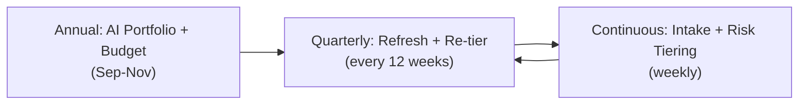

# Phase 1: AI Portfolio Planning

> **In one line:** Enterprise AI work isn't planned per-team — it's planned as a *portfolio*, with risk-tiered intake, cross-BU sequencing, and an explicit cap on how many High-tier features can be in flight at once.

:::tip[In plain English]
At a startup, you decide what AI feature to build by talking to a customer on Tuesday. At an enterprise, the AI features in flight next quarter are usually a deliberate portfolio choice — made annually with finance and the board, refreshed quarterly with risk and product leadership, and constrained by how many Responsible-AI reviewers and platform-team integration slots actually exist.

The shock for first-time enterprise AI engineers is that the *capacity constraint* often isn't engineering — it's Risk, Privacy, and the AI Governance committee, which can only seriously evaluate a fixed number of High-tier features per quarter.
:::

## The planning cadence

A typical Fortune 500 runs three loops:

- **Annual portfolio.** Sets the year's AI investment envelope. Approves committed-spend contracts (Bedrock, Azure OpenAI commits, on-prem GPU capex). Sets risk-tier capacity per quarter. Approves new platform-team hires.
- **Quarterly refresh.** Re-tiers features based on what's been learned, kills features that haven't moved, slots new High-tier features into the next quarter, locks the platform team's commitment list.
- **Continuous intake.** A weekly intake meeting where new AI feature ideas are risk-tiered and either fast-tracked (Low), scheduled (Medium), or queued for the next quarterly review (High).

## Risk-tiered intake

The single most important planning concept. Every proposed AI feature gets a tier within its first week:

| Tier | Criteria | Review depth | Typical lead time |
|------|----------|--------------|---------------------|
| **Low** | Internal-only, non-sensitive data, advisory output, no PII | Self-service intake form + platform-team review | 1–2 weeks |
| **Medium** | Customer-facing OR uses sensitive internal data, but non-decisional and no PHI/PCI | Standard review: eval bar, prompt review, privacy check | 4–8 weeks |
| **High** | Customer-facing AND (decisional OR PHI/PCI/PII OR regulated domain OR EU AI Act high-risk) | Full review: model risk + bias + adversarial + human-oversight design + AI Governance Committee sign-off | 12–26 weeks |

The capacity number that matters: a healthy enterprise AI governance function can deeply review **3–6 High-tier features per quarter**. If you have 20 in your portfolio, you need to sequence them — or get more reviewers.

:::info[Highlight: tiering is the throttle, not the budget]
Most enterprise AI planning failures aren't about money — they're about review capacity. You can have $20M in committed Bedrock spend and platform-team headcount to spare, and still ship nothing this quarter because all six High-tier review slots got used for one massive underwriting feature.

The right reflex: when a business unit proposes a new AI feature, your first question isn't "can we build it?" — it's "what tier is it?" and "do we have a review slot?" The portfolio is rate-limited by reviewers, not by engineers.
:::

## The AI portfolio document

A typical annual portfolio document for a 500-engineer org is 30–60 pages and includes:

- **Strategic theme** — what AI is for at this company this year (e.g., "operational efficiency in claims," "differentiated customer support").
- **Committed spend** — Bedrock / Azure OpenAI / Vertex commitments, GPU capex, vendor contracts.
- **Platform investment** — what the AI Platform team will build (e.g., "ship multi-tenant fine-tuning by Q3").
- **Per-BU feature list** — ranked, with risk tier, target quarter, and dependency on platform capabilities.
- **Risk-tier capacity plan** — High-tier slots per quarter and which features fill them.
- **Regulatory exposure map** — which features fall under EU AI Act High-risk, HIPAA, SR 11-7, etc.
- **Kill criteria per feature** — what eval result, cost overrun, or risk finding would stop the work.
- **Vendor concentration analysis** — exposure to any single model provider (often a board-level concern).

## Sequencing across business units

Cross-BU sequencing is what makes enterprise AI planning genuinely hard. A retail conglomerate might have:

- The credit card business wanting AI fraud detection (High-tier, GLBA, SR 11-7).
- The pharmacy business wanting AI clinical-note summarization (High-tier, HIPAA, FDA-adjacent).
- The marketing org wanting AI ad creative (Low-tier, mostly).
- The HR org wanting AI resume screening (High-tier, NYC Local Law 144, Colorado AI Act).
- The contact-center org wanting AI agent assist (Medium-tier).

The portfolio decision isn't "which is most valuable?" It's "in what sequence, given that High-tier review slots are scarce, can we deliver real outcomes across the business without overloading governance?"

A working pattern: each BU gets a guaranteed share of Medium-tier capacity, and High-tier slots are allocated centrally based on strategic priority.

:::note[Worked example: a quarterly High-tier slot fight]
It's Q1 planning. The AI Governance Committee can deeply review 4 High-tier features this quarter. The intake queue has:

- A. Credit card fraud detection (revenue-protecting, SR 11-7).
- B. Pharmacy refill prediction (operationally important, HIPAA).
- C. AI resume screening for hourly hiring (NYC Local Law 144 exposure if not done carefully).
- D. AI underwriting for small-business loans (revenue-generating, GLBA).
- E. Contact-center agent assist (cost-saving, EU AI Act high-risk because it affects employee performance evals).
- F. AI medical-records search for clinicians (operationally important, HIPAA, possible FDA reach).

Six features, four slots. The committee picks A, B, D, E based on a mix of revenue, regulatory deadline, and previously-committed roadmap. C is held to Q2 because the legal risk hasn't been scoped. F is held to Q2 because the platform team won't have multi-tenant fine-tuning ready until then.

The two deferred BUs aren't happy. The portfolio doc explains the trade-off in writing, and the CTO defends it publicly. That's what enterprise planning looks like in practice — bounded, explicit, contested.
:::

## What changes vs. startup AI planning

| | Startup | Enterprise |
|---|---|---|
| **Cadence** | Whenever someone has an idea | Annual + quarterly + weekly intake |
| **Capacity constraint** | Engineers | Governance reviewers |
| **Who decides** | Whoever runs the standup | Cross-functional committee with named members |
| **Vendor commits** | Pay-as-you-go | 1–3 year committed spend |
| **Kill criteria** | Vibes | Written, in the portfolio doc |
| **Cross-team trade-offs** | Implicit | Explicit and contested |

## Common mistakes

:::caution[Where people commonly trip up]
- **Building an AI portfolio from the bottom up.** If every BU just submits their wish list, you'll have 80 features in flight and ship none of them. The portfolio has to be capacity-aware *first*, ambition-driven *second*.
- **Treating risk tiering as a paperwork exercise.** Risk tier drives review depth, reviewer staffing, model choice, deployment topology, and audit retention. Getting the tier wrong at intake creates 4–10 weeks of rework downstream. Take the 30 minutes at intake.
- **Letting the loudest BU monopolize High-tier slots.** A working portfolio gives each BU some guaranteed Medium-tier capacity *and* explicitly allocates High-tier slots centrally. Without that, the BU with the most political muscle takes all four slots every quarter.
- **Skipping the kill-criteria column.** Features without explicit kill criteria become zombies — half-built, eating platform-team attention forever. Every feature in the portfolio should have a "this eval result, this cost, this risk finding ends it" clause, written before work starts.
- **Forgetting committed-spend math at planning time.** If your Bedrock commit was sized for 80% utilization and you only ship 40% of the planned features, you're paying for unused capacity. Quarterly refresh has to re-true-up committed spend against realistic shipping forecasts.
- **Annual planning that doesn't survive Q1.** A portfolio that's untouched between January and December is a fiction. The quarterly refresh is the part that makes annual planning real.
:::

<Quiz id="enterprise-ai-planning-quick-check" variant="micro" title="Quick check">

<Question
  prompt="According to the page, what is usually the binding capacity constraint on an enterprise AI portfolio?"
  options={[
    { text: "Engineering headcount" },
    { text: "Committed model spend" },
    { text: "GPU availability" },
    { text: "Governance review capacity for High-tier features" }
  ]}
  correct={3}
  explanation="The page's central point: you can have committed spend and platform headcount to spare and still ship nothing this quarter because all the High-tier review slots are used. Engineering headcount is the tempting answer because it is the constraint at startups — and that shift is exactly what the page is teaching."
/>

<Question
  prompt="Roughly how many High-tier features can a healthy enterprise AI governance function deeply review per quarter?"
  options={[
    { text: "3 to 6" },
    { text: "10 to 20" },
    { text: "1 at most" },
    { text: "As many as the portfolio demands" }
  ]}
  correct={0}
  explanation="The page gives 3–6 deep High-tier reviews per quarter as realistic capacity. If your portfolio has 20, you must sequence them or add reviewers. 'As many as the portfolio demands' is the trap — treating review capacity as elastic is how portfolios end up with 80 features in flight and none shipped."
/>

<Question
  prompt="Why does the page insist every feature in the portfolio has written kill criteria?"
  options={[
    { text: "Regulators require kill criteria for all AI systems" },
    { text: "Without them, half-built features become zombies that consume platform attention indefinitely" },
    { text: "They let finance forecast committed spend precisely" },
    { text: "They make quarterly portfolio reviews shorter" }
  ]}
  correct={1}
  explanation="Features without explicit kill criteria never officially die — they linger half-built, eating platform-team attention forever. The regulatory answer is tempting because so much else in the chapter is compliance-driven, but kill criteria are a portfolio-discipline tool: a written clause, agreed before work starts, that says which eval result, cost overrun, or risk finding ends the work."
/>

</Quiz>

## What's next

→ Continue to [Enterprise AI Reference Architecture](./04-architecture.md) — the technical shape of the stack you're planning into.
