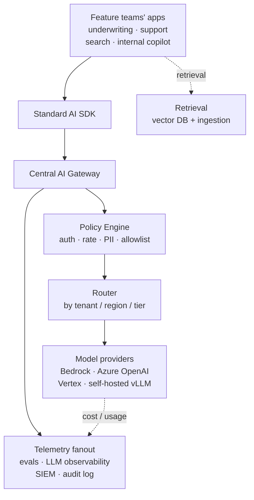

# Phase 3: Enterprise AI Reference Architecture

> **In one line:** Every AI call from every feature team funnels through a central gateway with an attached policy engine, fans out to a curated set of model providers (private endpoints + self-hosted), and emits structured telemetry to eval, observability, and SIEM systems.

:::tip[In plain English]
A startup's "AI architecture" is often a wrapper around the OpenAI SDK in one Node service. The enterprise equivalent is a multi-layered system where every model call passes through an authenticated gateway, a policy engine that can redact or block, a router that picks the right model and region, and an observability pipeline that splits the trace into application telemetry, eval datasets, and a security log.

Why all that? Because at 500+ engineers, you need *one place* where you can flip a switch and stop a model, change a vendor, redact a new PII pattern, or prove to an auditor what happened with a specific prompt eight months ago. Without that one place, you have neither control nor visibility.
:::

## The reference architecture



## Layer-by-layer

### The standard AI SDK

Every feature team uses the same in-house SDK (typically a thin wrapper around the OpenAI or LangChain client). Why a wrapper?

- **Forces gateway routing.** No direct `openai.com` calls; the SDK only knows the gateway URL.
- **Standardizes telemetry.** Trace IDs, feature IDs, prompt registry IDs, eval-suite IDs are attached automatically.
- **Hides vendor differences.** Switching a feature from GPT-4o to Claude Sonnet 4.5 is a config change, not a code change.
- **Centralizes deprecation.** When a model EOLs, the SDK warns; when a new policy lands (e.g., mandatory PII redaction headers), the SDK enforces it.

### The central AI gateway

This is the load-bearing piece. Every AI call passes through it. Common choices:

- **Portkey Enterprise** — purpose-built for AI gateway use cases; multi-provider, observability built in.
- **Kong AI Gateway** — extends the Kong API gateway with AI-specific plugins; appealing if Kong is already deployed.
- **In-house on Envoy/Istio** — chosen by very large orgs that already have heavy service-mesh investment.
- **Apigee or AWS API Gateway** — sometimes used, but usually missing the AI-specific features (prompt redaction, model routing, eval integration).

The gateway handles: authentication (workload identity, not API keys), per-tenant rate limiting, per-feature spend limits, vendor failover, model-version pinning, request/response logging, and a single integration point for the policy engine.

### The policy engine

A separate decision layer (usually OPA or AWS Cedar) the gateway consults on every call. It enforces:

- **Model allowlist per feature.** Feature `support-agent-v2` can call Claude Sonnet on Bedrock; it cannot call GPT-4o (because that feature's risk tier requires AWS-native).
- **PII redaction policy.** Inbound prompts run through a Presidio-style scrubber based on the feature's data classification.
- **Geographic routing.** EU users' requests must land on EU-region endpoints.
- **Kill switch.** A policy flag that can disable a model, a feature, or a tenant in seconds.

A sample policy expressed in YAML (the underlying engine is OPA):

```yaml
# gateway-policies/support-agent-v2.yaml
feature_id: support-agent-v2
risk_tier: medium
allowed_models:
  - provider: bedrock
    model: anthropic.claude-sonnet-4-5
    regions: [us-east-1, eu-west-1]
  - provider: bedrock
    model: anthropic.claude-haiku-4-5
    regions: [us-east-1, eu-west-1]
data_classification: customer-confidential
required_redactions:
  - email
  - phone
  - ssn
  - credit_card
geo_routing:
  eu_user: eu-west-1
  default: us-east-1
rate_limits:
  per_user_rpm: 30
  feature_rpm: 5000
spend_cap_usd_per_day: 8000
required_telemetry:
  - prompt_registry_id
  - eval_suite_id
  - tenant_id
  - user_pseudonym
kill_switch: false
```

### The model provider layer

The four patterns from [Deployment topology](./deployment.md), used together:

- **Bedrock** for most customer-facing AI on AWS-resident data.
- **Azure OpenAI** for orgs already on Microsoft 365 / Azure; GPT-4o and o-series access.
- **Vertex AI** for orgs on Google Cloud; Gemini access plus Claude on Vertex.
- **Self-hosted vLLM** on internal GPU clusters for the most sensitive workloads (defense, healthcare research) or for very-high-volume narrow tasks where the unit economics favor self-host.

Most enterprises run all three hyperscaler endpoints plus a small self-hosted footprint. The gateway abstracts that.

### Retrieval layer

A separate concern from generation, but equally important:

- **Vector DB:** Vespa (very large scale), Pinecone Enterprise (managed), OpenSearch / Elastic with vector plugin (if already deployed), Databricks Vector Search, Snowflake Cortex Search.
- **Ingestion pipelines:** Usually owned by a data engineering team; documents are chunked, embedded, and indexed via Snowflake/Databricks/Airflow jobs.
- **Access control on retrieval.** Critically, retrieval has to respect the same row-level / document-level ACLs the source system enforces. A user who can't see a document in SharePoint must not see it through a RAG endpoint.

### Telemetry fanout

Every gateway call emits a structured record. That record is consumed by:

- **The eval platform** (Braintrust, LangSmith, in-house) — for replay against eval suites and regression detection.
- **LLM observability** (Datadog LLM Observability + Langfuse or Arize Phoenix) — for latency, cost, error rate, hallucination scoring, drift detection.
- **The SIEM** (Splunk, Microsoft Sentinel) — for security/compliance correlation: who called what model, with what data classification, from where.
- **The audit log store** — immutable, retention-per-policy (HIPAA: 6 years; SR 11-7: indefinite; GDPR: subject to deletion-on-request).

Splitting telemetry into these four sinks is the standard pattern because no single tool does all four well.

:::info[Highlight: the gateway is the audit boundary]
The deepest reason every enterprise eventually builds a central AI gateway isn't observability or cost control — it's **audit defensibility**. When an auditor asks "show me every model call made on behalf of EU customers between March 1 and March 15, with the redaction policy that applied and the eval suite that was active," the answer needs to be a single query against the gateway logs.

If half your model calls go through the gateway and half go straight from feature teams' code to OpenAI, that answer is "we can't tell you." That's the answer that fails the audit.

This is why "all AI calls go through the gateway, no exceptions" is the single most important architectural rule at enterprise scale.
:::

## RAG-specific architecture notes

RAG features add their own layer of complexity:

- **Embedding-model independence.** Choose embedding models the gateway can also serve and route. Coupling RAG to one embedding model with a different SDK undoes the gateway's value.
- **Doc-level ACLs in the index.** Each chunk carries the source document's ACL fingerprint. The retriever filters by the requester's identity *before* the model sees results.
- **Stale-content detection.** Vector indexes drift; ingestion failures silently produce stale RAG. A daily diff job comparing source store vs. index keeps the team honest.
- **Re-ranker as a service.** Treat re-rankers (Cohere Rerank, in-house) as just another model behind the gateway, not as a special pipeline.

## What's not in this architecture (deliberately)

- **No agent framework as the central abstraction.** Agent-style multi-step calls happen *through* the gateway, not in spite of it. Frameworks like LangGraph or in-house equivalents live in feature-team services.
- **No "AI app server."** Avoid building an enterprise-wide "AI service" that does generation for everyone. Generation is a library call (through the gateway); state and business logic live in feature services.
- **No single embedding pipeline.** Different domains have different freshness, ACL, and chunking needs. A central embedding *platform* (templates, queues, observability) yes; a central *pipeline* no.

## Common mistakes

:::caution[Where people commonly trip up]
- **Letting feature teams bypass the gateway "for performance" or "for a special case."** Every bypass is a hole in the audit story. Performance arguments are almost always wrong (gateway overhead is single-digit ms); special cases are nearly always solvable with a per-feature policy.
- **Putting business logic in the gateway.** The gateway is for routing, auth, redaction, and telemetry. The moment you put feature-specific orchestration in it, you've turned a platform into a monolith that every feature team blocks on.
- **Building the policy engine into the gateway code.** Hard-coded policies don't survive contact with reality. Use OPA / Cedar so policies are config, not deploys.
- **Treating the SIEM integration as optional.** Without security telemetry, the gateway is "operationally useful" but doesn't help compliance. Wire the SIEM from day one — retrofitting it is two quarters of work.
- **One eval suite for the whole company.** A central eval *platform* (Braintrust, LangSmith) yes; a single shared eval *suite* across all features no. Each feature owns its eval suite; the platform owns the infrastructure for running them.
- **Choosing the vendor before designing the architecture.** "We're going to use Portkey" should be the answer to a designed-for-our-stack question, not the first decision. Sketch the layers above, then evaluate vendors against them.
:::

<Quiz id="enterprise-ai-architecture-quick-check" variant="micro" title="Quick check">

<Question
  prompt="What does the page say is the deepest reason every enterprise eventually builds a central AI gateway?"
  options={[
    { text: "It reduces model latency through caching" },
    { text: "It lowers token costs through smart routing" },
    { text: "Audit defensibility — one place that can answer exactly what happened on every model call" },
    { text: "It removes the need for feature teams to write SDKs" }
  ]}
  correct={2}
  explanation="When an auditor asks for every model call made for EU customers in a date range, the answer must be a single query against gateway logs. If half the calls bypass the gateway, the answer is 'we cannot tell you' — and that fails the audit. Cost and observability benefits are real but are not the load-bearing reason."
/>

<Question
  prompt="In the reference architecture, what is the policy engine's role?"
  options={[
    { text: "A separate decision layer the gateway consults on every call, enforcing allowlists, redaction, geo routing, and kill switches as config" },
    { text: "A code library compiled into each feature service" },
    { text: "A monthly review board that approves model choices" },
    { text: "The component that generates embeddings for RAG" }
  ]}
  correct={0}
  explanation="The policy engine (typically OPA or Cedar) is deliberately separate from gateway code so policies are config, not deploys. The 'compiled into each service' answer is tempting because that is how startups enforce rules — but hard-coded policy is exactly what the page says does not survive contact with reality."
/>

<Question
  prompt="What must RAG retrieval respect, per the architecture notes?"
  options={[
    { text: "A single company-wide embedding pipeline" },
    { text: "The same document-level access controls the source system enforces" },
    { text: "A maximum of one vector database per company" },
    { text: "Only documents created in the last 12 months" }
  ]}
  correct={1}
  explanation="A user who cannot see a document in SharePoint must not see it through a RAG endpoint — each chunk carries the source document's ACL fingerprint, and the retriever filters by requester identity before the model sees results. The single-pipeline answer is a trap: the page explicitly recommends a central embedding platform but not a central pipeline."
/>

</Quiz>

## What's next

→ Continue to [AI in Enterprise Frontends](./05-frontend-architecture.md) — what changes when your AI features ship inside a design system and on a regulated UI.
