# Phase 5: Development Practices for AI Code

> **In one line:** Daily AI engineering at this scale is trunk-based, eval-gated, and reviewed twice — once for code by engineers, once for prompts by a small standing committee — with every change linked to an eval suite, a risk tier, and a prompt registry version.

:::tip[In plain English]
At a startup, "AI development practices" usually means "the engineer changes the prompt, pushes, and watches what happens." At an enterprise, the same change goes through code review, prompt review, an eval gate in CI, and (for Medium/High-tier features) a quick sign-off by a designated reviewer who has context on the feature's risk profile.

It looks slow on paper, and it is somewhat slower per change. The trade-off is that you catch the kind of regression that would otherwise reach 50,000 users — and you have an audit trail when it happens anyway.
:::

## The standard PR shape for AI code

A typical AI PR at an enterprise touches five things:

1. **Code change** (the actual integration).
2. **Prompt change** (a new version in the registry, surfaced as a diff).
3. **Eval cases** (added or updated to cover the new behavior).
4. **Eval results** (CI runs the suite, posts results to the PR).
5. **Manifest change** (risk tier, model, regions — if any of these changed).

CI gates on all five before merge is allowed.

```mermaid
flowchart LR
    PR["PR opened"]
    Lint["Lint + type"]
    Unit["Unit tests"]
    Eval["Eval suite (smoke)"]
    Adv["Adversarial slice"]
    Sec["Security scan + secret scan"]
    Pol["Policy lint (manifest valid?)"]
    Prompt["Prompt review (if changed)"]
    Code["Code review (CODEOWNERS)"]
    Risk["Risk review (if tier=high)"]
    Merge["Merge to main"]
    PR --> Lint --> Unit --> Eval --> Adv --> Sec --> Pol --> Prompt --> Code --> Risk --> Merge
```



## Code review for AI code

Standard enterprise code-review practices apply (CODEOWNERS, two reviewers, automated checks) — plus AI-specific things reviewers look for:

- **Is the model call going through the standard SDK / gateway?** Direct vendor SDK calls are a red flag.
- **Is the prompt fetched from the registry by ID, or hard-coded?** Hard-coded prompts can't be governed, versioned, or A/B tested.
- **Is the response handled defensively?** Missing field handling, JSON-parse failure, truncation, refusal — all real failure modes that need explicit code paths.
- **Are PII / secrets prevented from going into the prompt?** Logged inputs end up in audit storage; raw PII shouldn't appear.
- **Is there a fallback when the model is unavailable?** Gateway down, regional outage, kill switch — what does the user see?
- **Is the eval suite updated to cover the change?** A code change without a matching eval case is almost always a gap.
- **Are cost and latency budgets respected?** The gateway will enforce, but reviewers should sanity-check.

## Prompt review committees

For Medium- and High-tier features, the prompt review is a separate step from code review. Typically:

- **Reviewers (rotating roster of 4–8):** at least one AI engineer, at least one domain SME (e.g., a claims adjuster for a claims-summary feature), and for High-tier, an AI Risk partner.
- **Cadence:** the committee reviews queued prompt promotions twice a week. Promotion to staging is fast (24 hrs); promotion to production requires the committee.
- **What they look for:** prompt clarity, harmful instruction patterns, jailbreak resistance, locale safety, refusal correctness, citation rules for RAG, scope limits.
- **Sign-off lives in the registry.** The promotion record carries the committee member who signed off; auditors can query it.

A common prompt-review checklist:

```markdown
## Prompt review — policy-search-v1@v2.4

### Reviewer: jchen (committee member, AI eng)
### Domain reviewer: alopez (HR policy SME)

- [ ] System message clearly bounds scope to HR policies (no general legal advice).
- [ ] Refusal phrasing is reviewed; matches the company tone.
- [ ] Citation format matches the design-system AISummary component.
- [ ] No instruction patterns that increase jailbreak susceptibility.
- [ ] No locale assumptions (e.g., "U.S. holidays").
- [ ] Eval suite includes refusal cases for out-of-scope queries.
- [ ] Eval scores on smoke suite >= last shipped version.
- [ ] Domain SME has approved the policy interpretation tone.

Approved: yes / no / changes requested
```

## Eval-driven development

A working enterprise discipline that mirrors test-driven development:

1. Decide what the AI feature should do.
2. Write 10–20 representative eval cases (input → expected behavior, scorer).
3. Run the suite against the current prompt; observe baseline.
4. Edit the prompt or code to improve scores.
5. Re-run; iterate until acceptable.
6. Add adversarial cases (jailbreak attempts, edge inputs, ambiguous prompts).
7. Promote prompt + open PR.

Cultural marker: at a mature AI engineering org, "I changed the prompt and it seemed better in three test calls" is treated the way "I changed the function and tested it manually" would be in a backend code review — embarrassing, not acceptable.

:::info[Highlight: the eval suite is the contract]
The deepest shift from startup AI to enterprise AI is that **the eval suite, not the prompt, is the contract for what the feature does.**

A prompt is a means to an end. The end is "this set of inputs produces these graded outcomes." When you frame the work that way, the prompt becomes free to evolve (newer model, new technique, new safety wording) as long as the eval suite still passes.

Without that framing, you end up with sacred prompts that nobody dares change because nobody can prove the change is safe. The eval suite is what lets you change the prompt confidently.
:::

## Pair-programming rituals for AI

Enterprise AI teams often add specific pairing rituals:

- **Eval pairing.** Two engineers, one screen, an hour to write 15 eval cases for a feature. Catches assumptions and bias gaps that a solo engineer misses.
- **Prompt critique sessions.** Weekly, an hour, one team brings a prompt and the room critiques it. Spreads knowledge of what good prompts look like.
- **Red-team Fridays.** Periodic adversarial sessions where engineers try to break each other's AI features. Findings go into adversarial eval suites.
- **On-call pairing for AI incidents.** AI failures are unfamiliar to most on-callers. Pair a platform-team engineer with the feature on-call during incidents until both are comfortable.

## Daily rituals

A typical week for an AI feature engineer:

- **Mon:** Triage eval regressions from the weekend nightly run.
- **Tue:** Standup; pair on a new eval suite for an upcoming feature.
- **Wed:** PR work + reviews; prompt-review committee meeting (if on rotation).
- **Thu:** Office hours with the platform team for help with a tricky retrieval issue.
- **Fri:** Red-team Friday; write up findings into the adversarial suite.

## Cross-team rituals

- **Monthly AI engineering all-hands.** Platform team shares roadmap; feature teams show what they shipped.
- **Quarterly AI risk review.** Risk partners present which features are graduating tiers, which are entering, which are sunsetting.
- **Quarterly prompt-portfolio review.** Which prompts have eval drift? Which haven't been touched in a year? Which need a re-baseline?

## What changes vs. startup AI development

| | Startup | Enterprise |
|---|---|---|
| **Where prompts live** | In code | In the prompt registry |
| **Who reviews a prompt** | The PR author | The PR reviewer + prompt review committee for Medium/High |
| **Eval gate** | Optional | CI-blocking |
| **Adversarial testing** | "We'll do it before launch" | Eval-suite slice that runs nightly |
| **Time from change to production** | Same day | Days (Medium) to weeks (High) |
| **Audit trail** | "git blame" | Registry + eval-result history + sign-off records |

## Common mistakes

:::caution[Where people commonly trip up]
- **Hard-coding the prompt because "the registry adds friction."** Six months later, three teams have diverging prompts for the same feature and nobody can tell which is in production. Use the registry from PR #1.
- **Letting the eval suite drift below the production prompt.** Eval cases were written six months ago, the prompt has been edited four times, and the eval no longer reflects what the feature does. Tie a "re-baseline evals" task to every prompt promotion.
- **Treating the prompt review committee as a rubber stamp.** A committee that approves everything within an hour isn't reviewing. Either staff it properly with named members and an SLA, or fold the function into code review with explicit checkpoints.
- **Skipping the adversarial slice "because the model is well-aligned."** Aligned models still fail in domain-specific ways (medical jailbreaks, financial advice slippage, regulated-content prompts). Adversarial cases are part of the eval suite, not a one-time launch exercise.
- **Reviewing AI code with backend-only reviewers.** A senior backend engineer who hasn't shipped AI may approve a PR that calls the SDK directly and hard-codes a prompt because they don't know what "wrong" looks like in this domain. Add at least one AI-fluent reviewer to CODEOWNERS for any directory that talks to a model.
- **Running red-team exercises only before launch.** Threats evolve weekly; one launch red-team is a snapshot. Make it a recurring ritual, not an event.
:::

<Quiz id="enterprise-ai-development-practices-quick-check" variant="micro" title="Quick check">

<Question
  prompt="According to the page, what is the real contract for what an AI feature does?"
  options={[
    { text: "The eval suite — a set of inputs producing graded outcomes" },
    { text: "The system prompt, carefully version-controlled" },
    { text: "The feature's product requirements document" },
    { text: "The model card filed with governance" }
  ]}
  correct={0}
  explanation="The eval suite, not the prompt, is the contract. A prompt is a means to an end and stays free to evolve — newer model, new technique, new safety wording — as long as the suite still passes. Treating the prompt as the contract is the trap: it produces sacred prompts nobody dares change because nobody can prove a change is safe."
/>

<Question
  prompt="A typical enterprise AI pull request touches five things that CI gates on. Which list matches the page?"
  options={[
    { text: "Code, screenshots, design specs, prompts, and release notes" },
    { text: "Prompt, model weights, GPU config, datasets, and dashboards" },
    { text: "Code change, prompt change, eval cases, eval results, and manifest change" },
    { text: "Code, unit tests, documentation, changelog, and deploy script" }
  ]}
  correct={2}
  explanation="The standard AI PR shape is: the code integration, a new prompt version in the registry surfaced as a diff, eval cases covering the new behavior, CI-posted eval results, and any manifest change (tier, model, regions). The docs-and-changelog answer describes a conventional PR — the page's point is that AI PRs carry eval and registry artifacts too."
/>

<Question
  prompt="Who reviews a production prompt promotion for a Medium-tier feature, beyond the code reviewers?"
  options={[
    { text: "Nobody — code review covers prompts too" },
    { text: "A standing committee including an AI engineer from outside the team and a domain expert" },
    { text: "The company's external auditors" },
    { text: "The model provider's safety team" }
  ]}
  correct={1}
  explanation="Prompt review is a separate step from code review for Medium and High tier: a rotating committee with at least one AI engineer and a domain SME (plus an AI Risk partner for High tier) reviews queued promotions twice a week. 'Code review covers it' is the tempting answer — and exactly the practice the committee exists to upgrade."
/>

</Quiz>

## What's next

→ Continue to [Testing AI in Regulated Environments](./08-testing.md) — what testing looks like when FedRAMP/HIPAA artifacts are part of the deliverable.
