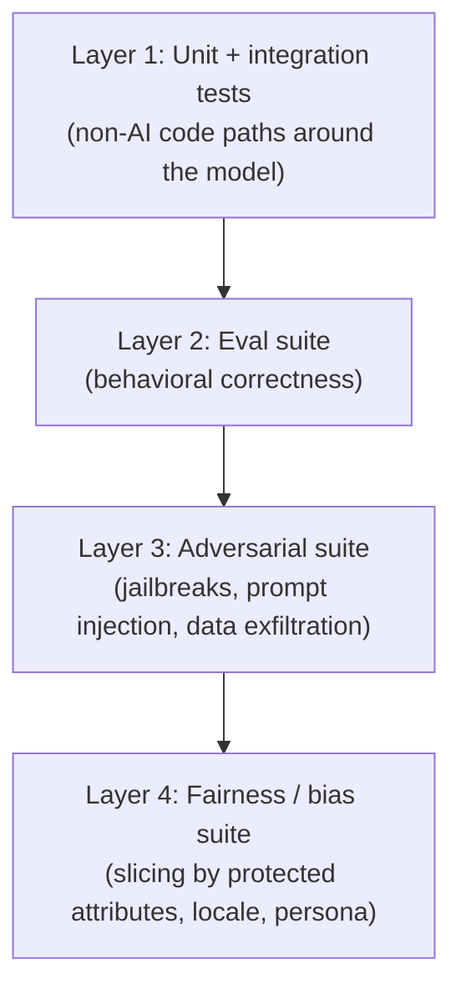

# Phase 6: Testing AI in Regulated Environments

> **In one line:** Enterprise AI testing has four layers — unit, eval, adversarial, and fairness — each of which produces artifacts that auditors care about as much as engineers do.

:::tip[In plain English]
At a startup, "AI testing" usually means an eval suite of 50 cases and a deploy. At an enterprise, the same feature has four testing layers, each of which exists for a different reason — engineering quality (unit), behavioral quality (eval), security posture (adversarial), and regulatory defensibility (fairness). The output of all four is logged, retained, and pulled out during the next SOC 2 / HIPAA / EU AI Act audit.

A common shock for first-time enterprise AI engineers: the auditors don't care that your tests pass. They care that you ran them, recorded the results, and addressed the failures. The artifact is the deliverable.
:::

## The four layers



Each runs in CI; the eval and adversarial layers also run nightly against the production prompt; the fairness layer runs weekly or per major change.

### Layer 1: Unit + integration tests

The non-AI code paths around the model. Standard backend testing applies:

- The retrieval call returns the expected document set for a known query.
- The response handler correctly parses a known model output.
- The fallback path triggers when the gateway returns 503.
- The PII redactor scrubs SSNs and emails from inputs.

This layer catches the same bugs unit tests always catch. It's necessary but not where the AI-specific risk lives.

### Layer 2: Eval suite (behavioral correctness)

The core "is the AI doing what we want" layer. Cases look like:

```yaml
# evals/cases/policy-search-rag-grounded.yaml
id: rag-grounded-pto-question
input:
  query: "How many PTO days do I get in my first year?"
  user_persona: us-fulltime-new-hire
expected:
  - groundedness_score >= 0.90       # LLM-judge scorer
  - cites_source: hr-policy-pto-v3
  - response_length_words: [40, 200]
  - refuses_to_extrapolate: true
```

A mature eval suite for a single feature has 50–500 cases, organized into:

- **Smoke** (10–30): runs on every PR.
- **Production** (200+): runs nightly and on promotion.
- **Adversarial** (50+): see next layer.
- **Fairness slices** (variable): see layer 4.

Scorers are a mix of programmatic (exact match, regex, schema validity) and LLM-judge (groundedness, helpfulness, tone). LLM-judge scorers themselves get versioned and reviewed — drifting judges silently change pass rates.

### Layer 3: Adversarial suite

Tests the security posture of the AI feature. Categories every High-tier feature should cover:

- **Prompt injection** — inputs that try to override the system prompt ("Ignore previous instructions and…").
- **Indirect prompt injection** — for RAG, malicious content in retrieved documents.
- **Jailbreak** — attempts to elicit content the model should refuse.
- **PII / secret exfiltration** — attempts to make the model echo or guess at user-pseudonyms, account numbers, or system prompts.
- **Tool-use abuse** — for agent features, trying to make the agent call tools with attacker-controlled arguments.
- **Resource exhaustion** — prompts that try to produce maximum tokens, infinite loops, or expensive tool sequences.
- **Refusal correctness** — verifying the model refuses when it should (medical advice, legal advice, harmful content, out-of-scope queries).

These cases are *intentionally adversarial*. A failing case here usually triggers a prompt-review committee discussion, not just a code fix.

### Layer 4: Fairness / bias testing

Required for any feature touching protected attributes, hiring, lending, healthcare, or anything in EU AI Act High-risk. The technique: run the same eval cases across slices and compare scores.

Common slices:

- **Locale slices** (en-US vs. es-MX vs. fr-FR vs. de-DE).
- **Persona slices** (varying demographic markers in the input).
- **Name swaps** (input identical except for traditionally Black vs. White vs. Asian vs. Hispanic names).
- **Gender swaps** (he/she/they versions of the same input).
- **Age proxies** (graduation year, technology familiarity markers).

For each slice, compute score deltas. A statistically significant gap is a finding — sometimes a real bias, sometimes a measurement artifact, always worth a review.

```yaml
# evals/fairness/name-swap-slice.yaml
base_case: rag-grounded-pto-question
variations:
  - name: Aaliyah Washington
  - name: Allison Walsh
  - name: Aiko Watanabe
  - name: Alejandra Vargas
scorers:
  - groundedness_score
  - response_length_words
  - tone_warmth   # LLM-judge with explicit rubric
acceptable_delta:
  groundedness_score: 0.03
  tone_warmth: 0.05
```

:::info[Highlight: fairness deltas are findings, not failures]
A common mistake is treating any fairness-slice delta as a hard CI failure. That doesn't work — small deltas are inevitable, and over-tight thresholds create noise that teams learn to ignore.

The working pattern: deltas above the acceptable threshold open a **finding** that's reviewed by a human (the AI risk partner, an AI engineer, sometimes the prompt-review committee). Some findings are real bias; some are sampling noise; some reveal a prompt that needs locale-aware phrasing. The artifact is the *triaged finding*, not the raw delta.

That's what auditors want to see — that you measured, you triaged, and you have a record of how you handled each one.
:::

## FedRAMP, HIPAA, and EU AI Act test artifacts

The testing layers above are also the artifact-production process for regulators.

### FedRAMP (government / federal)

For Moderate / High authorizations, AI features need:

- Documented eval methodology + sample.
- Adversarial test results, retained.
- Continuous-monitoring eval results.
- Evidence the model is hosted in FedRAMP-authorized environments (Bedrock GovCloud, Azure Government).

### HIPAA (healthcare)

Less prescriptive about AI specifically, but:

- Evidence that PHI isn't sent to non-BAA-covered services. (Eval cases include PHI-containing inputs that should be redacted or rejected.)
- Audit logs of every model call touching PHI.
- Documented Risk Assessment per HIPAA Security Rule §164.308.

### EU AI Act (High-risk applications)

This is the heavy one. For High-risk uses, you need:

- A documented **risk management system** (eval methodology + adversarial + fairness).
- A **data governance** description (training data, fine-tuning data, RAG corpora).
- A **technical documentation** package (model card + system architecture + intended purpose).
- **Record-keeping** capability (audit logs, retained per Art. 12).
- A **human oversight** design (how a human can review, override, or stop the AI).
- An **accuracy, robustness, and cybersecurity** report (your test results).
- A **conformity assessment** before market placement.

The four-layer testing setup produces most of the test-result artifacts the conformity assessment needs.

### SR 11-7 (financial model risk)

For banks, an AI feature that influences decisions is a "model" under SR 11-7 and needs:

- A model development document (often pulls from the model card + eval suite).
- Independent model validation by a model risk team (separate from the development team).
- Ongoing performance monitoring with documented thresholds.
- A model inventory entry (your model registry feeds this).

## What changes vs. startup AI testing

| | Startup | Enterprise |
|---|---|---|
| **Layers** | One eval suite, sometimes | Unit + eval + adversarial + fairness |
| **Cadence** | Pre-launch | Per PR (smoke) + nightly (production) + weekly (fairness) |
| **Failures** | Reverted | Triaged, documented, sometimes accepted with mitigation |
| **Audit posture** | "We tested" | Artifacts retained per regulatory regime |
| **Who runs it** | The author | CI + a Risk partner for High-tier |

## Common mistakes

:::caution[Where people commonly trip up]
- **Treating eval cases as throwaway scripts.** Eval suites are an asset that compounds — every shipped feature, every regression, every adversarial finding adds to the corpus. Store them in a tracked repo, version them, and add to them deliberately.
- **Skipping the adversarial layer because "our model is safe."** Modern models *are* better aligned, but the failure modes that matter at enterprise scale (indirect prompt injection via RAG content, regulated-domain refusal slippage, tool-use abuse) are real and feature-specific. Generic alignment doesn't substitute for adversarial cases against *your* feature.
- **Running fairness slices and not triaging the findings.** A weekly fairness run that produces a 100-finding report nobody reads is worse than not running it — you've created liability without value. Triage cadence has to keep up with run cadence.
- **Letting LLM-judge scorers drift.** The judge prompt itself is a piece of the test infrastructure. Version it, re-baseline pass rates when you change it, and review changes to judges as carefully as you review changes to feature prompts.
- **One eval suite covering all locales.** A US-English-only eval suite gives false confidence on a multi-language feature. Locale-specific cases are required for any feature serving non-English users — not nice-to-have.
- **Treating compliance test artifacts as a launch checklist.** They're recurring. EU AI Act and SR 11-7 want *ongoing* monitoring evidence. Build the artifact pipeline once and run it forever.
- **Forgetting to test the kill switch.** A gateway kill switch that hasn't been exercised in 6 months might be broken. Quarterly game-days that flip the switch and verify the user-facing behavior keep it real.
:::

## What's next

→ Continue to [CI/CD for AI](./09-ci-cd.md) — how all this testing wires into a release pipeline.
