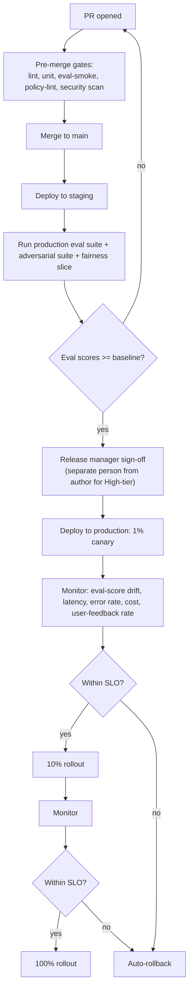

# Phase 7: CI/CD for AI

> **In one line:** An enterprise AI pipeline isn't just "build, test, deploy" — it's "lint → unit → eval → adversarial → fairness → security scan → policy lint → staging deploy with canary evals → release-manager sign-off → segregated production deploy → progressive rollout with auto-rollback on eval regression."

:::tip[In plain English]
A startup AI pipeline runs the tests and deploys. An enterprise pipeline does the same things but adds gating around eval scores, separates the engineer who writes the code from the engineer who clicks "deploy to production" (segregation of duties), and ramps traffic to the new version over hours or days while watching eval scores in real time.

The reason it's more complex isn't bureaucracy — it's that the failure mode of an AI deploy is uniquely hard to detect. A bad prompt change might quietly drop groundedness 5% across hundreds of thousands of queries before anyone notices. The pipeline exists to catch that *before* it reaches all your users.
:::

## The pipeline shape



## Pre-merge gates

These run on every PR. Failure blocks merge.

- **Lint + type check** — standard.
- **Unit + integration tests** — standard.
- **Eval-smoke** — 10–30 cases from the production suite; must pass and must not regress vs. main.
- **Policy lint** — manifest is valid; model used is in the registry and approved for the feature's risk tier; no PII in eval cases.
- **Security scan** — SAST (Semgrep), dependency scan (Snyk, GitHub Advanced Security), secret scan, license scan.
- **Prompt registry check** — every prompt referenced in code exists in the registry; new prompts are submitted to the registry as part of the PR.

A typical pre-merge gate takes 5–15 minutes; teams that let this grow past 25 minutes see PR throughput drop sharply.

## Post-merge staging pipeline

After merge, the pipeline deploys to staging and runs the heavy tests:

- **Production eval suite** — the full 200+ cases.
- **Adversarial suite** — all jailbreak / injection / refusal cases.
- **Fairness slice** — at least the per-locale slice; full demographic slice for High-tier.
- **Cost/latency benchmark** — sample of 50 representative calls; p50/p95 latency and cost-per-call must stay within budgets.
- **Contract tests against downstream services** — if the feature publishes events, verify schema compatibility.

Staging eval results are posted to the change ticket. A regression vs. main triggers an automatic rollback of the staging deploy and a Slack notification to the author.

## Segregation of duties and release-manager sign-off

For SOC 2, HIPAA, SR 11-7, and FedRAMP, the engineer who *wrote* the code typically cannot be the engineer who *deploys* it to production. The standard pattern:

- **Author:** opens the PR, gets it through code + prompt review, lands on main.
- **Release manager:** a different named role (often a senior engineer on a rotating shift) reviews staging eval results, confirms the change ticket has all required artifacts, and triggers the production deploy.
- **Automation:** does the actual deploy steps. The release manager is approving — not running commands.

For High-tier features, the release manager is augmented by an AI Risk partner who signs off on the eval-score deltas before production rollout.

:::info[Highlight: segregation of duties is the audit-passing piece]
A common mistake at growing companies is having the author of the change also click "deploy to production." It feels efficient. It fails SOC 2 (CC8.1), HIPAA Security Rule §164.308(a)(3), SR 11-7's segregation guidance, and the EU AI Act's human-oversight requirements.

The auditable record needs to show: change authored by Person A, reviewed by Persons B and C, deployed by Person D (or by automation triggered by Person D). When that record exists end-to-end in your release tooling, the audit is a 30-minute exercise. When it doesn't, the audit becomes a six-week reconstruction project.
:::

## Production canary with eval monitoring

The deploy ramps progressively:

| Stage | Traffic | Duration | Monitored |
|---|---|---|---|
| Canary | 1% | 30 min – 2 hr | Latency p95, error rate, eval-score drift on live samples, user-feedback ratio, cost-per-call |
| Ramp 1 | 10% | 2 – 24 hr | Same + drift across slices |
| Ramp 2 | 50% | 4 – 48 hr | Same |
| Full | 100% | — | Same, monitored ongoing |

Each stage has explicit SLOs. Breach triggers automatic rollback — Argo Rollouts or equivalent reverts the deployed manifest to the previous version, traffic returns, and the author/release manager are paged.

The novel piece (vs. non-AI canary) is **live eval-score drift detection.** A sample of production calls is replayed (or scored in-place) against the eval scorers. A drop of more than X% from staging baseline is treated as a critical signal — the same way a 5x latency increase would be.

```yaml
# rollouts/policy-search-v1.yaml
canary_stages:
  - traffic_pct: 1
    duration_min: 30
    slos:
      p95_latency_ms_max: 4500
      error_rate_max: 0.01
      eval_groundedness_drift_max: 0.04
      cost_per_call_usd_max: 0.014
      feedback_negative_rate_max: 0.05
  - traffic_pct: 10
    duration_min: 240
    slos:
      eval_groundedness_drift_max: 0.03
      fairness_locale_delta_max: 0.04
  - traffic_pct: 50
    duration_min: 1440
  - traffic_pct: 100
auto_rollback: true
on_rollback_notify:
  - slack: '#ai-platform-incidents'
  - pager: ai-feature-on-call
```

## Emergency-patch pipeline

Some AI changes can't wait for the normal pipeline:

- A jailbreak technique has been publicly disclosed and your feature is vulnerable.
- A model provider has announced an EOL with two weeks' notice.
- A regulatory finding requires a content-filter update within 24 hours.

The emergency pipeline keeps the same gates but compresses them:

- Eval-smoke + adversarial only (not full fairness).
- Single reviewer + release manager (not committee).
- Direct to 50% canary (not 1%).
- Auto-rollback on first SLO breach.

Use of the emergency pipeline is itself logged and reviewed monthly — it should be rare.

## What changes vs. a startup AI pipeline

| | Startup | Enterprise |
|---|---|---|
| **Pre-merge gates** | Lint + unit + maybe an eval | + adversarial + fairness + policy-lint + security |
| **Eval gating** | Optional | Hard gate, with baseline comparison |
| **Deploy actor** | Author | Release manager (separate person) |
| **Canary** | Maybe a feature flag | Progressive traffic ramps with SLO-based auto-rollback |
| **AI-specific monitoring** | Latency + error rate | + eval drift + fairness deltas + feedback ratio + cost-per-call |
| **Rollback** | Manual | Automatic on SLO breach |

## Common mistakes

:::caution[Where people commonly trip up]
- **Letting pre-merge gates grow past 25 minutes.** Throughput drops, engineers context-switch and lose the PR, and reviewers procrastinate. Aggressively prune slow tests into the post-merge staging stage.
- **Treating eval-smoke as a 5-case "is it broken" check.** Smoke needs to be representative enough that a regression in a major behavior is caught. 10–30 cases covering the core flows; less is too coarse.
- **Skipping segregation of duties because "we trust the engineer."** Trust isn't the audit criterion — separation is. SOC 2 will fail the company on this even if the engineer is the most careful person on the team.
- **Canary stages with no eval drift signal.** A canary that only watches latency and error rate misses the AI-specific failure mode — quiet quality regression on otherwise-successful calls. Eval drift is the AI canary's superpower; use it.
- **Auto-rollback that doesn't include the prompt version.** If you roll back the code but not the prompt registry pointer, you've rolled back to a state that doesn't exist. Treat prompt version + code version as a single deployable unit.
- **No documented rollback for irreversible model changes.** Fine-tuned model promotions, RAG index re-ingestion — these aren't trivially reversible. The release plan needs an explicit "if this goes wrong, here's how we get back" section.
- **Emergency pipeline used routinely.** The emergency path exists for jailbreaks and regulatory urgencies. If it's used for "we want to ship faster," you've broken the audit story.
:::

<Quiz id="enterprise-ai-ci-cd-quick-check" variant="micro" title="Quick check">

<Question
  prompt="Why does the enterprise pipeline separate the engineer who wrote a change from the person who deploys it to production?"
  options={[
    { text: "Authors are too busy to watch deployments" },
    { text: "It halves the chance of human error during deploys" },
    { text: "Deployment requires special infrastructure credentials" },
    { text: "Segregation of duties is required by SOC 2, HIPAA, SR 11-7, and similar regimes — the audit record must show different people" }
  ]}
  correct={3}
  explanation="Trust is not the audit criterion; separation is. The record must show authored by person A, reviewed by persons B and C, deployed by person D — and SOC 2 will fail the company on this even if the engineer is the most careful person on the team. The other answers are plausible operational reasons but not the page's point."
/>

<Question
  prompt="What is the novel monitoring signal in an AI canary compared to a conventional canary?"
  options={[
    { text: "Live eval-score drift on sampled production calls" },
    { text: "p95 latency" },
    { text: "HTTP error rate" },
    { text: "Memory utilization of the serving fleet" }
  ]}
  correct={0}
  explanation="Latency and error rates catch conventional failures, but a bad prompt change can quietly drop groundedness across thousands of successful-looking calls. Scoring a sample of live traffic against the eval scorers catches exactly that — the page calls eval drift the AI canary's superpower."
/>

<Question
  prompt="What does the page warn happens when pre-merge gates grow past about 25 minutes?"
  options={[
    { text: "CI costs exceed the model API budget" },
    { text: "PR throughput drops sharply as engineers context-switch away" },
    { text: "The eval suite becomes statistically invalid" },
    { text: "Auditors flag the pipeline as non-compliant" }
  ]}
  correct={1}
  explanation="Slow gates make engineers context-switch and lose the PR, and reviewers procrastinate. The fix is aggressively pruning slow tests into the post-merge staging stage, where the full 200-case suite, adversarial cases, and fairness slices run. The other options sound official but are not the failure mode the page describes."
/>

</Quiz>

## What's next

→ Continue to [Deployment & Change Management](./10-deployment.md) — the operational practices around the moment a change actually ships.
