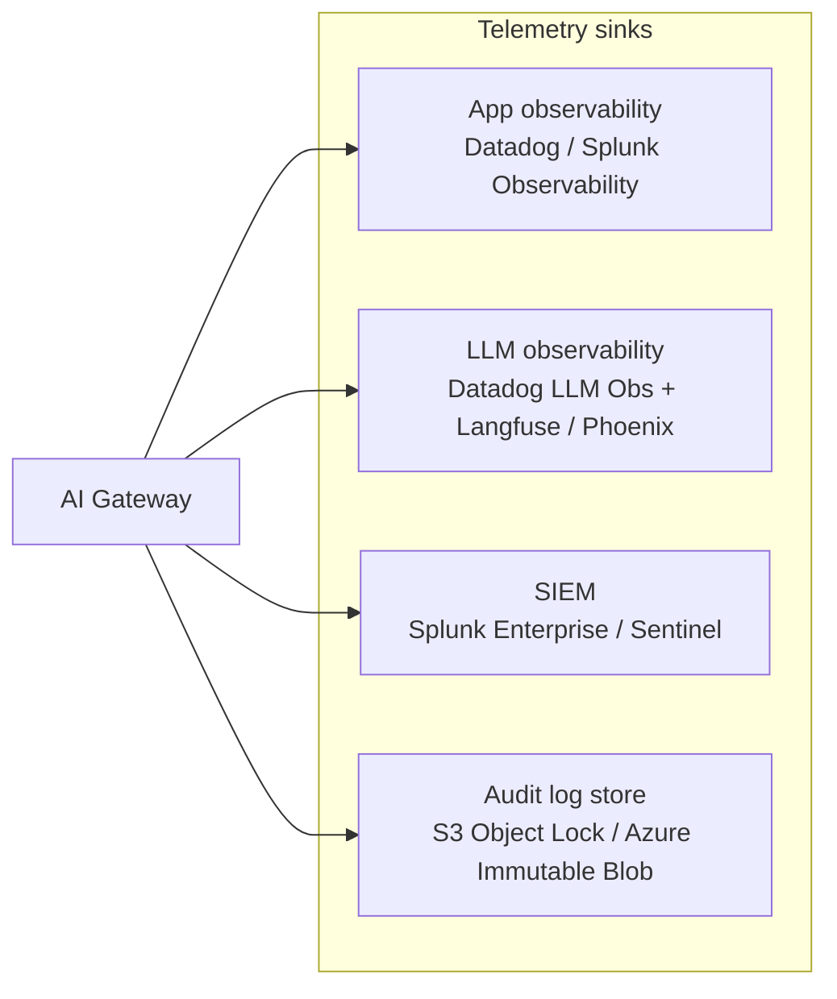

# Phase 9: Observability & Audit Logging

> **In one line:** Enterprise AI observability is four sinks — application telemetry (Datadog/Splunk), LLM-specific traces (Langfuse/Phoenix), security correlation (SIEM), and immutable audit logs — each filled from the gateway and each tuned to a different consumer.

:::tip[In plain English]
At a startup, "observability" is one tool that does logs, metrics, and traces. At an enterprise, the same telemetry has to satisfy four different audiences — engineers debugging in production, AI engineers analyzing prompt quality, security analysts hunting threats, and auditors answering "what did our AI do at 3pm on July 14, 2026?"

No single tool serves all four well, so the gateway emits a structured record that fans out to four sinks, each tuned for its audience. The art is doing this without doubling your bill or making the engineer's debug path go through Splunk.
:::

## The four sinks



### Sink 1: Application observability (Datadog, Splunk Observability)

The "is the system working" view, used by feature-team engineers on call.

- **Metrics:** request rate, error rate, p50/p95/p99 latency, cost per call, per-region breakdown.
- **Logs:** structured request/response (with PII redacted) for debugging.
- **Traces:** distributed traces showing the path from frontend → service → gateway → model → response.
- **Dashboards:** per-feature, auto-generated by the platform.
- **Alerts:** SLO-based, paging the feature team.

Datadog LLM Observability launched as a serious product around 2024 and is the dominant choice in 2026; Splunk Observability + a Langfuse layer is the common alternative.

### Sink 2: LLM-specific observability (Langfuse, Arize Phoenix)

The "is the AI working *well*" view, used by AI engineers analyzing prompt behavior.

- **Per-prompt traces:** every input, every output, every tool call.
- **Eval-on-production:** live samples scored against the eval scorers, drift over time.
- **Cost attribution:** per prompt, per feature, per tenant, per user cohort.
- **Token usage breakdowns:** input vs. output tokens, cache hit rate, by model.
- **User-feedback correlation:** which prompts produce the worst negative-feedback rates.
- **A/B variant overlays:** how does eval score, latency, cost differ between variants.

This is where AI engineers actually live during the day. The platform-team investment in this sink — making it easy to slice/filter/replay — is what determines whether AI engineering is a craft or a guessing game.

### Sink 3: SIEM (Splunk Enterprise, Microsoft Sentinel)

The "is this a security event" view, used by the SOC (Security Operations Center).

- **Correlation:** every model call tagged with workload identity, source IP region, data classification, user pseudonym.
- **Anomalies:** unusual prompt volume from a single workload, off-hours model usage, attempts to call disallowed models.
- **Indicators of compromise:** prompt-injection patterns, data-exfiltration patterns (model output containing patterns matching known secret formats), suspected jailbreaks.
- **Insider risk:** patterns suggesting an employee is using AI to access data they shouldn't.

The SIEM doesn't need full prompt/response bodies for most use cases — it needs the structured metadata. Sending bodies to the SIEM is expensive and usually unnecessary; the body lives in the audit log store and is fetched on demand for incident investigation.

### Sink 4: Audit log store (S3 Object Lock, Azure Immutable Blob)

The "what exactly happened" view, used by auditors, Legal, and incident responders.

- **Every prompt, every response, full content** (with PII redaction policy applied at write time per data classification).
- **Immutable write-once storage** (S3 Object Lock in compliance mode, Azure Immutable Blob).
- **Retention per policy:** HIPAA 6 years; SR 11-7 essentially indefinite; GDPR subject to deletion-on-request (so logs are designed to support targeted deletion of identifiable records).
- **Cryptographic integrity:** typically hashes per record, with the chain anchored in a separate system.
- **Queryable but slow:** Athena / Synapse on top, not real-time.

This is the "show me what our AI told customer 84210 on March 3rd" store. Engineers rarely touch it; Legal, Audit, and Risk live in it.

## The structured gateway record

The single source of truth that fans out to all four sinks:

```json
{
  "trace_id": "01HXR3...",
  "timestamp": "2026-05-23T14:42:18.012Z",
  "feature_id": "policy-search-v1",
  "tenant_id": "tenant-12891",
  "user_pseudonym": "u_8e91fa...",
  "user_locale": "es-MX",
  "user_region": "MX",
  "data_classification": "customer-confidential",
  "risk_tier": "medium",
  "prompt_registry_id": "policy-search-v1@v2.4",
  "eval_suite_id": "policy-search-v1-production@v3",
  "ab_experiment": "summary-card-v3",
  "ab_variant": "treatment",
  "model": "bedrock.anthropic.claude-sonnet-4-5",
  "provider_region": "us-east-1",
  "tokens_in": 1842,
  "tokens_out": 412,
  "cost_usd": 0.01138,
  "latency_ms": 2840,
  "redactions_applied": ["email", "phone"],
  "policy_decisions": [{"policy": "geo_routing", "outcome": "allowed"}],
  "feedback_event": null,
  "response_truncated": false,
  "kill_switch_triggered": false,
  "request_body_audit_ref": "s3://acme-ai-audit/.../01HXR3.json.gz",
  "response_body_audit_ref": "s3://acme-ai-audit/.../01HXR3-resp.json.gz"
}
```

Note the audit refs: the full bodies live in the audit store; the structured record carries pointers. This keeps the metrics/LLM/SIEM sinks cheap while preserving full content for audit.

## Data residency in logs

A subtle but important enterprise concern: **logs themselves are data**, and that data has residency requirements.

- EU users' prompts logged from an EU region must stay in EU log storage.
- Healthcare-classified logs (PHI) must live in HIPAA-eligible storage.
- Federal-customer logs in government scenarios must live in GovCloud regions.

The gateway routes telemetry to region-appropriate sinks. Failing this is a regulatory finding — and "we accidentally shipped EU customer prompts to a US Datadog tenant" is a real incident that has happened at multiple companies.

## SLOs and error budgets for AI

The traditional SLO pattern (latency, availability, error rate) applies — plus AI-specific SLOs:

- **Eval-score SLO** (e.g., "groundedness on live samples >= 0.85").
- **Refusal-correctness SLO** (e.g., "refusal triggered correctly >= 95% on sampled adversarial-like inputs").
- **Cost-per-call SLO** (e.g., "p95 cost per call \&lt;= $0.015").
- **Negative-feedback-rate SLO** (e.g., "thumbs-down rate \&lt;= 4%").

Burn-rate alerts on these AI SLOs are routed to the feature team. Sustained breach pauses feature work in favor of quality work — the [Architecture page](./04-architecture.md) doesn't enforce this; the on-call rotation does.

:::info[Highlight: eval-on-production is the killer AI ops feature]
The single highest-leverage observability investment for enterprise AI is **eval-on-production** — taking a sample of live model calls and scoring them against the same eval scorers used in CI.

This catches the failure mode CI cannot: silent quality degradation from model-version drift, retrieval-index decay, real-world input distributions that the eval set didn't cover, or prompt-version mismatches between code and registry.

Teams that have eval-on-production catch regressions within hours. Teams that don't catch them weeks later via customer complaints.
:::

## What changes vs. startup AI observability

| | Startup | Enterprise |
|---|---|---|
| **Tools** | One observability product | Four sinks for four audiences |
| **Audit storage** | "We have logs in CloudWatch" | Immutable, region-bound, retention-per-policy |
| **Eval in prod** | Eval suite ran pre-launch | Live samples scored continuously |
| **Cost attribution** | Total spend | Per feature, tenant, user cohort, model |
| **Data residency** | "We're in us-east-1" | Per-region routing of telemetry itself |
| **SLO scope** | Latency, errors | + eval drift, refusal correctness, negative feedback, cost |

## Common mistakes

:::caution[Where people commonly trip up]
- **One tool to rule them all.** Trying to make Datadog be your SIEM and your audit store is appealing — it usually fails on cost, retention, or compliance properties. Use four sinks; let each be good at its job.
- **Sending full prompt/response bodies to the SIEM.** Doubles your SIEM bill for no analytic value. Send metadata to SIEM; keep bodies in the audit store; fetch on demand.
- **Forgetting that logs have residency.** EU prompts in a US log tenant is a GDPR finding. Wire region-appropriate telemetry routing at the gateway, not as a clean-up project.
- **No eval-on-production.** CI scores reflect a moment in time; production behavior drifts. Without live eval scoring, your first signal of a quality problem is a Reddit post.
- **Logging PII into telemetry sinks.** Redaction has to be at write time, not "we'll scrub it later." Wire the redactor into the SDK and the gateway; treat any PII in non-audit sinks as a security incident.
- **Untested retention policies.** A "6-year retention" that has never been verified on a 5-year-old record might silently be 90 days because someone changed an S3 lifecycle rule. Quarterly verification.
- **AI SLOs without auto-paging.** A dashboard that shows eval drift but doesn't page on burn-rate alerts is just a poster. Make the AI SLOs first-class with the same paging story as latency SLOs.
:::

## What's next

→ Continue to [Security & Compliance Artifacts](./12-security-compliance.md) — the documents the observability and testing work feeds into.
