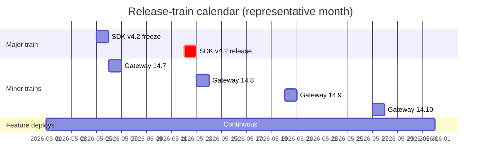

# Phase 11: Release Management

> **In one line:** Release management for enterprise AI is two things — predictable release trains that coordinate dozens of feature teams onto a small set of platform changes, and an emergency patch process for AI-specific vulnerabilities (jailbreaks, model EOLs, regulatory findings) that bypasses the train without breaking the audit story.

:::tip[In plain English]
At a startup, each team ships when they're ready. At an enterprise, that doesn't scale — when a platform-team change requires forty feature teams to update their SDK, "ship when ready" produces twenty different shipped-states for months. Release trains turn coordinated changes into scheduled events: everyone knows that version N of the AI SDK ships on the second Tuesday of the month, and the train arrives whether you're on it or not.

The opposite extreme — *everything* ships through trains — kills the agility AI work needs. The working pattern is: feature teams deploy their own AI features continuously, but cross-cutting platform changes (SDK upgrades, gateway-policy changes, model EOLs) move on coordinated trains.
:::

## When release trains apply

Use a train for:

- **SDK upgrades** that require code changes in many feature services.
- **Gateway policy changes** that change semantics (e.g., new redaction default, new model allowlist).
- **Model EOLs and migrations** (Bedrock deprecates a model; everyone has to move).
- **Eval scorer changes** that re-baseline scores across the company.
- **Major prompt-style-guide changes** that affect many features.

Do *not* use a train for:

- A single feature team shipping a prompt change.
- A bug fix in one feature.
- A new feature in a single product surface.

The line: if the change is cross-cutting and requires many teams to coordinate, train. Otherwise, the team ships independently.

## The release-train cadence

A common pattern at a 500-engineer org:

- **Monthly major train** (2nd Tuesday). SDK versions, gateway-policy major versions, model registry changes.
- **Weekly minor train** (Wednesdays). Gateway-policy minor versions, eval scorer updates, prompt-style-guide additions.
- **Continuous per-feature deploys.** Feature teams ship anytime within standard release windows.

## The train workflow

A typical major-train cycle:

1. **Two weeks out:** platform team posts the change list for the upcoming train (RFC-style). Feature teams scan for impact.
2. **One week out:** release-candidate (RC) of the SDK / gateway policies. Feature teams test against RC in staging.
3. **Three days out:** code freeze on the train contents. Last-minute fixes only.
4. **Train day:** the platform-team release manager ships the train in a coordinated window. CAB approval is at the train, not per-feature.
5. **First 24 hours:** AI Platform on-call watches for regressions. Feature teams pin to the new version.
6. **End of week:** post-train review. What rolled, what was deferred, what broke.

Teams that miss the train wait for the next one. There are no special-case mid-cycle releases for non-emergencies — that's the whole discipline.

## Emergency patches

The exception is the emergency-patch process, used for:

- **Newly disclosed jailbreaks** affecting your feature.
- **Public CVEs in model dependencies** (SDK libraries, gateway middleware).
- **Model-provider EOL announcements** with sub-train-cycle notice.
- **Regulatory findings** that require an immediate change.
- **Active security incidents** (data exfiltration via prompt injection, etc.).

The emergency-patch process:

1. **Trigger declared** by Security, AI Risk, or the platform-team on-call.
2. **War-room formed:** platform on-call + feature team on-call + Security partner + Comms (if customer-facing).
3. **Patch developed** through the emergency pipeline (eval-smoke + adversarial only, single reviewer, release manager + Security sign-off; see [CI/CD page](./09-ci-cd.md)).
4. **Deploy** with compressed canary (direct to 50% if needed, with auto-rollback).
5. **Communication** to customers if customer-impact (Trust portal, status page, direct outreach to enterprise customers).
6. **Post-incident review** within 5 business days, with action items into the regular train backlog.

:::info[Highlight: emergency-patch usage is itself measured]
A signal of platform-team health is the *rate of emergency patches*. If it's running above ~1 per month, something is wrong:

- The train cadence may be too slow (so urgent-but-not-emergency changes get force-fit into the emergency path).
- Pre-release testing may be too shallow (so things that should have been caught at RC become emergencies).
- The threat-modeling cadence may be lagging the actual threat landscape.

Monthly platform-team retros include an "emergency patches this month and why" review. The goal isn't zero — some emergencies are genuine — but the trend matters.
:::

## Model-EOL coordination

A specific recurring class of release work. Providers EOL models on schedules that don't match your roadmap:

- AWS Bedrock deprecates older Claude versions on ~12 month cycles.
- Azure OpenAI deprecates GPT versions on ~12–18 month cycles, often with shorter notice for preview SKUs.
- Self-hosted open models are EOL-ed by you when you choose, but security patches in vLLM / TGI sometimes force the issue.

The standard playbook:

1. **Six months out:** platform team adds the EOL date to the model registry; feature teams see a deprecation warning in CI.
2. **Three months out:** platform team publishes a recommended migration target and an SDK-level helper for the switch.
3. **One month out:** Backstage dashboard shows every feature still using the EOLing model. Directors with non-migrated features get a weekly email.
4. **Two weeks out:** features still on the EOLing model are escalated to VP level.
5. **EOL day:** the registry blocks the old model; remaining features auto-route to the migration target (with a notification).

The "auto-route to the migration target" step is what saves the company when a team genuinely misses the deadline. It's the platform's safety net.

## Worked example: rolling out a new PII redaction policy

The Privacy team mandates a new PII pattern (driver's license numbers in NA + EU formats) be redacted from all AI prompts. The change is to the gateway's redaction module; it affects every AI feature.

1. **Week -3:** Privacy + AI Platform + Risk agree on the policy. Platform team writes the pattern, tests against the standard adversarial suite, and publishes the spec.
2. **Week -2:** RC of the gateway policy is in staging. Feature teams whose prompts might genuinely contain DL numbers (HR, claims) are flagged for additional eval impact testing.
3. **Week -1:** post-staging eval results are clean. CAB approval at the upcoming weekly train.
4. **Train day:** gateway policy 14.8 ships in the weekly minor train. Audit logs reflect the new redaction within minutes.
5. **Day +1:** platform on-call confirms no spike in eval-score drift or feature-team incidents.
6. **Day +14:** post-deploy review with Privacy + Risk; the artifact (eval results, audit log sample, deploy record) goes into the GDPR/HIPAA evidence pack.

This is a representative cross-cutting release: small change, big coordination surface, handled by the train cadence rather than as individual feature-team work.

## What changes vs. a startup AI release process

| | Startup | Enterprise |
|---|---|---|
| **Coordination** | Implicit | Explicit release trains for cross-cutting changes |
| **Feature deploys** | Continuous | Continuous (within release windows) |
| **Cross-cutting changes** | Whoever ships first wins | Train cadence with named release manager |
| **Model EOL handling** | Hope you notice | Six-month playbook with VP escalation |
| **Emergency patches** | Same as a normal deploy | Compressed pipeline, war-room, measured rate |

## Common mistakes

:::caution[Where people commonly trip up]
- **Running everything through trains.** Forces feature teams to wait weeks for changes that have no cross-team impact. Trains are for cross-cutting; per-feature stays continuous.
- **Running nothing through trains.** When SDK v4.2 ships whenever the platform team feels ready, forty feature teams are surprised, and the migration becomes a six-month tail. Coordinate the cross-cutting.
- **Letting the emergency path become the routine path.** "We'll just emergency-patch it" three times a week means your standard pipeline is too slow. Fix the standard pipeline; preserve the emergency path for actual emergencies.
- **No VP-level escalation on model EOL.** Feature teams will defer migrations until they hurt. By the time the model is actually disabled, the team that didn't migrate is sympathetic — but the customers seeing a fallback aren't. Escalate early.
- **Skipping the post-train review.** The train is a learning loop or it isn't. If you don't review what broke and what was deferred, the next train repeats the same mistakes.
- **Treating CAB as a per-train rubber stamp.** The CAB's review of a train should focus on the *cross-team risk* (is this a bad time across the company? are too many high-impact changes bundled? is the rollback plan coherent?), not the per-change merits.
- **No Comms partnership for customer-impact emergencies.** When the patch goes out and a customer's AI feature briefly behaves differently, customer support needs the talking points before the calls come in. Bake Comms into the emergency war-room from the start.
:::

## What's next

→ Continue to [A Realistic AI Cost Picture](./14-cost-picture.md) — what all of this actually costs.
