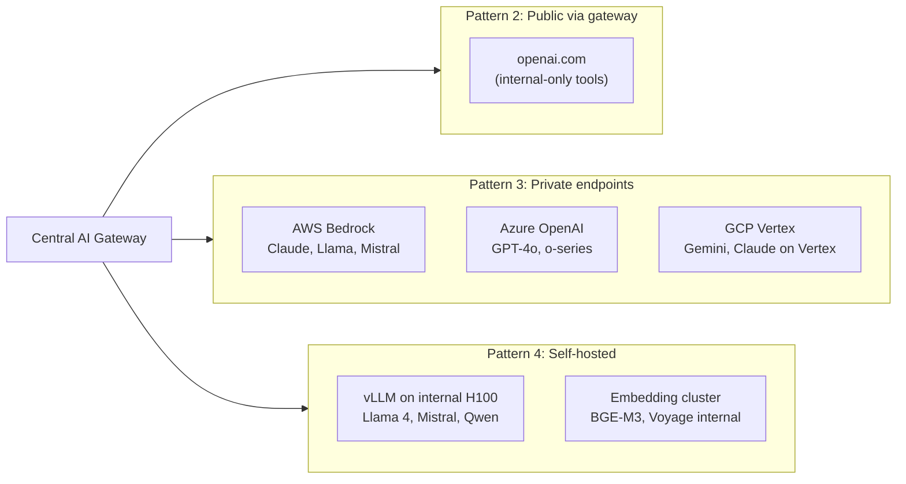

# Deployment Topology (Deep Dive)

> **In one line:** Enterprise AI runs on four deployment patterns simultaneously — public direct (rare), public via gateway (common for internal), private endpoint via hyperscaler (the default for customer-facing), and self-hosted on internal GPUs (the most sensitive workloads) — and the gateway is what makes the hybrid coherent.

:::tip[Where this fits]
The [Architecture page](./04-architecture.md) covered the central gateway + policy + telemetry pattern. This page is the deeper look at the model-provider layer: which deployment pattern fits which workload, what the trade-offs really look like, and how a typical enterprise ends up with a hybrid of all four patterns behind a single gateway.
:::

## The four patterns

### Pattern 1: Public API direct

Calls go directly from a service to OpenAI, Anthropic, or another provider's public endpoint. No gateway, no private peering.

**When used:** rarely at enterprise. Mostly for non-sensitive internal tools where the friction of going through the gateway exceeds the value.

**Risks:** no central audit trail, no policy enforcement, no spend control, no observability normalization. Almost always a sign that someone routed around the gateway.

**Realistic place at enterprise:** maybe a tiny internal hackathon tool. If a production feature is doing this, it's a finding.

### Pattern 2: Public API via gateway

Same public providers, but every call routes through the corporate AI gateway (Portkey Enterprise, Kong AI Gateway, or in-house).

**When used:** internal AI tooling (engineering productivity, internal-search, ops dashboards) where the data isn't customer-sensitive but you still want central control.

**Pros:** centralized observability, policy enforcement, spend control, vendor failover. Fast to set up (no private peering required).

**Cons:** data leaves the corporate network to the provider's public endpoint. May not satisfy data residency for regulated workloads.

**Common: yes.** This is often the on-ramp pattern for new AI work before regulated workloads require private endpoints.

### Pattern 3: Private endpoint via cloud (the enterprise default)

AWS Bedrock, Azure OpenAI, GCP Vertex. Same model providers' models, but accessed inside your VPC; data doesn't traverse the public internet.

**When used:** the default for customer-facing AI at enterprise scale. Required for most regulated workloads.

**Pros:**
- Data stays in your VPC and the provider's contractually-bound private region.
- BAA, DPA, and residency commitments are in place via the hyperscaler.
- Existing enterprise procurement / billing relationship (often a multi-year commit already).
- Often inherits FedRAMP, HIPAA, SOC 2 from the hyperscaler.

**Cons:**
- Region availability lags the public API (newest model in us-east-1 only, EU regions weeks/months later).
- Sometimes feature gaps vs. public API (e.g., a brand-new tool-use mode appears on the public API first).
- Quota / capacity management adds operational overhead.

**Common: yes — the most common enterprise choice in 2026.**

### Pattern 4: Self-hosted open models

vLLM or TGI on internal GPUs (H100, MI300, Blackwell), running Llama, Mistral, Qwen, Phi, or other open-weight models.

**When used:**
- The most sensitive workloads (defense, intelligence, certain healthcare research).
- Very-high-volume narrow tasks where the unit economics favor self-host (e.g., a billion classification calls per day where a 7B model is enough).
- Data-sovereignty requirements that even contractual hyperscaler residency can't satisfy.

**Pros:**
- Total data control; no third-party at all.
- Predictable performance (no provider rate limits or capacity throttles).
- Potentially better unit economics at very high volume on narrow tasks.

**Cons:**
- Operational burden. A serious self-host needs ~2 FTE to operate.
- Capex tie-up.
- Model-quality gap. Open models in 2026 are very good but still trail frontier closed models on many tasks.
- Redundancy multiplier. Peak load is much higher than average.
- Slower migration to new model generations.

**Common: a small but growing footprint** alongside Pattern 3. Almost no enterprise is pure self-host; a hybrid is the norm.

## The hybrid in practice

A representative deployment topology at a mid-size enterprise:

Every call goes through the gateway. The gateway routes based on the feature's policy: this feature is approved for Bedrock Claude in us-east-1 and eu-west-1; this internal tool can call OpenAI directly; this high-volume classifier goes to the self-hosted Mistral cluster.

## What drives the choice (per workload)

A practical decision tree:

1. **Is the data PHI, PCI, classified, or otherwise regulated?**
   - Yes → Private endpoint or self-hosted (Patterns 3 or 4). Never Pattern 2.
2. **Is the model quality gap acceptable for open models on this task?**
   - Yes (narrow task, well-evaluated) → self-host may make economic sense (Pattern 4).
   - No → private endpoint (Pattern 3).
3. **Is the volume very high (billions of calls/year) and the task narrow?**
   - Yes → self-host is worth modeling (Pattern 4).
   - No → private endpoint (Pattern 3).
4. **Is data sovereignty an absolute (no third-party allowed)?**
   - Yes → self-host only (Pattern 4).
5. **Is this an internal-only, non-sensitive tool?**
   - Yes → public-via-gateway is fine (Pattern 2).

## Region and residency

For Pattern 3, region selection matters:

- **EU customer data** must land on EU endpoints. AWS Bedrock in eu-west-1 / eu-central-1; Azure OpenAI in Sweden / Switzerland / France regions; Vertex in europe-west4 / europe-west9.
- **US federal customer data** must use GovCloud / Azure Government regions, which lag commercial regions by months.
- **Cross-region routing in the gateway** handles this transparently per the feature's policy (see the YAML example on the [Architecture page](./04-architecture.md)).

A common mistake: a feature is launched in us-east-1 with no EU regional plan, then a year later EU customers are added and the team discovers the model isn't available in EU-Bedrock yet or requires re-evaluation. Plan regions at the feature's intake, not at launch.

## Procurement timeline implications

The four patterns have very different procurement timelines (see the [Procurement page](./procurement.md)):

- **Pattern 1 (public direct):** weeks (if at all approved; usually only for tiny tools).
- **Pattern 2 (public via gateway):** weeks-to-months. The gateway is already in place; adding a public provider is mostly Security + Privacy review of the provider.
- **Pattern 3 (private endpoint):** the hyperscaler relationship is usually already in place. Adding a new model from the same hyperscaler is typically the fastest path (sometimes days). Adding a new hyperscaler is months.
- **Pattern 4 (self-hosted):** depends. A new self-hosted model on existing GPU infrastructure is often fast. New GPU capex is months to a year (capex approval, hardware procurement, datacenter capacity).

:::info[Highlight: the gateway is what makes hybrid manageable]
Without a central gateway, hybrid deployment becomes a maintenance nightmare — each feature team writes its own provider switching, its own auth, its own observability, its own failover. With three patterns × many features, that's hundreds of independent re-implementations.

With the gateway, "switch this feature from Bedrock to self-hosted Llama for cost" is a policy YAML change reviewed in a PR. That's the single biggest architectural reason every mature enterprise eventually has a central gateway — it makes the four-pattern hybrid economically and operationally viable.
:::

## When self-hosting is the wrong answer

The recurring case: an engineer sees the Bedrock bill, runs the obvious math (open model is "free"), and proposes self-hosting. See the [Cost Picture page](./14-cost-picture.md) for the honest math.

Short version: self-host saves money only at very high volume on narrow tasks, or when control/sovereignty requirements demand it. "Open weights are free" doesn't include the FTE, the redundancy multiplier, the model-quality gap, or the capex. Most self-host proposals fail when the real costs are added up.

## What changes vs. startup AI deployment

| | Startup | Enterprise |
|---|---|---|
| **Default pattern** | Pattern 1 (direct) | Pattern 3 (private endpoint) |
| **Patterns in use** | Usually 1 | Usually 3 simultaneously |
| **Region handling** | "us-east-1, ship it" | Per-feature region routing for residency |
| **Provider switching** | Code change | Policy YAML change in PR |
| **Self-host evaluation** | Rare | Real option for specific workloads |
| **Gateway** | Usually none | Universally present |

## Common mistakes

:::caution[Where people commonly trip up]
- **Picking a deployment pattern at launch instead of at intake.** EU regional needs, residency requirements, and self-host candidacy should be settled at feature intake. Discovering them at launch causes weeks of rework.
- **Treating Pattern 1 (public direct) as a starter that you'll "fix later."** "Later" never comes. The auditor finds it in a year. Use the gateway from day one even for internal tools — Pattern 2, not Pattern 1.
- **Self-hosting "because Bedrock is expensive."** The cost-math is almost always more complicated than the spreadsheet suggests. Build the honest TCO model (FTE + redundancy + quality gap + capex) before committing.
- **Launching in one region without an EU plan.** Adding EU customers later means re-evaluating in EU regions, which may not have the model you launched with. Plan regions at intake.
- **Skipping the gateway "for performance."** Gateway overhead is single-digit milliseconds. The arguments are almost always wrong; the audit cost of having bypasses is enormous.
- **Forgetting that Pattern 3 EOLs faster than Pattern 4.** Hyperscaler model EOLs hit on the provider's schedule. Self-hosted models EOL on yours. For workloads where stability matters more than freshness, self-host is sometimes the operational win even if the cost is similar.
:::

## What's next

→ Next: [Procurement & vendor management](./procurement.md) — what it actually takes to get a new AI vendor approved.
