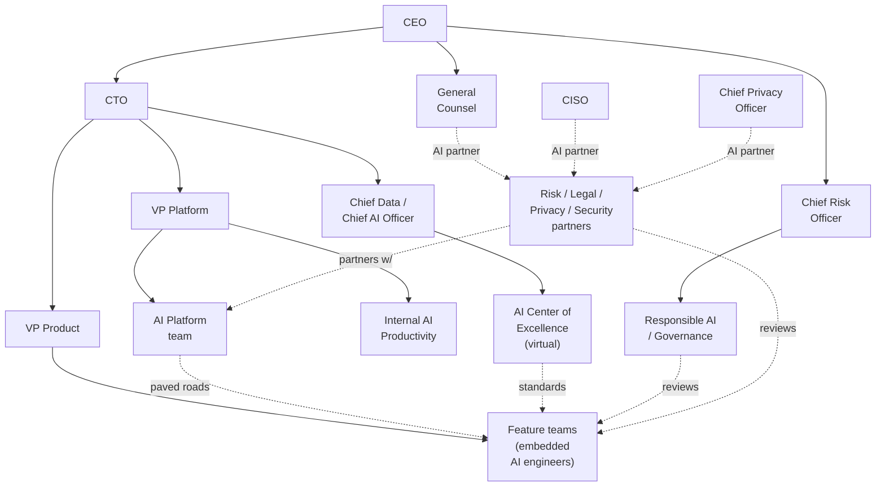

# The Enterprise AI Org Chart (Deep Dive)

> **In one line:** Working enterprise AI orgs split into five functions — Platform, Feature teams, CoE, Responsible AI, and named Risk/Legal/Privacy partners — each with a distinct charter, reporting line, and OKR shape; mixing any two of them under one leader usually breaks both.

:::tip[In plain English]
This page is about who does what when a big company does AI. One team builds the shared tools, many teams use those tools to ship features, a small council writes the standards, a watchdog group keeps the risky work in check, and a few named people from Legal, Privacy, and Security join reviews when needed. The key insight: each group has a different boss and a different scorecard, and that separation is deliberate. Put two of them under the same boss and one of them usually stops doing its job well.
:::

:::tip[Where this fits]
The [Team Structure page](./02-team-structure.md) introduced the five functions and a staffing model. This page is the deeper read: what each function's charter actually says, what reports where, what the typical failure mode for each function looks like, and how the functions coordinate during normal work and during incidents.

If you're standing up an AI org from scratch, this is the page to read alongside Team Structure. If you've inherited an AI org that isn't working, this is the page that tells you what's probably mis-wired.
:::

## The five functions and their charters

### AI Platform team

**Charter:** Build and operate the paved roads — gateway, SDK, prompt registry, eval platform, RAG infrastructure, fine-tuning platform, model registry, LLM observability — that all AI features use.

**Reports to:** typically a Director or VP of AI Platform within the CTO org. In some companies, under a VP of Platform Engineering alongside other internal platforms (DevEx, Data Platform).

**OKR shape:** paved-road adoption percentage, time-to-first-eval on new features, gateway availability, eval-on-production coverage. Explicitly *not* feature-shipping.

**Antipattern:** when judged by features shipped rather than adoption, the team builds new abstractions instead of removing friction from existing ones.

### Feature teams (consuming)

**Charter:** Ship AI features in their product domain (claims, support, search, underwriting, etc.) on top of the paved roads.

**Reports to:** their product VP — not the AI organization. The AI engineer embedded in a feature team has a solid line to the product team and a dotted line (community of practice, technical norms) to the AI Platform / CoE.

**OKR shape:** product / business metrics + risk-tier compliance + paved-road adoption.

**Antipattern:** picking their own stack ("we need a different vector DB because our case is special"); the platform team has to spend a quarter pulling the team back.

### AI Center of Excellence (CoE)

**Charter:** Set AI engineering standards, run the eval clinic, own the model card template and risk-tier rubric, partner with Risk on policy.

**Reports to:** typically the VP of AI (or Chief AI Officer where one exists). A virtual function — members are drawn from the platform team, senior feature-team engineers, and the AI Risk function.

**OKR shape:** standards adoption, eval clinic engagement, model-card freshness, prompt-style-guide updates.

**Antipattern:** CoE without authority. A "guidance only" team becomes an internal blog; its standards get ignored. The working pattern is CoE with a real sign-off role (e.g., CoE chair signs Medium-tier promotions).

### Responsible AI / AI Governance

**Charter:** Own the AI risk register, the EU AI Act readiness program, the AI risk review committee, regulator engagement, and the public AI principles. The function that defines what "high-tier" means at this company.

**Reports to:** at most enterprises this is under the Chief Risk Officer or General Counsel; at some it's a peer of the CTO under a Chief AI Officer. In banks, often part of Model Risk Management (MRM).

**OKR shape:** risk-register completeness, High-tier review cycle time, regulatory-finding closure, audit-readiness scores.

**Antipattern:** Responsible AI under the same VP as the AI Platform team. The two functions have legitimately opposing incentives (ship vs. review); concentrating them produces either over-shipping or over-blocking.

### Risk, Legal, Privacy, Security partners

**Charter:** Not a separate function — these are *named partners* from existing Risk, Legal, Privacy, and Security teams who become the AI specialists in their function.

**Reports to:** their existing function (Legal, CISO, CPO).

**OKR shape:** part of their existing role; the AI partnering is structured time, not their full job.

**Antipattern:** a fresh privacy lawyer every review, a different Security partner every threat-model. Continuity matters; the named-partner pattern is the fix.

## Internal AI Productivity (the often-forgotten team)

In addition to the five above, most enterprises now also have an **Internal AI Productivity** function (4–10 engineers, often inside DevEx or IT). They roll out AI *to the company's own employees*:

- Cursor / GitHub Copilot Enterprise / Claude Code to thousands of engineers.
- Internal AI chat assistants on Slack/Teams.
- AI tooling for non-engineering functions (legal copilots, sales-call summarization).

This is distinct from the AI Platform team — they're a customer of it, not it. Mixing the two starves both; treat them as separate functions even when they're small.

## Reporting lines (the picture)

The dotted lines matter as much as the solid ones. The CoE doesn't *manage* feature teams, but it sets the standards they ship against. The Risk partners don't *report to* the AI org, but they're the ones in the review meetings.

## How the functions coordinate

### Normal work (per AI feature)

1. Feature team forms with an embedded AI engineer.
2. CoE-published intake form fills out risk tier.
3. Platform team's CLI scaffolds the feature; opens the AI Risk Review ticket.
4. Feature ships through CI gates the Platform team owns.
5. For Medium/High tier, Responsible AI partner reviews; for High-tier, the AI Risk Review Committee approves.
6. Release manager triggers production deploy; observability is auto-wired.

Each function has a defined touch point. No function is in the critical path for every step.

### Incidents

When an AI feature has an incident (eval drift, jailbreak in the wild, regulatory complaint), the standard response includes:

- Feature team on-call (operational).
- Platform team on-call (gateway / SDK / observability).
- Responsible AI partner (if customer-impact or regulatory).
- Security partner (if security-incident).
- Comms partner (if customer-visible).

The named-partner pattern pays off here: the people in the war room have prior context, not just titles.

## What "AI engineer" means in this org

Job titles vary; the work breaks down into a few archetypes:

- **AI Platform Engineer** — works on the SDK, gateway, eval platform. Comfortable with low-level systems, Rust/Go/Python, infrastructure.
- **Embedded AI Engineer / Applied AI Engineer** — sits in a feature team; ships AI features. Comfortable with evals, prompts, RAG, the gateway.
- **AI Solutions Architect** — pre-sales-adjacent or partners-with-customers; not always present.
- **MLE / ML Platform Engineer** — historically distinct from "AI engineer" (classical ML, deep learning, MLOps); increasingly the boundary blurs.
- **AI Research Engineer** — at orgs that do training or significant fine-tuning. Rare at most enterprises; common at AI-native companies.

The healthy pattern at a 500-engineer enterprise is mostly Platform Engineers + Embedded Engineers, with a small MLE team for classical workloads.

## What goes wrong (recurring failure modes)

- **Feature teams each pick their own stack.** Six vector DBs, eight eval tools. The Platform team eventually consolidates; painful.
- **CoE without authority.** "Guidance" team becomes a newsletter; standards get ignored.
- **Responsible AI under the AI Platform VP.** Conflicting incentives produce either over-shipping or over-blocking.
- **No named Privacy/Security partners.** A different reviewer every time means no continuity; each review starts from scratch.
- **Internal AI Productivity bolted onto the Platform team.** Both starve. They're separate concerns.
- **Platform team OKRs about features shipped, not adoption.** The team optimizes for shipping abstractions nobody uses.

## What a healthy weekly cadence looks like

- **Mon:** Platform team standup; feature-team standups; CoE virtual-team sync.
- **Tue:** AI Risk Review Committee (weekly, 90 min) — Medium and High tier promotions reviewed.
- **Wed:** Eval clinic office hours (open to any feature team).
- **Thu:** Cross-functional standing with named Risk/Privacy/Security partners.
- **Fri:** Platform team retro; CoE office hours.

Plus monthly: AI engineering all-hands; quarterly: AI risk review (portfolio level); annually: portfolio planning.

## Common mistakes

:::caution[Where people commonly trip up]
- **Concentrating Platform + Responsible AI under one leader.** Two functions with opposing incentives need separate leadership. Concentrating them produces either over-shipping or over-blocking; both are bad.
- **Treating the CoE as a thought-leadership function.** A CoE that only writes blogs and runs talks isn't a function — it's a publication. Real CoEs have sign-off roles and named owners of standards.
- **Letting the AI Platform team be judged on feature shipping.** When platform OKRs match feature-team OKRs, the platform builds for itself. Adoption-percentage OKRs are the fix.
- **Skipping named Risk/Privacy/Security partners.** Without continuity, every review is a fresh start, and feature teams spend weeks re-educating reviewers. Named partners pay for themselves within a quarter.
- **Forgetting Internal AI Productivity exists.** Cursor + Copilot Enterprise + Claude Code rollouts are their own program. Bolting them onto the Platform team starves both functions.
- **Embedded AI engineers reporting into the AI org rather than the product team.** They lose product context; the product team loses ownership. Solid line to product, dotted line to the AI community of practice.
:::

<Quiz id="enterprise-org-chart-quick-check" variant="micro" title="Quick check">

<Question
  prompt="Why should Responsible AI not report to the same VP as the AI Platform team?"
  options={[
    { text: "Their incentives oppose — ship versus review — and one leader will systematically favor one side" },
    { text: "Compliance regulations forbid shared reporting lines" },
    { text: "The platform team is too large to share a leader" },
    { text: "Responsible AI must report directly to the CEO" }
  ]}
  correct={0}
  explanation="The platform team wants adoption and shipping; the governance function wants careful review. Concentrating both under one leader produces either over-shipping or over-blocking. The regulation answer is the tempting one because so much in this chapter is compliance-driven — but this is an incentive-design argument, not a legal requirement."
/>

<Question
  prompt="Where should an embedded AI engineer in a feature team report?"
  options={[
    { text: "Solid line to the AI Platform team, dotted line to the product team" },
    { text: "Directly to the Responsible AI function" },
    { text: "Solid line to the product team, dotted line to the AI community of practice" },
    { text: "To the Center of Excellence chair" }
  ]}
  correct={2}
  explanation="Embedded engineers belong to their product team — that is where product context and ownership live — with a dotted-line connection to the AI org for norms and community. Reversing it (solid line to the AI org) makes them lose product context while the product team loses ownership, which the page lists as a common mistake."
/>

<Question
  prompt="What is the relationship between the Internal AI Productivity team and the AI Platform team?"
  options={[
    { text: "They are the same team under two names" },
    { text: "Internal AI Productivity is a customer of the platform, and should stay a separate function" },
    { text: "Internal AI Productivity manages the platform team's budget" },
    { text: "The platform team reports to Internal AI Productivity" }
  ]}
  correct={1}
  explanation="Internal AI Productivity rolls out AI tools (Cursor, Copilot Enterprise, internal assistants) to the company's own employees — it consumes the platform rather than building it. Merging them is the tempting efficiency move, but the page says mixing the two starves one or the other, even when both are small."
/>

</Quiz>

## What's next

→ Next: [Governance & risk](./governance.md) — the artifacts and processes the Responsible AI function actually produces.
