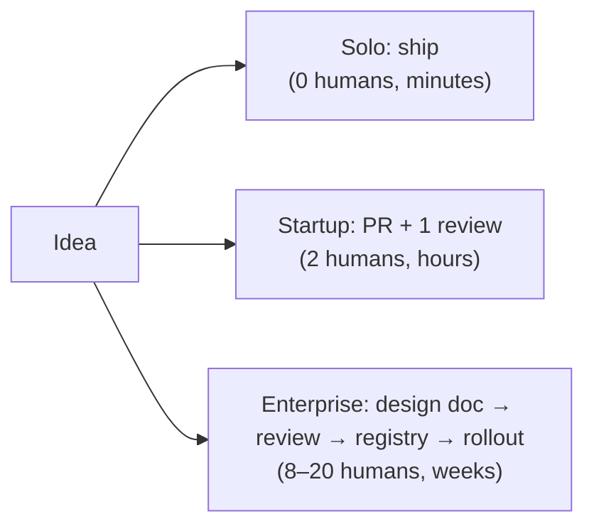

# Team and Process

> **In one line:** A solo dev is the entire AI org; a startup has 1–10 AI engineers and a Slack channel; an enterprise has a platform team, feature teams, an AI Center of Excellence, and a written approval path for every model and prompt.

:::tip[In plain English]
The cleanest predictor of how fast a change ships isn't the model, the framework, or the cloud — it's **how many humans have to nod before it goes live**.

Solo: zero (you nod at yourself). Startup: one reviewer, maybe a PM glancing at the prompt diff. Enterprise: a code reviewer, a tech lead, an AI safety partner, a security partner, sometimes legal, sometimes a model risk committee. Every nod is also a wait.

The trick is matching the number of nods to the actual blast radius of being wrong.
:::

## Team shape

| Role | Solo | Startup AI Team | Enterprise AI |
|----|----|----|----|
| **AI engineers** | 1 (you) | 1–10 | 50–500+ across feature teams |
| **Platform / infra** | 0 | 0–1 part-time | 10–30 on a dedicated AI platform team |
| **MLOps / LLMOps** | 0 | 0–1 | Dedicated function, 5–20 people |
| **Prompt engineers / AI PMs** | 0 | 0–2 hybrid roles | Specialized, dozens |
| **AI safety / red team** | 0 | 0 | Dedicated function |
| **Legal / privacy partner** | 0 | Shared with rest of company | Embedded per business unit |
| **Model risk / governance** | 0 | 0 | A committee (often required by regulators) |
| **AI Center of Excellence (CoE)** | N/A | N/A | Yes — sets standards, vets vendors, runs internal LLM days |

The biggest cultural break is again between **startup** and **enterprise**. A startup AI team is generalists who ship end-to-end: the same person writes the prompt, builds the retrieval, wires the eval, and watches the dashboard. An enterprise splits those into specialized teams that have to coordinate via tickets.

For each column in depth, see [Chapter 9: Solo](/docs/solo), [Chapter 10: Startup](/docs/startup), and [Chapter 11: Enterprise](/docs/enterprise).

## Decision style

| Decision | Solo | Startup | Enterprise |
|----|----|----|----|
| **Pick a model** | Whim, vibes-test on 5 prompts | Eval suite + cost spreadsheet | Bake-off + bias evals + vendor security review + procurement (3–9 months) |
| **Tweak a prompt** | Edit + push | PR, one reviewer, evals in CI | PR + prompt registry update + peer review + (high-risk tier) AI safety review |
| **Add a tool to an agent** | Just add it | PR + eval that exercises it | Threat model + permission scoping review + audit log plumbing |
| **Move from RAG to fine-tune** | Saturday experiment | Sprint with stakeholder buy-in | Cross-team RFC, data governance review, training-data lineage doc |
| **Change embedding model** | Re-embed Saturday night | Migration plan + dual-index for a week + cohort cutover | Quarter-long program, vendor re-vetting, compliance impact assessment |
| **Add a new provider** | Sign up with credit card | Add a row to the gateway config | Vendor onboarding committee + security review + DPIA + contract negotiation |

:::info[Highlight: the prompt registry is the dividing line]
The single artifact that most clearly separates **startup** from **enterprise** AI work is the **prompt registry** — a versioned, reviewed, audited store of every prompt running in production.

At solo and startup scale, prompts live in code; the git log *is* the registry. At enterprise scale, prompts have to be discoverable across teams, attributable to an owner, auditable for compliance, and changeable without a code deploy. That's a whole platform, often built in-house, sometimes 5+ engineers' full-time job.

If you're at startup scale and someone proposes building a prompt registry "to be ready," ask which specific upcoming customer or regulator requires it. Usually the answer is none, and you've just lit three months on fire.
:::

## Time-from-idea-to-live, by change type

| Change | Solo | Startup | Enterprise |
|----|----|----|----|
| **Typo in a prompt** | 90 seconds | 30 minutes | 1–2 days (or 1–6 weeks for High-risk tier) |
| **New tool for an agent** | 30 minutes | 1–3 days | 4–8 weeks |
| **New AI feature** | Hours to days | 2 weeks | 1–3 months |
| **Replace primary model** | An evening | 1–2 weeks (gateway + evals + cohort rollout) | 1–2 quarters (re-vet vendor, re-run evals, change management) |
| **Adopt a new provider** | Same day | A week | 3–9 months |

:::note[Worked example: same prompt tweak, three orgs]
A user reports the chatbot misses a follow-up question 1 in 5 times. Engineer wants to add one sentence to the system prompt.

- **Solo:** opens `system_prompt.md`, adds the sentence, runs Promptfoo locally, ships. **Total: 5 minutes.** 1 human (themselves) involved.
- **Startup:** opens PR with the diff, eval suite runs in CI on the standard 200-case set, one teammate reviews, merge auto-deploys behind a feature flag, gradual rollout over 24 hours, watches Langfuse dashboard. **Total: a day, ~30 active minutes.** 2 humans involved.
- **Enterprise:** opens PR, prompt registry entry updated, tech lead reviews, AI safety partner checks change is Low risk (it is), evals run on 5,000-case battery + bias suite, change goes into the next deploy window, canary at 1% for 6 hours, then 10%, then 100% over a week, change advisory board sees the entry on their weekly digest. **Total: 1–2 weeks.** 8+ humans involved.

The actual *thinking* — "add this sentence" — took the same 5 minutes everywhere. Everything else is risk-absorption process, priced against the cost of being wrong.
:::

## What stays the same / what changes

**Stays the same:** every column has prompts in version control. Every column runs *some* eval before shipping. Every column has someone who can press a kill switch.

**Changes:** the *number of nods* between idea and live, the *formality* of the eval bar, the *blast radius* a kill switch protects against. At solo scale a kill switch protects you from your own bill; at enterprise scale it protects against an SEC filing.

## Stakeholders per change

A useful proxy for "which column am I in?" is **how many distinct humans get involved in a typical AI change**.

| Change | Solo | Startup | Enterprise |
|----|----|----|----|
| **Prompt tweak** | 1 | 2 (author + reviewer) | 4–8 (author + reviewer + tech lead + AI safety + sometimes legal) |
| **New AI feature** | 1 | 4–6 (PM + AI engineer + reviewer + designer + CS lead) | 10–20 (above + AI safety partner + security partner + privacy + product council + pilot customers) |
| **New provider onboarding** | 1 | 2–3 | 15+ across procurement, legal, security, AI CoE, platform team |
| **Production incident** | 1 | 3–5 (on-call + AI eng + PM + CS) | 10–30 across incident command, comms, legal, executive, sometimes regulators |

The stakeholder count is the cleanest single predictor of calendar time. Each additional stakeholder is roughly a +1 day of wait time at startup scale and +1 week at enterprise scale, even when everyone moves fast.

## Common mistakes

- **Importing enterprise governance into a 3-person AI team.** A prompt registry, AI safety partner, and risk-tier review for a 3-engineer team isn't "raising the bar" — it's a tax that hands the market to the competitor still on git + Promptfoo.
- **Believing "we have evals" means "we have process."** A test suite is a check; a process is *who runs it, when, and what blocks if it fails*. The startup that runs evals locally but skips them in CI on Fridays is solo with extra steps.
- **Romanticizing the platform team.** From the outside, an enterprise AI platform team looks like leverage. From the inside it's a permanent ticket queue. Don't build one until feature teams are actively blocked on shared infra they can't build themselves.
- **Confusing AI CoE with AI velocity.** A Center of Excellence is a *coordination* function for an org with dozens of independent AI efforts. At one or two efforts, calling a Slack thread a CoE doesn't speed anything up — it just adds meetings.
- **Hiring a head of AI before the second AI engineer.** A "head of AI" with no team is a job title looking for a problem; for the first one or two AI engineers, the right manager is whoever is already managing the relevant product team. Add the dedicated leadership role when the coordination cost across multiple AI engineers actually exceeds one engineering manager's attention.

---

→ Next: [Stack comparison](./stack.md).
