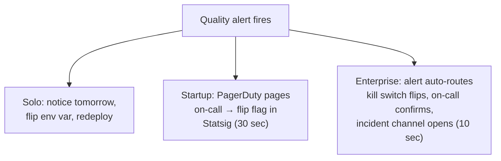

# Ops — observability, on-call, and kill switches

> **In one line:** A solo dev *is* the on-call and *is* the kill switch (it's a feature flag); a startup runs PagerDuty + Langfuse + a single big red `disable_ai` flag; an enterprise runs follow-the-sun on-call, an LLM-aware SIEM, severity-tiered runbooks, and per-feature kill switches wired into the gateway.

:::tip[In plain English]
AI ops is regular ops *plus* three new failure modes: the model gets dumber on a Tuesday (drift), the bill suddenly 10x's (a runaway agent loop), and the model says something that ends up screenshotted on Twitter (a quality/safety regression).

Solo handles all three with "I check the dashboard sometimes." Startup wires alerts for each one. Enterprise has a dedicated person watching each one in shifts. The list of failure modes is identical at every scale — only the *response time and accountability* differ.
:::

## Observability stack

| Aspect | Solo | Startup | Enterprise |
|----|----|----|----|
| **LLM call traces** | Langfuse free tier | Langfuse Pro / Helicone / Arize | Datadog LLM + Langfuse + corporate SIEM |
| **Cost dashboard** | Provider dashboard | Per-tenant cost dashboard | FinOps tooling + per-team chargeback |
| **Eval results in prod** | None (eval is pre-merge) | Nightly drift eval, alert on regression | Continuous shadow evals on live traffic |
| **Latency monitoring** | Vercel built-in | Datadog / Better Stack | Datadog APM + custom SLO dashboards |
| **Prompt + completion logging** | Langfuse (no PII filter) | Langfuse with PII redaction | Gateway-level redaction → SIEM with retention policy |
| **User feedback signal** | Thumbs in the UI | Thumbs + structured outcome tracking | Thumbs + outcome + human-rater audit pipeline |
| **Synthetic monitoring** | None | Daily canary prompts | Multi-region synthetic prompts every minute |

## On-call

| Aspect | Solo | Startup | Enterprise |
|----|----|----|----|
| **Who's paged** | Your phone, sometimes | Engineer rotation (Slack + PagerDuty) | Follow-the-sun rotation across regions |
| **Coverage** | Best effort | Business hours + a "best-effort" overnight | 24/7 with documented SLA |
| **Runbook quality** | "I'll remember" | A Notion page per known failure | Severity-tiered runbooks per service, drilled quarterly |
| **First responder skill** | You | Generalist on-call engineer | L1 ops → escalate to L2 AI engineer → L3 platform |
| **Time-to-acknowledge target** | None | 15 minutes business hours | 5 minutes SEV1, 15 minutes SEV2 |
| **Post-mortem** | None | For anything user-visible | Formal blameless for SEV1/SEV2 with action-item tracking |

## Kill-switch process

The most distinctly *AI* piece of ops. Models misbehave in ways traditional services don't, and you need a way to turn the feature off without rolling back code.

| Aspect | Solo | Startup | Enterprise |
|----|----|----|----|
| **Granularity** | Boolean: AI on/off | Per-feature flag | Per-feature × per-tenant × per-model |
| **Mechanism** | Env var flip + redeploy | Feature flag in Statsig/PostHog (instant) | Gateway-level routing rule (instant, audited) |
| **Who can flip it** | You | On-call engineer | On-call engineer + auto-flip on SLO breach |
| **Time to disable in prod** | 60 seconds + redeploy | < 30 seconds, no deploy | < 10 seconds, fully audited |
| **What flipping does** | Returns a "service unavailable" message | Falls back to non-AI flow or canned response | Falls back to non-AI flow + emits compliance event + auto-files incident |
| **Tested how often** | Never | Once when it was built | Quarterly fire drill |

## Incident severity

| Severity | Solo | Startup | Enterprise |
|----|----|----|----|
| **SEV1 (worst)** | "Everything's down" | Outage, data leak, or hallucination on the front page | Same + breach affecting >X users, regulator-notifiable, or revenue-impacting |
| **SEV2** | Major feature broken | Major feature broken or quality dropped >20% | Same + customer-visible SLA risk |
| **SEV3** | A test failed | Minor regression, eval drift > threshold | Same + per-tenant impact |
| **Who declares** | You | On-call engineer | On-call engineer; escalates to incident commander |
| **Comms** | None | Status page + internal Slack | Status page + customer emails + executive brief + (sometimes) regulatory filing |
| **Required artifact** | Maybe a tweet | Post-mortem in Notion | Formal incident report, root-cause doc, action items tracked to closure |

:::info[Highlight: the AI-specific failure modes traditional ops misses]
A traditional ops team watches **uptime, latency, and error rate**. An AI ops team adds:

1. **Quality drift** — the model still returns 200s, but the answers got worse. Caught only by continuous evals on live traffic, not by uptime monitoring.
2. **Cost blowup** — a runaway agent loop or a single user with a 200K-token prompt can 10x the daily bill in minutes. Caught only by per-tenant cost alerts.
3. **Safety regression** — the model starts saying something it shouldn't. Caught by output classifiers running on a sample of completions.
4. **Provider degradation** — the model didn't change, but the provider's serving infrastructure got slower or returned more errors. Caught by latency and error-rate SLOs *per provider*.

A startup that watches only the first set of metrics will be surprised by the second set, often loudly.
:::

:::note[Worked example: same hallucination incident, three orgs]
The customer-support assistant starts confidently quoting a refund policy that doesn't exist. A customer screenshots it.

- **Solo:** notice the angry tweet at 9am, flip `AI_REPLIES_ENABLED=false` in Vercel, redeploy (60 seconds). Spend the afternoon adjusting the prompt and re-enabling. **Total downtime of AI feature: ~2 hours. Documentation: a tweet apologizing.**
- **Startup:** PagerDuty pages on-call at 2am from the synthetic eval going red. On-call flips the kill switch in Statsig (30 seconds), opens a Slack incident channel, drafts a status page entry. Morning standup triages the root cause; eval gets a new case; prompt gets fixed; flag re-enabled by noon. **Total downtime: ~10 hours. Documentation: a one-page post-mortem.**
- **Enterprise:** SIEM correlates the bad completion with prior similar completions across tenants; auto-routes to incident commander; kill switch auto-flips for the affected tenant cohort; comms team drafts customer email; legal reviews whether the misstatement is materially actionable; root-cause requires a 2-week project (retrieval over a stale knowledge base); action items: stale-KB detector, new eval suite, contract amendment for the affected enterprise customer. **Total downtime for cohort: ~30 minutes. Documentation: 15-page incident report, 8 action items, board-level summary.**

Same bug. Three different blast radii. Each response is appropriately sized.
:::

## What stays the same / what changes

**Stays the same:** every column has *some* dashboard, *some* alert, *some* kill switch. The list of failure modes (drift, cost, safety, provider degradation) is identical.

**Changes:** the *response time*, the *automation level*, the *number of artifacts produced per incident*, and the *blast radius the on-call is held accountable for*.

## Adoption order for ops investment

A useful sequence when you cross into the next column — adopt in this order, not all at once:

1. **A kill switch you've actually flipped in production.** Universal across columns. If you've never flipped it, it doesn't work.
2. **A cost cap and a cost alert.** Solo can use the provider dashboard's built-in cap; startups need per-tenant cost dashboards before the second paying customer.
3. **A nightly eval against a stored snapshot.** Catches drift. Cheap to run, expensive to skip.
4. **A documented runbook for each known failure mode.** Even a Notion page beats nothing.
5. **A real on-call rotation with a paging tool.** Slack notifications everyone mutes after 3 false positives don't count.
6. **Per-feature kill switches** (vs. one global switch). Required once you have more than one AI feature.
7. **Continuous eval-on-live-traffic.** Enterprise-tier; usually overkill before then.
8. **Audit-grade prompt+completion logging.** Required when a regulator or customer-due-diligence questionnaire forces it.

Most startups get steps 1–3 right and skip 4–5, then are surprised when their first real incident has no runbook and the on-call doesn't know what to do.

## Common mistakes

- **Treating LLM ops like web-app ops.** Uptime green + latency green does not mean "AI is working." Quality drift hides behind 200s. You need eval-on-live-traffic, or you're flying blind.
- **One global kill switch.** Solo can get away with it. Startup can almost get away with it. Enterprise must have per-feature switches or every quality bug becomes a full AI outage.
- **No fire drill on the kill switch.** A kill switch that hasn't been flipped in production in 6 months probably doesn't work. Schedule a quarterly drill — flip it on purpose during business hours, confirm the fallback, flip it back.
- **Datadog LLM at 5 engineers.** $50K/year for a tool whose value is in the cross-team aggregation features. Langfuse Pro + Sentry covers the same ground for $500/month until you actually have multiple teams.
- **Counting on the provider's status page.** Provider status pages lag reality by 20–90 minutes. Your synthetic prompts will catch a degradation before they do.
- **A runbook nobody has read.** A 40-page incident runbook last updated 18 months ago is worse than nothing — it gives false confidence and sends the on-call down dead paths. Trim ruthlessly, rehearse quarterly, or delete.

---

→ Next: [Workflow comparison](./workflow.md).
