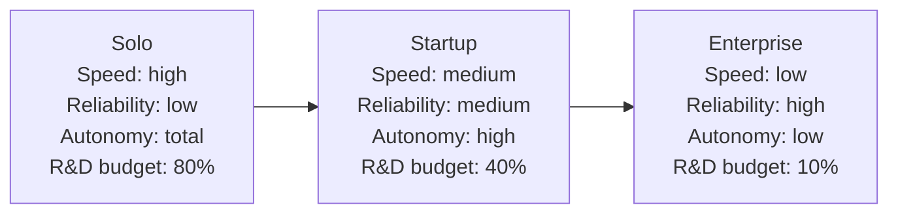

# Tradeoffs and when to pick which

> **In one line:** Solo trades reliability and process for speed; enterprise trades speed and autonomy for reliability and alignment; startup is the unstable middle where the wrong tradeoff in either direction kills the team.

:::tip[In plain English]
Each column is a coherent *bundle of tradeoffs*, not a menu you pick from. You can't take the solo experimentation budget into a bank or the enterprise governance into a 3-person team without breaking what made each one work.

The skill is **diagnosing which column you're actually in** — which is sometimes different from the one you think you're in — and then committing to that column's tradeoffs honestly.
:::

## The three tradeoff axes

Every AI org is making three big tradeoffs at once. Each column picks a different point on each axis.

### Speed vs reliability

| Aspect | Solo | Startup | Enterprise |
|----|----|----|----|
| **Time to ship a prompt change** | 90 seconds | 30 minutes | 1 day – 6 weeks |
| **Tolerance for a regression** | High — you fix it | Medium — customers tweet | Near zero — regulators care |
| **Eval bar before merge** | "Looks good on 5 prompts" | 200-case suite, blocks merge | 5,000-case battery + bias + safety + red-team |
| **Rollout strategy** | Push to main | Cohort 5% → 100% over a week | Pilot → expanded pilot → GA over months |

### Autonomy vs alignment

| Aspect | Solo | Startup | Enterprise |
|----|----|----|----|
| **Who picks the model** | You | The AI team | An approved-vendor list maintained by a CoE |
| **Who picks the framework** | You | Team consensus | CoE-approved, possibly mandated |
| **Who can call an LLM in prod** | You | Anyone on the team | Only via the internal gateway, scoped by team |
| **What "best practice" means** | Whatever ships | What the team agrees on | A written standard, sometimes audited |

### Experimentation budget

| Aspect | Solo | Startup | Enterprise |
|----|----|----|----|
| **Cost of a failed experiment** | A weekend | A sprint | A quarter + an audit trail |
| **% of time on R&D vs hardening** | 80 / 20 | 40 / 60 | 10 / 90 |
| **Where new patterns get tried** | Production (it's your laptop) | A staging env or behind a flag | A sandbox VPC isolated from production data |
| **How a new technique enters the stack** | "Saw a tweet, tried it" | RFC + spike + eval | RFC + spike + risk assessment + CoE sign-off |

## When to pick which workflow

Match the workflow to **your blast radius** — the worst plausible damage if the model misbehaves on a Tuesday.

### Pick the Solo workflow when…

- One person ships and is the only one accountable.
- Bad output reaches < 100 users.
- Wrong output is embarrassing but not legally or financially material.
- The product would be killed by 2 weeks of governance overhead.
- *Example: indie SaaS, personal project, internal demo, hackathon prototype.*

### Pick the Startup workflow when…

- 2–10 AI engineers ship to a shared surface.
- Bad output reaches hundreds to tens of thousands of paying users.
- Wrong output causes churn and angry tweets, not lawsuits.
- The team will collapse if a bad deploy can't be rolled back in < 1 minute.
- *Example: Series A–C product team, AI features inside a SaaS, mid-market vertical AI tools.*

### Pick the Enterprise workflow when…

- Bad output is regulator-notifiable, contractually material, or front-page-news material.
- > 1,000 engineers, or any regulated industry (finance, health, government, defense).
- Multiple teams ship AI to the same surface and have to stay coordinated.
- A single uncaught hallucination can cost more than the team's annual budget.
- *Example: bank, hospital, insurer, government agency, FAANG-scale consumer product.*

## "Wrong column" mistakes

The most expensive AI-org mistakes come from applying a column's playbook in the wrong column:

| Mistake | Symptom | Why it kills you |
|----|----|----|
| **Solo with enterprise process** | Nothing ships, the side project rots | All the process, none of the risk it absorbs |
| **Startup with solo practices** | First real outage exposes the team and they retrofit governance in panic | No kill switch, no eval bar, no audit trail when something goes wrong |
| **Startup with enterprise practices** | Out-shipped by a 2-person competitor in 6 months | Risk-tier reviews on prompt tweaks that 4 users see |
| **Enterprise with startup practices** | One incident removes someone's job and triggers a regulator letter | Insufficient documentation and audit when something breaks |
| **Enterprise with solo practices** | A "fast-moving team" inside a bank ships an unaudited model | Regulator finds out before you do |

:::info[Highlight: the column-jumping trap]
The most dangerous moment in an AI team's life is **when it has just crossed into the next column**.

A solo project that hires its first AI engineer is now a startup but is still operating like solo (no PRs, no evals in CI, no kill switch). A startup that just signed its first enterprise customer is now enterprise-adjacent but is still operating like a startup (no SOC 2, no audit logs, no risk classification).

The cost of *catching up* late is always higher than the cost of *adopting just-in-time*. The trick is to import practices one at a time as you cross thresholds — not wait for the incident that forces the whole bundle on you at once.
:::

:::note[Worked example: which column is this AI org actually in?]
A real-feeling mid-size SaaS:
- 150 total engineers, 6 AI engineers
- 50K paying customers, average contract $5K/year
- Operates in HR-tech (sensitive but not heavily regulated)
- Has a few six-figure enterprise customers asking for SOC 2

**Where this team often *thinks* they are:** late-stage startup. "We're agile, we move fast, we have a Slack channel."

**Where they actually are:** entering enterprise-adjacent territory. The presence of six-figure enterprise customers with SOC 2 expectations means:
- They need a prompt registry-like artifact (even if it's a Notion page) for the SOC 2 auditor.
- They need a kill-switch fire drill before a customer asks them to demonstrate one.
- They need per-tenant cost dashboards before one enterprise tenant 10x's the AI bill.
- They need a documented incident-response process before the first reportable incident.

They don't need an AI Center of Excellence yet (still one feature team). They don't need a 5,000-case eval battery (200 is fine). But they need to start importing enterprise practices *selectively* — not the whole playbook, just the pieces a six-figure customer would notice in due diligence.
:::

## What stays the same / what changes

**Stays the same:** at every column, the tradeoffs are real. There's no free lunch — buying more reliability always costs speed, buying more speed always costs reliability.

**Changes:** *which* tradeoffs are worth making. The same tradeoff that's correct at solo scale (push to main, eyeball the dashboard) is malpractice at enterprise scale, and vice versa.

## Common mistakes

- **Believing one column is "better."** The columns are *fit to context*, not ranked. The staff engineer at a bank and the indie hacker on Twitter are both right — for their respective columns.
- **Importing a whole column at once.** When you cross into a new column, you don't need that column's entire playbook on day one. Import practices in order of risk-reduction-per-dollar — usually kill switch → eval-in-CI → cohort rollout → audit log → registry.
- **Skipping the "where am I actually?" check.** Job titles lie. "Senior staff at a small startup" can be solo-column work; "junior at a bank" can be enterprise-column work from day one. The blast radius, not the org chart, decides the column.
- **Treating the column as a destination.** A startup that "graduates to enterprise" by adopting the heaviest enterprise practices is choosing process for its own sake. The right adoption order is *as risk requires*, not *as headcount grows*.
- **Reading the enterprise column as aspirational.** A 5,000-case eval battery, a CoE, and a private endpoint look principled from a blog post and feel like sludge from inside. The cost is real; only adopt when the risk it absorbs is also real.

<Quiz id="comparison-tradeoffs-quick-check" variant="micro" title="Quick check">

<Question
  prompt="How does the page say you should decide which workflow column to operate in?"
  options={[
    { text: "By headcount: more engineers always means a heavier process" },
    { text: "By blast radius — the worst plausible damage if the model misbehaves — not by the org chart or job titles" },
    { text: "By picking the practices you like from each column" },
    { text: "By copying whatever the most successful competitor does" }
  ]}
  correct={1}
  explanation="The page matches workflow to blast radius: who is hurt, and how badly, if the model misbehaves on a Tuesday. Job titles lie — 'senior staff at a small startup' can be solo-column work, while 'junior at a bank' can be enterprise-column work from day one. And each column is a coherent bundle of tradeoffs, not a menu to cherry-pick from."
/>

<Question
  prompt="What does the page call the most dangerous moment in an AI team's life?"
  options={[
    { text: "The first production incident involving real users" },
    { text: "The day the primary model provider has an outage" },
    { text: "Just after crossing into the next column, while still operating with the previous column's practices" },
    { text: "The quarter when the eval set saturates" }
  ]}
  correct={2}
  explanation="The column-jumping trap: a solo project that hires its first engineer is now a startup but still has no PRs, evals in CI, or kill switch; a startup that signs its first enterprise customer still has no SOC 2 or audit logs. Catching up late always costs more than adopting just-in-time — the fix is importing practices one at a time as thresholds are crossed, not waiting for the incident that forces the whole bundle at once."
/>

<Question
  prompt="According to the 'wrong column' table, what happens to a startup that imports enterprise practices?"
  options={[
    { text: "It gets out-shipped by a smaller competitor within months — risk-tier reviews on prompt tweaks that only a handful of users see" },
    { text: "It immediately passes SOC 2 and wins enterprise deals" },
    { text: "It ships faster because the process catches bugs earlier" },
    { text: "Nothing — extra process is harmless if the team is disciplined" }
  ]}
  correct={0}
  explanation="The table's verdict: a startup running enterprise practices gets out-shipped by a 2-person competitor in 6 months, because it pays all the process cost without facing the risk that process absorbs. The columns are fit to context, not ranked — the same governance that is malpractice to skip at a bank is a self-inflicted tax on a 3-person team."
/>

</Quiz>

---

→ Next: [Checkpoint](./07-checkpoint.md) — self-test on the key differences.
