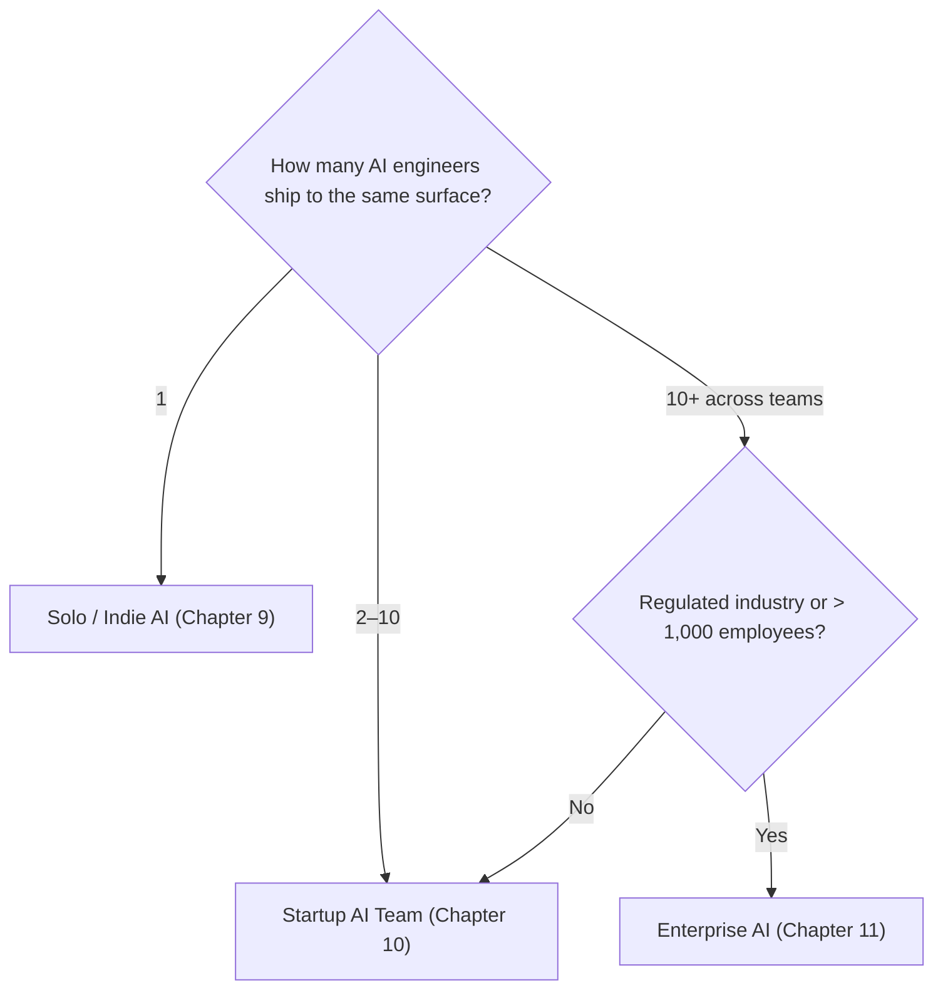

# Part 12: Comparison

*Solo, startup, and enterprise AI work, side-by-side.*

> **In one line:** Same primitives — different practices. Whether a prompt change ships in 90 seconds or 90 days depends entirely on which column you're in.

:::tip[In plain English]
Chapters 5, 6, and 7 each built out one column in detail. This chapter is the **reference card** that puts those three columns next to each other so you can see the shape of the differences at a glance.

**The big takeaway in advance:** there is no single "correct" way to build with LLMs. Promptfoo-in-CI is the right eval strategy for a solo builder and a disaster for a regulated bank. A prompt-registry-with-approval-gates is right for the bank and an extinction-level event for the solo builder.

**If you're choosing a workflow:** find your column, copy that row, ignore the others until your scale catches up.

**If you only remember one thing:** the patterns (RAG, tool use, agents, evals) are scale-invariant. The *process around them* changes dramatically. Don't copy a FAANG AI org's MLOps stack for your weekend project, and don't bring a weekend stack into a bank.
:::

## At a glance

| Dimension | Solo / Indie | Startup AI Team | Enterprise AI |
|----|----|----|----|
| **Team** | 1 person | 1–10 AI engineers | Platform + feature teams + AI CoE |
| **Models** | Frontier API direct | 2 providers via gateway | Private endpoint / hybrid / self-hosted |
| **Eval discipline** | Promptfoo script | Hosted platform, CI-gated | Platform + prompt registry + audit trail |
| **Observability** | Free tier of one tool | Dedicated tool + dashboards | Centralized obs + corporate SIEM |
| **Vector DB** | pgvector | pgvector → Pinecone / Qdrant | Pinecone enterprise / Vespa / OpenSearch |
| **Cost discipline** | Hard cap in dashboard | Per-tenant dashboards | Forecast + chargeback by team |
| **Governance** | None | Light prompt review | Full model + prompt + risk registry |
| **Compliance** | None | SOC 2 once asked | SOC 2 + HIPAA + EU AI Act + sector regs |
| **Deployment** | Vercel / Modal | Vercel + Modal + gateway | Bedrock / Azure / Vertex + on-prem |
| **Time to ship a prompt change** | 90 seconds | 30 minutes | 1–6 weeks |
| **Time to ship a new feature** | Hours to days | 2-week cycle | 1–3 months |
| **Time to procure a new model vendor** | Sign up with card | Hours to days | 3–9 months |

## Where you sit

The transitions are gradual. You don't wake up one morning and suddenly need a model registry, an internal LLM gateway, or a prompt review board. Adopt each practice when its cost is justified by your scale — not before, and not after a near-miss forces it on you in panic mode.

## How this chapter is organized

Each page below isolates one dimension and runs it across all three columns.

1. [Team and Process](./01-team-and-process.md) — Team shape, decision style, time from idea to live, stakeholder count per change.
2. [Stack comparison](./stack.md) — Layer-by-layer tooling at each scale.
3. [Ops](./04-ops.md) — On-call, kill switches, observability stack, incident severity.
4. [Workflow comparison](./workflow.md) — How an AI change moves from idea to production.
5. [Economics comparison](./economics.md) — Order-of-magnitude costs at each scale.
6. [Tradeoffs](./06-tradeoffs.md) — The explicit tradeoffs and when to pick which workflow.
7. [Checkpoint](./07-checkpoint.md) — Self-test on the differences.

## What stays the same / what changes

Across all three columns:

**Stays the same:**
- The core patterns: streaming, tool use, RAG, agent loops, structured output.
- The discipline of evals before shipping anything to users.
- The fact that prompts are code and belong in version control.
- The reality that LLMs are non-deterministic and drift over time.

**Changes dramatically:**
- *Who* is allowed to change a prompt and how many people sign off.
- *Where* the model call physically runs and which provider's terms apply.
- *How fast* a change reaches users — minutes vs. months.
- *How much paperwork* exists between "I had an idea" and "users see it."

## Wrapping up in advance

The biggest mistake at every scale is **applying the wrong column's playbook**:

- Solo with enterprise process → nothing ships, the side project dies.
- Startup with solo practices → first real outage exposes the team and they retrofit governance in panic mode.
- Startup with enterprise practices → the 8-person AI team that requires a risk-tier review for every prompt tweak gets out-shipped by a 2-person competitor in six months.
- Enterprise with startup practices → first regulatory or reputational hit removes someone's job.

The corollary is that **column-jumping is the most expensive moment in an AI team's life**. When you cross into the next column — first hire after going solo, first six-figure enterprise customer at a startup — the temptation is to either import the entire next column's playbook at once (over-correction, kills velocity) or pretend you're still in the previous column (under-correction, sets up the first big incident). The right move is selective import in order of risk-reduction-per-dollar; the rest of this chapter is the menu you pick from.

## How to read this chapter

- Each page below is a focused side-by-side on one dimension; pages are short, opinionated, and meant to be skim-able in 5 minutes each.
- The 3-column table is the workhorse. Look at the row for your column, then glance at the others to calibrate what "too little" and "too much" look like for that dimension.
- The `:::tip[In plain English]` callouts are the TL;DR if you're in a hurry.
- The "common mistakes" sections at the bottom of each page are the highest-density part — that's where the chapter's opinion sits.

Skim this chapter when you need a quick mental model of how a specific dimension differs across scales. Read [Chapter 13: Decision Frameworks](/docs/decisions) when you need to actually pick.

---

→ Continue with [Team and Process](./01-team-and-process.md).
