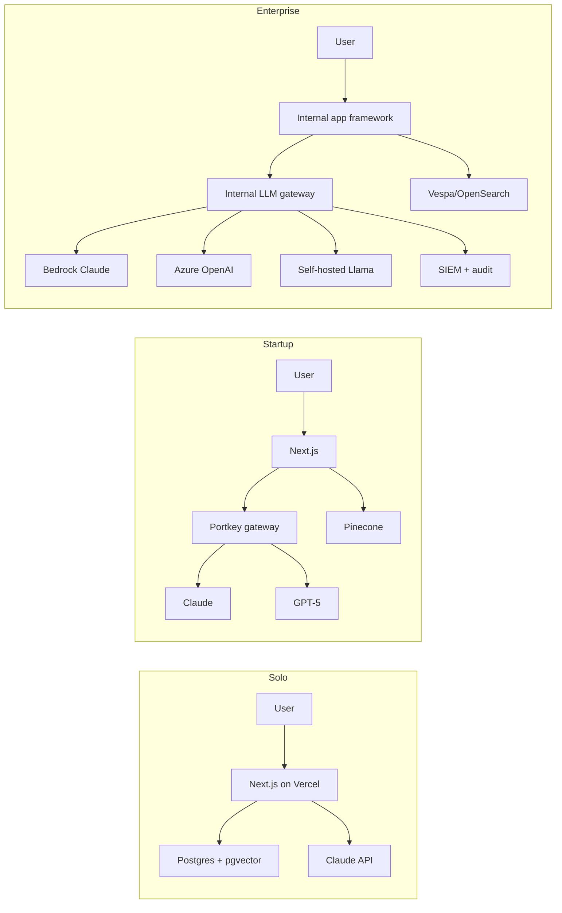

# Stack comparison

> **In one line:** Solo runs Claude Sonnet direct + pgvector + Promptfoo + Langfuse free tier. Startup adds a gateway, swaps to a hosted vector DB, and pays for an eval platform. Enterprise replaces every line with a private-endpoint, audit-logged, contract-negotiated equivalent.

:::tip[In plain English]
You can read an org's scale off its AI stack diagram in about 30 seconds.

One model + one provider + a SQL extension for vectors + an OSS eval tool = solo. Two providers behind a gateway + a hosted eval platform + Pinecone or Qdrant = startup. Private endpoints + an internal LLM gateway + dual eval platforms + a corporate SIEM piping every prompt and completion = enterprise.

Each step adds capability *and* cost *and* coordination overhead. The question is never "which is best?" — it's "which one is appropriate for my blast radius?"
:::

## Models and providers

| Layer | Solo | Startup | Enterprise |
|----|----|----|----|
| **Workhorse model** | Claude Sonnet 4.5 (API direct) | Claude Sonnet + GPT-5 mid (via gateway) | Bedrock Claude / Azure OpenAI / private endpoints |
| **Cheap model** | Claude Haiku | Haiku + Gemini Flash | Private-endpoint Haiku / self-hosted Llama-class |
| **Embeddings** | OpenAI `text-embedding-3-small` | OpenAI small or Cohere v3 | Private-endpoint OpenAI / Bedrock Titan / in-house |
| **Number of providers** | 1 | 2–3 | 5+ (incl. self-hosted) |
| **Provider redundancy** | None | Failover via gateway | Multi-region multi-provider with automated cutover |

## Application layer

| Layer | Solo | Startup | Enterprise |
|----|----|----|----|
| **LLM SDK** | Vercel AI SDK / OpenAI SDK direct | Vercel AI SDK / Pydantic AI / LangChain (selectively) | Vercel AI SDK + internal wrapper that enforces auth, logging, redaction |
| **Gateway** | None | Portkey / OpenRouter / LiteLLM | Internal gateway on Kong / Apigee / Portkey Enterprise |
| **Vector DB** | pgvector on Postgres | pgvector → Pinecone / Qdrant / Weaviate | Pinecone Enterprise / Vespa / OpenSearch with KNN |
| **Orchestration** | None | Inngest / Temporal / Trigger.dev | Temporal / internal workflow platform |
| **Agent framework** | LangGraph or hand-rolled | LangGraph / OpenAI Assistants | Internal SDK on top of one of the above |

## Eval and observability

| Layer | Solo | Startup | Enterprise |
|----|----|----|----|
| **Eval tool** | Promptfoo in CI | Braintrust / Langfuse / Patronus | Platform-grade — often hybrid OSS + commercial |
| **Eval cadence** | Pre-merge + ad hoc | Pre-merge + nightly drift run | Pre-merge + nightly + pre-release + post-incident |
| **LLM observability** | Langfuse free tier | Langfuse Pro / Helicone / Arize | Datadog LLM + Langfuse + corporate SIEM |
| **Prompt versioning** | Git | Git + eval-platform versions | Prompt registry as a first-class platform |
| **Drift detection** | Eyeball weekly | Automated nightly | Continuous, alerts on regression |

## Hosting and infra

| Layer | Solo | Startup | Enterprise |
|----|----|----|----|
| **Hosting** | Vercel / Modal / Fly | Vercel + Modal + cloud (AWS/GCP) | Cloud + on-prem hybrid; VPC-isolated AI workloads |
| **Compute for inference** | Provider API only | Provider API + occasional Modal GPU | Bedrock / Azure / Vertex + self-hosted GPU fleets |
| **Secrets** | `.env` + Vercel UI | Doppler / 1Password / cloud KMS | HashiCorp Vault / cloud-native KMS, tied to SSO |
| **Network** | Public internet | Public internet + private VPC for sensitive paths | Private link / PrivateLink to every model endpoint |
| **Data residency** | Wherever the provider runs | US or EU choice in gateway | Strict per-region routing, often per-tenant |

:::info[Highlight: the internal LLM gateway is the most under-appreciated enterprise pattern]
At enterprise scale, the **internal LLM gateway** is the load-bearing piece. It centralizes auth, key rotation, per-team budgets, prompt and completion logging, PII redaction, rate limits, provider failover, and model routing — in one chokepoint every team's app calls.

At solo scale you don't need it (you are the only team). At startup scale a SaaS gateway (Portkey, OpenRouter, LiteLLM in a container) gets you 80% of the value for $0–$2K/month. At enterprise scale, the chokepoint is *the* control plane — and that's why most large orgs end up building or heavily customizing their own.
:::

## What stays the same

- The **patterns** — streaming, tool use, RAG, agent loops, structured output — are byte-for-byte identical at every scale. A Solo dev and a bank both write the same `tools=[...]` array.
- The **discipline of evals** is non-negotiable everywhere; only the tooling and cadence change. (→ Going deeper: the eval techniques themselves — scorers, LLM-as-judge, production grading — are the same across all three columns. See [Chapter 5: Evaluation & Measurement](/docs/evaluation).)
- **Prompts live in version control** at every scale — even if there's also a registry on top.
- **Sentry-equivalent error tracking** is universal.

## What scales up

- **Number of providers** (1 → 2–3 → 5+).
- **Centralization of cross-cutting concerns** (gateway, evals, prompt registry, observability).
- **Governance overhead** per change.
- **Number of audit trails** a single prompt completion writes to.

## What scales down

- **Time from idea to live.**
- **Number of dependencies one engineer can hold in their head.**
- **Tolerance for ad hoc experimentation against production.**
- **Cost-per-token volatility** — enterprise contracts smooth it; solo eats every API price hike directly.

:::note[Worked example: same RAG app, three stacks]
A doc-Q&A app over a 10K-document corpus.

- **Solo:** Next.js on Vercel + Supabase Postgres with pgvector + OpenAI embeddings + Claude Sonnet direct + Promptfoo + Langfuse free. **Stack diagram: 5 boxes. Monthly bill: ~$50.**
- **Startup (10K users):** Next.js + Modal for ingestion + Pinecone + OpenAI embeddings + Claude Sonnet & GPT-5 mini via Portkey + Braintrust + Langfuse Pro + Inngest for re-indexing. **Stack diagram: 10 boxes. Monthly bill: ~$8K (AI + infra).**
- **Enterprise (regulated, internal tool):** Internal Next.js framework + corporate ingestion pipeline + OpenSearch KNN + private-endpoint embeddings + Bedrock Claude + Azure OpenAI for fallback, all via internal LLM gateway + internal eval platform + Datadog LLM + corporate SIEM + Temporal for ingestion + Vault for keys. **Stack diagram: 25+ boxes. Monthly bill: $200K+ across team chargebacks.**

Same product, three radically different stacks. Each is correct for its column; lifting either of the others would be a mistake.
:::

## Architecture pattern at each scale

The visual cue: **the number of arrows in the diagram is roughly the number of teams that have to coordinate.** Solo: 3 arrows, 1 brain. Startup: ~8 arrows, 1 team. Enterprise: 20+ arrows, multiple teams owning each box.

## Common mistakes

- **Adopting Pinecone for a 200-document corpus.** pgvector on the Postgres you already have outperforms a hosted vector DB at small scale, costs $0, and has zero new ops surface. Reach for Pinecone/Qdrant when you've outgrown pgvector, not in anticipation.
- **Building a custom LLM gateway as your second project.** A gateway is a coordination tool. Until you have 3+ teams calling LLMs independently, a SaaS gateway (or no gateway) wins. Most "we should build a gateway" pitches at small companies are resume-driven.
- **Picking LangChain because everyone talks about it.** At solo and startup scale, hand-rolled patterns with the official SDKs are faster to debug than a framework you don't fully understand. Adopt LangChain/LangGraph when you have a specific pattern (e.g. complex agent state) it actually simplifies.
- **Self-hosting Llama-class to "save on inference."** A solo or small-startup self-host project burns weekends on driver issues and saves single-digit dollars. Self-hosting is enterprise math — it pays off above 100M tokens/day, not below.
- **Treating "polyglot" as a feature.** Five frameworks and three model providers in your stack is a *cost* enterprises absorb because they can't agree on one — not an aspiration. At solo and startup scale, picking one SDK and one workhorse model end-to-end is a competitive advantage.
- **Reading the enterprise observability row as a shopping list.** Datadog LLM + Langfuse + corporate SIEM at startup scale is $50K/year for tools whose value is in features you can't yet use. Buy the column you're in, not the column you want on your resume.

---

→ Next: [Ops](./04-ops.md).
