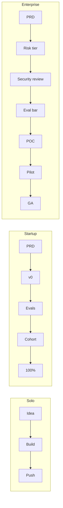

# Workflow comparison

> **In one line:** Solo: edit, push, watch the dashboard. Startup: PRD → v0 → evals → cohort → 100%, two weeks. Enterprise: PRD → risk tier → security review → eval bar → POC → pilot → rollout, 1–3 months and 8–20 people.

:::tip[In plain English]
The same change moves through dramatically different choreography at each scale. A prompt tweak that takes a solo dev 90 seconds takes a startup 30 minutes and an enterprise 1–2 weeks. Almost none of that delta is *the work* — it's the *waiting* for nods, evals, deploy windows, and rollout soaks.

The choreography exists for a reason: it absorbs risk that the lower scales don't carry. The mistake is keeping a step after the risk it was designed to absorb is gone, or skipping a step before you've earned the speed.
:::

## Idea → live (a new AI feature)

| Stage | Solo | Startup | Enterprise |
|----|----|----|----|
| **Spec** | A sentence in your head | One-page PRD | Full PRD + risk-tier classification + data-flow diagram |
| **Approach** | Whatever Claude suggests | Quick design discussion + eval sketch | Architecture review, prompt/RAG/fine-tune decision documented |
| **v0** | A weekend hack | 3–5 day sprint behind a flag | Internal POC, 2–4 weeks |
| **Eval bar** | "Looks good on 5 prompts" | Pass on 200-case eval suite | Pass on 5,000-case battery + bias + safety + red-team |
| **Rollout** | Push to main | Cohort rollout: 5% → 25% → 100% over a week | Pilot tenant → expanded pilot → general availability, over months |
| **People involved** | 1 | 3–5 | 8–20 |
| **Calendar time** | A weekend | 2 weeks | 1–3 months |

## Prompt change

| Step | Solo | Startup | Enterprise |
|----|----|----|----|
| **Author** | Edit file in IDE | Open PR with diff | Open PR + propose registry entry update |
| **Review** | None | One teammate | Tech lead + (for High tier) AI safety partner |
| **Eval** | Run Promptfoo locally | CI runs eval suite, blocks on regression | CI + extended battery + bias eval + nightly soak in staging |
| **Deploy** | Push to main → live in 60 sec | Merge → auto-deploy behind flag → cohort rollout | Merge → next deploy window → canary 1% → 10% → 100% |
| **Audit** | git log | git log + eval-platform diff | Prompt registry version + audit log + change record |

## Provider change (e.g. swap primary model)

| Step | Solo | Startup | Enterprise |
|----|----|----|----|
| **Triggering decision** | Read a tweet about a new model | Eval suite shows new model is better/cheaper | Cost forecast or strategic vendor decision |
| **Vetting** | None | Run full eval suite on candidate | Vendor security review + DPIA + legal + procurement (3–9 months for a new vendor) |
| **Mechanism** | Edit one env var | Change one line in gateway config | Update gateway routing rule via change management |
| **Rollout** | Immediate | Shadow traffic for a day → cohort cutover | Shadow → pilot tenants → expanded → 100%, with rollback runbook |
| **Time** | An evening | 1–2 weeks | 1–2 quarters |

## Incident response

| Stage | Solo | Startup | Enterprise |
|----|----|----|----|
| **Detection** | A tweet, your dashboard, or "oh no" | Synthetic eval / alert / customer report | SIEM correlation, automated SLO breach, multiple signals |
| **Triage** | You, immediately | On-call engineer opens incident channel | Incident commander assigned, severity declared |
| **Mitigation** | Flip env var, redeploy | Flip kill switch in Statsig | Auto-flip switches by cohort, manual confirm |
| **Comms** | A tweet | Status page + customer email | Status page + customer emails + executive brief + (sometimes) regulatory notification |
| **Post-mortem** | None | One-pager in Notion | Formal blameless report, action items tracked to closure, board summary if SEV1 |

:::info[Highlight: the cohort rollout is the most copy-able startup practice]
If a startup adopts exactly one enterprise-style practice early, it should be the **cohort rollout** — pushing changes to 5% → 25% → 100% with a kill switch ready.

It costs almost nothing (a feature flag and a metric to watch), catches the majority of "looked great in eval, looks awful in prod" regressions, and gives you a clean rollback story. It's the highest-leverage process import from enterprise to startup; everything else (RFCs, risk tiers, registries) is way more expensive per unit of risk reduced.
:::

:::note[Worked example: shipping a "summarize my emails" feature, three orgs]
- **Solo:** Friday night, weekend project. Hack a Next.js page + Vercel AI SDK + Claude Sonnet + a prompt. Eyeball it on 10 emails of your own. Deploy to a `.app` domain. Tweet about it Sunday night. **Total: a weekend. Stakeholders: 1.**
- **Startup:** PM writes a one-page PRD on Monday. AI engineer builds v0 by Wednesday, behind a `summarize_email` flag. Eval suite (200 cases curated from real user inboxes, with PII redacted) runs in CI. Cohort rollout to 5% of beta users on Friday; expand to 25% Monday; 100% next Wednesday after dashboards stay green. **Total: 2 weeks. Stakeholders: PM + AI engineer + reviewer + designer + customer-success lead = 5.**
- **Enterprise:** PRD goes to product council Q1. Risk-tier classification: Medium (touches user data). Security review (3 weeks) confirms email content can flow to the approved Bedrock endpoint. Eval bar requires passing the 5,000-case enterprise eval battery + a bias eval + a red-team session. POC built by the AI feature team over 6 weeks. Pilot to one internal team (2 weeks). Expanded pilot to 3 customers (4 weeks). GA in Q2. **Total: ~4 months. Stakeholders: PM + 2 AI engineers + AI safety partner + security partner + legal + privacy + designer + product council + 3 pilot customers = 15+.**

Same feature. Three different blast radii. Three appropriately-sized processes.
:::

## What stays the same / what changes

**Stays the same:** at every scale you go from idea → eval → deploy → watch. Every column has *some* kill switch. Every column has *some* version of "ship it behind a flag."

**Changes:** how many people are in the room at each step, how long each step takes, how much documentation each step produces, and how big a hole in the world a screw-up makes.

## Eval-bar evolution by scale

The "what counts as a passing eval" bar is the most visible per-column ratchet in the development loop.

| Stage of eval rigor | Solo | Startup | Enterprise |
|----|----|----|----|
| **Number of eval cases** | 5–20 | 100–500 | 2,000–20,000 |
| **Where they come from** | The author's intuition | Curated from real user prompts | Curated + adversarial + bias-targeted + red-team |
| **Pass criteria** | "Looks good to me" | Pass rate ≥ baseline on suite | Pass rate + no regression on safety + no bias delta beyond threshold |
| **When they run** | Manually before pushing | On every PR + nightly drift | Pre-merge + nightly + pre-release + post-incident + continuous on live traffic sample |
| **Who owns the suite** | The author | The AI team collectively | A dedicated eval / quality function |
| **Eval refresh cadence** | Whenever | Monthly | Continuous + post-incident additions |

The pattern: **the eval suite grows roughly with the blast radius**. Solo doesn't need 5,000 cases because the cost of being wrong is one annoyed user. Enterprise can't ship with 200 cases because the cost of being wrong is a regulatory filing.

## Common mistakes

- **Solo + cohort rollout.** Setting up a 5%/25%/100% rollout for a feature only you and three friends use is procrastination dressed up as engineering. You don't have enough users to read the signal — ship to 100%, watch the dashboard, roll back if needed.
- **Startup + enterprise PRD.** A 20-page PRD with risk-tier classification and a security section for a 2-week feature is the surest way to ship in 2 months instead. Use a one-pager, ship faster, learn faster.
- **Enterprise + "just push it."** A staff engineer at a bank who skips the change-management process for a "tiny prompt tweak" is one screenshot away from a regulator's letter. The process exists for a reason; route around it only with senior cover and a written exception.
- **No kill switch at any scale.** Even solo. The only acceptable answer to "what do you do if the model starts saying something it shouldn't?" is "flip this thing." Build it before you need it.
- **Confusing a feature flag with a kill switch.** A flag that nobody on-call knows how to flip in production at 3am is not a kill switch — it's a config option. Make it explicit, document it, and drill it.
- **Treating the eval suite as static.** An eval suite that doesn't grow after every real-world failure is decaying — the bugs you've already shipped will keep recurring. Every post-incident review should add at least one eval case.

<Quiz id="comparison-workflow-quick-check" variant="micro" title="Quick check">

<Question
  prompt="If a startup adopts exactly one enterprise-style practice early, which one does the page recommend?"
  options={[
    { text: "A 5,000-case eval battery" },
    { text: "A risk-tier classification for every change" },
    { text: "The cohort rollout — 5% to 25% to 100% with a kill switch ready" },
    { text: "A formal prompt registry" }
  ]}
  correct={2}
  explanation="The cohort rollout costs almost nothing — a feature flag and a metric to watch — yet catches most 'looked great in eval, looks awful in prod' regressions and gives a clean rollback story. The page calls it the highest-leverage process import from enterprise to startup; RFCs, risk tiers, and registries cost far more per unit of risk reduced."
/>

<Question
  prompt="A prompt tweak takes 90 seconds solo, 30 minutes at a startup, and 1-2 weeks at an enterprise. What does the page say accounts for the difference?"
  options={[
    { text: "Almost none of it is the work itself — it is the waiting for nods, evals, deploy windows, and rollout soaks, choreography that absorbs risk the lower scales don't carry" },
    { text: "Enterprise codebases are larger, so edits take longer to write" },
    { text: "Enterprise CI pipelines run far slower than startup ones" },
    { text: "Startups skip evals entirely to save time" }
  ]}
  correct={0}
  explanation="The edit is the same everywhere; the delta is choreography — reviews, extended eval batteries, deploy windows, canary soaks. That choreography exists to absorb risk, and the page names both failure modes: keeping a step after the risk it absorbs is gone, and skipping a step before you have earned the speed. Startups do run evals; theirs block merges in CI."
/>

<Question
  prompt="According to the page, when is a feature flag NOT a kill switch?"
  options={[
    { text: "When it is implemented in a third-party flag service" },
    { text: "When nobody on-call knows how to flip it in production at 3am — then it is just a config option; make it explicit, document it, and drill it" },
    { text: "When it controls more than one feature at a time" },
    { text: "When it was created after the feature shipped" }
  ]}
  correct={1}
  explanation="A kill switch is defined by operational readiness, not by the mechanism: if the on-call cannot confidently flip it during a 3am incident, it provides no protection. The page pairs this with 'no kill switch at any scale' as a universal mistake — even solo devs need one answer to 'what do you do if the model starts saying something it shouldn't?': flip this thing."
/>

</Quiz>

---

→ Next: [Economics comparison](./economics.md).
