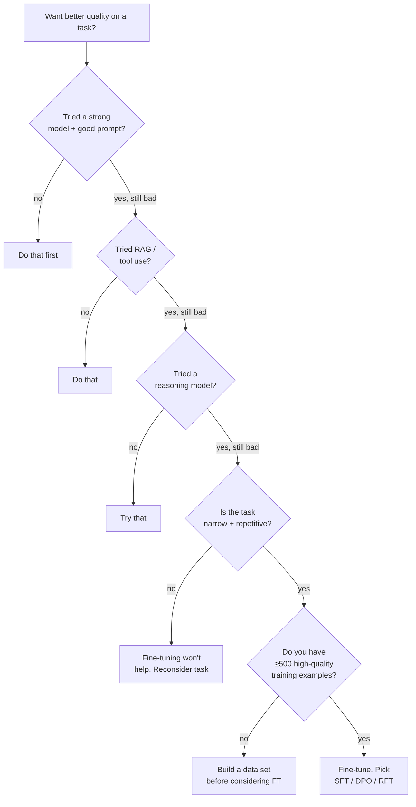

# Fine-tuning — the decision walkthrough

> **In one line:** Fine-tuning is usually the wrong answer in 2026 — prompting, RAG, and tool use cover 95% of needs at a fraction of the cost — but for the 5% where it's right, the choice between SFT / DPO / RFT and the data-quality bar are what determine whether it works.

:::tip[In plain English]
The default move in 2026 is: try the strongest non-finetuned model first, with a good prompt and RAG. If that doesn't work, try a reasoning model. If *that* doesn't work, *now* think about fine-tuning. Fine-tuning is a real lever — for specific narrow tasks it can beat the frontier — but it's expensive, slow to iterate, and you're committing to a maintenance burden. This page is the decision tree before you commit.
:::

## The decision tree



Five "have you tried…" gates. Each one is cheaper to do than the next. Skip them at your peril — every team that fine-tunes before trying these wastes weeks.

## When fine-tuning is actually the right answer

Honest list of cases where fine-tuning wins over prompt + RAG:

1. **Latency or cost forces a smaller model.** You need Haiku-class performance, but Haiku underperforms on your task. Fine-tune Haiku on your task → frontier-tier quality at Haiku price/speed.
2. **Output format or style needs to be very consistent.** Domain-specific report formats, legal document drafting, very specific tone. Fine-tuning is great at "make every output match this shape."
3. **The task is narrow and repetitive at high volume.** Classifying support tickets into 50 buckets at 10K/day. A fine-tuned 7B model beats a frontier model on this task at 1/100th the cost.
4. **Domain language is far from the pretraining distribution.** Specialized medical, legal, scientific, code in obscure languages — areas where the base model lacks vocabulary.
5. **The task has a non-language objective.** Function calling for unusual schemas, structured generation with format constraints.

When fine-tuning is **not** the answer (even though it tempts):

1. **"The model is sometimes wrong."** Wrong how? Specific failure modes — usually fixable with a better prompt, better retrieval, or a reasoning model.
2. **"I want the model to know about my company."** That's RAG, not fine-tuning. Fine-tuning bakes facts in poorly and they go stale instantly.
3. **"My users want a specific persona."** Prompt + few-shot. Fine-tuning a persona is overkill for almost every product.
4. **"I have a small training set and want quality gains."** With &lt;500 high-quality examples, fine-tuning often makes things *worse* — you over-fit on a tiny distribution.

## The four flavors of fine-tuning

### 1. Continued pretraining

Take a base model, continue training on raw text from your domain. Goal: shift the model's *knowledge* / vocabulary.

- **When:** truly novel domain (rare languages, internal jargon, proprietary scientific data).
- **Data:** millions to billions of tokens of raw text.
- **Cost:** highest. Often requires significant compute (multi-GPU days or weeks).
- **Risk:** can degrade general capability.
- **In 2026:** rare in production. Most teams use RAG instead.

### 2. SFT (Supervised Fine-Tuning)

Train on labeled (input, output) pairs. Goal: shift the model's *behavior*.

- **When:** clear task with right-answer demonstrations. The 95% of "production fine-tuning."
- **Data:** 500–50K high-quality (input, output) pairs.
- **Cost:** moderate. Single GPU hours to days. LoRA brings it lower still.
- **Risk:** overfits if data is biased or small.

```jsonl
{"messages": [
    {"role": "user", "content": "User says: 'My order is late!'"},
    {"role": "assistant", "content": "{\"intent\":\"order_status\",\"urgency\":\"high\"}"}
]}
{"messages": [...]}
```

### 3. DPO (Direct Preference Optimization)

Train on (input, preferred output, less-preferred output) triples. Goal: shift the model toward preferences without an explicit reward model.

- **When:** you can rank outputs but can't easily write "the right answer." Tone, helpfulness, refusal calibration.
- **Data:** 1K–50K preference triples.
- **Cost:** similar to SFT.
- **The 2024-2026 winner over PPO/RLHF** for most preference-tuning. Simpler, more stable.

### 4. RFT (Reinforcement Fine-Tuning) / RLAIF

Train against an explicit reward signal — a verifier, a judge, or a downstream metric.

- **When:** task has a verifiable reward (math, code, tool-use correctness). OpenAI's o-series and DeepSeek R1 use this style.
- **Data:** prompts + reward function. Sometimes 1K is enough; the *reward function* is the hard part.
- **Cost:** higher than SFT — requires generating many samples and scoring each.
- **2025-2026:** the technique behind reasoning models. The frontier of fine-tuning research.

### LoRA / QLoRA — the implementation choice

Most "fine-tuning" in 2026 is not full-parameter fine-tuning — it's **LoRA** (Low-Rank Adaptation): train a small set of new parameters that "patch" the base model. QLoRA additionally quantizes the base for less memory.

- **Why:** full fine-tuning of a 70B model costs 50× as much as LoRA and rarely wins. LoRA is the default.
- **Serving:** multi-LoRA serving (multiple adapters on one base model) means you can fine-tune many tasks cheaply and serve them at marginal cost.

## A worked numerical example

**Task:** classify customer support tickets into 30 categories. 10K tickets/day.

**Option A — Sonnet with a good prompt:**

- 92% accuracy on eval set.
- ~1K tokens per request (prompt + ticket + output).
- Cost: ~$0.005 per request × 10K/day = $50/day = ~$18K/year.

**Option B — Fine-tuned Haiku:**

- 5K labeled examples (existing tickets you've categorized).
- LoRA fine-tune: ~$200 one-time + ~10 hours of iteration.
- Result: 94% accuracy. Beats Sonnet because the data is in-distribution.
- Cost: ~$0.0003 per request × 10K/day = $3/day = ~$1.1K/year.

**Yearly savings:** ~$17K/year. **Payback period:** ~5 days.

**Plus** the latency is ~5× faster, which matters if this is in a real-time path.

For this task: fine-tuning wins clearly. Now ask: *do you have the 5K labeled examples?* If no, the math changes — building a labeled set is real work, often 1–4 weeks. Include that in the payback calc.

## Data is the bottleneck — almost always

The dominant variable in fine-tuning success is data quality. Specifically:

- **500 examples is a soft floor.** Below this, SFT often makes things worse. The exceptions are tasks with extremely constrained outputs (regex-like structure).
- **High variance in label quality kills you.** Even 5% bad labels in a small set can dominate the result.
- **Diversity matters more than volume.** 1K diverse examples > 10K near-duplicates.
- **Train/test overlap is the silent killer.** Random splitting on tickets *from the same user* leaks information. Split by user / by time / by source.

The right order of operations:

1. Build the eval set first. ~200 representative held-out examples.
2. Score the base model + prompt on the eval. Establish baseline.
3. Build the training set. Avoid contaminating the eval.
4. Fine-tune. Score on the held-out eval.
5. If gain is < 5%, the fine-tuning isn't working. Don't ship.

## Maintenance — the hidden cost

Fine-tuned models are not "set and forget":

- **Data drift.** Customer language changes; new product features create new ticket types; the model misclassifies them.
- **Base model updates.** When the provider releases a new base, you have to re-tune to take advantage of it. Or your model becomes "the frozen tuning of an aging base."
- **Eval rot.** The eval set ages; you need to refresh from production samples.
- **Deployment burden.** Hosting a fine-tuned model (especially open-weights LoRA) is real infra work.

A reasonable rule: budget the maintenance burden as **~20% of the engineer-time the initial tune took**, ongoing.

## Build-vs-buy for fine-tuning

In 2026, you don't necessarily train fine-tunes yourself:

- **Managed FT platforms:** OpenAI fine-tuning API, Anthropic fine-tuning (limited), Together AI, Fireworks, Predibase, OpenPipe.
- **DIY:** Axolotl, Unsloth, TRL (Hugging Face), torchtune. Required for unusual model architectures or for full control.

Managed wins if your needs match the platform's supported recipes (SFT and DPO on common models). DIY wins for novel methods, exotic base models, or strict data residency.

## What beginners get wrong

:::caution[Common mistakes]
- **Fine-tuning before trying RAG / reasoning models.** The fix to "the model doesn't know X" is rarely fine-tuning.
- **Fine-tuning with < 500 examples.** You almost certainly made things worse; the eval just isn't catching it.
- **Eval contamination.** Your training data includes near-duplicates of your eval. Apparent gains evaporate in production.
- **Ignoring base-model updates.** A year-old fine-tune of a year-old base is often worse than today's plain Sonnet with the same prompt.
- **Picking the wrong technique.** SFT for things you should be doing with DPO (preference); RFT when SFT would do.
- **No A/B in production.** You shipped the fine-tune based on offline evals only. Always shadow + canary ([Safe model swaps](../10-patterns/model-swaps.md)).
- **Treating fine-tuning as a one-time investment.** You're committing to a maintenance pipeline, not a project.
- **Fine-tuning a model when the failure is in your retrieval.** Your RAG is missing the chunk; no amount of fine-tuning fixes that.
:::

:::info[Highlight: the bar for "fine-tuning was the right call" is high in 2026]
Five years ago, fine-tuning was the obvious next step for any quality improvement. Today, with strong frontier models, prompt caching, RAG, reasoning models, and tool use, fine-tuning's place is narrower: serving cost reduction, domain shift, narrow-task speed. If your case isn't one of those three, you're probably better off iterating on prompt and retrieval.
:::

---

→ Next: [What would actually hurt us](./12-what-would-hurt.md)
