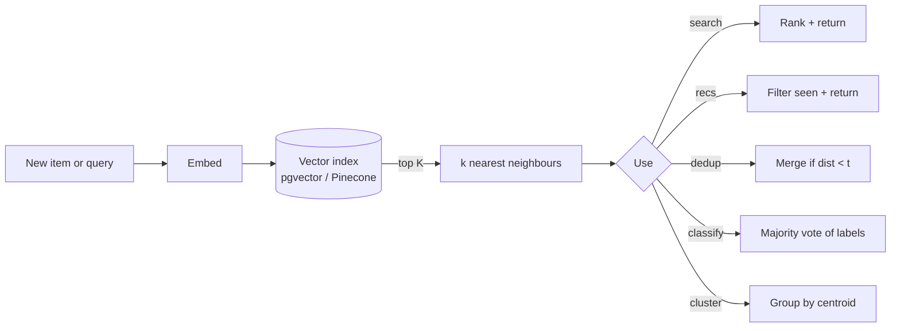

# Embeddings & semantic search

> **In one line:** Embeddings are useful by themselves — for search, recommendations, deduplication, and cheap classification — even when no LLM ever sees the query.

:::tip[In plain English]
RAG made embeddings famous, but the most under-used pattern is "embeddings without the chat model." Once every item in your DB has a vector, a huge set of features — semantic search, "more like this," dedupe, k-NN classification, anomaly detection — collapse into "find the closest neighbours." Cheap at query time, no LLM call, no hallucination surface.
:::

## What you can do with just embeddings

| Feature                          | Pattern                                                |
|----------------------------------|--------------------------------------------------------|
| Semantic search                  | Embed query → top-K nearest items                      |
| "More like this" / recs          | Use the source item's vector as the query              |
| Dedup / near-duplicate detection | Self-join, keep pairs with distance < threshold        |
| Classification (k-NN)            | Top-K nearest labelled items, majority vote            |
| Clustering / topic discovery     | k-means or HDBSCAN over the vectors                    |
| Anomaly detection                | Distance from nearest centroid above threshold         |
| Autocomplete / "did you mean"    | Embed prefix, return nearest items as suggestions      |
| Smart routing                    | Embed user query, route to closest pre-defined intent  |

None of these require an LLM at *query time*. The cost is the embedding (sub-cent per call) plus the vector search.

## The shape



## Worked example — semantic search + k-NN classification

The same vector index powers two features on our support assistant: search across past tickets, and a routing classifier that picks the support queue without an LLM call.

**Schema (Postgres + pgvector):**

```sql
CREATE EXTENSION IF NOT EXISTS vector;

CREATE TABLE tickets (
  id            bigint PRIMARY KEY,
  tenant_id     text NOT NULL,
  text          text NOT NULL,
  category      text NOT NULL,         -- known label, hand-curated
  created_at    timestamptz DEFAULT now(),
  embedding     vector(1536),
  ts            tsvector GENERATED ALWAYS AS (to_tsvector('english', text)) STORED
);

-- HNSW for fast ANN search at >100k rows
CREATE INDEX tickets_embedding_hnsw
  ON tickets USING hnsw (embedding vector_cosine_ops);

-- BM25 alongside, for hybrid
CREATE INDEX tickets_ts_gin ON tickets USING gin(ts);
```

**Ingestion (Python):**

```python
def ingest_ticket(t: dict):
    vec = embed_cached(t["text"], model="text-embedding-3-small")
    db.execute(
        "INSERT INTO tickets(id, tenant_id, text, category, embedding) "
        "VALUES (%s, %s, %s, %s, %s) "
        "ON CONFLICT (id) DO UPDATE SET text=EXCLUDED.text, embedding=EXCLUDED.embedding",
        (t["id"], t["tenant_id"], t["text"], t["category"], vec),
    )
```

**Semantic search:**

```python
def search_tickets(query: str, tenant_id: str, k: int = 20) -> list[dict]:
    qvec = embed_cached(query)
    rows = db.fetch(
        """
        SELECT id, text, category, embedding <=> %s AS distance
        FROM tickets
        WHERE tenant_id = %s
        ORDER BY embedding <=> %s
        LIMIT %s
        """,
        (qvec, tenant_id, qvec, k),
    )
    return rows
```

**k-NN classification (no LLM, no training):**

```python
from collections import Counter

def classify_by_knn(text: str, tenant_id: str, k: int = 7) -> tuple[str, float]:
    """Predict category by majority vote of the k nearest labelled tickets."""
    qvec = embed_cached(text)
    neighbours = db.fetch(
        "SELECT category, embedding <=> %s AS dist "
        "FROM tickets WHERE tenant_id = %s "
        "ORDER BY embedding <=> %s LIMIT %s",
        (qvec, tenant_id, qvec, k),
    )
    if not neighbours:
        return "other", 0.0
    counts = Counter(r["category"] for r in neighbours)
    label, votes = counts.most_common(1)[0]
    confidence = votes / k
    return label, confidence
```

This is your first-line ticket router — sub-cent per call, no LLM, and the accuracy floor is "as good as your labelled examples." Use the LLM triage from the [structured output page](./structured-output.md) only when k-NN's confidence is low. Hybrid is best of both.

**Near-duplicate detection:**

```python
def find_duplicates(tenant_id: str, threshold: float = 0.04) -> list[tuple[int, int]]:
    return db.fetch(
        """
        SELECT a.id AS a_id, b.id AS b_id, a.embedding <=> b.embedding AS d
        FROM tickets a JOIN tickets b ON a.id < b.id
        WHERE a.tenant_id = %s AND b.tenant_id = %s
          AND a.embedding <=> b.embedding < %s
        """,
        (tenant_id, tenant_id, threshold),
    )
```

A nightly job using this collapses "I emailed you about this yesterday" duplicates *before* a human reads them.

## When embeddings beat keyword (and when they don't)

Embeddings shine on:

- **Synonyms and paraphrases** — "refund" matching "money back."
- **Cross-language matches** with multilingual models (`multilingual-e5`, Cohere `embed-multilingual-v3.0`).
- **Concept queries** like "billing problems" matching tickets that never use that phrase.

Embeddings *lose* to keyword search on:

- **Exact-string lookups** — product SKUs, error codes, person names, version strings.
- **Boolean filters** — `status=open AND priority=high`. Use SQL.
- **Rare or domain-specific terms** the embedding model wasn't trained on.

Production search is almost always **hybrid: BM25 + vector, fused** (reciprocal-rank fusion or learned). Don't argue about which; ship both.

## Watch out for

- **Mixing embedding models in one index.** Vectors from `text-embedding-3-small` and `voyage-3` live in different spaces — distances are meaningless across them. Tag every row with the model name + version, never query across.
- **No ANN index.** A million-row pgvector table without HNSW does a full sequential scan on every query. Add `hnsw` or `ivfflat` up front; tune `ef_search` / `lists` to your latency target.
- **Embedding raw HTML or boilerplate.** Nav menus, cookie banners, footers will dominate the embedding. Strip chrome; normalize first.
- **Cosine vs. L2 mismatch.** Cosine assumes unit-length vectors. Most modern providers return normalized vectors; some don't. Pick the metric the provider documents.
- **Stale embeddings on edited content.** Whenever the text changes, the embedding must too. Recompute on update; don't lazily refresh.
- **K too small.** Top-3 misses correct answers that are at rank 5. Retrieve top 20–50 candidates; then rerank or filter down. Recall first, precision second.
- **Querying without a tenant filter.** Index-wide search returns other customers' data. Always filter by tenant (and by ACL — see [safety](./11-safety-privacy.md)).

## 2026 stack

| Layer            | Default pick                                                                |
|------------------|-----------------------------------------------------------------------------|
| Embedding model  | OpenAI `text-embedding-3-small` (default), `text-embedding-3-large` (quality), Voyage `voyage-3` (best for code/RAG). |
| Multilingual     | Cohere `embed-multilingual-v3.0`, BGE-M3 (open).                            |
| Vector storage   | pgvector under ~10M vectors. Pinecone / Qdrant / Turbopuffer / Weaviate above. |
| ANN algorithm    | HNSW for most workloads. IVFFlat for very large + read-heavy.               |
| Reranker         | Cohere Rerank 3, Voyage Rerank, BGE Rerank.                                 |
| Hybrid fusion    | Reciprocal-rank fusion (5 lines of code) or your DB's `BM25 + vector` operators. |

:::note[The "no-LLM" superpower]
A team's first instinct on "improve search" is "add an LLM." It's usually backwards. The first move is *pre-compute an embedding per item*, then add a vector index. That alone elevates "search" from "exact-token grep" to "semantic," at a few hundred microseconds per query and no LLM bill.

Once that works, *then* you decide whether you want an LLM in the loop — to rewrite the query, to rerank, to summarize results. Most apps don't need it.
:::

<Quiz id="pattern-embeddings-search-quick-check" variant="micro" title="Quick check">

<Question
  prompt="Why is the 'embeddings without the chat model' pattern so attractive for features like search, recommendations, and dedup?"
  options={[
    { text: "Embeddings are more accurate than any LLM at answering questions" },
    { text: "It avoids needing a vector index entirely" },
    { text: "Query time needs no LLM call, so it is cheap, fast, and has no hallucination surface" },
    { text: "It removes the need for labelled data in every case" }
  ]}
  correct={2}
  explanation="Once every item has a pre-computed vector, a whole family of features collapses into 'find the closest neighbours' — sub-cent embedding cost plus a vector lookup, no LLM bill, nothing to hallucinate. Embeddings are not 'more accurate than an LLM'; they solve a different problem (similarity), and k-NN classification still depends on labelled examples."
/>

<Question
  prompt="According to the page, when does keyword search beat embeddings?"
  options={[
    { text: "Exact-string lookups like product SKUs, error codes, and version strings" },
    { text: "Synonym and paraphrase matching such as 'refund' vs 'money back'" },
    { text: "Cross-language matching with multilingual content" },
    { text: "Concept queries like 'billing problems'" }
  ]}
  correct={0}
  explanation="Embeddings shine on synonyms, paraphrases, cross-language matches, and concept queries — but lose to keyword/BM25 on exact tokens like SKUs and error codes, which is why production search is almost always hybrid (BM25 plus vector, fused). The other three options are precisely where embeddings win, so they make tempting but wrong answers."
/>

<Question
  prompt="What goes wrong if you store vectors from two different embedding models in the same index?"
  options={[
    { text: "The index gets slower but results stay correct" },
    { text: "Distances across the two models are meaningless, so similarity results are garbage" },
    { text: "Nothing, as long as both models output the same dimensionality" },
    { text: "The database rejects the inserts automatically" }
  ]}
  correct={1}
  explanation="Vectors from different models live in different spaces, so comparing them is comparing apples to oranges — the page says to tag every row with model name and version and never query across them. Matching dimensionality is the tempting trap: same vector length does not mean same space, and the database has no idea which model produced a vector."
/>

</Quiz>

---

→ Next: [Multimodal patterns](./10-multimodal-patterns.md).
