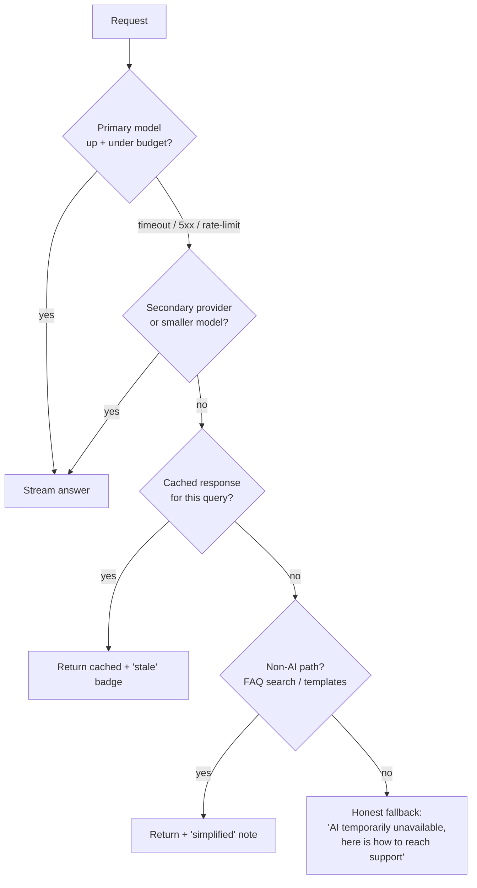

# Fallbacks & graceful degradation

> **In one line:** Every AI feature has a fallback ladder — bigger model → smaller model → cached response → non-AI path → "temporarily unavailable" — and the ladder runs *automatically* with a sensible UX at every rung.

:::tip[In plain English]
Providers go down. Models get rate-limited. Costs spike. Latency tails. Your AI feature has to keep working — or at least keep being honest — when any of that happens. The pattern is to define each fallback rung *up front* and wire automatic transitions; not "we'll figure out an outage in the postmortem." The cheap version of this work, done in week one, prevents the "AI is broken, status page is green" days that cost trust.
:::

## The fallback ladder



Each rung is faster, cheaper, and *worse* than the one above — but always better than a spinner or a 500.

## Pattern 1 — tiered model fallback

Cascade through providers/models on transient failure, not just on cost.

```typescript
type ModelTier = { provider: string; model: string; reason: 'primary' | 'fallback' };

const TIERS: ModelTier[] = [
  { provider: 'anthropic', model: 'claude-sonnet-4-5', reason: 'primary' },
  { provider: 'openai',    model: 'gpt-5',             reason: 'fallback' },
  { provider: 'anthropic', model: 'claude-haiku-4-5',  reason: 'fallback' },
];

async function streamWithFallback(messages: any[], signal: AbortSignal) {
  let lastError: unknown;
  for (const tier of TIERS) {
    try {
      return await tryStream(tier, messages, signal);
    } catch (e) {
      lastError = e;
      if (!isTransient(e)) throw e;     // a 400 isn't a fallback case
      metrics.incr('fallback.triggered', { from: tier.model, reason: classify(e) });
    }
  }
  throw lastError;                      // hand to the next rung
}

function isTransient(e: unknown): boolean {
  const status = (e as any)?.status;
  return status === 429 || status === 503 || status === 504 || (status >= 500 && status < 600);
}
```

Two principles:

- **Only fall back on transient errors.** A schema mismatch or content-policy refusal will fail on every tier; no point cycling.
- **Mark the response.** The client should know which tier served it — for UX badges, for evals, for capacity planning.

## Pattern 2 — cached-response fallback

When all models are unhappy, serve a relevant cached answer if you have one, *labelled as such*.

```typescript
async function answerWithFallback(question: string) {
  try {
    return await streamWithFallback([{ role: 'user', content: question }]);
  } catch (e) {
    const cached = await findCachedAnswer(question);  // semantic match in cache
    if (cached) {
      return { ...cached, kind: 'stale', staleness_seconds: cached.ageSeconds };
    }
    throw e;
  }
}
```

The client renders the stale answer with an "answers may be slightly out of date" badge. Much better than nothing; honest about what it is.

## Pattern 3 — non-AI fallback

For features where you have a deterministic baseline, fall back to it.

- **Smart support chat** → falls back to **FAQ keyword search** + an email-us form.
- **AI autocomplete** → falls back to **lexical prefix match**.
- **AI-powered category classifier** → falls back to **rule-based classifier** with a default of "needs human review."
- **AI summary** → falls back to **first paragraph + headings list**.

```typescript
async function summarize(text: string) {
  try {
    return await aiSummarize(text);
  } catch {
    return {
      summary: extractFirstParagraph(text),
      headings: extractHeadings(text),
      kind: 'simplified',
    };
  }
}
```

The non-AI version often handles 30–60% of the value at zero cost and zero downtime risk. Worth keeping around even when the model is up.

## Pattern 4 — honest "temporarily unavailable"

When even the non-AI baseline isn't appropriate, *say so*. Don't hide AI failures behind a spinner or a generic error.

```tsx
function UnavailableNotice({ retryAt }: { retryAt: Date }) {
  return (
    <div className="rounded border bg-amber-50 p-4">
      <p>The assistant is temporarily unavailable. We expect it back shortly.</p>
      <p>In the meantime:</p>
      <ul className="mt-2 list-disc pl-5">
        <li><a href="/help">Browse the help center</a></li>
        <li><a href="mailto:support@acme.com">Email support</a> (reply within 4 hours)</li>
      </ul>
      <p className="mt-2 text-sm text-gray-500">Estimated return: {retryAt.toLocaleTimeString()}</p>
    </div>
  );
}
```

A clear notice is worth more than 20 retries of a broken call.

## Worked example — full ladder for the support assistant

Putting the whole ladder together in one request handler:

```typescript
export async function POST(req: Request) {
  const { messages, userId, tenantId } = await parse(req);

  // Rung 0: kill switch
  if (await flags.killed('support_assistant')) {
    return Response.json(buildUnavailable(new Date(Date.now() + 5 * 60_000)));
  }

  // Rung 1: tiered models
  try {
    const result = await streamWithFallback(messages, req.signal);
    return result.toDataStreamResponse({ headers: { 'x-tier': result.tier } });
  } catch (e) {
    log.warn('all model tiers failed', { error: e });
  }

  // Rung 2: cached answer for this question
  const question = messages.at(-1)?.content ?? '';
  const cached = await findCachedAnswer(question, tenantId);
  if (cached) {
    return Response.json({ ...cached, kind: 'stale' }, { headers: { 'x-tier': 'cache' } });
  }

  // Rung 3: non-AI FAQ search
  const faq = await faqSearch(question, tenantId);
  if (faq.length) {
    return Response.json({
      kind: 'simplified',
      text: 'I cannot run the assistant right now, but these articles might help:',
      links: faq.slice(0, 3),
    }, { headers: { 'x-tier': 'non-ai' } });
  }

  // Rung 4: honest unavailable
  return Response.json(
    buildUnavailable(new Date(Date.now() + 5 * 60_000)),
    { status: 503, headers: { 'x-tier': 'unavailable' } },
  );
}
```

Every rung has a header so observability can show, in production, how often the system runs on each. Healthy is "primary 99%, secondary 0.9%, cache 0.05%, non-ai 0.04%, unavailable 0.01%." A pathological day is "primary 30%" and you go fix providers, not customers.

## Picking the right ladder per feature

- **Real-time chat (user is waiting):** tiered models → cached → non-AI → unavailable. Honest, fast.
- **Batch jobs (no one's watching):** tiered models → queue + retry. No need for non-AI fallback.
- **Background features (alt text, classification):** tiered models → non-AI default → skip. Don't break the surrounding flow.
- **High-stakes actions (billing, legal):** stricter — refuse rather than degrade. "Cannot complete right now, please try again."

The right ladder depends on whether degraded output is *useful* or *dangerous* in your context.

## Watch out for

- **Retrying non-transient errors.** A 400 (bad schema, bad arguments, content-policy refusal) will fail every fallback. Classify before retrying.
- **Cascading the wrong models.** A fallback that's also rate-limited at the same time as primary isn't a fallback. Diversify providers (Anthropic + OpenAI + Google) for true outage resilience.
- **Silent staleness.** A cached answer rendered as if it were live is worse than no answer. Always badge `stale`.
- **Retry storms.** When the primary fails, every concurrent request retries the secondary, and now the secondary falls over. Add jitter, circuit breakers, and a brief cooldown before retrying after multiple failures.
- **No retry budget.** Fallbacks across N providers with 3 retries each = 3N requests on a bad day. Cap retries per request and per minute.
- **Fallback that costs more than primary.** When you fall back from Sonnet to Opus, the math breaks at scale. Cheaper next, then cached, then non-AI.
- **No alerting on fallback rates.** Healthy systems have a low, stable fallback rate. A jump to 5% should page; a jump to 30% should set off everything.

## 2026 stack

| Layer              | Default pick                                                                |
|--------------------|-----------------------------------------------------------------------------|
| Multi-provider routing | Portkey, OpenRouter, LiteLLM gateway. Or build inline with Vercel AI SDK's `provider` param. |
| Circuit breakers   | `opossum` (TS), `pybreaker` (Py); or a service-mesh circuit breaker.        |
| Retries / backoff  | `p-retry`, `cockatiel` (TS); `tenacity` (Py).                              |
| Feature flags / kill switches | LaunchDarkly, Statsig, Vercel Edge Config.                     |
| Cached answers     | Redis / Upstash with semantic-match keys (embed-then-knn over recent cache entries). |
| Non-AI baseline    | Whatever your search/match/template infra already is (Postgres, Algolia, Elastic). |

:::note[Fallbacks as feature design, not error handling]
The teams who get fallbacks right don't think of them as "what we do when the model fails." They think of them as **alternate experiences with a known quality floor**, planned and shipped alongside the AI version.

Specifically: write the non-AI version *first*. Ship it. Add the AI version as an upgrade. The non-AI version is then *automatically* your bottom rung when AI breaks — already tested, already live, already understood. The product never falls below it.
:::

---

→ Next: [Complete worked example](./13-complete-example.md).
