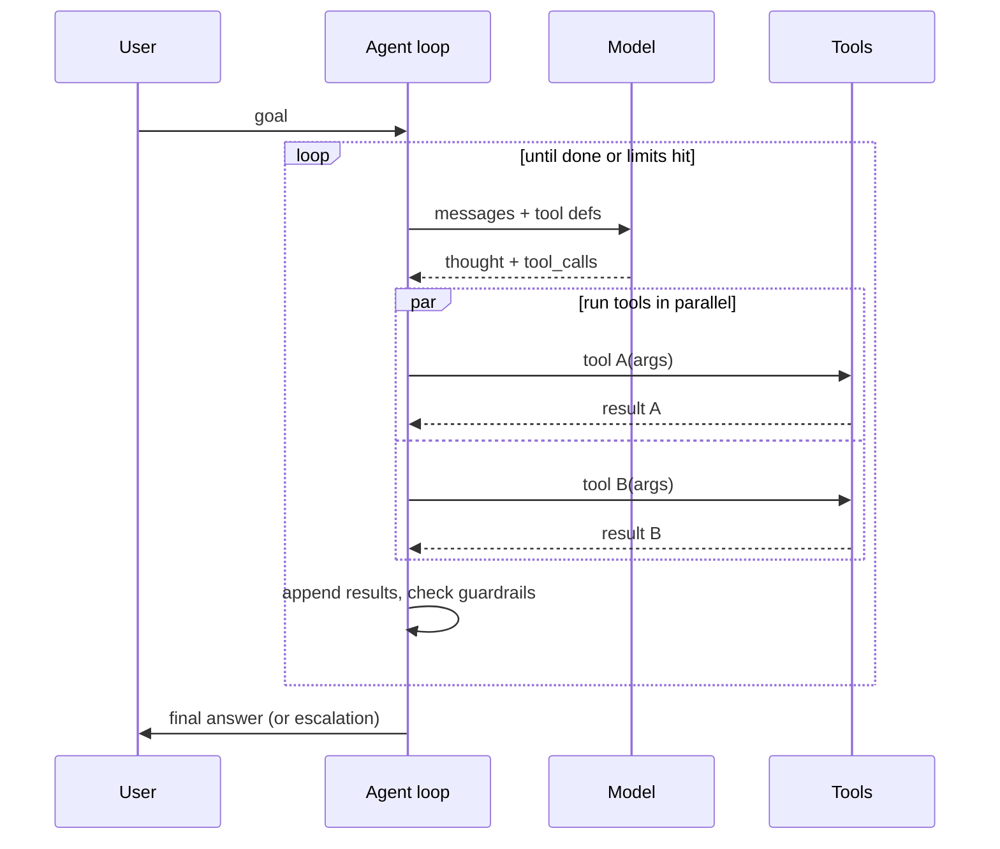

# The agent loop with guardrails

> **In one line:** The naive agent loop is 30 lines. The production one is 200, because of the guardrails. The guardrails are non-negotiable.

:::tip[In plain English]
"Agent" sounds magical; the implementation is plain. The model thinks, calls a tool, sees the result, thinks again, calls another tool, and stops when it has the answer. The whole job of production code is to keep this loop from running forever, costing too much, doing irreversible damage, or silently failing. Those bounds *are* the product.
:::

## The shape



## Required guardrails

- **`max_steps` cap.** Hard. 5–10 for most flows; 20 only with evidence.
- **`max_tool_calls_per_step` cap.** Stops parallel-call explosions.
- **`max_total_cost` per run.** Track input + output tokens × price; abort when exceeded.
- **Tool-call deduplication.** A model that calls `get_user(123)` 5× in 5 steps is confused; surface that signal.
- **Structured tool errors** (see [tool use](./tool-use.md)).
- **Per-step logging.** Tool name, args, result, latency, cost. You will need this when something goes wrong.
- **Trace ID.** Every call inside the run shares a trace ID; observability platforms group them.
- **Human handoff.** A `request_human(reason)` tool the model can call when it's stuck — and that you call *for* it when guardrails trip.

## Optional but high-value

- **Planner step.** Before the main loop, ask the model to outline a plan. Use it as a check on the loop's behavior.
- **Reflection step.** After every N tool calls, ask the model to summarize what it knows and what's left. Helps it avoid loops.
- **Checkpoint and resume.** With orchestration (Inngest / Temporal / Restate), an agent that crashes mid-loop can resume from the last completed step.
- **Confirmation steps for side effects.** Render a card; user clicks Confirm; *then* the tool runs.

## Worked example — bounded support agent (TypeScript)

The third layer of our support assistant: a small agent loop on top of the tools from the [tool-use page](./tool-use.md), with explicit budgets and a forced handoff path.

```typescript
import { generateText, tool } from 'ai';
import { anthropic } from '@ai-sdk/anthropic';
import { lookupOrder, escalateToHuman, scheduleFollowup } from './tools';
import { logStep } from './observability';

interface AgentLimits {
  maxSteps: number;
  maxTotalCostUsd: number;
  maxToolCallsPerStep: number;
}

const DEFAULT_LIMITS: AgentLimits = {
  maxSteps: 6,
  maxTotalCostUsd: 0.25,
  maxToolCallsPerStep: 4,
};

export async function runSupportAgent(
  messages: any[],
  traceId: string,
  limits: AgentLimits = DEFAULT_LIMITS,
) {
  const seenCalls = new Set<string>();
  let totalCost = 0;
  let stepNum = 0;

  const result = await generateText({
    model: anthropic('claude-sonnet-4-5'),
    system: SUPPORT_SYSTEM_PROMPT,
    messages,
    tools: { lookupOrder, escalateToHuman, scheduleFollowup },
    maxSteps: limits.maxSteps,
    onStepFinish: async (step) => {
      stepNum += 1;
      totalCost += estimateCost(step.usage);

      const calls = step.toolCalls ?? [];
      if (calls.length > limits.maxToolCallsPerStep) {
        throw new AgentLimitError('too_many_tool_calls', { step: stepNum, count: calls.length });
      }
      for (const call of calls) {
        const sig = `${call.toolName}(${JSON.stringify(call.args)})`;
        if (seenCalls.has(sig)) {
          await logStep(traceId, { stepNum, type: 'duplicate_call', call: sig });
        }
        seenCalls.add(sig);
      }
      if (totalCost > limits.maxTotalCostUsd) {
        throw new AgentLimitError('budget_exceeded', { totalCost });
      }
      await logStep(traceId, {
        stepNum,
        toolCalls: calls.map((c) => ({ name: c.toolName, args: c.args })),
        usage: step.usage,
        costUsd: totalCost,
      });
    },
  });

  return result;
}

class AgentLimitError extends Error {
  constructor(public reason: string, public context: any) { super(reason); }
}
```

The wrapper handling the forced-handoff case:

```typescript
try {
  return await runSupportAgent(messages, traceId);
} catch (e) {
  if (e instanceof AgentLimitError) {
    await escalations.create({
      reason: 'agent_limit',
      summary: `Limit hit: ${e.reason}. Conversation thread ${traceId}.`,
    });
    return {
      text: "Let me hand this to a human teammate — I want to make sure you get the right answer.",
      escalated: true,
    };
  }
  throw e;
}
```

A failure mode is now a *product surface*, not a 500. Every termination path has a trace and a human follow-up.

## What to measure per agent run

- Step count.
- Tool-call count (total + per tool).
- Cost (input + output tokens × price).
- Wall-clock time.
- Final outcome (`success`, `partial`, `failure`, `human_handoff`, `limit_hit`).

A dashboard of these by feature surface tells you which agent designs are healthy and which are pathological. Healthy agents have a tight, narrow distribution; pathological agents have a long tail in step count and cost.

## Watch out for

- **No `max_steps`.** Without it, a confused agent burns hundreds of dollars in one request. Cap it before you ship.
- **Letting the model retry tool failures forever.** A 500 from your DB shouldn't cause the agent to call the same tool 10 times. Surface the error as `{error, retry_after, fallback}` and trust the model less than you trust your circuit breaker.
- **Re-asking the model to "think harder."** Reflection loops can help; "think harder" prompts rarely do. Measure first.
- **Bundling unrelated subtasks into one agent.** A "do everything" agent is harder to evaluate than a deterministic orchestrator that calls three specialized agents. Compose; don't conflate.
- **Skipping the trace ID.** Without one, debugging a 12-step failure is archaeology. Generate a trace ID at the entry point and thread it through every tool call and every log line.
- **Trusting an agent to be safe with side effects.** Wrap side-effectful tools in human confirmation. Always. ([Safety](./11-safety-privacy.md) goes deeper.)

## 2026 stack

| Layer            | Default pick                                                                       |
|------------------|------------------------------------------------------------------------------------|
| Agent runtime (TS) | Vercel AI SDK `generateText({ tools, maxSteps, onStepFinish })`. Direct provider SDK if you need more control. |
| Agent runtime (Py) | OpenAI SDK + Pydantic AI, or the Anthropic SDK's tool loop. Frameworks: LangGraph (graph-based) or smolagents (minimal). |
| Orchestration    | Inngest, Temporal, or Restate — for resumable, long-running, multi-step agents.   |
| Observability    | Langfuse (OSS default), Braintrust, LangSmith. Capture per-step trace.            |
| Limits           | Build into the loop yourself. Frameworks ship inconsistent defaults.              |

## When *not* to use an agent

The most common mistake is reaching for an agent when a deterministic pipeline would do. The decision rule:

- **Single retrieve → single answer.** Use RAG, not an agent.
- **Fixed N steps in known order.** Write the orchestrator in code; call the model for each step.
- **Steps depend on prior steps' output in non-obvious ways.** Now you have a real agent case.
- **The task is genuinely open-ended** (research, complex debugging, multi-turn planning). Agent.

A useful heuristic: if you can sketch the flow as a flowchart with fixed boxes and arrows before writing any code, you don't need an agent. If the next step truly *depends* on what the previous one found, you do.

Agents cost more, fail in more ways, and are harder to evaluate than deterministic orchestrators. Reach for them when the problem actually has the shape; otherwise the simpler pattern wins on every axis.

:::note[Most "agent" problems are tool-design problems]
When an agent loops, hallucinates a tool name, or fails to make progress, the first instinct is to swap models or change the system prompt. The actual cause is almost always the tool surface: too many tools, fuzzy descriptions, opaque errors, or one tool whose return value the model can't reason about.

Fix the tools first. The agent loop almost always follows.
:::

---

→ Next: [Evals as a product surface](./evals.md).
