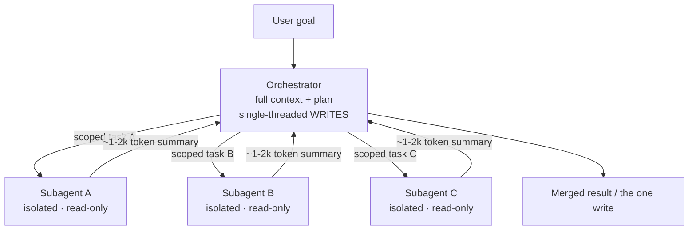

# Multi-agent orchestration

> **In one line:** Single-agent is still the 2026 default. When you do go multi-agent, the shape that ships is one orchestrator with the full plan, single-threaded writes, and isolated read-only subagents that return *summaries* — not a swarm of peers freely collaborating.

> **← Foundations:** New to the idea of multiple agents? Start with [multi-agent foundations](../01-foundations/multi-agent.md), then come back here for the production shape.

:::tip[In plain English]
Think of a senior engineer leading a research sprint. They hold the whole plan in their head and they're the only one who edits the shared doc. They send junior researchers off to dig into separate topics in parallel, each comes back with a one-page brief — not their entire browser history — and the lead stitches the briefs together. The juniors never edit the doc and never argue with each other. That's the pattern. Everything else is the lead's job.
:::

## Why single-agent is still the default

For coding and any task with tightly interdependent parts, one agent in one context window is the 2026 default. It's cheaper, it's far easier to debug (one transcript, one trace), and it dodges the real failure mode of naive multi-agent systems: **parallel agents make conflicting implicit decisions that don't merge cleanly.** Two subagents writing the same module each pick a different data shape, a different error convention, a different name for the same thing — and when you glue their outputs together you get a Frankenstein that compiles but is incoherent.

So the bar for going multi-agent is high: the task must genuinely decompose into **independent, parallelizable, read-mostly subtasks**. "Research these 8 companies in parallel" qualifies. "Build this feature" usually does not.

## The shape that ships: orchestrator-worker

The canonical production pattern is **orchestrator-worker** (also called lead-and-subagents, or map-reduce with read-only workers):

- **One orchestrator** owns the full context and the plan.
- It **spawns isolated subagents**, often in parallel, each scoped to one piece.
- Each subagent does its work in its *own* context window and returns a **compressed summary** (~1–2k tokens), not its raw transcript.
- The orchestrator merges the summaries and is the **only** place that takes real actions or makes edits — this is the **single-threaded writes** rule.



Two numbers worth keeping honest. Anthropic reported this shape beat a single-agent baseline by **~90%** on their internal research-task eval — but it used roughly **~15× the tokens** of a normal chat. That economics is the whole point: orchestrator-worker is for high-value, parallelizable research, *not* for low-value tasks where 15× cost buys nothing.

## Why subagents are read-only

This is where the two loudest voices in the space converged. Cognition's *"Don't Build Multi-Agents"* (June 2025) argued hard for single-threaded agents plus aggressive context compaction. Their April 2026 follow-up softened the position — but only along one axis: extra agents can contribute **intelligence** (read-only gathering and analysis), they must not contribute **actions**. Writes stay single-threaded. Anthropic landed in the same place from the other direction. The 2026 consensus, then, is not peer-to-peer agents freely collaborating; it's:

> one orchestrator with full context **+** single-threaded writes **+** isolated, read-only subagents that gather/analyze and return summaries.

## A worked example

Here's a minimal orchestrator spawning isolated, read-only subagents in parallel and merging their compressed summaries. The orchestrator is the only thing that ever writes.

```python
import asyncio

# `llm(...)` is your model call; `read_tools` are read-only (search, fetch, grep).
# Note: no write/edit tools are handed to subagents — that's the single-threaded-writes rule.

async def subagent(task: str) -> str:
    """Isolated, read-only worker. Owns its OWN context window.
    Returns a compressed ~1-2k-token summary, NOT its raw transcript."""
    transcript = await run_agent_loop(
        system="You research one scoped question. Read-only. "
               "End with a <=300-word summary of findings + sources.",
        goal=task,
        tools=read_tools,          # read-only only
        max_steps=8,               # bound the worker; see ./agent-loop.md
    )
    return await llm(f"Compress to <=300 words, keep facts + citations:\n{transcript}")

async def orchestrate(goal: str) -> str:
    # 1. Lead owns the plan: decompose into INDEPENDENT, read-mostly subtasks.
    plan = await llm(f"Break this into independent parallel research tasks "
                     f"(one per line). If it doesn't cleanly decompose, return 'SINGLE'.\n{goal}")
    tasks = [t for t in plan.splitlines() if t.strip()]

    if tasks == ["SINGLE"]:
        return await run_single_agent(goal)   # cheaper + easier to debug; prefer this

    # 2. Fan out: isolated subagents run in parallel.
    summaries = await asyncio.gather(*(subagent(t) for t in tasks))

    # 3. Reduce: ONLY the orchestrator synthesizes and (if needed) writes.
    merged = "\n\n".join(f"## {t}\n{s}" for t, s in zip(tasks, summaries))
    return await llm(f"Synthesize one coherent answer to '{goal}' from these briefs:\n{merged}")
```

The shape to notice: subagents never share a context window, never write, and never talk to each other. They hand back compressed text. All coordination — and all conflict resolution — lives in the orchestrator's single head.

## Handoffs vs. orchestration

Don't confuse fan-out with **handoffs**. A handoff (a primitive in the OpenAI Agents SDK) is an explicit **transfer of control** from one agent to another — a triage agent hands the conversation to a refunds agent, and the refunds agent now drives. That's a sequential baton-pass, useful for routing in support flows. Orchestrator-worker is a parallel fan-out where control always returns to the lead. You'll use both, for different jobs.

## Frameworks people reach for

- **LangGraph** — stateful graphs, durable execution, human-in-the-loop checkpoints.
- **OpenAI Agents SDK** — handoffs, guardrails, built-in tracing.
- **Microsoft Agent Framework** — the successor to AutoGen + Semantic Kernel.
- **Google ADK** — Google's agent development kit.

The framework is the easy part. The discipline — single-threaded writes, read-only workers, compressed summaries — is what keeps the system debuggable. Agent-to-agent coordination protocols (see [MCP / A2A](../01-foundations/mcp.md)) standardize the wiring, but they don't change the shape you should pick.

## Why it matters

Multi-agent is the most over-applied pattern of 2026. Teams reach for a swarm because it sounds powerful, then drown in cost (15× tokens), latency (parallel still waits on the slowest worker), and un-debuggable transcripts (five agents, five contexts, conflicting decisions). The teams that ship multi-agent successfully do exactly one thing differently: they keep it boring. One orchestrator, single-threaded writes, read-only workers, compressed handbacks — and they reserve it for tasks that *genuinely* parallelize. Get that discipline right and you get the ~90% research lift. Get it wrong and you've paid 15× for a more confusing single agent.

:::caution[Common pitfalls]
- **Going multi-agent before the task decomposes.** If subtasks share state or depend on each other's decisions, stay single-agent. The merge cost will eat any parallelism gain.
- **Letting subagents write.** The moment two agents take actions, you've reintroduced conflicting-implicit-decision merges. Workers gather and analyze; the orchestrator acts.
- **Returning raw transcripts instead of summaries.** Pumping each worker's full context back into the orchestrator blows the context window and the budget. Compress to ~1–2k tokens.
- **Ignoring the 15× cost.** Orchestrator-worker is for high-value, parallelizable work. Running it on low-value tasks is just expensive theater.
- **No per-subagent guardrails.** Each worker still needs `max_steps`, cost caps, and structured errors (see [the agent loop](./agent-loop.md)); fan-out multiplies runaway loops.
- **Skipping orchestration-level evals.** A multi-agent system can be right on every subtask and wrong overall. Evaluate the merged output and the trajectory, not just the parts (see [evaluating agents](../13-evaluation/095-agent-evaluation.md)).
:::

<Quiz id="agent-orchestration-quiz" title="Check yourself: multi-agent orchestration" sampleSize={3}>
  <Question
    prompt="What is the single most important reason single-agent remains the 2026 default for coding and tightly-interdependent tasks?"
    options={[
      { text: "Models can't call tools in parallel inside one context" },
      { text: "Parallel agents make conflicting implicit decisions that don't merge cleanly" },
      { text: "Multi-agent systems can't be traced or logged at all" },
      { text: "Subagents are not allowed to read files" }
    ]}
    correct={1}
    explanation="The core failure mode is incoherent merges: parallel agents independently pick different data shapes, names, and conventions, so gluing their outputs together yields something that compiles but is internally inconsistent. Cost and debuggability matter too, but the merge problem is what kills naive multi-agent on interdependent work."
  />
  <Question
    prompt="In the 2026 consensus orchestrator-worker shape, what do the isolated subagents return to the orchestrator?"
    options={[
      { text: "Their full raw transcript so the lead has every detail" },
      { text: "Nothing — they write their own results directly to the shared output" },
      { text: "A compressed ~1-2k-token summary of their findings" },
      { text: "A handoff that transfers control permanently to the next agent" }
    ]}
    correct={2}
    explanation="Subagents run in their own context windows and return a compressed summary (~1-2k tokens), not their raw transcript — that keeps the orchestrator's context and budget bounded. They don't write to shared output (single-threaded writes), and returning everything raw would defeat the whole point."
  />
  <Question
    prompt="A teammate proposes using orchestrator-worker to speed up writing a single tightly-coupled feature. What's the strongest objection?"
    options={[
      { text: "It's illegal to run more than one agent per request" },
      { text: "The task doesn't cleanly decompose, so ~15x token cost buys conflicting merges, not a speedup" },
      { text: "Subagents would refuse because they only do research" },
      { text: "LangGraph doesn't support parallel execution" }
    ]}
    correct={1}
    explanation="Orchestrator-worker earned its ~90% lift on independent, parallelizable, read-mostly research — at roughly 15x the tokens. A single tightly-coupled feature has interdependent parts, so you pay the 15x premium and still hit the conflicting-implicit-decisions merge problem. Stay single-agent until the work genuinely decomposes."
  />
</Quiz>

---
→ Next: [Evals as a product surface](./evals.md)
