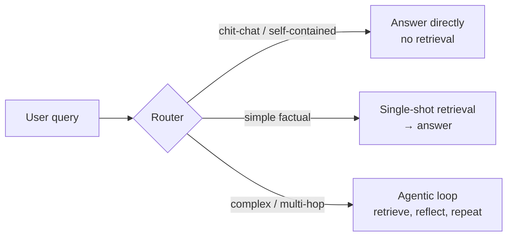

# Agentic RAG & GraphRAG

> **In one line:** Agentic RAG turns retrieval from a fixed first step into a *tool the model drives* — it decides when to retrieve, rewrites and decomposes the query, retrieves in multiple steps, and reflects on whether it has enough; GraphRAG adds a knowledge graph for "what are the themes across everything" questions.

> **← Foundations:** New to retrieval? Read [RAG basics](../01-foundations/rag-basics.md) for the minimal pipeline and [production RAG](./rag-prod.md) for hybrid search + reranking first. Agentic RAG sits *on top* of that baseline.

:::tip[In plain English]
Naive RAG is like a librarian who, no matter what you ask, always grabs exactly five books off the nearest shelf and reads from them — even when you only said "hello." Agentic RAG is a librarian who first asks "do I even need to look this up? If so, what should I actually search for, and is one trip to the stacks enough?" GraphRAG is the librarian who has already drawn a map of how every book relates to every other, so they can answer "what's the overall theme of this whole collection?" — a question no single book contains.
:::

## Naive RAG vs agentic RAG

**Naive RAG** = always retrieve once, then answer. Query in → embed → search → stuff top-k chunks into the prompt → generate. It is simple and works for single-hop FAQ lookups ("what's the refund window?").

It breaks on three things:

- **Questions that don't need retrieval** ("summarize what we just discussed") — you pay latency and risk injecting irrelevant chunks.
- **Multi-hop questions** ("which of our EU customers signed before the pricing change?") — the answer isn't in any single chunk; you need to retrieve, reason, then retrieve again.
- **Bad first queries** — the user's raw words often aren't the best search query.

**Agentic RAG** = the LLM acts as an *agent over retrieval*. Retrieval becomes one tool among several, and the model decides **when** to call it, **what** to search for (rewriting/decomposing the query), whether to retrieve **multiple times**, and whether the results are **sufficient** before answering. In 2026 this is the dominant pattern for complex and multi-hop workflows.

## Router / adaptive RAG: don't pay for retrieval you don't need

The cheapest upgrade is a **router** (also called *adaptive RAG*): a fast first step classifies the query into one of three paths.



The router is usually a small, cheap model (or a few-shot classifier). It saves money and latency on the common easy cases and reserves the expensive multi-step loop for the hard ones.

## A worked agentic-retrieval loop

Here is an illustrative loop where the model decides whether to retrieve, rewrites the query, retrieves, and reflects on sufficiency before answering. The `llm()` and `search()` calls are stand-ins for whatever model and hybrid-search backend you use — the *control flow* is the point.

```python
MAX_STEPS = 3

def agentic_rag(question: str) -> str:
    notes = []  # evidence gathered so far

    for step in range(MAX_STEPS):
        # 1) DECIDE: does the model need (more) evidence, and if so, what query?
        decision = llm(f"""
        Question: {question}
        Evidence so far: {notes or "none"}
        Reply as JSON: {{"action": "search" | "answer",
                         "query": "<search string if action=search>"}}
        Rewrite the search query to be specific and keyword-rich.
        """, as_json=True)

        if decision["action"] == "answer":
            break  # model says it has enough — exit early

        # 2) RETRIEVE: hybrid search + rerank (the production baseline)
        chunks = search(decision["query"], top_k=5)   # BM25 + vector → rerank

        # 3) REFLECT: are these chunks actually relevant to the question?
        for c in chunks:
            verdict = llm(f"Does this passage help answer '{question}'? "
                          f"Answer yes/no.\n\n{c.text}")
            if verdict.strip().lower().startswith("yes"):
                notes.append(c)

    # 4) ANSWER, citing only the gathered evidence (or admit ignorance)
    return llm(f"""
    Question: {question}
    Use ONLY this evidence; cite chunk ids. If insufficient, say so.
    Evidence: {notes}
    """)
```

Trace it on *"Which engineer reviewed the auth migration, and were they also on-call that week?"* — a two-hop question:

1. **Step 0 — decide:** model returns `{"action":"search","query":"auth migration code review reviewer name"}`. It rewrote the vague question into a keyword query.
2. **Retrieve + reflect:** finds the PR record — "reviewed by Priya." Keeps that chunk, drops an unrelated one about a *database* migration.
3. **Step 1 — decide:** model now has the reviewer's name but not the on-call fact, so it searches again: `{"action":"search","query":"on-call schedule week of auth migration Priya"}`. **This second hop is what naive RAG cannot do.**
4. **Retrieve + reflect:** finds the on-call rotation chunk, keeps it.
5. **Step 2 — decide:** `{"action":"answer"}`. The model answers with both facts, citing the two chunk ids.

Two safety rails matter here: the **`MAX_STEPS` cap** (otherwise a confused model loops forever and burns tokens) and the **reflect step** (otherwise irrelevant chunks poison the final answer). The reflect step is essentially [reranking](../01-foundations/reranking.md) done by the LLM itself — keep the cheap cross-encoder reranker in `search()` too; LLM reflection is a *second* filter, not a replacement.

## GraphRAG: when the answer spans the whole corpus

Everything above retrieves *chunks*. Some questions aren't about any chunk — they're about the corpus as a whole: *"What are the recurring themes across all incident reports this year?"* No top-5 retrieval can answer that, because the answer is a synthesis of hundreds of documents.

**GraphRAG** (popularized by Microsoft) addresses this. At index time it uses an LLM to extract entities and relationships from the corpus into a **knowledge graph** (nodes = entities, edges = relationships), then clusters the graph into communities and writes an LLM **summary of each community**. At query time, *global* questions are answered by combining those community summaries; *local* multi-hop questions are answered by walking the graph.

- **Strong for** global ("themes across everything") and multi-hop questions over large corpora.
- **Overkill for** simple single-hop FAQ lookups — it is slower and the indexing is expensive (an LLM call per chunk to extract entities). For those, plain hybrid search wins on cost and latency.
- Microsoft's GraphRAG repo is explicitly a **demonstration, not a supported product** — treat it as a reference architecture, not a turnkey dependency.
- **LazyGraphRAG** cuts the heavy upfront indexing cost dramatically by deferring most of the work to query time, which makes the approach far more affordable to try.

## Why it matters

Most production failures of RAG aren't embedding-model failures — they're *retrieval-strategy* failures: retrieving when you shouldn't, retrieving once when the question needed two hops, or searching the user's raw words instead of a good query. Agentic RAG fixes exactly those. And as context windows balloon, the recurring question is **"is RAG dead?"** — no. RAG and long context are *complementary*. A useful rule of thumb: if the whole corpus fits under ~200K tokens, you can often skip RAG and put it all in context (with prompt caching); above that, you retrieve. Agentic RAG is how you retrieve *well*.

:::caution[Common pitfalls]
- **Skipping the baseline.** Agentic RAG sits *on top of* hybrid search + reranking; it does not replace good chunking or a reranker. A clever loop over a bad retriever is still bad.
- **No step cap.** Without a `MAX_STEPS` limit (and a token/cost budget), a confused agent can loop indefinitely, re-searching forever. Always bound the loop.
- **Letting the model "always retrieve."** If you don't route, you pay retrieval latency and risk injecting irrelevant chunks even for "hi" or "summarize the above." Add a no-retrieve path.
- **Trusting reflection alone.** LLM "is this relevant?" checks are useful but cost tokens and can be wrong; keep a deterministic reranker and distance thresholds as well.
- **Reaching for GraphRAG by default.** It is expensive to index and overkill for single-hop FAQ. Use it for global/multi-hop questions over large corpora — or try LazyGraphRAG to defer the cost.
- **Evaluating only the final answer.** A multi-step agent can get the right answer via a wrong path (or waste five hops). Evaluate the *trajectory* — see [evaluating agents](../13-evaluation/095-agent-evaluation.md).
:::

<Quiz id="agentic-rag-quiz" title="Check yourself: agentic RAG" sampleSize={3}>
  <Question
    prompt="What is the defining difference between naive RAG and agentic RAG?"
    options={[
      { text: "Agentic RAG uses a larger embedding model" },
      { text: "In agentic RAG the model decides whether/what/how many times to retrieve, treating retrieval as a tool it drives" },
      { text: "Agentic RAG removes the need for a reranker" },
      { text: "Agentic RAG only works with knowledge graphs" }
    ]}
    correct={1}
    explanation="Naive RAG always retrieves once then answers. Agentic RAG makes the LLM an agent over retrieval: it decides when to retrieve, rewrites/decomposes the query, can retrieve multiple times, and reflects on sufficiency. It still relies on a good retrieval baseline (hybrid search + reranking), so it neither requires a bigger embedder nor removes the reranker, and it doesn't require a graph."
  />
  <Question
    prompt="A user asks a simple FAQ-style question over a large document set. Why might plain hybrid search be the better choice than GraphRAG here?"
    options={[
      { text: "GraphRAG cannot answer factual questions at all" },
      { text: "Hybrid search is more accurate on every question type" },
      { text: "GraphRAG's expensive entity-extraction indexing is overkill for single-hop lookups, where hybrid search is faster and cheaper" },
      { text: "GraphRAG requires the corpus to fit in the context window" }
    ]}
    correct={2}
    explanation="GraphRAG shines on global ('themes across everything') and multi-hop questions, but its LLM-driven entity-extraction indexing is expensive and slower at query time. For simple single-hop FAQ lookups that's overkill — plain hybrid search wins on cost and latency. (LazyGraphRAG defers much of that indexing cost if you do need the graph.)"
  />
  <Question
    prompt="Given much larger context windows in 2026, is RAG obsolete?"
    options={[
      { text: "Yes — just paste everything into the prompt every time" },
      { text: "No — RAG and long context are complementary; a rough rule is to skip RAG only when the whole corpus fits under ~200K tokens" },
      { text: "Yes, but only for corpora over 200K tokens" },
      { text: "No — long context never helps with retrieval problems" }
    ]}
    correct={1}
    explanation="RAG and long context are complementary, not rivals. A useful rule of thumb: if the entire corpus fits under ~200K tokens you can often put it all in context (with prompt caching) and skip retrieval; above that, you retrieve. Long context does help, but it doesn't make retrieval obsolete for large corpora."
  />
</Quiz>

---
→ Next: [The agent loop with guardrails](./agent-loop.md)
