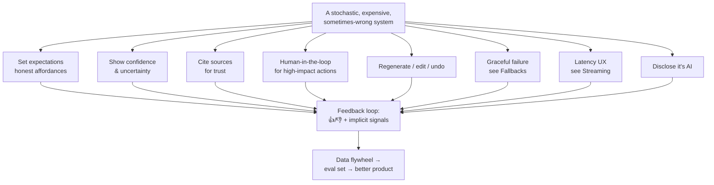
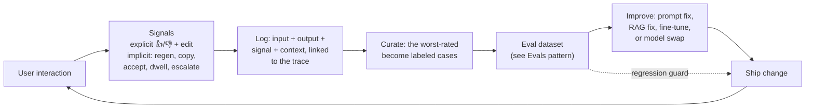

# Designing AI product UX

> **In one line:** Every AI UX pattern exists to do one job — keep the user in control of a system that is *stochastic* (it varies), *expensive* (every call costs real money), and *sometimes wrong* (it will confidently lie) — and the highest-leverage one is the feedback loop that turns each thumbs-down into a permanent eval case.

:::tip[In plain English]
A normal app is a vending machine: you press B4, you get the chips in slot B4, every time. An AI app is more like asking a brilliant, fast, slightly unreliable intern to do a task — they're usually great, occasionally confidently wrong, they take a few seconds to think, and each request quietly costs you money. You wouldn't hand that intern's work to a customer without a glance, and you wouldn't let them send an email on your behalf without seeing it first. **Every pattern on this page is a way of giving the user that same "let me glance at it / let me confirm / let me try again" control** — and a way of catching the intern's mistakes so they stop happening.
:::

This page is the *mental model* that ties the rest of the chapter together. [Streaming UX](./streaming-ux.md) solved one property (slow); [Fallbacks](./12-fallbacks.md) solved another (the provider breaks). This page names the **whole** problem and the family of UX moves that follow from it — and then teaches, in depth, the one move that's name-dropped everywhere and taught nowhere: the **feedback loop** that turns usage into a better product.

Three terms before we start, each defined the first time you'll need it:

- **Stochastic** means *random within bounds* — the same prompt can produce a different answer each time. This is the root cause of almost every AI UX problem: you cannot design a deterministic screen for a non-deterministic engine.
- **Human-in-the-loop (HITL)** means a person reviews or confirms the model's output *before* a consequential action happens. The standard safety pattern for anything irreversible.
- A **data flywheel** is a self-reinforcing loop: people use the product → their use generates labeled data → that data improves the model or prompt → the product gets better → more people use it. The compounding moat of a well-instrumented AI product.

## The one mental model

Treat every AI feature as a **control surface over a stochastic, expensive, sometimes-wrong system.** Three properties; each one *forces* specific UX. Memorize this table — every pattern below is a cell in it.

| Property | What the user feels | The UX job |
|---|---|---|
| **Stochastic** (varies, can't be previewed) | "Why is it different this time? Can I trust this run?" | Let them **regenerate**, **edit the input**, and **undo**. Set the expectation that output varies. |
| **Expensive** (every call bills) | (Invisible to the user, very visible to you) | Don't make the user pay for your fear: avoid forcing 5 regenerations to get a usable answer. Make the *first* output good, and make retries cheap and deliberate. |
| **Sometimes-wrong** (confidently hallucinates) | "Is this true? Where did it come from? Should I double-check?" | **Cite sources**, **show honest confidence**, **disclose it's AI**, and put a **human in the loop** before any high-impact action. |

The unifying principle, stated once: **a normal UI hides the machine and promises a result; an AI UI exposes just enough of the machine that the user can supervise it.** Hiding the machine ("make it feel magical") is the single most common AI-UX mistake — it removes exactly the controls the user needs to catch the machine being wrong.



The bottom of that diagram is the part most teams never build. The rest of this page walks every box, then spends most of its length on the flywheel.

## The patterns, one property at a time

### Setting expectations & honest affordances

An **affordance** is a UI element's signal of what it can do — a button looks pressable, a text field looks typeable. AI breaks naive affordances because the thing behind the button is unreliable. So set expectations *honestly*, up front:

- **Name the limits where the user can see them.** "I can answer questions about your orders and account. I can't change your billing." A model that's allowed to *try* anything will confidently fail at the things it can't do.
- **Don't dress up a guess as an answer.** If the feature is grounded in retrieved docs, the absence of a source should *look* different from a cited answer (see citations, below).
- **Make destructive affordances look heavier.** A "Send to all customers" button driven by AI should not look identical to "Save draft."

The failure mode to avoid: a slick, confident UI wrapped around an engine that's right 88% of the time. The polish makes users trust the 12% too.

### Showing confidence & uncertainty (and when NOT to fake a percentage)

Users calibrate their skepticism to the signal you give them — *if* the signal is honest. The trap is the **fake precision** of a raw number.

- **Good:** a coarse, honest band. "High confidence" / "Review carefully" / "Low confidence — please verify." Three states a human can act on.
- **Bad:** `0.78`. Two problems. First, users can't calibrate to it — is 0.78 good? Second, and worse: **a softmax probability is not a calibrated confidence.** A model that outputs "0.92" is not right 92% of the time; the number is the model's internal token probability, which is often wildly overconfident. Showing it as a percentage is a *lie dressed as math*.

:::caution[When NOT to show a confidence number]
Never surface a raw model probability (a logprob-derived `0.91`, a "self-rated 9/10") as if it were a true accuracy. Models are systematically overconfident and poorly *calibrated* — calibration means stated confidence matches real accuracy, and most models fail it badly. Show a number only if you have **measured** that, say, your "high-confidence" bucket really is right ~90% of the time on held-out data (an *eval* job, not a vibe). Until you've measured it, show a coarse honest band or nothing — a missing confidence signal is more honest than a fabricated one.
:::

How to derive an *honest* signal without lying: thresholded **retrieval similarity** ("found a strong matching source" vs "no good match"), a **self-consistency** check (run it 3× cheaply; if the answers disagree, that's genuine uncertainty), or a **measured** confidence bucket you've validated against labels. All three map to a coarse band, not a decimal.

### Citations & sourcing for trust

If the answer is grounded in retrieved documents, **show the source inline and make it clickable.** This is the single highest-leverage trust pattern in the chapter — the [AI Product Design](/docs/startup/startup-ai-design) lesson documents a legal-research team that lifted feature NPS from 6 to 8.5 with *citations alone*, no model change.

- Each claim links to the chunk it came from; clicking opens the source at the right place.
- If you *can't* cite (pure generation, no retrieval), **say so** — never imply grounding that isn't there. "Generated from the model's training, not your documents" is a real, useful disclosure.
- Citations also give you a free correctness check: if the model cited a chunk ID that wasn't in the retrieved set, it hallucinated the citation — catch and block it (this is a deterministic [eval](./evals.md) check).

### Human-in-the-loop for high-impact actions

The rule: **the higher the cost of being wrong, the more the human must be in the loop.** Reversibility is the axis.

| Action | Reversible? | Pattern |
|---|---|---|
| Draft a reply (user still sends) | n/a — it's a draft | Show it, let them edit. No confirmation needed. |
| Send an email, post a comment | Hard to reverse | **Undo window**: queue for 5–10s, toast "Sent — Undo." |
| Charge a card, delete records, file legally | Irreversible | **Explicit confirmation** with a preview of exactly what will happen. Never auto-execute. |
| Bulk action across many records | Irreversible × N | Confirmation + a dry-run preview + a per-item review for the high-value slice. |

The mistake in both directions: a confirmation dialog on *every* trivial action trains users to click "OK" blindly (so the one that mattered gets clicked through too), while *no* gate on an irreversible action means the model's 5% error rate ships straight to production. Match the gate to the blast radius.

### Regenerate, edit, and undo

These three are the user's core controls over *stochastic*:

- **Regenerate** — one click to roll the dice again, ideally with modifiers ("shorter", "more formal"). Cheap to build, massively reduces frustration with a single bad output. (But: if a user regenerates 5× in a row, that's a strong implicit "this is bad" signal — capture it, see the flywheel.)
- **Edit the input, not the output.** Power users want to refine. Let them edit the *prompt* and re-run, rather than hand-editing the output into an artifact the model can no longer help with. "Edit this message → re-run the turn" keeps the model in the loop.
- **Undo** — for any action the AI took, an undo window. The queue-then-execute pattern (toast "Sent — Undo") gives real reversibility without taxing every interaction with a confirm dialog.

### Graceful failure, latency, and disclosure

Three patterns this page only *names*, because they have their own homes — but they're part of the same mental model:

- **Graceful failure & fallbacks.** When the provider is down, slow, or returns garbage, degrade honestly — never spin forever. The full fallback ladder (tiered model → cached → non-AI → "temporarily unavailable") is its own pattern: see [Fallbacks & graceful degradation](./12-fallbacks.md). *(Don't re-implement it here; cross-link it.)*
- **Latency UX.** A 4-second blocking wait feels broken even if the answer is perfect; stream the answer and name the step the system is on ("searching your docs…"). The full treatment is [Streaming UX](./streaming-ux.md).
- **AI disclosure & trust.** Label AI output as AI. "Generated by AI" is not embarrassing — it's what lets the user apply appropriate skepticism, and in many jurisdictions and app stores it's becoming required. Hiding the AI to "feel magical" removes the user's reason to double-check the 12% of outputs that are wrong.

### The interface decision: chat vs structured vs agent

Before any of the above, one architectural UX choice decides everything downstream: **what shape is the interface?**

| Shape | What it is | Use when | Cost |
|---|---|---|---|
| **Chat** | Open text box, conversation | The task is genuinely open-ended and exploratory (research assistant, general copilot). | Maximal freedom, minimal guidance — users don't know what to type, and you can't constrain the output shape. A chat box for a structured task is usually the *lazy* choice. |
| **Structured / inline** | AI lives inside the existing UI: a "summarize" button, an autofilled field, a suggested reply chip | The task is *specific and recurring* — most product features. | More design work, far better UX. The user never faces a blank prompt; the output slots into a known shape you can validate and cite. |
| **Agent** | The model takes multi-step actions toward a goal, with tool calls | The task needs the model to *do* things across steps (book the trip, triage the inbox), not just answer. | Most power, most risk — every high-impact action needs HITL gates, and the [agent loop](./agent-loop.md) needs its own guardrails. |

The default instinct — "ship a chatbot" — is usually wrong for a domain task. A contract reviewer needs a side-by-side diff with inline suggestions, not a chat window. **Design for the task, not for the demo.**

## The feedback loop in depth: from thumbs to a data flywheel

This is the pattern everyone references and nobody teaches. Here it is in full.

**The core idea:** every interaction with an AI feature is an unlabeled data point. A thumbs-up/down, an edit, a regenerate, an accepted-vs-discarded suggestion — these are *labels* the user hands you for free. Collected and structured, they become an **eval dataset** that drives model and prompt improvement. That's the **data flywheel**: usage → labels → better model → more usage.



### Step 1 — capture both explicit and implicit signals

**Explicit signals** are the ones the user deliberately gives:

- **Thumbs up / down** on each output — the canonical one. Add an optional "what was wrong?" follow-up on a down-vote (a tag list: *inaccurate, off-topic, too long, unsafe, wrong tone*) — the tag is worth ten times the raw down-vote, because it tells you *which* eval slice to grow.
- **The edit itself.** If the user edits an AI draft before sending, the **diff between draft and sent** is a gold-standard label — it's a human telling you exactly what "better" looks like.

**Implicit signals** are far more abundant and often more honest (users rarely click thumbs, but they always *act*):

| Implicit signal | What it usually means |
|---|---|
| Regenerated immediately | The first output was bad. |
| Copied the output / clicked "use this" | The output was good (a positive label). |
| Accepted a suggestion vs dismissed it | Direct accept/reject label (this is how coding-assistant flywheels work). |
| Edited heavily before using | Partially good; the edit is the correction. |
| Escalated to a human / abandoned the session | Strong negative — the AI failed the task. |
| Dwell time, then no action | Weak signal; the user read it and didn't trust it. |

A practical rule: **instrument implicit signals from day one, because you'll get 100× more of them than thumbs.** Thumbs are sparse and biased (angry users click down; happy users click nothing).

### Step 2 — instrument it (the actual wiring)

Capture the signal *attached to the trace* so you can reconstruct the full input later. The minimum payload: a stable output ID, the resolved input (messages + retrieved context + the prompt/model version), the signal, and any tag.

```typescript
// Client — a feedback control on each AI message
async function sendFeedback(outputId: string, signal: 'up' | 'down', tag?: string) {
  await fetch('/api/feedback', {
    method: 'POST',
    body: JSON.stringify({ outputId, signal, tag }),
  });
}

// Implicit signal: a regenerate is an automatic soft "down" on the prior output
function onRegenerate(prevOutputId: string) {
  void sendFeedback(prevOutputId, 'down', 'implicit:regenerated');
  regenerate();
}
```

```typescript
// Server — persist the label JOINED to the trace, not floating on its own
export async function POST(req: Request) {
  const { outputId, signal, tag } = await req.json();
  const trace = await traces.get(outputId);   // the logged input + output + prompt/model version

  await feedback.insert({
    output_id: outputId,
    signal,                                    // 'up' | 'down'
    tag,                                       // 'inaccurate' | 'implicit:regenerated' | ...
    input: trace.resolvedInput,                // messages + retrieved chunks
    output: trace.output,
    prompt_version: trace.promptVersion,       // so you know which version earned the vote
    model: trace.model,
    tenant_id: trace.tenantId,                 // so you can slice later
    created_at: new Date(),
  });
  return Response.json({ ok: true });
}
```

The non-negotiable detail: **store the resolved input and the prompt/model version with the label.** A thumbs-down with no way to reconstruct what produced it is a number you can't learn from. This is why feedback lives next to your [observability traces](/docs/stack/observability-tools), not in a separate analytics tool.

### Step 3 — labels become an eval dataset

Now the flywheel turns. Periodically (weekly, or on a cron), take the **worst-rated real interactions** — the down-votes, the heavily-edited drafts, the escalations — and promote them into your [eval set](./evals.md) as labeled cases:

- The **input** is the real user request (plus the real retrieved context).
- The **expected-good output** is either the human's edited version (you already have it from the edit diff) or a gold answer written during curation.
- The **assertion** encodes the fix: "must cite a source", "must not invent a phone number", "must escalate when out of scope".

Every promoted case becomes a regression guard: the next prompt or model change that would reproduce that failure now fails CI *before* it ships. This is the same move the [incident-response](./incident-response.md) page calls the highest-leverage habit in the chapter — except here the source isn't a 2 a.m. fire, it's the steady drip of everyday thumbs-downs. (For the discipline of running and slicing that eval set, see [Evals as a product surface](./evals.md).)

### Step 4 — close the loop into model/prompt improvement

The curated dataset drives improvement, cheapest lever first:

1. **Prompt fix** — most down-votes cluster into a few patterns (wrong tone, too long, ignores a rule). Fix the prompt, run it against the eval set, confirm the cluster's pass rate went up *without* regressing the rest.
2. **RAG fix** — if the failure tag is mostly "inaccurate / no source," the problem is retrieval, not generation. Fix chunking/reranking; the cited-source eval checks confirm it.
3. **Fine-tuning** — at volume, the accumulated input→good-output pairs *are* a fine-tuning dataset (this is the [data flywheel as a moat](/docs/fine-tuning)). Thousands of real, human-corrected examples beat any synthetic set.
4. **Model swap** — sometimes the answer is a better base model; your eval set (built from real failures) is exactly what tells you if the swap actually helps your traffic — run it as a [safe model swap](./model-swaps.md).

The flywheel's compounding property: each turn makes the eval set richer, which makes the *next* improvement safer and more measurable. A year of this is a precise map of every way your product fails in the real world — a moat a competitor can't copy by switching to the same base model.

## Traced worked example — UX for an AI email-reply assistant

One realistic feature, every decision traced. The feature: inside a support inbox, an **"AI reply" assistant** drafts a response to the customer's latest email.

**1. Interface shape →** *Structured/inline, not chat.* The task is specific and recurring ("reply to this email"), so the AI lives as a **"Draft reply" button** above the compose box, not a chatbot. The output slots into a known shape: a draft in the editor the agent already uses. *(Decision driven by: the chat-vs-structured table — a chat box here would be the lazy choice.)*

**2. Latency →** *Stream the draft* into the compose box token by token, with a "Drafting…" indicator while it retrieves the customer's order history first. TTFT under ~800ms or it feels broken. *(Cross-link: [Streaming UX](./streaming-ux.md).)*

**3. Grounding & citations →** The draft references the customer's actual order. Each factual claim ("your order #AC-1234 shipped Tuesday") shows a small **source chip** linking to the order record. If retrieval found no matching order, the draft says so and the chip reads "no order found" — it does **not** invent a tracking number. *(Driven by: sometimes-wrong → cite sources; a hallucinated order number is the exact failure to block.)*

**4. Confidence →** No `0.84` anywhere. Instead: if retrieval similarity was strong *and* the model didn't hit a refusal, the draft appears normally; if retrieval was weak, a coarse banner reads **"Low confidence — please verify the order details before sending."** *(Driven by: never fake a percentage; show a measured/derived coarse band or nothing.)*

**5. Human-in-the-loop →** This is the whole point: **the AI never sends.** It produces a *draft* the human agent reads, edits, and sends. Sending an email is hard-to-reverse, so even after the human hits send there's a **5-second "Sent — Undo"** window. *(Driven by: HITL table — draft = no gate; send = undo window; the model is never trusted to auto-send.)*

**6. Regenerate / edit →** "Regenerate" with modifiers ("more apologetic", "shorter"). The agent usually *edits* the draft before sending — and that's not just UX, it's the richest signal in the whole feature (next step).

**7. Disclosure →** The compose box shows a small "Drafted by AI — review before sending" label, both for the agent's skepticism and so no one pretends a bot reply is hand-written. *(Driven by: AI disclosure.)*

**8. Graceful failure →** If the model provider is down, the button degrades to inserting a **template** ("Thanks for reaching out — we're looking into this") with an honest "AI drafting is temporarily unavailable" note, so the agent is never blocked. *(Cross-link: [Fallbacks](./12-fallbacks.md) — don't reimplement; reuse the ladder.)*

**9. The feedback flywheel →** This feature is a flywheel goldmine:
- **Explicit:** a 👍/👎 on each draft; a down-vote opens tags (*inaccurate, wrong tone, too long*).
- **Implicit and gold-standard:** the **diff between the AI draft and what the agent actually sent.** Every send is a human telling you exactly how the draft should have read.
- **Instrumented:** each draft is logged with its retrieved order context and prompt version; the sent-vs-draft diff is stored against it.
- **Closed:** weekly, the heaviest-edited drafts and the down-votes become [eval](./evals.md) cases (input = the email + order context; expected = roughly the sent version). The "wrong tone" cluster drives a prompt fix; the "invented tracking number" cases become a hard deterministic check. Six months in, the assistant's drafts need far less editing — and the eval set is a precise record of how this team's support replies should sound.

Read that back: nine UX decisions, every one traceable to *stochastic / expensive / sometimes-wrong*, and a feedback loop that makes the feature get better the more it's used. That's the whole discipline.

## Why it matters

The hardest truth about AI products is that **model quality is table stakes; UX is the moat.** Everyone can call the same frontier model. What they can't copy is a feature designed so users stay in control of its mistakes — and a feedback loop that's been compounding real corrections into a private eval-and-fine-tune set for a year. The legal-research team's NPS jump came from citations, not a model swap; the support-assistant's improvement comes from the edit-diff flywheel, not a bigger model. Teams that treat AI UX as "wrap the API in a chat box" ship a demo; teams that treat it as "give the user a control surface and instrument every interaction" ship a product that improves on its own. The patterns here are cheap — most are a few days of frontend — and they are, repeatedly, higher-leverage than the next model upgrade.

## Common pitfalls

:::caution[Where people commonly trip up]
- **Building a chatbot for a structured task.** Generic chat is a weak UX for almost every domain feature. Design for the task — a diff view, an inline suggestion, a button — not a blank prompt box.
- **Hiding the AI to "feel magical."** Polish wrapped around an 88%-correct engine makes users trust the wrong 12%. Disclose it's AI so users keep their skepticism.
- **Showing a fake confidence percentage.** A raw `0.91` softmax/logprob is not a calibrated accuracy and models are systematically overconfident. Show a *measured* coarse band or nothing — never a fabricated decimal.
- **Implying grounding that isn't there.** If you can't cite a source, say so. A confident answer that *looks* sourced but isn't is the most damaging kind of hallucination.
- **No human gate on irreversible actions — or a confirm dialog on everything.** Both are wrong. Match the gate to the blast radius: drafts free, sends get an undo window, irreversible actions get explicit confirmation with a preview.
- **Collecting thumbs but never using them.** A 👍/👎 with no pipeline into the eval set is theater. The signal is only worth capturing if it's joined to the trace and curated into labeled cases.
- **Only capturing explicit feedback.** Thumbs are sparse and biased. Implicit signals — regenerate, edit-diff, accept/dismiss, escalate — are 100× more abundant and often more honest. Instrument them first.
- **Logging feedback without the input.** A down-vote you can't trace back to the exact input + retrieved context + prompt version is a number you can't learn from. Store the resolved input with every label.
:::

## Practice — design the control surface

Pick a feature you'd actually build — say, an **"AI meeting-notes summarizer"** that turns a transcript into action items. On paper, write the eight decisions from the worked example for *your* feature:

1. **Interface shape** — chat, structured/inline, or agent? Justify against the table.
2. **Latency** — what streams, and what status do you show while it works?
3. **Citations** — can you ground action items in transcript timestamps? If not, how do you disclose that?
4. **Confidence** — is there an *honest* coarse signal, or do you show none? (Resist the fake percentage.)
5. **Human-in-the-loop** — does any action need a gate? (E.g. "auto-create Jira tickets" is irreversible-ish — what's the pattern?)
6. **Regenerate / edit** — what does the user edit, the output or the input?
7. **Disclosure & fallback** — how is it labeled, and what happens when the provider is down?
8. **Feedback flywheel** — which *implicit* signal is your gold-standard label here? (Hint: which action does the user take that *corrects* the AI?)

Then ask the meta-question: for each decision, **which of the three properties (stochastic / expensive / sometimes-wrong) forced it?** If a decision maps to none of them, you may be gold-plating. If a property maps to no decision, you have a gap.

<Quiz id="pattern-ai-product-ux-quick-check" variant="micro" title="Quick check" sampleSize={3} passingScore={0.67}>

<Question
  prompt="A teammate wants to show users a confidence score next to each AI answer, using the model's logprob-derived probability rendered as '0.91'. What's the right call?"
  options={[
    { text: "Ship it — a precise number is more transparent than a vague label" },
    { text: "Don't surface the raw probability as accuracy: models are poorly calibrated and systematically overconfident, so show a coarse honest band only if you've measured it — otherwise show nothing" },
    { text: "Show it, but multiply by 100 and add a '%' so it reads as a percentage" },
    { text: "Always show the largest logprob in the response as the confidence" }
  ]}
  correct={1}
  explanation="A softmax/logprob probability is the model's internal token confidence, not a measured accuracy — and models are systematically overconfident, so '0.91' rendered as a percentage is a lie dressed as math. The honest move is a coarse band (high / review / low) that you've validated against held-out labels, or nothing at all. The 'precise number is transparent' option is the exact trap: precision the number doesn't actually have."
  revisit={{ to: "/docs/patterns/pattern-ai-product-ux", label: "Showing confidence (and when not to fake a percentage)" }}
/>

<Question
  prompt="You ship an AI email-reply assistant. You want the strongest possible signal for the feedback flywheel. Which signal is the gold-standard label?"
  options={[
    { text: "The thumbs-up rate, since explicit feedback is the most reliable" },
    { text: "Total number of drafts generated per day" },
    { text: "The diff between the AI's draft and what the human agent actually sent — a human showing you exactly how the draft should have read" },
    { text: "Average response latency of the draft endpoint" }
  ]}
  correct={2}
  explanation="The edit-diff is a human correction: the input is the real email plus order context, and the expected-good output is the version the human actually sent — exactly the (input, gold output) pair an eval or fine-tuning set needs. Thumbs are sparse and biased; counts and latency are operational metrics, not labels. Implicit correction signals like the edit-diff are the richest and most abundant labels you'll get."
  revisit={{ to: "/docs/patterns/pattern-ai-product-ux", label: "The feedback loop in depth — capture signals" }}
/>

<Question
  prompt="Per this page's mental model, what is the unifying reason all these AI UX patterns exist?"
  options={[
    { text: "To make the AI feature feel as magical and seamless as possible by hiding the machine" },
    { text: "To give the user control of a system that is stochastic, expensive, and sometimes-wrong — exposing just enough of the machine to supervise it" },
    { text: "To reduce token costs on every request" },
    { text: "To comply with AI regulation" }
  ]}
  correct={1}
  explanation="Every pattern — expectations, confidence, citations, HITL, regenerate/edit/undo, fallbacks, latency UX, disclosure — is a control over one of the three properties: stochastic, expensive, or sometimes-wrong. 'Hide the machine to feel magical' is the single most common mistake the page warns against, because it removes exactly the controls the user needs to catch the system being wrong. Cost and compliance matter, but they're consequences, not the unifying why."
  revisit={{ to: "/docs/patterns/pattern-ai-product-ux", label: "The one mental model" }}
/>

<Question
  prompt="An AI feature can draft a reply (user still sends), send an email, or permanently delete records. How should the human-in-the-loop gate differ across these?"
  options={[
    { text: "Put an identical confirmation dialog on all three for consistency" },
    { text: "No gate on any of them — undo is always enough" },
    { text: "Match the gate to reversibility: a draft needs no gate, sending gets an undo window, and irreversible deletion gets explicit confirmation with a preview of exactly what will happen" },
    { text: "Gate only the draft, since that's where the AI does the most work" }
  ]}
  correct={2}
  explanation="The gate scales with blast radius: a draft is reversible by definition so it needs no gate, a sent email gets a queue-then-execute undo window, and an irreversible delete needs explicit confirmation with a preview. An identical dialog on everything trains users to click OK blindly — so the one that mattered gets clicked through too; no gate at all ships the model's error rate straight into irreversible actions."
  revisit={{ to: "/docs/patterns/pattern-ai-product-ux", label: "Human-in-the-loop for high-impact actions" }}
/>

</Quiz>

## Going deeper

This page is the unifying mental model; the companion pages drill into individual patterns, both directions:

- [Streaming UX](./streaming-ux.md) — the latency-UX pattern this page only names: stream tokens, name the step, wire a real Stop button.
- [Fallbacks & graceful degradation](./12-fallbacks.md) — the full graceful-failure ladder (tiered → cached → non-AI → unavailable) behind the "graceful failure" box here.
- [Evals as a product surface](./evals.md) — where the feedback flywheel's labeled cases live and run; this page feeds it, that page operates it.
- [AI Product Design](/docs/startup/startup-ai-design) — the startup-team companion: the seven UX patterns, the designer-engineer pairing pattern, and the component primitives (citation popover, confidence chip, undo toast) you'll build for these.
- [Incident response & on-call](./incident-response.md) — the same fixture-the-failure move as the flywheel, but sourced from production fires instead of everyday thumbs-downs.

---

→ Next: [Structured output everywhere](./structured-output.md).
