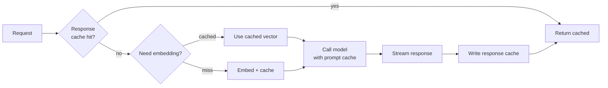

# Caching

> **In one line:** Three caches — response, prompt, embedding — sit at three different layers of the stack, and turning each on at the right time cuts cost and latency by a multiple, not a percentage.

:::tip[In plain English]
Caching in AI apps isn't one trick; it's three. The *response* cache says "the same question gets the same answer" (great for FAQs). The *prompt* cache says "the model already chewed on that 4 KB system prompt last call — bill me less for the prefix" (great for long static prompts). The *embedding* cache says "I already turned this paragraph into a vector — don't pay to do it again" (great for ingestion). Each works at a different layer, with different keys, and saves a different bill.
:::

## Three tiers



- **Response cache** — identical input → cached output. The big win for FAQ-style features.
- **Prompt cache (provider-side)** — the model's KV cache for stable prefixes is reused, billed at a fraction (typically 5–10×) cheaper.
- **Embedding cache** — same text shouldn't be embedded twice.

## Response cache

- Key on the **normalized** input + model + temperature + structured-output schema. Normalize whitespace, casing, and trailing punctuation.
- For chat history: key on the *intent*, not the raw history. A cheap small model can extract `{intent, entities}` from the latest user turn and you cache against that.
- **TTL based on freshness needs.** A "what's our return policy" answer can cache for a week; a "what's the current price" answer cannot cache at all.
- Be careful with **personalization** — cache per-user, not globally, when output depends on user context.
- Stampede protection: deduplicate concurrent identical requests to one upstream call (singleflight).

```typescript
// Minimal Redis-backed response cache
import { createHash } from 'crypto';

function key(input: string, model: string, schemaName?: string) {
  const normalized = input.trim().toLowerCase().replace(/\s+/g, ' ');
  return 'rcache:' + createHash('sha256')
    .update(`${model}|${schemaName ?? ''}|${normalized}`)
    .digest('hex');
}

export async function cachedGenerate(input: string, generator: () => Promise<string>) {
  const k = key(input, 'claude-haiku-4-5', 'TriageSchema');
  const hit = await redis.get(k);
  if (hit) return JSON.parse(hit);
  const out = await singleflight(k, generator);
  await redis.set(k, JSON.stringify(out), 'EX', 60 * 60 * 24); // 24h TTL
  return out;
}
```

## Prompt cache

The provider's prompt cache reuses internal KV state for a stable prefix:

- Put **stable content (system prompt, tools, large reference text)** at the *start* of the prompt.
- Put **variable content (user message, latest turn)** at the *end*.
- The stable prefix length must exceed the provider's minimum (typically 1K–2K tokens; check current docs).
- Bills typically 90% cheaper for cached input tokens. For a long system prompt, this is a 5–10× cost reduction at scale.

Anthropic example (explicit cache control):

```typescript
import Anthropic from '@anthropic-ai/sdk';
const client = new Anthropic();

const res = await client.messages.create({
  model: 'claude-sonnet-4-5',
  max_tokens: 1024,
  system: [
    {
      type: 'text',
      text: BIG_SUPPORT_SYSTEM_PROMPT,  // 4 KB of instructions + tool docs + style guide
      cache_control: { type: 'ephemeral' },
    },
  ],
  messages: [{ role: 'user', content: userMessage }],
});
console.log(res.usage); // { cache_read_input_tokens, cache_creation_input_tokens, ... }
```

OpenAI prompt caching is automatic for stable prefixes ≥1024 tokens — same principle, different ergonomics. Verify it's hitting by inspecting `usage.prompt_tokens_details.cached_tokens` in the response.

## Embedding cache

- Key on the normalized text + model + dimensionality.
- Even a simple in-process LRU saves big on re-ingest jobs.
- For server-side ingestion, a Postgres `embeddings_cache(text_hash, model, vector)` table is enough.

```python
import hashlib
from functools import lru_cache

def emb_key(text: str, model: str) -> str:
    return hashlib.sha256(f"{model}|{text.strip()}".encode()).hexdigest()

def embed_cached(text: str, model: str = "text-embedding-3-small") -> list[float]:
    k = emb_key(text, model)
    cached = db.fetchone("SELECT vector FROM emb_cache WHERE key = %s", (k,))
    if cached: return cached[0]
    vec = client.embeddings.create(model=model, input=text).data[0].embedding
    db.execute("INSERT INTO emb_cache(key, model, vector) VALUES (%s, %s, %s) "
               "ON CONFLICT (key) DO NOTHING", (k, model, vec))
    return vec
```

## What to cache vs. what not to cache

| Workload                              | Response cache | Prompt cache | Embedding cache |
|---------------------------------------|----------------|--------------|-----------------|
| Public FAQ                             | yes — long TTL | yes          | n/a             |
| Personalized chat (per user)           | per-user only  | yes          | n/a             |
| RAG over static docs                   | sometimes      | yes (system + tools) | yes (ingest) |
| Streaming creative writing             | rarely         | yes (system) | n/a             |
| Real-time data ("what's the price?")   | no             | yes          | n/a             |
| Re-ingestion of unchanged docs         | n/a            | n/a          | yes — big win   |

## When caching backfires

- **Highly personalized responses with low repeat-input rate** — the cache miss rate is so high the cache overhead loses.
- **Streaming responses where the latency win is mostly in TTFT** — cache is great when the response is full-blocking but adds less when streaming is already fast.
- **Stale answers in moving-target domains** — pricing, inventory, news. TTL aggressively or skip.
- **Cache key collisions on near-identical inputs.** Whitespace differences alone shouldn't make two inputs cache separately; normalize.

## Watch out for

- **Caching errors.** Make sure failures aren't memoized as success. Cache only happy results, never `{error}` envelopes.
- **PII in the cache.** The cache is now a PII store. Apply the same retention and access rules as your DB.
- **Drift across model versions.** A response cached against `claude-sonnet-4-5` should not be returned for `claude-sonnet-4-6`. Key includes the model name.
- **Prompt cache misses because the prefix isn't stable.** A timestamp, request ID, or randomized greeting at the top of the system prompt invalidates the cache every call. Keep the prefix byte-identical across requests.
- **Embedding cache returning vectors for the wrong dimensionality** after a model change. Key includes dim.

## 2026 stack

| Layer         | Default pick                                                                |
|---------------|-----------------------------------------------------------------------------|
| Response cache| Redis / Upstash (TS), `cachetools` + Redis (Py). Vercel KV is fine for low scale. |
| Prompt cache  | Anthropic `cache_control`, OpenAI automatic, Gemini explicit cache API.     |
| Embedding cache | Postgres table (default). In-process LRU for tight loops.                 |
| Singleflight  | `p-memoize`, `dataloader` (TS); `asyncio.Lock` per key (Py).                |
| Gateway-level | Portkey, Helicone, Cloudflare AI Gateway can cache across the SDK boundary. |

## Semantic response cache

For chat-style features where users ask "the same thing" in many wordings, a *semantic* cache outperforms an exact-string cache. The pattern:

1. On cache miss, embed the question, store `(embedding, answer)` in a small recent-cache table or Redis vector store.
2. On the next query, embed it and find the nearest cached entry. If distance is below a threshold (e.g., 0.06 cosine), serve the cached answer.

```typescript
async function semanticCacheGet(question: string, tenantId: string) {
  const qvec = await embed(question);
  const [hit] = await db.fetch(
    `SELECT id, answer, embedding <=> $1 AS d
     FROM rcache WHERE tenant_id = $2
     ORDER BY embedding <=> $1 LIMIT 1`,
    [qvec, tenantId],
  );
  if (hit && hit.d < 0.06 && !isStale(hit)) return hit.answer;
  return null;
}
```

Caveats: per-tenant scope (never global), TTL aggressively, and *always* invalidate when the underlying knowledge changes. Semantic caches are easy to over-tune and ship subtly wrong answers — start with a strict threshold and only loosen with evidence.

:::note[The 10× lever you can flip today]
For most production AI apps, the largest single cost lever is **turning on prompt caching for your system prompt and tool definitions**. If your system prompt is 3 KB and you call the model 10× per session, you were paying for that 3 KB ten times; with caching, you pay full price once and a fraction nine times. That alone is often 5× cheaper across the whole feature.

Run a one-day experiment, measure `cached_input_tokens` in `usage`, and you'll usually find this pays for the engineering work before lunch.
:::

---

→ Next: [Cost control patterns](./cost-control.md).
