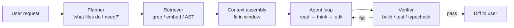

# Coding agents

> **In one line:** A coding agent is a specialized agent loop where the tools are file-read, file-write, run-command, and search-codebase — but the *interesting* engineering is in how it manages the context window, how it applies code changes safely, and how it decides what to look at next in a large repo.

:::tip[In plain English]
Coding agents are the highest-profile production agents of 2025-2026 — Cursor, Claude Code, Aider, Continue, Devin. They look like chat, but the engineering inside is distinctive: a 200KLOC repo doesn't fit in any context window, so the agent has to *strategically retrieve* what matters; small edits need surgical diffs, not whole-file rewrites; and a wrong tool call can corrupt a working codebase. The patterns on this page show up in every serious coding-agent build.
:::

## Anatomy of a coding agent



Five stages, mapped to a typical "fix this bug" request:

1. **Plan.** Decide what kind of task this is (bug fix vs. feature vs. refactor) and what files are likely involved.
2. **Retrieve.** Pull relevant files into context — by name, by grep, by embedding, by AST relationships.
3. **Assemble context.** Fit the retrieved code into the window. Truncate, summarize, or chunk if needed.
4. **Loop.** Read more files as needed, propose edits, observe errors.
5. **Verify.** Run the tests / build / typechecker. If failures, loop. If clean, propose the diff.

The agent loop ([The agent loop](../01-foundations/agent-loop.md)) is the engine; the rest is coding-specific scaffolding.

## Context strategy — the central problem

A 200KLOC TypeScript repo is ~30M tokens. Frontier models have 200K-1M context windows. The agent can't read everything; it has to pick.

Production strategies, ordered by sophistication:

### 1. User-pointed context

The user picks the files. Cursor's "@-mentions" of files and symbols. Simplest; surprisingly effective for small tasks. Falls apart when the user doesn't know which files are involved.

### 2. Lexical retrieval (grep / ripgrep)

The agent emits search queries; you run grep across the repo and return matches. Cheap, fast, no embedding index needed. Best for keyword searches ("where is `parseAuthToken` defined?").

```python
# Tool: search_codebase(query: str, file_pattern: str | None) -> list[Match]
```

### 3. Embedding-based retrieval

Chunk the codebase, embed each chunk, query by user intent. Better at "find the file that handles billing" (semantic) than "find this exact symbol" (lexical). Usually layered *with* lexical retrieval — they catch different things.

The chunking strategy matters more than the embedding model:

- **By symbol** (function, class) using tree-sitter or AST — usually best.
- **By file** for small files; by function for large ones.
- **Markdown headers** for docs and READMEs.

### 4. Repo-map / index

Generate a structured outline of the repo — file paths, top-level symbols, dependencies, module relationships. Inject the outline into the system prompt as a "map." The agent picks files to read using the map.

Aider's "repo map" feature is the canonical implementation. ~5–20K tokens of map + targeted file reads beats embedding retrieval for most coding tasks.

### 5. AST / LSP-aware retrieval

Use the language server (or tree-sitter) to follow real code relationships: "all callers of this function," "all subclasses of this class," "all places that import this module." Most accurate for "understand where this matters." Expensive to set up; pays off in large repos.

### Production blend

Real systems combine all of these:

```
User asks: "Make logout redirect to /goodbye instead of /login"
  ↓
1. Lexical search for "logout" → 8 hits across 4 files
2. Repo map highlights auth/, components/, routes/
3. Open the top 4 hits + 1 file from the map
4. Read; decide which file actually owns the redirect
5. Edit; run tests
```

## Diff application — the safety pattern

When the agent wants to change code, *how* it changes it matters enormously.

### Whole-file rewrite (worst)

Model emits the entire file. Problems: token budget, the model "improves" unrelated code, hard to review.

### Search-and-replace (Aider style)

Model emits paired `<<<<<<<` / `>>>>>>>` blocks: exact text before, exact text after. Apply by literal string match.

```
<<<<<<< SEARCH
  redirect("/login")
=======
  redirect("/goodbye")
>>>>>>> REPLACE
```

Robust because the "search" anchors the edit to specific bytes. Fails if the model paraphrases ("any whitespace change → no match"). Reliable in practice with the right prompt and a strict-match policy.

### Unified diff (patch style)

Model emits a unified diff (`---` / `+++` / `@@` hunks). Apply with `git apply` or `patch`.

```diff
--- a/auth.ts
+++ b/auth.ts
@@ -42,7 +42,7 @@
 export function logout() {
   clearSession();
-  redirect("/login");
+  redirect("/goodbye");
 }
```

The most reliable format in 2026. Line numbers anchor the edit; hunks fail loudly if context drifts. Used by Claude Code and most serious coding agents.

### AST-based edits (best, hardest)

Model says "in function `logout`, change the `redirect` call's argument from `/login` to `/goodbye`." A code-aware tool applies the change via AST manipulation. Most precise; requires per-language tooling.

## Verification — the agent's eval loop

A coding agent has the rare luxury of a *cheap, deterministic* signal — the test suite, the typechecker, the build. Use it relentlessly.

The pattern:

1. Agent proposes an edit.
2. Apply it to a working copy (not the user's tree).
3. Run typecheck → if fails, feed errors back to the agent, loop.
4. Run tests → if fails, feed failing-test output back, loop.
5. After N successful checks, propose the diff to the user.

Cap iterations (5–10). Aggressively. A confused agent will edit-then-revert-then-edit-the-same-line forever.

## Tool design for coding agents

A small, sharp tool set beats a large one. The canonical set:

| Tool | What it does | Notes |
|---|---|---|
| `read_file(path, line_range?)` | Read source | Range reads avoid blowing context on big files |
| `write_file(path, content)` | Whole-file write | Used rarely; prefer edit-file |
| `edit_file(path, search, replace)` | Apply a specific edit | The 80% case |
| `apply_diff(path, unified_diff)` | Apply a unified diff | The 80% case for serious agents |
| `search_codebase(query)` | grep / ripgrep | Indispensable |
| `run_command(cmd, cwd?)` | Run a shell command | Tests, builds, scripts |
| `list_files(path)` | Directory listing | Cheap navigation |
| `read_diagnostics(path)` | Get LSP errors | If you have an LSP integration |

What's NOT on this list: `fix_this_bug`, `refactor`, `optimize`. Tools should be primitives, not goals. The model composes goals from primitives.

## The "you can't see the whole repo" prompt pattern

Be honest with the model about the constraint. A typical system prompt:

```
You're a coding agent operating on a repository you can't see all at once.
Before editing, you MUST:
  1. Use search_codebase or read_file to confirm the code you're about
     to change actually exists and looks the way you expect.
  2. Read enough surrounding code to understand the function's callers
     and the conventions of the codebase.
  3. Run typecheck/tests after editing.

Don't assume the structure of the code — verify by reading.
```

This single instruction prevents the most common failure: the model assuming the code looks a certain way and emitting an edit that doesn't match reality.

## Eval shape for coding agents

Coding agents have an unusual evaluability — you can run tests automatically. The eval set looks like:

- **A frozen task description.** "Fix this bug." / "Add this feature."
- **A starting commit** (the repo state before the change).
- **A "golden" diff or test set** (what the change should achieve).
- **An automatic check** — usually "do the hidden test cases pass after the agent's diff is applied?"

SWE-Bench and the SWE-Bench Verified subset are the public benchmarks. Building your own version of this for an internal codebase is the highest-leverage eval investment for a coding-agent product.

## The cost shape

Coding-agent costs are dominated by repeated context. A 5-iteration task that re-loads the same 20K-token context every turn pays for 100K tokens of input. Levers:

- **Prompt caching.** Anthropic and OpenAI cache the static prefix of the prompt — system prompt + repo map. Hit rates of 90%+ on long sessions.
- **Persistent context.** Some systems keep a session-level cache of "files we've already read" rather than re-reading on every turn.
- **Targeted reads with line ranges.** Don't read a 2000-line file when you need 50 lines around a function.
- **Summarize history.** Once a sub-task is done, replace its detailed messages with a one-line summary.

## What beginners get wrong

:::caution[Common mistakes]
- **Loading the whole repo into context.** Doesn't fit; doesn't scale. Retrieve selectively.
- **Whole-file rewrites as the default edit primitive.** Wastes tokens; encourages "improvements" the user didn't ask for. Prefer diffs or search-and-replace.
- **No verification step.** The agent claims it fixed the bug; nobody ran the tests. Always wire `run_command` to the build + tests + typecheck.
- **One giant `do_coding_task` tool.** Too vague. Sharp primitives compose better.
- **Letting the agent edit the user's tree directly.** Edits should land in a working copy or stash; the user sees a diff and approves.
- **No iteration cap.** A confused agent can churn for hours. Cap at 5–10 verification cycles.
- **Embedding-only retrieval.** Misses exact symbol lookups. Always pair with grep.
- **Ignoring prompt caching.** A serious coding agent without prompt caching pays 5–10× more than it has to.
- **No "I'm stuck" exit.** The agent should be able to give up and ask for human help. Make giving-up a tool: `escalate_to_user(reason)`.
:::

:::info[Highlight: the 2026 coding-agent fight is about context]
The model is roughly equal across vendors at 2026 frontier-tier. What separates Cursor, Claude Code, Cline, and Aider is *who manages context better* — which files to load, when, how to summarize, how to handle long sessions, how to make caching hit. Engineering investment goes into that layer, not into the LLM call itself.
:::

<Quiz id="pattern-coding-agents-quick-check" variant="micro" title="Quick check">

<Question
  prompt="What does this page call the central engineering problem of a coding agent?"
  options={[
    { text: "Context strategy — the repo cannot fit in any window, so the agent must strategically retrieve what matters" },
    { text: "Picking the strongest frontier model" },
    { text: "Writing a system prompt that makes the model code carefully" },
    { text: "Supporting every programming language" }
  ]}
  correct={0}
  explanation="A 200KLOC repo is roughly 30M tokens against a 200K-1M window, so retrieval strategy (lexical, embedding, repo map, AST) is where the engineering goes — the page notes the 2026 coding-agent fight is about context, not the model. Picking a stronger model is the tempting answer because models are roughly equal across vendors at frontier tier; the differentiator is who manages context better."
/>

<Question
  prompt="Which edit-application format does the page call the most reliable in 2026?"
  options={[
    { text: "Whole-file rewrite — simplest for the model to emit" },
    { text: "Freeform instructions that a human applies" },
    { text: "Unified diff — line numbers anchor the edit and hunks fail loudly when context drifts" },
    { text: "Direct writes to the user's working tree" }
  ]}
  correct={2}
  explanation="Unified diffs anchor edits precisely and fail loudly rather than silently corrupting code, which is why serious agents use them. Whole-file rewrite is the tempting easy option, but the page ranks it worst: it wastes tokens, invites unrequested 'improvements,' and is hard to review."
/>

<Question
  prompt="Why is verification (running tests, typecheck, build) so central to the coding-agent loop?"
  options={[
    { text: "It replaces the need for retrieval" },
    { text: "Coding agents have a rare cheap, deterministic correctness signal — and failures feed straight back into the loop" },
    { text: "Providers require test results before accepting tool calls" },
    { text: "It eliminates the need for an iteration cap" }
  ]}
  correct={1}
  explanation="Most LLM features need fuzzy judges; a coding agent can just run the tests — a deterministic signal it should use relentlessly, feeding errors back until checks pass. The iteration-cap option is exactly backwards: verification loops still need an aggressive cap of 5-10 cycles, because a confused agent will edit-revert-edit the same line forever."
/>

</Quiz>

---

→ Next: [Evals as a product surface](./evals.md)
