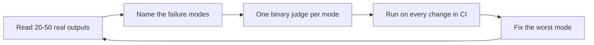

# Eval-driven development

> **In one line:** Don't start with a metric — start by *reading your model's outputs*. Eval-driven development is the loop: look at real failures, name them, turn each into a tiny pass/fail check, and let those checks drive every change.

:::tip[In plain English]
The fastest way to make an AI product better is **not** a fancy dashboard that says "helpfulness: 7.2 / 10." It's a habit: open up 30 real conversations, see what actually went wrong, and write a small test for each *kind* of mistake. After that, every prompt tweak, model swap, or code change gets graded by those tests — exactly like unit tests in normal software. This is the workflow used inside OpenAI and Anthropic, popularized by Hamel Husain and Shreya Shankar's evals course.
:::

## The loop

### 1. Error analysis first — the step everyone skips

Before you pick a single metric, **read** 20-50 real outputs end to end. Write down, in plain words, what went wrong each time ("scheduled the wrong day", "answered in the wrong language", "made up a refund policy"). This 30-minute habit is the single highest-leverage thing in the whole field, and almost nobody does it. You cannot measure what you haven't looked at.

### 2. One person owns "good" — the benevolent dictator

Quality is subjective, so don't average five opinions into mush. Pick **one** domain expert who understands your users to be the final judge of what counts as a failure. Their taste is the spec.

### 3. Cluster failures into a few named modes

Group what you saw into a handful of specific, named failure modes — *"didn't hand off to a human", "invented a policy", "wrong appointment day."* These named modes — not the vague question "is it good?" — are what you'll actually measure.

### 4. One judge per failure mode — and make it binary

Write one automated check per mode. Each is either a code assertion (cheap, exact) or an **LLM-as-judge** (for fuzzy things), and each returns **pass / fail** on **one** thing. Narrow + binary = reliable and actionable. A single mega-judge that scores 1-5 on "overall quality" is noisy and tells you nothing about *what* to fix.

### 5. Every failure becomes a regression test

Each real bug you find gets added as a test case. The set grows over time and becomes your safety net — the thing that catches the bug from re-appearing after the next "small" change.

### 6. Run the evals in CI

Wire the suite into continuous integration and **block merges that regress**. Evals that live in a notebook rot and nobody trusts them; evals in CI are the discipline that compounds.

:::note[Worked example — a support assistant]
Read 30 real transcripts. You find three recurring failures: it schedules the wrong day, it never escalates to a human when it should, and it invents refund policies. You write **three binary judges**, one per failure, plus **40 test cases** drawn from real conversations, and gate the build on them. Later you want to swap your frontier model for a cheaper one — the suite tells you in 60 seconds whether quality held. That's the whole game.
:::

## LLM-as-judge, done right

- One narrow failure mode per judge.
- **Binary** (pass/fail) or **pairwise** (A vs B), not 1-5 scores.
- Few-shot the judge with labeled examples of pass and fail.
- **Validate the judge against human labels** — measure how often it agrees with your expert. An unvalidated judge is just a vibe with extra steps.

## For RAG: the RAG Triad

Three named checks pinpoint *where* a RAG system breaks:

- **Faithfulness** — is the answer grounded in the retrieved text, with no hallucination?
- **Answer relevance** — does it actually answer the question asked?
- **Context relevance** — were the retrieved chunks even useful?

Use them as a diagnosis: weak **faithfulness** means fix the **prompt / generation**; weak **context relevance** means fix **retrieval / chunking**. Tools like Ragas compute the triad for you (see [Evals as a product surface](./evals.md) and the [eval tools](../04-stack/eval-tools.md) page).

:::caution[What people get wrong]
- Starting with a metric instead of reading data.
- One giant "overall quality" judge instead of one per failure mode.
- 1-5 scores (noisy) instead of binary pass/fail.
- Never checking whether the judge agrees with a human.
- Evals that live in a notebook, not in CI — so they rot.
:::

## Try it this week

Pick one AI feature. Read 25 real outputs. Write down every failure in a sentence. Cluster them into 3 modes. Write 3 binary judges and 20 test cases, and put them in CI. You now do eval-driven development.

**Further reading:** Hamel Husain — [LLM Evals FAQ](https://hamel.dev/blog/posts/evals-faq/); Chip Huyen — *AI Engineering* (the evaluation chapters).
