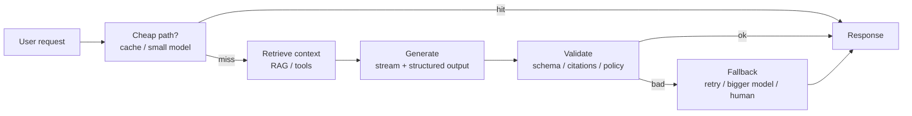

# Part 10: Production Patterns

*The patterns that turn an LLM demo into something you can charge for.*

> **In one line:** Every successful production LLM app is a recombination of the same dozen patterns — streaming, structured output, tool use, RAG, agents, evals, caching, cost control, embeddings, multimodal, safety, and graceful fallbacks. Master them once; reuse forever.

:::tip[In plain English]
A demo proves the model *can* do the thing. A product proves you can do the thing for ten thousand users, every day, without lighting your budget on fire or leaking customer data. These patterns are what stand between the two. None of them are exotic — most are software-engineering hygiene applied to a stochastic, expensive, network-bound component.
:::

## The patterns

### Core delivery patterns

- [Streaming UX](./streaming-ux.md) — Sub-second perceived latency for every user-facing call.
- [Structured output everywhere](./structured-output.md) — JSON / typed objects as the default output shape.
- [Tool use done right](./tool-use.md) — Tight tool sets, great descriptions, parallel execution.
- [The RAG pattern in production](./rag-prod.md) — Hybrid search, reranking, citations, evals.
- [The agent loop with guardrails](./agent-loop.md) — Iteration caps, observability per step, human handoff.

### Operational patterns

- [Evals as a product surface](./evals.md) — LLM-as-judge, regression sets, prod sampling.
- [Caching for cost & latency](./caching.md) — Response cache, prompt cache, embedding cache.
- [Cost control patterns](./cost-control.md) — Tiered models, prompt trimming, rate limits, kill switches.

### Adjacent patterns

- [Embeddings & semantic search](./09-embeddings-search.md) — Search, recs, dedup, classification — even without an LLM at query time.
- [Multimodal patterns](./10-multimodal-patterns.md) — Vision-first extraction, transcribe-then-process, the "give the model the image" trick.
- [Safety & privacy](./11-safety-privacy.md) — Prompt injection, PII scrubbing, authorization in RAG.
- [Fallbacks & graceful degradation](./12-fallbacks.md) — Tiered fallback, cached response, non-AI path, "temporarily unavailable" UX.

### Putting it together

- [Complete worked example](./13-complete-example.md) — Customer-support assistant with RAG + tools + escalation, with evals, deploy, and observability.
- [Chapter checkpoint](./14-checkpoint.md) — Self-test.

## The mental model

Treat an LLM call like a **slow, expensive, non-deterministic, network-bound function**.

That's not a put-down — it's a checklist. Everything that's true of slow, expensive, non-deterministic, network-bound functions is true of LLM calls, and the standard software response applies to each property:

| Property            | Standard response                                            |
|---------------------|--------------------------------------------------------------|
| Slow                | Stream output, run things in parallel, cache.                |
| Expensive           | Tier models, cap budgets, cache, summarize history.          |
| Non-deterministic   | Constrain with schemas, validate output, evaluate continuously. |
| Network-bound       | Retry, time-out, queue, fall back.                           |

Every pattern in this chapter is one of those responses, dressed up.

That's the whole game. Each pattern in this chapter fills in one of those boxes.

## How to read this chapter

Each page is a self-contained pattern with:

1. **The shape** — what the pattern looks like.
2. **Why it matters** — what you lose without it.
3. **Worked example** — real code in TypeScript or Python.
4. **Watch out for** — gotchas that bite.
5. **2026 stack** — what library implements this today.

Use them as a checklist when designing a new feature, and as a debugging checklist when an existing feature underperforms.

:::note[The through-line example]
Pages reference a single recurring worked example: a **customer-support assistant** that combines RAG, tool calls, evals, and human escalation. We build it incrementally — each pattern is one layer — and the final page ([complete example](./13-complete-example.md)) glues them together.
:::

---

→ Start with [Streaming UX](./streaming-ux.md).
