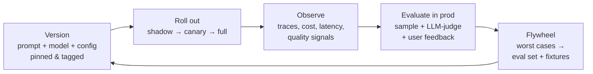

# LLMOps — the production operations loop

> **In one line:** Every other pattern in this chapter is a *part*; LLMOps is the *loop* that runs them forever. It's the operational discipline — version, roll out, observe, evaluate in production, feed failures back into evals and prompts — that keeps an AI feature good after launch instead of decaying the week the model changes underneath you.

:::tip[In plain English]
Shipping an AI feature once is a project. Keeping it good is an operation. Models get deprecated, prompts drift, user inputs shift, your eval set goes stale, and costs creep. LLMOps is the boring, repeatable loop that catches all of that — the AI equivalent of what SRE is for ordinary services. If you've read the [Lifecycle](/docs/lifecycle) chapter, this is the *steady-state* version of it: the part that never ends.
:::

## The shape

LLMOps is a closed loop with five stations. A change enters at the top; production signal flows back to the start.



The discipline is that **nothing skips a station**. A prompt tweak is a versioned change that gets canaried and watched, exactly like a model swap — because to your users a prompt edit and a model upgrade are the same risk: the output distribution moved.

## Why it matters

Without the loop, an AI feature degrades silently in ways ordinary software doesn't:

- **The ground shifts under you.** Providers deprecate models on 3–6 month notice ([model swaps](./model-swaps.md)). A prompt tuned for one model version is not tuned for the next.
- **Failures are distributional, not binary.** A service is up or down; an LLM feature is 94% good and quietly slipping to 89%. You only see it if you're [evaluating in production](./evals.md).
- **Your eval set rots.** An eval set is a snapshot of yesterday's failure modes. Real users find new ones weekly. If the set doesn't grow, your "passing" number means less every month.
- **Cost drifts.** Prompt bloat, context growth, retry storms, and a creeping ratio of expensive-model calls all push spend up without any single visible event ([cost control](./cost-control.md)).

The maturity ladder most teams climb:

| Level | What it looks like | What's missing |
|---|---|---|
| **0 — Vibes** | Prompts in code, ship on "looks good", no eval set | Everything; you're flying blind |
| **1 — Versioned** | Prompts + model IDs pinned and tagged; an eval set runs in CI | No production signal |
| **2 — Observed** | Every call traced; cost/latency/quality dashboards; alerts | Evals and prod are disconnected |
| **3 — Looped** | Prod failures auto-feed the eval set; canary + rollback on every change | — this is the goal |
| **4 — Flywheel** | Labelled prod data improves prompts/routing/fine-tunes continuously | (most teams don't need this) |

Aim for **Level 3**. Level 4 is for teams whose product *is* the model quality.

## Worked example

The Acme support assistant (the chapter's running example) ships a prompt change. Here's the loop in code-shaped pseudocode — a versioned, canaried rollout with automatic guardrails.

```python
# 1. VERSION — every shippable config is an immutable, tagged artifact.
config = PromptConfig(
    id="support-triage@2026-06-03.1",
    model="claude-sonnet-4-6",          # pinned, never a floating alias
    prompt_template=TEMPLATE_V7,
    temperature=0.2,
    retrieval={"hybrid": True, "rerank": True, "top_k": 5},
)
registry.publish(config)                 # stored, diffable, rollback-able

# 2. ROLL OUT — route a slice of live traffic to the new version.
@router.choose
def pick_config(request) -> PromptConfig:
    if shadow_mode(request):             # run new version, serve OLD output, log both
        return config.as_shadow()
    if in_canary_bucket(request, pct=5): # 5% see the new version for real
        return config
    return registry.current("support-triage")

# 3. OBSERVE — one trace per request, with the fields you'll actually query on.
trace.log(
    config_id=config.id, tokens=usage, cost_usd=cost, ttft_ms=ttft,
    retrieved_ids=ctx.ids, tool_calls=calls, user_feedback=None,  # filled in later
)

# 4. EVALUATE IN PROD — sample, judge, and gate the canary on the result.
nightly_sample = sample_traces("support-triage@2026-06-03.1", n=200)
scores = llm_judge(nightly_sample, rubric=SUPPORT_RUBRIC)
if scores.p50 < baseline.p50 - 0.03 or scores.refusal_rate > 0.02:
    registry.rollback("support-triage")  # automatic; page the owner
    alert("canary regressed — rolled back")

# 5. FLYWHEEL — the worst-scored real cases become permanent eval cases.
for case in scores.bottom(20):
    eval_set.add(Fixture(input=case.input, note="prod regression 2026-06-03"))
```

Read the five comments top to bottom and you have the whole discipline. The same skeleton works whether the "change" is a new prompt, a model upgrade, a retrieval tweak, or a fine-tune.

## Watch out for

:::caution[Where teams trip up]
- **Floating model aliases in production.** `gpt-5-mini` silently becomes a new snapshot; your pinned-version guarantees evaporate. Always deploy a dated snapshot and upgrade it as a *change* that goes through the loop.
- **Treating prompt edits as "not a deploy."** A one-word prompt change can move your refusal rate or cost more than a model swap. It's a versioned, canaried change.
- **Evals and production living in separate worlds.** If your eval set isn't fed by real failures, it's a museum. The single highest-leverage habit is the weekly triage that promotes the worst prod cases into fixtures.
- **Alerting on infra but not on quality.** CPU and 5xx dashboards won't tell you the answers got worse. You need a quality signal (LLM-judge sample, thumbs-down rate, escalation rate) wired into alerts.
- **No rollback path for prompts/config.** "Redeploy the old code" is not a rollback if the prompt lives in code. Keep prompt+model+config in a registry you can revert in one click.
- **Skipping shadow mode for risky changes.** Shadow (run the new version, log it, but serve the old output) catches regressions with zero user impact before you spend a single canary request.
:::

## 2026 stack

- **Versioning / registry:** prompt management tools ([prompt management](/docs/stack/prompt-management)) — Langfuse, PromptLayer, or a plain git-backed config table. The non-negotiable is *immutable, diffable, revertible*.
- **Observability:** Langfuse, Braintrust, Arize Phoenix, LangSmith ([observability tools](/docs/stack/observability-tools)) — per-call traces with cost, latency, retrieval, and feedback fields.
- **Eval-in-prod:** Braintrust, Langfuse evals, Promptfoo ([eval tools](/docs/stack/eval-tools)) — sampling + LLM-as-judge + a growing fixture set.
- **Rollout:** feature-flag the model/prompt the same way you flag any change (LaunchDarkly, Statsig, or a homegrown bucket function). Gateways like Portkey/OpenRouter ([AI gateways](/docs/stack/ai-gateways)) make canarying *across providers* a config change.
- **The flywheel:** this is mostly process, not a product — a recurring triage where bad prod cases become eval cases. See [eval-driven development](./eval-driven-development.md).

For how this fits the broader project arc, see the [Lifecycle](/docs/lifecycle) chapter (especially monitor and improve); for the org and governance layer at scale, see [Enterprise AI](/docs/enterprise). For the decision of *when* this rigor pays for itself, see [How much to invest in evals](/docs/decisions/eval-investment).

---

→ Next: [Complete worked example](./13-complete-example.md)
