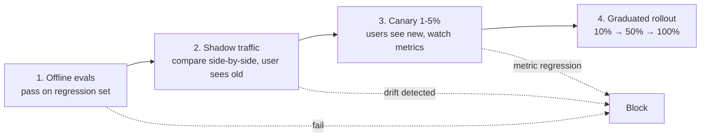

# Safe model swaps & canary deploys

> **In one line:** Every prompt change and every model version bump is a deploy that can silently regress quality — so you ship it the way you'd ship a risky DB migration: shadow traffic first, then canary to a small % of users, then graduate to full traffic only after the online metric agrees with the offline eval.

:::tip[In plain English]
Offline evals tell you "the new prompt scored 92% on my 100-case set." That's necessary, not sufficient — your eval set never perfectly matches prod traffic, and prompt regressions usually hide in the 8% your eval doesn't cover. The discipline on this page is the production-safety layer on top of evals: roll out new prompts and models like you'd roll out a schema change, with telemetry watching the whole way.
:::

## The four-stage rollout



Each stage gates the next. The earlier you catch a regression, the cheaper it is.

## Stage 1 — Offline evals

The usual eval suite ([evals](./evals.md)). New prompt or model must pass the regression set with no significant degradation.

Threshold: depends on the feature. For high-stakes paths (refunds, medical advice), require **strict no-regression** — every test case that passed before must still pass. For lower-stakes paths, allow a small swap (lose case X, gain case Y) if the net score is up.

**This is not enough.** Eval sets cover 80% of behavior at best. The remaining 20% is what the next stages catch.

## Stage 2 — Shadow traffic

Run the new version *alongside* the old version on real production traffic, but **only show the user the old version's response.** The new version is computed for telemetry but discarded.

```python
async def chat(request):
    # Real path — what the user sees
    response = await call_model(OLD_PROMPT, OLD_MODEL, request)

    # Shadow path — for comparison
    asyncio.create_task(
        shadow_compare(request, OLD_PROMPT, NEW_PROMPT, response)
    )

    return response


async def shadow_compare(request, old_p, new_p, old_response):
    new_response = await call_model(new_p, NEW_MODEL, request)
    # Log both for offline analysis
    log_pair({
        "request": request,
        "old_response": old_response,
        "new_response": new_response,
        "delta": diff(old_response, new_response),
    })
    # Optional: run an LLM-as-judge to score which is better
    judge_score = await llm_judge(request, old_response, new_response)
    metrics.histogram("shadow.judge_preference", judge_score)
```

What you learn from shadow traffic:

- **Distribution gap from your eval set.** Does the new prompt fail on real inputs your eval didn't cover?
- **Quality direction.** Run an LLM-as-judge over the pairs. Does the new prompt win, lose, or tie?
- **Cost / latency delta.** Real numbers, not estimates.
- **Tail behavior.** Refusals, JSON breaks, agent timeouts — these tend to show up in real traffic before they show up in evals.

Shadow traffic is the most expensive stage (you pay for both versions on every request). Run it for as long as needed to cover your real distribution — typically 24–72 hours.

## Stage 3 — Canary rollout

Once shadow looks good, switch a small fraction of users to the new version *for real* — they see the new responses.

The split is by user, not by request, so a single user has a consistent experience:

```python
def pick_variant(user_id: str) -> str:
    # Deterministic hash; same user always gets same variant
    h = hash(user_id + "model_swap_2026_05_26") % 100
    if h < CANARY_PERCENT:
        return "new"
    return "old"
```

Start at 1–5%. Watch:

- **Engagement metrics.** Session length, follow-up rate, thumbs-up/down. These move *before* explicit complaints do.
- **Implicit dissatisfaction signals.** Users editing the AI's response, retrying, abandoning the conversation.
- **Cost & latency.** Bill changes are real and immediate.
- **Eval-judge score on canary traffic.** Continue scoring the live responses against the rubric.
- **Error rates.** Provider 429s, your downstream tool failures, parse errors.

Canary timing: **at least 24 hours**, ideally a week, before graduating. Weekends look different from weekdays. Asia traffic looks different from US traffic.

## Stage 4 — Graduated rollout

If canary metrics are flat or up: ramp 1% → 10% → 50% → 100% over days or weeks. Each step is its own watch period.

Rollback gate: pre-define what triggers a rollback before you start the rollout. *"If thumbs-down rate increases by more than 20% versus the control, roll back automatically."* The rule should be in code, not in a meeting.

## A/B testing AI features specifically

Standard A/B testing applies, with a couple of AI-specific twists:

### Pick the right outcome metric

- **Don't** test "judge score" — you'd be testing the judge against itself in canary, and judges have their own biases.
- **Do** test user-observable metrics — engagement, retention, conversion, task completion.
- **Do** track "human edit distance" — how much do users edit the AI's response before sending? That's a great quality signal for drafting tools.

### Variance is bigger than you think

LLM responses are stochastic. Two users seeing "the same prompt" get different answers. This adds variance on top of the usual A/B variance. You need larger sample sizes than for a deterministic UI change — often **3–5× more users** for the same statistical power.

### Confounders are sneakier

- **Caching skew.** If the new prompt has a different cache hit rate, latency differs, and users react to latency, not the model quality. Control for cache behavior.
- **Provider drift.** A canary that runs the same model name as production might still differ — providers update models silently. Pin model versions in both arms.
- **Time-of-day.** Run the canary across full weekly cycles.

### Don't peek

Same rule as any A/B test. Define your sample size, your duration, your decision rule *before* starting. "It's looking good after 6 hours, let's ramp" is how you ship regressions you'll discover next quarter.

## Specific patterns for specific changes

### Model version bump (e.g., Sonnet 4.5 → 4.6)

Risk: prompt was tuned to old model's quirks. Run **full** shadow → canary → graduate. Prompts tuned hard to one model commonly need ~5% retuning on the new version.

### Prompt change (same model)

Lower risk than model swap, but still ship through shadow + canary. The 95% case where it's "fine" doesn't justify skipping process — the 5% case where it isn't is exactly what process catches.

### Tool definition change

Often the biggest risk people underestimate. A new tool description can shift selection accuracy by 10–30%. Treat as a major change.

### System prompt expansion (adding new instructions)

Test on **old failure cases**, not just the new behavior you want. "I added a refusal rule" can also accidentally suppress correct refusals you weren't trying to change.

### Retrieval pipeline change (new chunker, new embedding model)

Treat as an indexing migration *plus* a model swap. You can't shadow against the new index without building it. Often easier to do a *full corpus re-index* on a side index, then swap.

## The cost of model-swap discipline

Yes, this is expensive. You're paying for:

- **Shadow traffic** — 2× the LLM cost for as long as it runs.
- **The infrastructure** — two model configurations, two prompt versions, telemetry to compare them.
- **The slower rollout** — features ship in weeks instead of hours.

The trade is: you don't ship silent regressions that erode user trust over months. For features with any real stakes, this trade pays back every time.

The *one* place you can skip: an internal-only tool with 5 users, where the users will notice quality regressions immediately and tell you. For anything customer-facing, the discipline is non-negotiable past a certain scale.

## Wiring this into your stack

The minimum-viable pieces:

1. **Feature flags / experiment platform** — LaunchDarkly, GrowthBook, Statsig, or homegrown. Must support user-bucketed splits.
2. **Trace storage** — every request tagged with `prompt_version` and `model_version`.
3. **Comparison job** — async LLM-as-judge over recent traces by variant.
4. **Dashboard** — live latency, cost, error rate, judge score, by variant.
5. **Alert rules** — auto-rollback triggers if metrics breach thresholds.

Observability platforms ([Langfuse, LangSmith, Helicone, Braintrust](../04-stack/observability-tools.md)) increasingly bundle these — by 2026 the "experiment + eval + canary" loop is a first-class feature of the major platforms.

## What beginners get wrong

:::caution[Common mistakes]
- **Skipping shadow because "evals passed."** Evals catch the failures you anticipated. Shadow catches the ones you didn't.
- **Peeking and ramping early.** Canaries that look good at hour 6 sometimes look bad at hour 60.
- **Not pinning model versions.** Provider-side updates can change behavior in your "old" arm too. Always pin (`claude-sonnet-4-6-20260301`, not just `claude-sonnet-4-6`).
- **Using judge score as the outcome metric in canary.** The judge measures what the judge measures. Use user-observable metrics for actual decisions.
- **Hashing on request ID instead of user ID.** Same user gets different variants on different requests → confusing UX and broken statistics.
- **No rollback automation.** "We'll watch the dashboard" doesn't survive a 2am regression. Pre-define triggers and act on them.
- **Treating prompt changes as low-risk.** Some of the worst regressions come from "small prompt tweaks" because they skipped the process.
- **Mixing multiple changes in one rollout.** Swap *one thing* at a time. Otherwise you don't know which change caused the metric move.
:::

:::info[Highlight: AI features are continuously-deployed software]
The model-swap discipline is what makes AI features feel reliable to users over months. Without it, a feature can be silently worse for 60 days before someone notices — and by then the trust is gone. With it, you ship faster *and* more safely, because each rollout is a small, instrumented bet rather than a big leap.
:::

---

→ Next: [LLMOps — the production operations loop](./llmops-loop.md)
