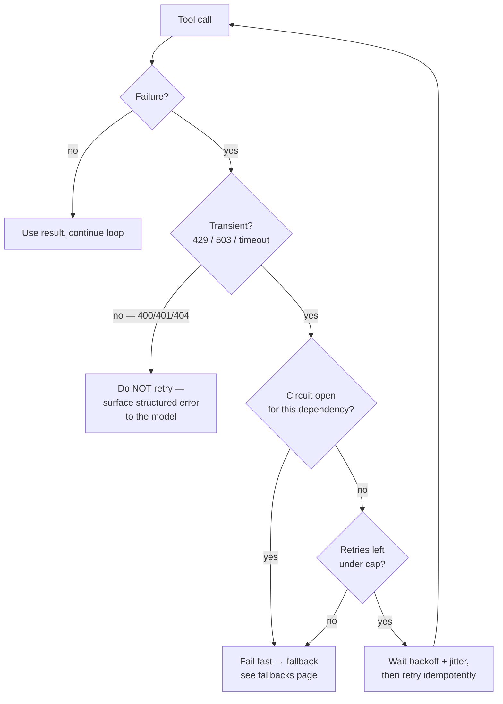
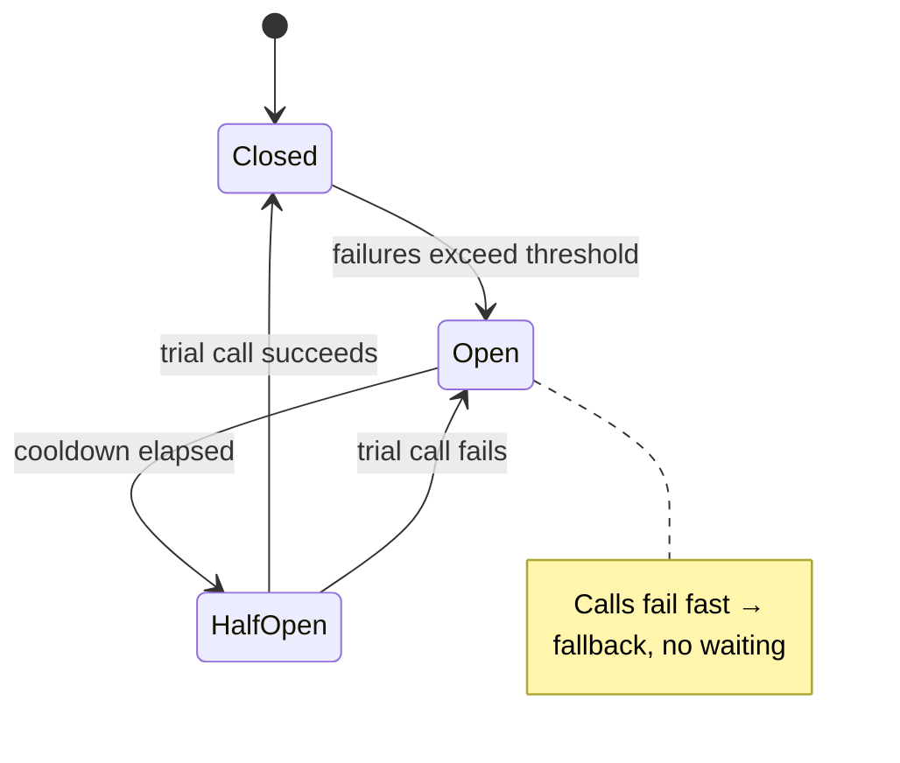

# Agent reliability & self-healing

> **In one line:** A long agent run touches dozens of flaky dependencies; *self-healing* is the small set of mechanisms — retry-with-backoff, idempotency, circuit breakers, and checkpointing — that let a run survive a transient blip or even a crash instead of dying or starting from scratch.

> **← Prerequisite:** This builds directly on [The agent loop with guardrails](./agent-loop.md). That page bounds the *blast radius* (step caps, cost caps, handoff). This page makes the loop *recover* from failures inside those bounds.

:::tip[In plain English]
The guardrails page taught you how to stop an agent from running forever or costing too much. This page is the opposite worry: an agent that gives up *too easily*. Real tools fail for boring reasons — a network blip, a rate limit, a database that's busy for half a second. A naive agent treats that momentary hiccup as "the task is impossible" and quits, or worse, retries something it shouldn't and double-charges a customer. Self-healing means the agent shrugs off the things that fix themselves, refuses to retry the things that won't, stops hammering a dependency that's truly down, and can pick up where it left off if the whole process crashes mid-run. None of it is exotic — it's four small habits.
:::

Four terms, each defined the first time you'll need it:

- A **transient failure** is a temporary error that will likely succeed if you simply try again a moment later — a network timeout, a `429` rate limit, a `503` "service busy." Nothing is wrong with your *request*; the dependency was momentarily unavailable.
- A **permanent failure** is an error that will fail identically every time you retry — a `400` bad-arguments, a `401`/`403` auth error, a `404`, a content-policy refusal. Retrying it just burns time and money.
- **Idempotency** means an operation produces the same end state whether you run it once or five times. `set_status("shipped")` is idempotent; `charge_card($50)` is not, unless you make it so.
- A **checkpoint** is a saved snapshot of the agent's progress — its message history and completed tool results — written to durable storage so a fresh process can reload it and continue.

## Why it matters

The [agent loop](../01-foundations/agent-loop.md) is a chain of network calls, and the longer the chain, the more certain it is that *one* link blips. If a 12-step research agent calls 30 tools, and each tool has a 99% success rate, the run's odds of finishing without a single failure are `0.99³⁰ ≈ 74%`. **One run in four hits a failure it must handle** — and that's at a generous 99%. At 97% per call, it's better than even odds the run fails somewhere. Self-healing is what turns those individual blips from "the agent gave up" into "the agent paused for 400 ms and carried on." Without it, your agent's reliability is the *product* of every dependency's reliability — a number that decays fast.



## Retry with exponential backoff and jitter

The first reflex on a transient failure is to try again — but *how* you try again matters enormously.

**Exponential backoff** means each retry waits longer than the last, growing by a constant factor: 0.5 s, 1 s, 2 s, 4 s. The idea is to give a struggling dependency room to recover instead of pummelling it the instant it stumbles.

**Jitter** means adding a random amount to each wait. Without it, when a shared dependency hiccups, *every* in-flight agent retries at exactly the same backed-off moment — 1 s later, then 2 s later — producing synchronized waves of load (a "thundering herd" or **retry storm**) that knock the dependency back down each time it tries to recover. Jitter spreads the retries across the interval so the load smooths out.

```typescript
interface RetryOptions {
  maxAttempts: number;     // hard cap — never retry forever
  baseDelayMs: number;     // first backoff, e.g. 500
  maxDelayMs: number;      // ceiling on a single wait, e.g. 8000
}

const DEFAULTS: RetryOptions = { maxAttempts: 4, baseDelayMs: 500, maxDelayMs: 8000 };

async function withRetry<T>(
  fn: () => Promise<T>,
  opts: RetryOptions = DEFAULTS,
): Promise<T> {
  let lastError: unknown;
  for (let attempt = 0; attempt < opts.maxAttempts; attempt++) {
    try {
      return await fn();
    } catch (e) {
      lastError = e;
      if (!isTransient(e)) throw e;                 // permanent → fail immediately
      if (attempt === opts.maxAttempts - 1) break;  // out of retries → give up

      // exponential backoff with full jitter
      const ceiling = Math.min(opts.maxDelayMs, opts.baseDelayMs * 2 ** attempt);
      const delay = Math.random() * ceiling;        // full jitter: pick anywhere in [0, ceiling)
      await sleep(delay);
    }
  }
  throw lastError;
}

// The single most important function on this page.
function isTransient(e: unknown): boolean {
  const status = (e as any)?.status;
  if (status === 429) return true;                  // rate limited — back off and retry
  if (status === 408 || status === 503 || status === 504) return true;  // timeout / busy
  if (typeof status === 'number' && status >= 500) return true;         // generic server error
  const code = (e as any)?.code;
  if (code === 'ETIMEDOUT' || code === 'ECONNRESET') return true;       // network blip
  return false;                                     // everything else (400/401/403/404) is permanent
}
```

The whole design lives in `isTransient`. **A `400` is not a retry case** — the request itself is malformed and will fail identically forever; retrying it four times just wastes four round-trips and four backoff waits before failing anyway. A `401`/`403` won't fix itself in 500 ms either. Retry *only* the errors that are genuinely about timing, never the ones about correctness.

:::caution[Honour `Retry-After` when the provider gives it]
On a `429`, a well-behaved API often returns a `Retry-After` header telling you exactly how long to wait. When present, use it instead of your computed backoff — the provider knows its own recovery window better than your formula does. Treat your exponential-backoff number as the *fallback* when no header is given.
:::

## Idempotency makes retries safe

Retry is only safe if running the operation twice is harmless. For a read (`lookup_order`, `web_search`), it always is. For a **write** (`charge_card`, `send_email`, `create_ticket`), a naive retry is a landmine: the first attempt *succeeded* but the response got lost to a network blip, your code sees a timeout, retries — and now the customer is charged twice.

The fix is an **idempotency key**: a unique token the *caller* generates and attaches to a write, so the server can recognise a repeat and return the original result instead of doing the work again.

```typescript
// The agent generates ONE key per logical action, reused across every retry of that action.
async function chargeCustomer(amountUsd: number, idempotencyKey: string) {
  return withRetry(() =>
    paymentApi.charge({
      amount: amountUsd,
      // Stripe, Adyen, etc. dedupe on this. Same key twice → one charge, original result returned.
      idempotencyKey,
    }),
  );
}

// Caller mints the key once, BEFORE the retry loop, so all 4 attempts share it.
const key = `charge:${orderId}:${crypto.randomUUID()}`;
await chargeCustomer(50, key);
```

The rule: **generate the idempotency key once, outside the retry loop, and reuse it for every attempt.** If you minted a fresh key per attempt, the server would see four distinct requests and you'd be back to double-charging. For tools whose underlying API has no idempotency support, the safe move is to *not auto-retry the write* — surface the ambiguous failure to the model (or a human) rather than risk a duplicate side effect.

## Circuit breakers: stop hammering a dead dependency

Backoff helps a dependency that's *briefly* struggling. But what if it's genuinely down — a five-minute outage? Retrying every call (even with backoff) means every agent run wastes its full retry budget waiting on something that will not answer, multiplying latency and load for nothing.

A **circuit breaker** is a wrapper that watches the recent failure rate of one dependency and, once failures cross a threshold, "trips" — it stops sending calls through and **fails fast** for a cooldown window. Borrowed from electrical circuits: when current spikes, the breaker pops so the wire doesn't melt. It has three states:

- **Closed** — normal. Calls flow through; failures are counted.
- **Open** — tripped. Calls fail *instantly* (no network round-trip, no wait) and route to a [fallback](./12-fallbacks.md). Stays open for a cooldown (e.g. 30 s).
- **Half-open** — after the cooldown, let *one* trial call through. If it succeeds, close the breaker (dependency recovered); if it fails, re-open and wait again.



The payoff is twofold: the agent **stops wasting time** retrying a corpse, and the struggling dependency **gets breathing room** to recover instead of being pinned under load. The instant the breaker opens, you're no longer in "retry" territory — you're in graceful-degradation territory, which is exactly the [fallback ladder](./12-fallbacks.md): fail fast to a smaller model, a cached answer, or a non-AI path. Retry, circuit breaker, and fallback are three rungs of one staircase — retry handles the blip, the breaker handles the outage, the fallback keeps the feature honest while either heals.

:::caution[Don't rebuild this from scratch]
Circuit breakers, retries, and backoff are solved, battle-tested libraries — `cockatiel`/`opossum` (TS), `tenacity`/`pybreaker` (Py). Reach for one before hand-rolling state machines. The point of this page is to know *which* mechanism each failure shape calls for, not to write the primitives yourself.
:::

## Deterministic checkpointing: resume instead of restart

Retry and circuit breakers handle failures *within* a running process. But a long agent run faces a bigger threat: the process itself dies — a deploy, an OOM kill, a spot-instance reclaim, a crash on step 9 of 12. Without checkpointing, all nine steps of reasoning and tool work are gone, and the user pays for the entire run *again* from scratch.

**Checkpointing** is persisting enough of the agent's state, after each step, that a brand-new process can reload it and continue from the last completed step. The key word is *deterministic*: resuming must reproduce the same run, not a divergent one.

**What to checkpoint** (the minimum to resume faithfully):

- **The full message list** — system prompt, user goal, every assistant turn, and every tool-result turn. This *is* the agent's memory; it's what gets re-sent to the model on the next step.
- **Completed tool results** — so you never re-execute a tool that already ran (critical for non-idempotent ones — you do *not* want to re-charge a card on resume).
- **The step counter and accumulated cost** — so the resumed run respects the same `max_steps` and budget caps from the [guardrails](./agent-loop.md) page rather than getting a fresh budget.
- **A run ID and status** (`running` / `done` / `failed`) — so a supervisor knows what to resume and what's finished.

```typescript
interface Checkpoint {
  runId: string;
  status: 'running' | 'done' | 'failed';
  step: number;                  // last COMPLETED step
  costUsd: number;               // accumulated, to honour the budget cap on resume
  messages: Message[];           // full history = the resume payload
}

async function runResearchAgent(runId: string, goal: string, limits: AgentLimits) {
  // Resume if a checkpoint exists; else start fresh.
  let cp = await store.load(runId);
  if (!cp) {
    cp = { runId, status: 'running', step: 0, costUsd: 0,
           messages: [systemMsg, { role: 'user', content: goal }] };
    await store.save(cp);                       // checkpoint the starting state too
  }

  while (cp.step < limits.maxSteps && cp.costUsd < limits.maxTotalCostUsd) {
    const resp = await withRetry(() => model.step(cp.messages));   // self-healing on the model call
    cp.messages.push(resp.assistant);
    cp.costUsd += resp.costUsd;

    if (!resp.toolCalls.length) {               // model is done
      cp.status = 'done';
      await store.save(cp);
      return resp.assistant.content;
    }

    for (const call of resp.toolCalls) {
      const result = await withRetry(() => executeTool(call), DEFAULTS);  // retry transient tool fails
      cp.messages.push({ role: 'tool', toolCallId: call.id, content: result });
    }

    cp.step += 1;
    await store.save(cp);                        // ← THE CHECKPOINT: durable after every completed step
  }

  cp.status = cp.step >= limits.maxSteps ? 'failed' : cp.status;
  await store.save(cp);
  return null;
}
```

The single load-bearing line is `await store.save(cp)` at the bottom of the loop: after every completed step, the entire resumable state is durable. Crash anywhere, and a supervisor calls `runResearchAgent(runId, goal, limits)` again — it loads the checkpoint, sees `step: 9`, and continues from step 10 with all nine steps of context and results intact. **Resume semantics:** because completed tool results are persisted, the resumed run never re-executes a tool that already ran, and because `step` and `costUsd` carry over, it respects the original caps. That's what "deterministic" buys you — resume is a continuation, not a re-roll.

:::info[You usually don't write the persistence yourself]
Durable-execution engines — **Temporal**, **Inngest**, **Restate** (the [orchestration](/docs/stack/orchestration) layer) — give you checkpointing as a built-in: each tool call becomes a durably-recorded step, and a crash auto-resumes from the last completed one. The mental model above is exactly what they implement; reach for one for any agent run measured in minutes rather than seconds.
:::

## Traced worked example — a long research agent that heals

Walk one realistic run end-to-end. The agent's goal: *"Compile a competitive brief on the top 5 vector databases, with pricing."* Budget: `maxSteps: 12`. (This is the research agent from the [agent loop](../01-foundations/agent-loop.md), now self-healing.)

**Step 1–4 (clean).** `web_search` → `fetch_url` ×3. Each succeeds first try. After each step, `store.save(cp)` writes the checkpoint. `step` is now 4, `costUsd` ≈ $0.06.

**Step 5 — a transient failure heals itself.** The model calls `fetch_url("https://pinecone.io/pricing")`. The page's CDN returns a `503` (busy). `isTransient` → **true**. `withRetry` waits a jittered backoff (`Math.random() * 500` ≈ 310 ms) and retries: still `503`. Backs off again (`Math.random() * 1000` ≈ 740 ms), retries — **`200 OK`**. The tool returns the pricing page. From the model's perspective, nothing happened except the tool took ~1 s longer. **No human saw a failure; the run never paused the model.** Checkpoint saved; `step` = 5.

**Step 6 — a permanent failure is NOT retried.** The model, confused, calls `fetch_url("not-a-real-url")`. The fetch returns `400`. `isTransient` → **false**. `withRetry` throws *immediately* — no backoff, no four attempts. The error is surfaced to the model as a structured `{error: "invalid_url", retryable: false}`, and the model corrects course on step 7 with a valid URL. Retrying a `400` here would have cost four round-trips and ~7 s of backoff to arrive at the same failure.

**A dependency goes down — the circuit trips.** On step 8 the model calls `fetch_url` against a competitor's docs site that has just gone fully offline. Three consecutive `503`s trip the **circuit breaker** for that host. Step 9's call to the same host now **fails fast in microseconds** (no 4× backoff waste) and routes to the [fallback](./12-fallbacks.md): a cached snapshot of that page from last week, returned with a `stale` marker the model is told about. The agent keeps making progress instead of burning its whole budget waiting on a dead host.

**Step 10 — the process crashes.** Mid-run, the container is OOM-killed. Everything in memory is gone. But the checkpoint on disk says: `{ step: 9, costUsd: 0.14, messages: [... 9 steps of history and tool results ...], status: 'running' }`.

**Resume.** A supervisor restarts the worker and calls `runResearchAgent(runId, goal, limits)`. It loads the checkpoint, sees `step: 9` with $0.14 already spent, and **continues from step 10** — full context, every prior tool result intact, the remaining budget (`maxSteps - 9`, `$0.25 - $0.14`) correctly enforced. No re-searching, no re-fetching, no double-spending. The user's brief completes on step 11. Total wasted work from the crash: **zero steps.**

Read the run back: a transient blip healed silently, a permanent error failed fast instead of thrashing, an outage tripped a breaker into a fallback, and a hard crash resumed without losing a single step. That is what "self-healing" means in practice — and not one piece of it required the model to be smarter.

## Common pitfalls

:::caution[Common mistakes]
- **Retrying non-idempotent actions.** Auto-retrying `charge_card` or `send_email` without an idempotency key double-charges and double-sends. Either make the write idempotent (one key per action, minted *outside* the retry loop) or don't auto-retry it — surface the ambiguous failure instead.
- **Retry storms with no jitter.** Synchronized exponential backoff makes every agent retry at the same instant, hammering a recovering dependency back down in waves. Always add jitter; prefer full jitter over fixed backoff.
- **No retry cap — looping forever.** Backoff without a `maxAttempts` ceiling is just an infinite loop with naps. Cap attempts *and* cap total time, the same way the [guardrails page](./agent-loop.md) caps steps and cost.
- **Retrying permanent errors.** Cycling a `400`/`401`/`404` four times wastes four round-trips and four backoff waits to fail identically. The `isTransient` check is the whole game — get the classification right before you retry.
- **Checkpointing too little to resume.** Saving only the step number but not the message history and completed tool results means "resume" actually re-runs everything (and re-executes side effects). Checkpoint the full resume payload — messages, results, step, cost — or you don't have a checkpoint, you have a progress bar.
- **No circuit breaker — thrashing a dead dependency.** Pure retry-with-backoff still sends every run's full retry budget at a host that's been down for five minutes. A breaker fails fast to a fallback and gives the host room to recover.
- **A fresh budget on resume.** If the resumed run doesn't carry over `step` and `costUsd`, a crash-and-resume loop can blow past your `max_steps` and cost caps several times over. Persist and honour the accumulated counters.
:::

## 2026 stack

| Layer | Default pick |
|---|---|
| Retries / backoff (TS) | `cockatiel`, `p-retry` — built-in exponential backoff + jitter. |
| Retries / backoff (Py) | `tenacity` — decorator-based retry with `wait_exponential_jitter`. |
| Circuit breakers | `opossum` (TS), `pybreaker` (Py); or a service-mesh breaker (Envoy/Istio). |
| Idempotency | Provider-native keys (Stripe/Adyen `idempotencyKey`); else a dedupe table keyed on the action ID. |
| Durable execution / checkpointing | Temporal, Inngest, Restate — checkpoint-and-resume as a built-in ([orchestration](/docs/stack/orchestration)). |
| State store (DIY checkpoints) | Postgres or Redis row per `runId`, written after each step. |

:::note[Self-healing is reliability engineering, not prompt engineering]
None of this lives in the system prompt. A flaky agent is almost never fixed by telling the model to "be more resilient" — it's fixed in the *harness* around the model, with the same retry/backoff/circuit-breaker/checkpoint primitives that make any distributed system reliable. The model is one more unreliable network dependency; treat the loop around it the way you'd treat any production service that calls flaky APIs.
:::

<Quiz id="pattern-reliability-quick-check" variant="micro" title="Quick check" sampleSize={3} passingScore={0.67}>

<Question
  prompt="A tool call in your agent returns a 400 (invalid arguments). What is the correct self-healing behavior?"
  options={[
    { text: "Retry it up to 4 times with exponential backoff — every error deserves a retry" },
    { text: "Fail fast immediately and surface a structured error to the model; do NOT retry it" },
    { text: "Open the circuit breaker for that tool so future calls fail fast" },
    { text: "Checkpoint the state and crash so a fresh process can retry the 400" }
  ]}
  correct={1}
  explanation="A 400 is a PERMANENT failure — the request itself is malformed and will fail identically every time, so retrying it just wastes four round-trips and four backoff waits before failing anyway. The whole design lives in the isTransient check: retry only timing errors (429/503/timeouts), never correctness errors (400/401/404). A breaker is for a dependency that's down across many calls, not for a single bad request; crashing to 'retry' it is nonsense."
  revisit={{ to: "/docs/patterns/pattern-reliability", label: "Retry with backoff — transient vs permanent" }}
/>

<Question
  prompt="Your agent auto-retries a charge_card tool call after a network timeout, and the customer gets charged twice. What is the fix?"
  options={[
    { text: "Add more jitter to the backoff so the retries are spread out" },
    { text: "Increase maxAttempts so the retry eventually 'sees' the first charge" },
    { text: "Generate one idempotency key per action, outside the retry loop, and reuse it on every attempt" },
    { text: "Lower the model temperature so it stops calling the tool twice" }
  ]}
  correct={2}
  explanation="The double-charge happens because the first attempt actually succeeded but its response was lost to the timeout, so the blind retry does the work again. An idempotency key minted ONCE before the loop lets the payment API recognize the repeat and return the original result instead of charging again. Minting a fresh key per attempt would recreate the bug; jitter and maxAttempts change retry timing, not the duplicate-side-effect problem; temperature is irrelevant to a write being non-idempotent."
  revisit={{ to: "/docs/patterns/pattern-reliability", label: "Idempotency makes retries safe" }}
/>

<Question
  prompt="A long agent run crashes on step 9 of 12. Per this page, what must your checkpoint contain so the run RESUMES instead of restarting — and respects the original budget?"
  options={[
    { text: "Just the step number (9), so the new process knows where to begin" },
    { text: "The full message list, the completed tool results, and the accumulated step count and cost" },
    { text: "Only the final answer, written optimistically before the crash" },
    { text: "Nothing — you should re-run from step 1 to be safe" }
  ]}
  correct={1}
  explanation="Resuming faithfully needs the full resume payload: the message list (the agent's memory, re-sent to the model), the completed tool results (so you never re-execute a tool — critical for non-idempotent ones), and the step + cost counters (so the resumed run honors the same max_steps and budget caps instead of getting a fresh budget). Saving only the step number gives you a progress bar, not a checkpoint — 'resume' would re-run everything and re-fire side effects."
  revisit={{ to: "/docs/patterns/pattern-reliability", label: "Deterministic checkpointing: resume instead of restart" }}
/>

<Question
  prompt="A dependency your agent calls has been fully down for five minutes. Why is plain retry-with-backoff not enough, and what handles it?"
  options={[
    { text: "Backoff is enough; just raise maxDelayMs so each run waits longer" },
    { text: "A circuit breaker — it trips after repeated failures and fails fast to a fallback, sparing both the run's budget and the dead dependency" },
    { text: "An idempotency key — it deduplicates the failed calls" },
    { text: "A bigger model that can reason its way around the outage" }
  ]}
  correct={1}
  explanation="Pure retry-with-backoff still sends every run's full retry budget at a host that won't answer — multiplying latency and load for nothing. A circuit breaker watches the recent failure rate, trips 'open' after a threshold, and fails fast (no round-trip, no wait) to a fallback for a cooldown, then lets one trial call through to test recovery. That both stops the agent wasting time and gives the dependency room to heal. Idempotency keys and bigger models do nothing about a dead dependency."
  revisit={{ to: "/docs/patterns/pattern-reliability", label: "Circuit breakers: stop hammering a dead dependency" }}
/>

</Quiz>

## Going deeper

This page is self-contained for making an agent loop self-healing. The companions, both directions:

- [The agent loop with guardrails](./agent-loop.md) — bounds the run (step/cost caps, handoff); this page makes it recover *within* those bounds. Read them as a pair.
- [Fallbacks & graceful degradation](./12-fallbacks.md) — where a tripped circuit breaker or an exhausted retry budget lands: the cheaper-but-honest rungs (smaller model, cached answer, non-AI path).
- [Incident response & on-call](./incident-response.md) — when self-healing *isn't* enough and a human gets paged; your manual mitigations (revert, kill switch) are the breaker pulled by hand.
- [Evaluating agents](../13-evaluation/095-agent-evaluation.md) — how you *measure* whether all this recovery actually keeps the trajectory healthy, not just the final answer.

---

→ Next: [Evals as a product surface](./evals.md)
