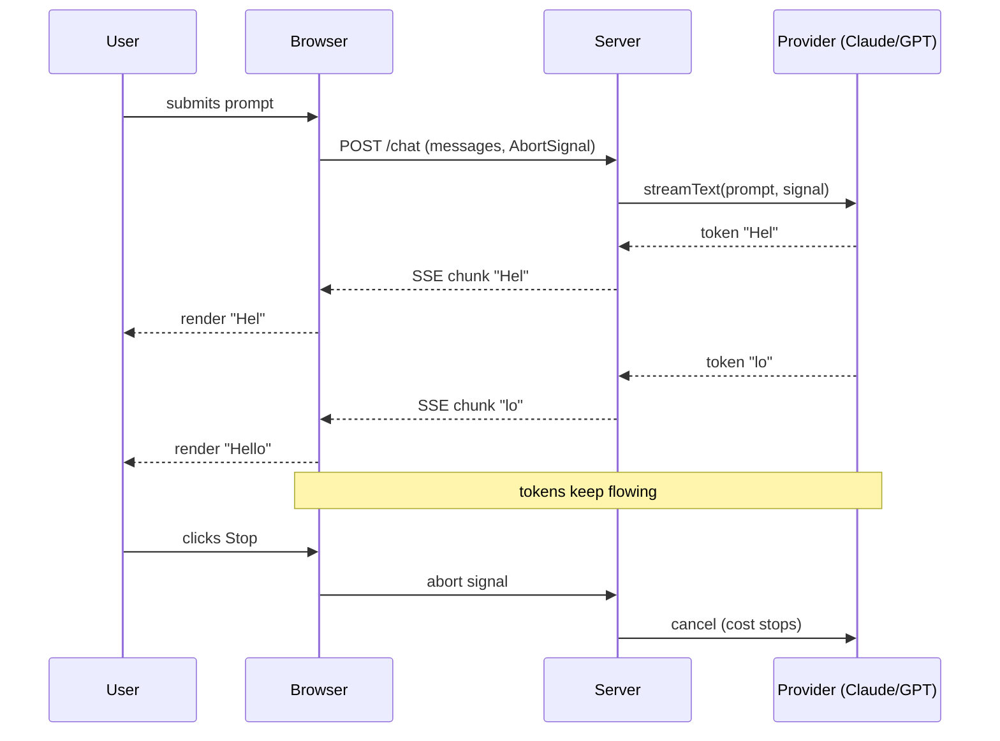

# Streaming UX

> **In one line:** Every user-facing AI feature streams. If the user is staring at a spinner for more than a second, the feature feels broken — no matter how good the eventual answer is.

:::tip[In plain English]
The model is not actually faster when you stream. It just looks faster, because the user starts reading the first sentence while you're still generating the last one. That perceived-speed gap is the difference between "feels magical" and "feels broken." Streaming is the cheapest UX win in the AI stack.
:::

## The shape

- **Provider** streams tokens via SSE.
- **Server** forwards the stream to the client (SSE / `ReadableStream`).
- **Client** renders tokens to the DOM as they arrive.
- **Cancel** propagates abort all the way back to the provider call.



## Why it matters

- **Time-to-first-token (TTFT)** drops to ~200–500 ms (vs. 3–8 s for a blocking response).
- **Tolerance for long outputs grows.** Users will sit through a 20 s answer if they see progress; they will give up on a 4 s blocking spinner.
- **Aborts save real money.** Half a streamed answer cancelled mid-flight is half the tokens billed.

## Worked example — streaming chat with abort

A minimal end-to-end TypeScript example with the Vercel AI SDK (the de-facto 2026 TS choice). It shows the three things people forget: pass the `AbortSignal` through, return a streaming response, and read the stream incrementally on the client.

**Server (Next.js route handler):**

```typescript
// app/api/chat/route.ts
import { anthropic } from '@ai-sdk/anthropic';
import { streamText } from 'ai';

export async function POST(req: Request) {
  const { messages } = await req.json();

  const result = streamText({
    model: anthropic('claude-sonnet-4-5'),
    system: 'You are a customer-support assistant for Acme.',
    messages,
    abortSignal: req.signal,        // propagates client disconnect to provider
    onError: (err) => console.error('stream error', err),
  });

  return result.toDataStreamResponse();
}
```

**Client (React + `useChat`):**

```typescript
// app/chat/page.tsx
'use client';
import { useChat } from '@ai-sdk/react';

export default function Chat() {
  const { messages, input, handleInputChange, handleSubmit, stop, isLoading } = useChat();

  return (
    <div className="flex flex-col h-screen p-4">
      <div className="flex-1 overflow-auto space-y-3">
        {messages.map((m) => (
          <div key={m.id} className={m.role === 'user' ? 'text-right' : ''}>
            <span className="inline-block rounded bg-gray-100 p-2">{m.content}</span>
          </div>
        ))}
      </div>
      <form onSubmit={handleSubmit} className="mt-4 flex gap-2">
        <input
          value={input}
          onChange={handleInputChange}
          className="flex-1 rounded border p-2"
          placeholder="Ask anything"
        />
        {isLoading ? (
          <button type="button" onClick={stop} className="rounded bg-red-500 px-3 text-white">
            Stop
          </button>
        ) : (
          <button type="submit" className="rounded bg-blue-500 px-3 text-white">
            Send
          </button>
        )}
      </form>
    </div>
  );
}
```

The `stop` callback aborts the fetch, which aborts the server handler, which aborts the provider call. Tokens stop generating; you stop paying. That cancel path is the part most teams forget.

## What also belongs in streaming UX

- **A working Stop button** wired through to the abort.
- **Reasoning indicators.** "Thinking…" → "Retrieving sources…" → "Drafting answer…" for multi-step flows. Vague but immediate beats accurate but delayed.
- **Partial parsing.** For structured output, render fields as they stream in (Vercel AI SDK's `streamObject`, Pydantic AI's partial validation, OpenAI's `stream=True` with `tools`).
- **Token-level edits.** Some UIs render a "diff" between the streaming partial and the user's prior message.
- **Skeleton-first chunk.** Send an immediate placeholder chunk so the SSE connection opens before the model emits anything; TTFT-as-perceived drops further.

## Watch out for

- **A single buffering hop** (CDN, reverse proxy, load balancer with default settings, Next.js middleware that wraps the response) silently collects chunks and ships them as one blob. Verify in DevTools → Network → Response that the `content-type` is `text/event-stream` *and* that the body arrives in chunks, not one frame.
- **SSE keep-alive intervals.** Long generations behind aggressive proxies get killed after ~60 s of "idle." Emit a heartbeat comment line (`: ping\n\n`) every 15–30 s.
- **Mobile tab backgrounding** cancels SSE without warning. Persist the partial answer server-side keyed by a request ID so the user can resume.
- **Streaming + non-streaming retries.** If your retry policy converts a failed stream into a blocking second call, latency jumps and the UX inverts. Retries should also stream.
- **History bloat.** Re-sending the whole conversation every turn works in dev with 3 messages and tanks TTFT by turn 40. Cap history or roll older turns into a summary from day one.
- **Rendering raw model output as HTML.** Sanitize on render (DOMPurify, Markdown with HTML disabled) — treat tokens as untrusted strings.

## 2026 stack

| Layer    | Default pick                                                                       |
|----------|-----------------------------------------------------------------------------------|
| TS SDK   | Vercel AI SDK (`streamText`, `streamObject`, `useChat`) — handles SSE, abort, partial JSON. |
| Python   | Native SDK (`anthropic.messages.stream`, `openai.responses.stream`) + FastAPI `StreamingResponse`. Pydantic AI for typed partials. |
| Transport| SSE (HTTP/1.1 or HTTP/2). WebSockets only when you genuinely need bidirectional. |
| Frontend | React `useChat` / SolidStart equivalent. Server Components stream too via `Suspense`. |
| Hosting  | Vercel (TS), Modal / Fly (Py). Edge runtime is fine; verify nothing buffers.       |

:::note[The metric that matters]
For chat-style streaming, **TTFT** — not total response time — is the metric. A 400 ms TTFT feels instant; a 2 s TTFT feels broken even if the full answer arrives in 3 s. Track TTFT separately from total time, alert on regression, optimize it first: smaller models, parallel retrieval, no pre-stream serialization, no buffering proxies.
:::

## Streaming structured output

For features that need both — streamed UX *and* a typed object — both Vercel AI SDK (`streamObject`) and Pydantic AI emit progressively-valid partial objects. The UI renders fields as they arrive:

```typescript
import { streamObject } from 'ai';
import { TriageSchema } from './schemas';

const { partialObjectStream } = streamObject({
  model: anthropic('claude-haiku-4-5'),
  schema: TriageSchema,
  prompt,
});

for await (const partial of partialObjectStream) {
  setTriage((prev) => ({ ...prev, ...partial })); // React state update per chunk
}
```

The user sees the `category` chip render the moment the first field lands; the `reasoning` text streams in below. Same time-to-perceived-completion gain as streamed chat, but for structured features.

## Reasoning indicators for multi-step flows

For features that do real work *before* the stream can start — RAG retrieval, agent planning, tool calls — emit a visible status sequence so the user sees progress instead of a frozen spinner:

```typescript
function* statusEvents(): AsyncGenerator<string> {
  yield 'event: status\ndata: Looking up your account…\n\n';
  // ... await account fetch ...
  yield 'event: status\ndata: Searching docs…\n\n';
  // ... await retrieval ...
  yield 'event: status\ndata: Drafting answer…\n\n';
  // ... start model stream ...
}
```

On the client, render each `status` event in a small chip above the assistant bubble. Vague-but-immediate beats accurate-but-delayed every time.

<Quiz id="pattern-streaming-ux-quick-check" variant="micro" title="Quick check">

<Question
  prompt="What does streaming actually change about an LLM response?"
  options={[
    { text: "Nothing about generation speed — the user starts reading early, so perceived latency collapses" },
    { text: "The model generates tokens faster in streaming mode" },
    { text: "Streaming reduces the total token count of the answer" },
    { text: "Streaming skips the provider's queue" }
  ]}
  correct={0}
  explanation="The model is not faster when you stream; it just looks faster, because TTFT drops to a few hundred milliseconds while the rest generates. The 'model is faster' option is the natural misconception — the win is perceptual, which is exactly why the page calls it the cheapest UX win in the AI stack."
/>

<Question
  prompt="Why is the cancel path (Stop button to abort to provider) worth wiring all the way through?"
  options={[
    { text: "It is required by the SSE specification" },
    { text: "It prevents the conversation history from growing" },
    { text: "Abort propagates to the provider call, so token generation stops and so does the bill" },
    { text: "It makes the next request start faster" }
  ]}
  correct={2}
  explanation="Half a streamed answer cancelled mid-flight is half the tokens billed — the abort chain (client fetch, server handler, provider call) is the part most teams forget. The other options are invented mechanics; the real stakes are cost and a Stop button that actually stops."
/>

<Question
  prompt="Streaming works locally but production users see the whole answer arrive as one blob. What is the likely cause?"
  options={[
    { text: "The model is too fast in production" },
    { text: "A buffering hop — CDN, reverse proxy, or middleware — is collecting chunks and shipping them as one frame" },
    { text: "The client is rendering markdown" },
    { text: "SSE is unsupported in production browsers" }
  ]}
  correct={1}
  explanation="A single buffering hop anywhere in the chain silently defeats streaming; the page says to verify in DevTools that the content-type is an event stream and the body arrives in chunks. Browser support is the red herring — SSE is plain HTTP and works everywhere; the problem is almost always infrastructure between your server and the user."
/>

</Quiz>

---

→ Next: [Structured output everywhere](./structured-output.md).
