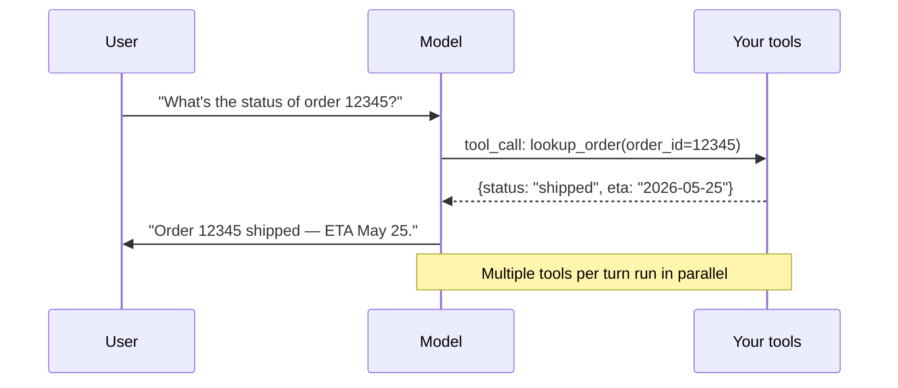

# Tool use done right

> **In one line:** The model is only as good at tool use as the tool descriptions you write — and *anything* destructive needs a human in the loop, not a clever prompt.

:::tip[In plain English]
"Tool use" is just: the model emits a structured request like *call `lookup_order` with `order_id=12345`*, your code runs that function, and you hand the result back. The pattern is trivial. The discipline — small tool set, sharp descriptions, structured errors, parallel execution, confirmation on writes — is what separates a useful assistant from a footgun.
:::

## The shape



## Tight tool sets

- **5–10 tools, well-chosen.** Beyond ~30 tools, selection accuracy degrades sharply — the model picks wrong, or invents.
- **No overlap in tool purpose.** Two tools that "do similar things" confuse the model. `find_customer_by_email` and `search_customers(query)` are a recipe for non-determinism.
- **No catch-all tools.** `do_thing(arbitrary_query: str)` defeats the point — you've just made an unconstrained RPC channel.
- **Cluster by surface, not by team.** Tools for the same user task belong together; one team owning 12 tools doesn't.

## Great descriptions

The model picks by description, not by name. Treat tool descriptions like prompt engineering:

- One sentence on what it does.
- One sentence on when to use it (vs. similar tools).
- One sentence on common pitfalls or constraints.
- Example invocation when behavior is non-obvious.

## Worked example — three tools for the support assistant

The support assistant gets three tools — lookup, escalation, and a follow-up scheduler. Note the descriptions, the parameter constraints, and the explicit "when not to use this tool" line.

```typescript
import { tool } from 'ai';
import { z } from 'zod';

export const lookupOrder = tool({
  description:
    'Look up the status, ETA, and recent events for a customer order by its ID. ' +
    'Use this whenever the user asks about an order they have placed. ' +
    'Do NOT use this for refund requests or to modify the order — only to read.',
  parameters: z.object({
    order_id: z.string().regex(/^[A-Z0-9-]{6,12}$/, 'Order IDs look like AC-1234-X.'),
  }),
  execute: async ({ order_id }) => {
    try {
      const order = await db.orders.findById(order_id);
      if (!order) {
        return { error: 'not_found', message: `No order with id ${order_id}.` };
      }
      return {
        status: order.status,
        eta: order.eta?.toISOString() ?? null,
        last_event: order.events.at(-1) ?? null,
      };
    } catch (e) {
      return { error: 'lookup_failed', retry_after_seconds: 5 };
    }
  },
});

export const escalateToHuman = tool({
  description:
    'Hand the conversation to a human agent. Use ONLY when: ' +
    '(1) the user explicitly asks for a human, OR ' +
    '(2) the request is outside your documented capabilities, OR ' +
    '(3) the user is upset and de-escalation has failed. ' +
    'After calling this, your next message should be a short handoff note to the user.',
  parameters: z.object({
    reason: z.enum(['user_request', 'out_of_scope', 'emotional', 'risk']),
    summary: z.string().max(280).describe('one-paragraph context for the human agent'),
  }),
  execute: async ({ reason, summary }) => {
    const ticketId = await escalations.create({ reason, summary });
    return { escalated: true, ticket_id: ticketId };
  },
});

export const scheduleFollowup = tool({
  description: 'Schedule a callback or email follow-up. REQUIRES user confirmation before calling.',
  parameters: z.object({
    channel: z.enum(['email', 'phone']),
    when_iso: z.string().datetime(),
    note: z.string().max(280),
  }),
  // execute omitted — wired through a confirmation UI before the side effect happens
});
```

Wired into a streaming call:

```typescript
import { streamText } from 'ai';

const result = streamText({
  model: anthropic('claude-sonnet-4-5'),
  system: SUPPORT_SYSTEM_PROMPT,
  messages,
  tools: { lookupOrder, escalateToHuman, scheduleFollowup },
  maxSteps: 4,                 // hard cap on the tool loop
  toolChoice: 'auto',
  experimental_continueSteps: true,
});
return result.toDataStreamResponse();
```

The model can now answer "where's my order AC-1234-X?" by calling `lookupOrder` and streaming the response. It cannot wire a `scheduleFollowup` side effect without your UI step — `execute` is intentionally omitted.

## Parallel execution

Modern providers emit multiple tool calls per turn. Execute them concurrently — never serially. A 4-tool query goes from 4× latency to 1× plus orchestration overhead.

The Vercel AI SDK, the OpenAI SDK (`parallel_tool_calls: true`), and Anthropic tool use all run concurrently by default if you let them. The footgun is wrapping `execute` in an `await`-in-a-`for`-loop somewhere downstream — instrument the per-tool wall-clock and check.

## Structured errors

When a tool fails, return a structured error to the model:

```json
{"error": "rate_limited", "retry_after_seconds": 30, "fallback": "use cached_status tool"}
```

The model can reason about a structured error. It usually *cannot* reason about `Error: 429 Too Many Requests` — it apologizes and gives up.

Pattern: every tool returns either a success object or `{error: <enum>, ...context}`. The model treats errors as part of its working memory, not an exception.

## Validation

Schema constrains shape, not semantics. **Validate that `email` is a real email, that `user_id` exists in your DB, that `amount` is non-negative, that `target_email` is in the user's contacts.** Never invoke a side-effecting tool without validating its arguments. The Zod schema's `regex` on `order_id` above is the bare minimum; the *real* check is your database.

## Human confirmation for write/destructive tools

Any tool that writes, deletes, sends, or charges should require explicit user confirmation when invoked by an agent. The model's request to call the tool is *not* the user's approval.

The pattern: tool definitions include a flag like `requiresConfirmation: true`; your agent loop interprets the tool *call* but renders a confirmation card instead of executing. The user clicks Confirm; *then* the side effect runs.

## Watch out for

- **Letting the model call a write tool unconfirmed.** It will, eventually, do the wrong thing. Default deny.
- **Tool descriptions that read like API reference docs.** "Returns a paginated list of items." → useless. "Use to look up an item by its SKU when the user pastes one." → useful.
- **Names that overlap.** `search` and `lookup` and `find` all in the same toolset. The model coin-flips. Pick one verb per intent.
- **Hidden state in tool execution.** Tools should be (mostly) deterministic given their arguments. If two calls with the same args return different things, the model loops trying to reconcile.
- **Returning a 200 KB blob of JSON** as a tool result. The model now has 200 KB of context to wade through on its next turn. Summarize, truncate, paginate.
- **Forgetting `maxSteps`.** Without it, a confused model burns a fortune in a 30-step loop. Cap it.

## 2026 stack

| Layer        | Default pick                                                                |
|--------------|-----------------------------------------------------------------------------|
| TS framework | Vercel AI SDK `tool()` + `streamText({ tools })`. OpenAI SDK `tools` array directly is also fine. |
| Python       | OpenAI SDK `tools=[...]` / Anthropic `tools=[...]`. Pydantic AI for typed loops. |
| Tool schemas | Zod (TS) / Pydantic (Py). Both serialize to JSON Schema natively.           |
| Catalog      | [MCP (Model Context Protocol)](https://modelcontextprotocol.io) for reusable tools across apps. Standard in 2026. |
| Observability| Langfuse, Braintrust, LangSmith — capture every tool call (name, args, result, latency, cost). |

## MCP — the standardised tool catalogue

By 2026, the **Model Context Protocol** (MCP) is the de-facto standard for exposing tools to AI clients across apps. Instead of redefining the same `lookup_customer` tool in every product that needs it, you expose it once as an MCP server and any MCP-capable client (Claude Desktop, Cursor, your own agent) can use it.

The protocol covers three primitives: **tools** (what the model can call), **resources** (what the model can read), **prompts** (reusable templates). For tools specifically, the wire format is JSON-RPC over stdio or HTTP/SSE; the schema is plain JSON Schema.

For internal apps the MCP overhead isn't worth it — define tools inline as in the example above. For tools you want *multiple* apps to share (a company-wide CRM lookup, an internal docs search, a deploy trigger), the MCP server pattern pays back the layering cost quickly.

:::note[Tool use is just structured output with side effects]
Conceptually, a tool call is structured output (`{name, arguments}`) that your code reacts to. Everything you learned in [structured output](./structured-output.md) — descriptions matter, validate at the boundary, prefer flat shapes, stream partials — applies. The new piece is the *loop*: model calls a tool, your code answers, model calls another. That loop is the [agent loop](./agent-loop.md).
:::

---

→ Next: [The RAG pattern in production](./rag-prod.md).
