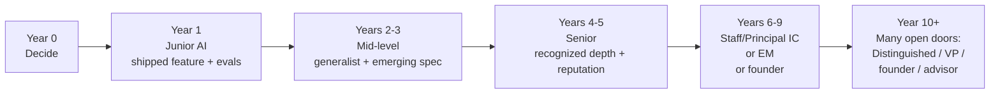

# A Multi-Year Path

> **In one line:** Year 1 is "shipped one LLM feature with evals"; Year 3 is "mid-level generalist AI engineer with one specialization forming"; Year 5 is "senior with a recognized depth and a public reputation"; Year 10 is "Staff / Principal / EM / founder — many open doors."

:::tip[In plain English]
Careers don't move in months — they move in years. The path below is the median, not the maximum or the minimum. Some people compress it; some take longer. Don't compare yourself to the Twitter outlier who "went from zero to Anthropic in 14 months" — they had a hidden head start or they're lying. Compare yourself to where *you* were a year ago.
:::

## The trajectory at a glance

## Year 0: Decide to learn

- Pick AI engineering as the path. Read the [State of the Market](./01-state-of-market.md) and [Roles](./03-roles.md) pages.
- Commit time (5–10 hours / week minimum if part-time, 30+ hours / week if full-time pivot).
- Set up your environment: a Python or TypeScript dev environment, an Anthropic + OpenAI API account, a Modal or Vercel free tier, pgvector via Supabase free tier.
- Buy a domain ($12).

## Year 1: Junior AI Engineer

**Goal:** ship one real LLM feature with an eval suite, deployed publicly.

**Skills you should have:**
- One of TypeScript / Python at a working level.
- Basic prompting: system / user / output schema, can write a prompt that returns reliable structured JSON.
- Basic RAG: chunking, embeddings, pgvector or similar, top-k retrieval.
- Basic evals: 20+ test cases, LLM-as-judge, can show before/after scores.
- Basic observability: every LLM call traced with Langfuse or LangSmith.
- One deployed project on a custom domain.

**Concrete artifacts you should produce in Year 1:**
- A streaming chat app, deployed, with at least one tool call and 20+ eval cases. (Your stage-2 / stage-3 project from this guide.)
- A blog post explaining one specific design decision you made.
- One merged PR to an OSS AI library — even a docs PR counts as starter signal.

**Year 1 typical situation:**
- If transitioning from existing SWE work: shipped one LLM feature inside an existing product.
- If full-time learning / job-search: in the middle of interview loops or just landed first AI Engineer role.

## Year 2: Mid-junior

**Goal:** add a second discipline. If Year 1 was prompts + RAG, Year 2 is agents or evals at depth.

**Skills to add:**
- One agent project shipped — multi-step, tool-using, with traces and an eval suite that scores outcomes, not just final messages.
- Real cost / latency intuition: you can ballpark a feature's monthly bill before building.
- One specialization track from the [Specializations](./05-specializations.md) page is starting to feel like "my thing."
- Comfortable in your team's eval platform (Braintrust, Langfuse, Promptfoo, or homegrown).

**Concrete artifacts:**
- A second deployed project — ideally an agent or a RAG-at-real-scale app.
- 3–5 blog posts on specific design decisions.
- Conference attendance: at least one AI Engineer Summit or equivalent.
- Recognized inside your team as the "AI person."

## Year 3: Mid-level

**Goal:** become a generalist mid-level AI engineer who can be trusted to own a slice of an AI product end-to-end.

**Skills to add:**
- Can lead a small AI feature from kickoff through ship — including scoping, eval design, model selection, cost budget, observability.
- Can review another engineer's prompts, RAG pipeline, or agent design substantively.
- Can debug a slow agent by reading trace data without help.
- Have opinions on at least one specialization with a real war story behind them.
- Comfortable making model-selection decisions across providers (Anthropic, OpenAI, Google, open-source).

**Concrete artifacts by end of Year 3:**
- 4–6 shipped AI features in production (at work or open-source).
- 1 conference talk or large blog post at the "interesting to other AI engineers" level.
- Maintaining or co-maintaining a small open-source AI tool, or being a recognized substantive contributor to a larger one.
- Often: a job change at Year 2.5–3.5, usually with a meaningful comp jump.

## Year 4: Mid-to-senior

**Goal:** start being known publicly for one specialization.

**Skills to add:**
- Recognized depth in one track (retrieval / agents / evals / inference / voice / multimodal / safety / fine-tuning / FDE).
- Mentor at least one junior AI engineer.
- Can give a talk on your specialization at AI Engineer Summit or equivalent.
- Have a small public reputation — blog, Twitter, OSS, conference talks — adding up to "this person knows X."

## Year 5: Senior AI Engineer

**Goal:** lead AI projects, make architectural decisions, mentor across a team.

**Skills you should have:**
- Lead AI projects of 3–10 person team-equivalents.
- Make architectural decisions that the team trusts (vector DB choice, agent framework, eval platform, model routing strategy).
- Mentor junior and mid engineers; do their on-call as needed.
- Choose your next move: stay IC and aim for Staff/Principal, or pivot to Engineering Management.

**Concrete artifacts by end of Year 5:**
- Recognized publicly as a specialist in your track — people from other companies DM you for advice.
- Either: maintaining a respected open-source AI library, or a regular speaker at conferences, or a substantial blog readership.
- A clear answer to "what kind of AI engineer am I, and what companies need this?"

## Years 6–9: Senior / Staff / Principal / EM

**Goal:** lead larger scope. Several legitimate paths:

- **Staff / Principal IC** — deep specialization, owns architecture across multiple teams. Frontier-lab Staff is the highest comp tier in tech.
- **Engineering Manager** — different track, different daily life (meetings, hiring, 1:1s, no code). Not "above" Staff IC; parallel.
- **Founder / co-founder** — most viable in 2026 for engineers with a clear product wedge and AI as differentiator. The 2024–2026 cohort of AI startup founders includes plenty of ex-senior-AI engineers.
- **Forward-Deployed Engineering** — at frontier labs, often a senior-IC-band role with high upside and unique relationships.
- **Independent consultant** — AI implementation consulting is a real path in 2026 at $300–$1,500/hr depending on specialization and reputation.

## Year 10+: Many open doors

By Year 10 you have real options. Some patterns:

- **Stay at one big company** through Staff / Principal / Distinguished.
- **Bounce between AI-native scaleups** at senior IC or EM level — often the highest cash + equity outcome.
- **Start a company.** AI engineering experience is a strong founder signal in 2026.
- **Become an independent consultant or fractional CTO.**
- **Move into investing** — many ex-AI-engineers are now at AI-focused VCs (Conviction, Felicis AI, Greylock, Sequoia AI track).
- **Move into research / academia** — usually requires a PhD, but exceptions exist.
- **Move into education / content** — Latent Space, Hamel Husain's consulting + courses, Eugene Yan's writing are all archetypes.

There's no single "right" path. The skills you've built open many doors.

:::note[Worked example: a Year-2 weekly schedule]
Concretely, here's what a productive Year 2 might look like for someone working 10 hours/week on AI engineering outside their main job:

- **Mon evening (2 hrs):** Work on current portfolio project — push a feature, write tests / evals.
- **Wed evening (2 hrs):** Read documentation on a topic the project demands; experiment with one new tool.
- **Sat morning (3 hrs):** Long deep-work session on the project; deploy a meaningful change.
- **Sat afternoon (1 hr):** Write a short blog post about what you shipped this week.
- **Sun (2 hrs):** Engage in one AI community (Latent Space Discord, AI Tinkerers meetup, MLOps Slack); contribute one PR or substantive comment.

That cadence — sustained for 12 months — is what gets you from "junior AI engineer" to "mid-level generalist with emerging specialization" by end of Year 3.
:::

:::info[Highlight: compound interest is the real model]
A single week of work is barely visible on your AI portfolio. A year of weeks is a transformation. The AI engineers who succeed in 2026 are not the ones who sprinted for three months — they're the ones who showed up most weeks for three years. **Consistency beats intensity at every stage.** The shipped-with-evals discipline you build in Year 1 is what lets you ship a Staff-level project in Year 8.
:::

## Common mistakes

:::caution[Where people commonly trip up]
- **Comparing your Year 1 to someone else's Year 6.** Every "I went from zero to senior AI engineer in 14 months" thread is either a lie, an outlier, or someone with a hidden head start. The compounding curve is real and it takes years.
- **Skipping consistency for occasional sprints.** A 2-week 80-hour grind followed by 3 months of nothing nets less than 10 hours / week sustained. Your future self cares about area under the curve.
- **Pausing side projects the moment you land the first AI job.** Year 2–5 is exactly when continued side shipping multiplies, both for skill compounding and for the next job switch's portfolio refresh. The "I'll relax now" instinct is what causes the mid-level plateau.
- **Treating the timeline as a deadline.** Some people land the first AI Engineer role in Year 1, some in Year 3. Off-schedule is not off-track; abandoning the plan because you missed an arbitrary month is.
- **Optimizing every year for the next job, never for skill compounding.** Job-hopping for 25% raises four times in a row makes Year 1–4 comp look great and Year 5+ stagnate, because depth never built. Sometimes the best career move is two years in one place going deep.
- **Picking the management track because it sounds like promotion.** EM at year 5 is a great move *if* you actually want the daily life of 1:1s, hiring, planning, no code. It's a bad move if you took it because the title sounded bigger. Senior IC / Staff IC is a real, well-paid destination.
:::

<Quiz id="career-multi-year-path-quick-check" variant="micro" title="Quick check">

<Question
  prompt="What is the Year 1 goal on the multi-year path?"
  options={[
    { text: "Ship one real LLM feature with an eval suite, deployed publicly" },
    { text: "Land a role at a frontier lab" },
    { text: "Pick a specialization and publish about it" },
    { text: "Complete a major certification or degree program" }
  ]}
  correct={0}
  explanation="Year 1 is concrete: a deployed streaming chat app with at least one tool call and 20-plus eval cases, a blog post on one design decision, and one merged OSS PR. The shipped-with-evals discipline built here is what compounds into Staff-level work years later."
/>

<Question
  prompt="What does the page say about consistency versus intensity in building an AI career?"
  options={[
    { text: "Intensity wins - compressed sprints are how outliers reach senior fast" },
    { text: "Either works as long as total hours match" },
    { text: "Consistency beats intensity at every stage - showing up most weeks for years beats a three-month sprint" },
    { text: "Intensity matters early, consistency matters only after senior" }
  ]}
  correct={2}
  explanation="A two-week 80-hour grind followed by three months of nothing nets less than 10 sustained hours per week. Compound interest is the real model: a single week is barely visible, but a year of weeks is a transformation."
/>

<Question
  prompt="How does the page characterize the Engineering Manager track relative to Staff or Principal IC?"
  options={[
    { text: "EM is the promotion above Staff IC and the natural next step" },
    { text: "Staff IC exists only at frontier labs, so most people must choose EM" },
    { text: "EM pays substantially more than IC at every level" },
    { text: "EM is a parallel track, not a promotion - choose it only if you want the daily life of 1:1s, hiring, and planning instead of code" }
  ]}
  correct={3}
  explanation="EM and Staff IC are parallel, comparably paid tracks at major AI employers. Picking management because the title sounds bigger is a named mistake; Senior and Staff IC are real, well-paid destinations for people who want to keep building."
/>

</Quiz>

→ Next: [Where to find work](./13-jobs.md).
