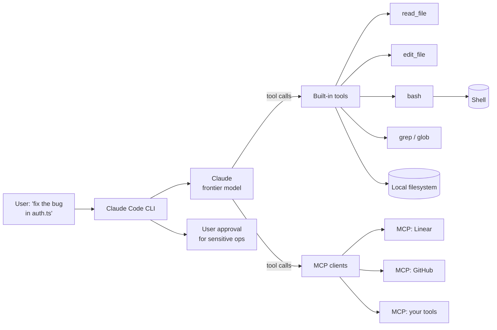

# Case study: Claude Code

> **In one line:** Claude Code is Anthropic's CLI coding agent — a terminal interface plus an MCP-native tool system plus an agent loop tuned for "edit files, run commands, verify with tests" — and the interesting architecture is how it constrains the agent to *demonstrably correct* edits rather than plausible-looking ones.

## The product

A coding agent you talk to in the terminal. You can ask it to:

- Read and explain code across a repo.
- Make multi-file edits.
- Run tests, builds, and shell commands.
- Use MCP servers to extend its tools (Linear, GitHub, Slack, your DB).
- Commit and push when work is done.

Distinct from IDE-integrated tools like Cursor: Claude Code is **agent-first** rather than completion-first. You don't autocomplete; you delegate.

## Architecture



The core loop: model emits a tool call (read, edit, bash, grep) → CLI executes locally → result feeds back → model decides next step. Every meaningful side effect (edits, commands, commits) is gated by user permission policies.

## Key engineering decisions

### 1. Tool discipline — small set, sharp edges

The built-in tool set is *deliberately* small:

- `Read`, `Edit`, `Write` for files.
- `Bash` for shell commands.
- `Grep`, `Glob` for searching.
- `TodoWrite` for self-managing task lists.

That's roughly the whole surface. No `do_thing(query: str)` catch-alls. Every tool is a primitive.

This is the opposite of "give the model 50 tools and let it figure it out." Tight tools force the model to compose; composed primitives are easier to debug than confused selections.

### 2. MCP as the extension story

Beyond built-ins, every external integration is an MCP server (see [MCP](../01-foundations/mcp.md)). Linear, GitHub, your DB — all plug in as MCP servers, and Claude Code's MCP client surfaces them as additional tools.

This means: same patterns, same auth model, same observability, regardless of integration. Add a server, get a tool surface — no per-integration glue code.

### 3. Apply-diff with verification, not whole-file writes

For file edits, Claude Code uses the `Edit` tool — search-and-replace style with strict matching. The model emits:

```
old_string: "redirect('/login')"
new_string: "redirect('/goodbye')"
```

The CLI applies the change if the `old_string` matches exactly somewhere in the file; refuses if it doesn't (with an error the model sees). This forces the model to *read first*, then edit — the alternative ("write the whole file") was found to cause "improvements" the user didn't ask for.

### 4. Permission policies, not blind execution

Bash commands and file writes don't run silently. The user (or settings.json) defines:

- **Always allow:** safe commands (`ls`, `git status`, etc.).
- **Ask first:** anything with side effects (`rm`, `git push`, network calls).
- **Always deny:** dangerous patterns.

The agent can do real work without the user being in the loop on every read; the user stays in control of every write. This is the design that makes "AI commits code" not "AI breaks production."

### 5. Self-managed task lists

For multi-step work, the agent maintains an internal todo list (via the `TodoWrite` tool) and updates it as it makes progress. Two effects:

- The user sees what the agent thinks it's doing.
- The agent self-tracks instead of forgetting steps in a long session.

It's a small thing that quietly fixes the "agent declared victory but didn't actually finish" failure mode.

## Stack snapshot (2026)

- **Model:** Claude Sonnet / Opus (whatever the latest frontier-tier Anthropic model is).
- **Runtime:** the CLI is a Node.js binary; the model runs server-side via the Anthropic API.
- **Tools:** built-in Read / Write / Edit / Bash / Grep / Glob / WebFetch / TodoWrite, plus user-installed MCP servers.
- **Storage:** local — config in `~/.claude/`, project context in `CLAUDE.md`, no remote state by default.
- **Permissions:** local settings.json with allow/deny patterns.

## What to copy

- **Small, sharp tool sets.** Resist the urge to add tools. Composition of primitives is more debuggable than vague meta-tools.
- **MCP as the integration boundary.** Don't write five different integrations to five different services — write one MCP client and let servers plug in.
- **Search-and-replace edits, not file rewrites.** Anchored edits prevent the model from "improving" unrelated code.
- **Permission policies in code, not vibes.** Define what the agent can do unattended vs. what needs approval; encode in settings, not memory.
- **Self-tracking task lists.** Give the model a tool to maintain its own todo list. Cheap, visible, and reduces "forgot to finish" failures.

## What to avoid

- **Letting the agent write whole files when an edit would do.** Tokens wasted; behavior worsened.
- **Skipping the user-permission layer.** "Just YOLO it" turns into "agent rm -rf'd the repo" eventually.
- **Treating every tool as equally safe.** Reads can run free; writes need policy.
- **One giant `do_software_engineering` tool.** That's the failure mode this design exists to refute.

## Sources

- Anthropic's Claude Code documentation: docs.anthropic.com/claude-code.
- Anthropic engineering blog posts on agent design and MCP.
- Public conference talks (AI Engineer Summit, Code with Claude events).
- The published MCP spec: modelcontextprotocol.io.
- Public discussions on the design philosophy (Anthropic team interviews).

---

→ Next: [Perplexity](./perplexity.md)
